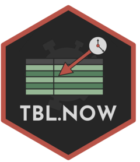
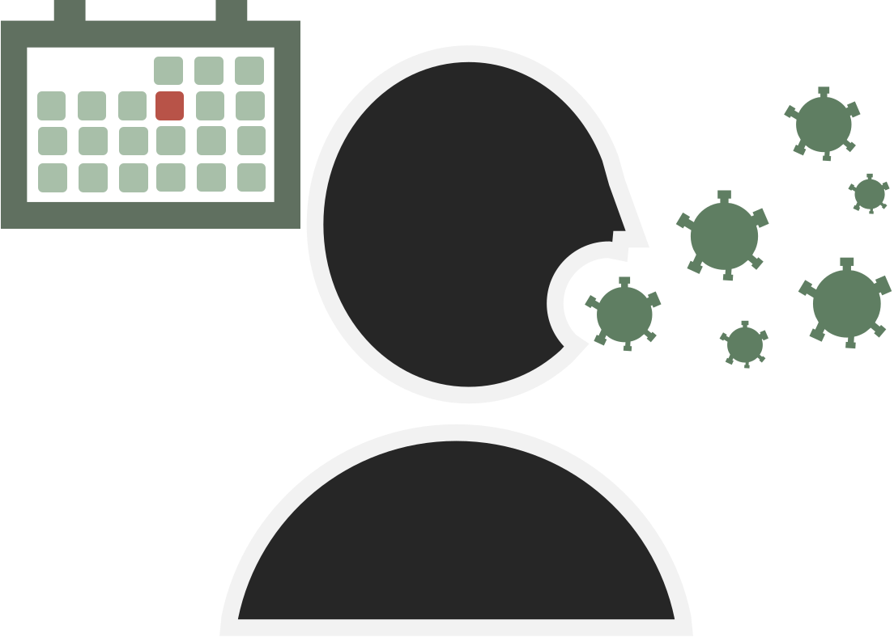
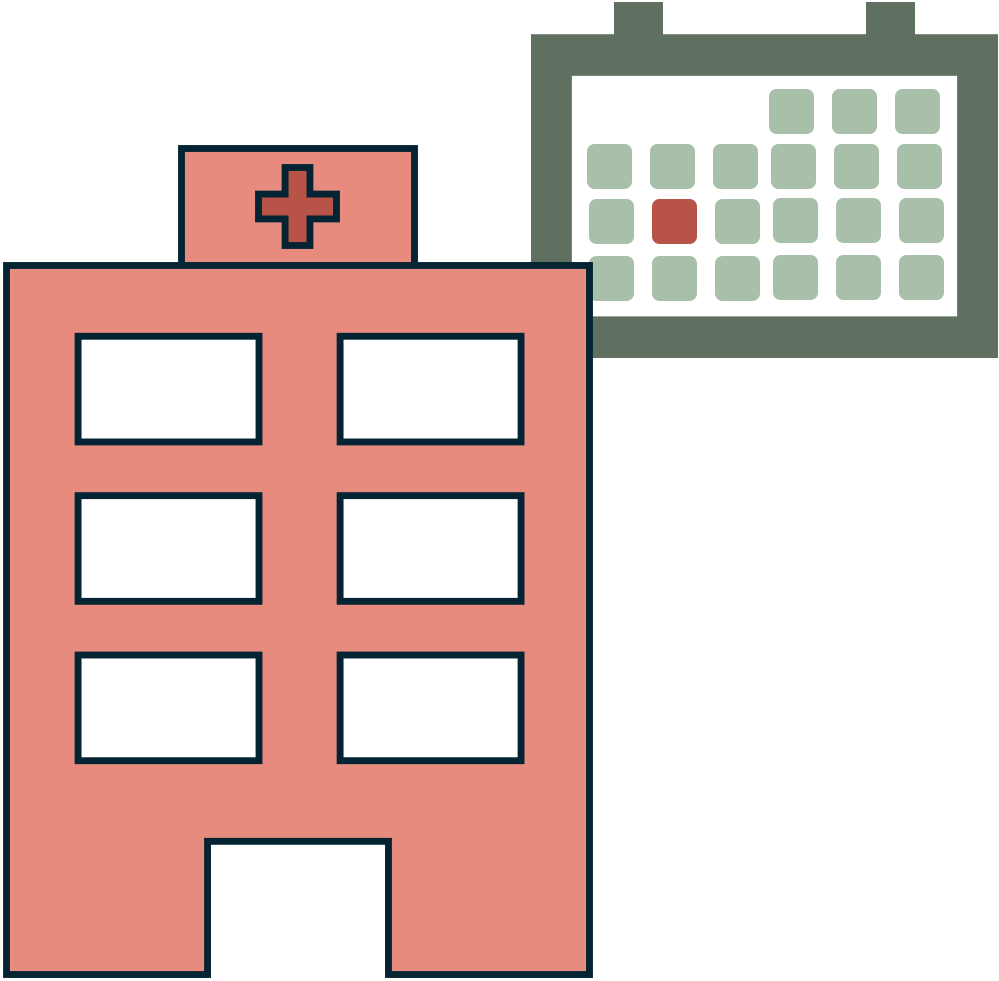
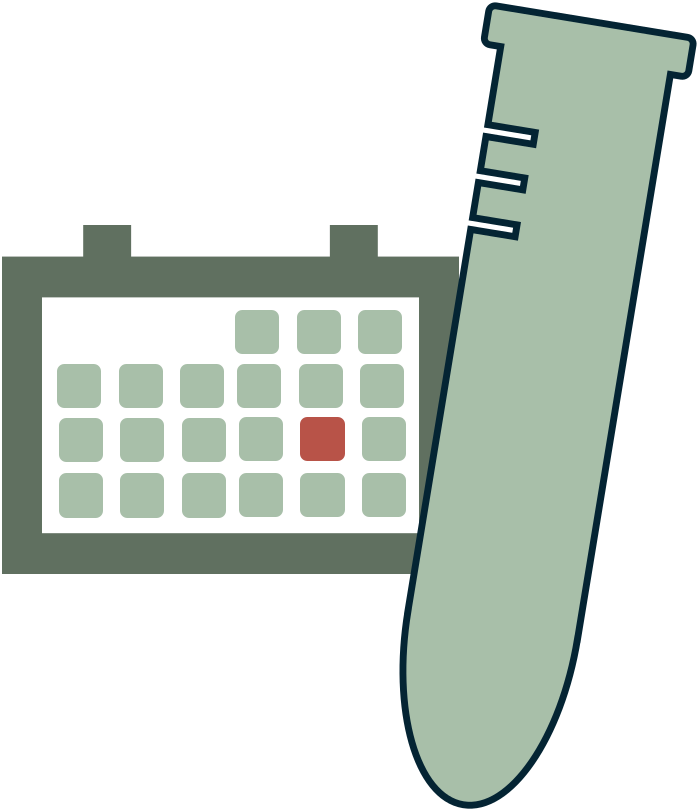
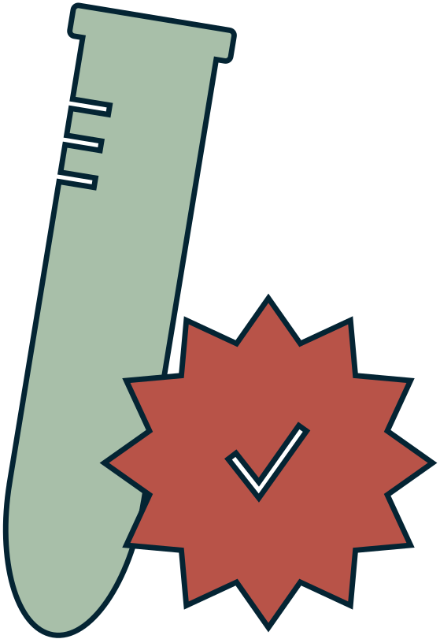
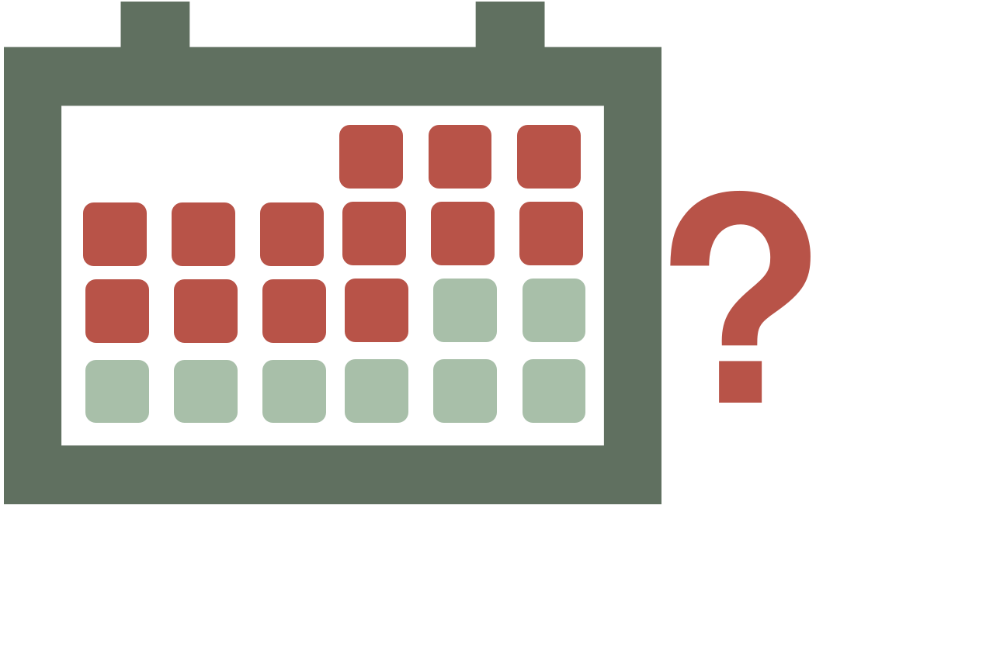
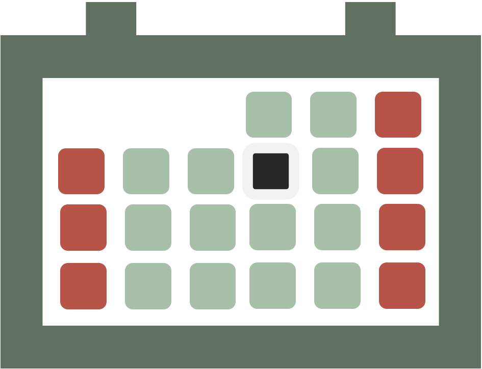
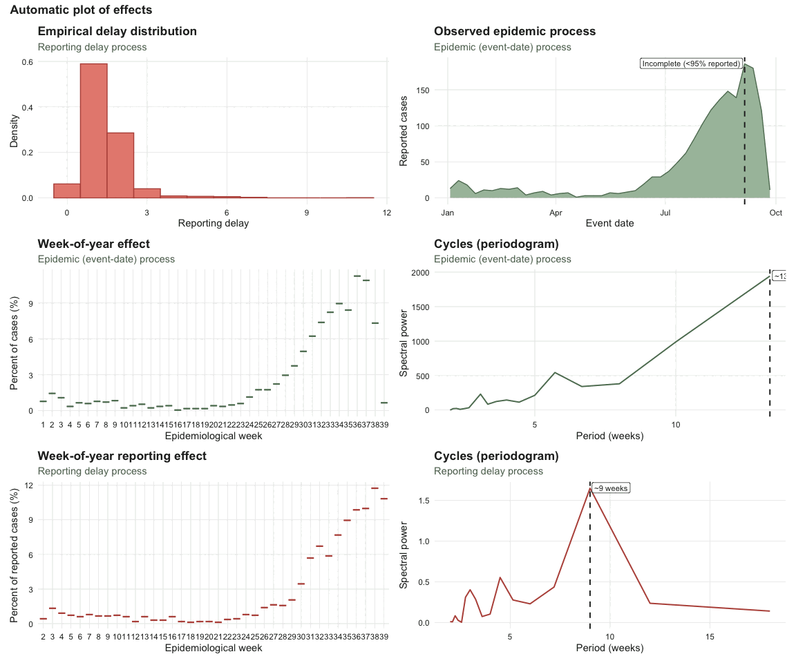
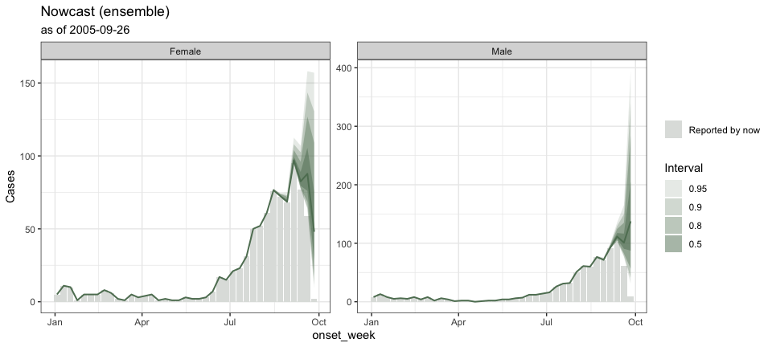

<!-- README.md is generated from README.Rmd. Please edit that file -->

# Tibble now (tbl.now) <a href="https://rodrigozepeda.github.io/tbl.now/"></a>

<!-- badges: start -->

[](https://app.codecov.io/gh/RodrigoZepeda/tbl.now)
[](https://lifecycle.r-lib.org/articles/stages.html#experimental)
[](https://CRAN.R-project.org/package=tbl.now)
[](https://github.com/RodrigoZepeda/tbl.now/actions/workflows/R-CMD-check.yaml)
<!-- badges: end -->

[`tbl.now`](https://rodrigozepeda.github.io/tbl.now/) provides an
extension of the [`tibble()`](https://tibble.tidyverse.org/) for
storing, validating, and manipulating epidemiological nowcasting data.
It standardizes the representation of event dates, report dates, strata,
temporal covariates, etc and in a way that is compatible with many
frameworks including
[diseasenowcasting](https://rodrigozepeda.github.io/diseasenowcasting/),
[epinowcast](https://package.epinowcast.org/),
[NobBS](https://cran.r-project.org/web/packages/NobBS/index.html),
[surveillance](https://cran.r-project.org/web/packages/surveillance/index.html),
[EpiNow2](https://epiforecasts.io/EpiNow2/), and more.

Specifically a `tbl_now` is a data structure that keeps track of the
following attributes relevant for a nowcasting excercise so that all
`dplyr` transformations (i.e. the ones from tidyverse) keep track of the
relevant nowcasting variables:

<table>

<thead>

<tr>

<th align="center">

 
</th>

<th align="left">

Argument
</th>

<th align="left">

What it records
</th>

</tr>

</thead>

<tbody>

<tr>

<td align="center">


</td>

<td align="left">

<code>event_date</code>
</td>

<td align="left">

The column storing <strong>event dates</strong>; i.e. when the
epidemiological phenomenon of interest happened (symptom onset,
hospitalisation, death, …). <strong>Required.</strong>
</td>

</tr>

<tr>

<td align="center">


</td>

<td align="left">

<code>report_date</code>
</td>

<td align="left">

The column storing <strong>report dates</strong>; i.e. when that event
became known to the surveillance system. <strong>Required</strong>,
unless it is reconstructed from <code>delay</code>.
</td>

</tr>

<tr>

<td align="center">


</td>

<td align="left">

<code>validation_date</code>
</td>

<td align="left">

An optional third date indicating when the report was resolved (see
<code>validation_type</code>). <em>Optional</em>.
</td>

</tr>

<tr>

<td align="center">


</td>

<td align="left">

<code>validation_type</code>
</td>

<td align="left">

What the validation date resolved to. Only <code>confirmed</code>,
<code>retracted</code>, <code>pending</code> or <code>NA</code> are ever
stored; use <code>validation_levels</code> for data recorded in other
words. <em>Optional</em>.
</td>

</tr>

<tr>

<td align="center">


</td>

<td align="left">

<code>validation_levels</code>
</td>

<td align="left">

A named dictionary translating the labels in
<code>validation_type</code> into those four, e.g. <code>c(positive =
“confirmed”)</code>. <em>Optional</em>.
</td>

</tr>

<tr>

<td align="center">


</td>

<td align="left">

<code>now</code>
</td>

<td align="left">

The date the nowcast is anchored to — “today” from the model’s point of
view. <em>Optional</em>; defaults to the latest date.
</td>

</tr>

<tr>

<td align="center">


</td>

<td align="left">

<code>strata</code>
</td>

<td align="left">

Columns you want a separate nowcast for (e.g. gender, region).
<em>Optional</em>.
</td>

</tr>

<tr>

<td align="center">


</td>

<td align="left">

<code>covariates</code>
</td>

<td align="left">

Columns that inform the nowcast but that you do <em>not</em> want it
broken down by (e.g. temperature or precipitation). <em>Optional</em>.
</td>

</tr>

<tr>

<td align="center">


</td>

<td align="left">

<code>case_count</code>
</td>

<td align="left">

The column holding the counts when the data is given as aggregated
(rather than line-list). <em>Optional</em>.
</td>

</tr>

<tr>

<td align="center">


</td>

<td align="left">

<code>data_type</code>
</td>

<td align="left">

Whether the data represents a <code>linelist</code> (each row is a
case), <code>count-incidence</code>(each row is a collection of cases
per event-report date) or <code>count-cumulative</code>(each row is the
cummulative number cases for that event accumulating in the report
axis). <em>Optional</em>; inferred by default.
</td>

</tr>

<tr>

<td align="center">


</td>

<td align="left">

<code>event_units</code>, <code>report_units</code>,
<code>validation_units</code>
</td>

<td align="left">

The time grid each date lives on: <code>days</code>, <code>weeks</code>,
<code>months</code>, <code>years</code> or <code>numeric</code>.
<em>Optional</em>; inferred (<code>“auto”</code>) by default.
</td>

</tr>

<tr>

<td align="center">


</td>

<td align="left">

<code>is_censored_report</code>
</td>

<td align="left">

Flags report dates that are only an upper bound, e.g. a batch or
back-fill dump. <em>Optional</em>.
</td>

</tr>

<tr>

<td align="center">


</td>

<td align="left">

<code>is_censored_validation</code>
</td>

<td align="left">

The same on the validation axis: flags rows whose <em>validation</em>
delay is a bound rather than a measurement. <em>Optional</em>.
</td>

</tr>

<tr>

<td align="center">


</td>

<td align="left">

<code>t_effects</code>
</td>

<td align="left">

Columns holding temporal effects (day of week, holidays, …) that some
models can use. <em>Optional</em>.
</td>

</tr>

</tbody>

</table>

You can specify an object as a `tbl.now` with the `tbl_now` command:

``` r
library(dplyr)
library(tbl.now)
data(denguedat)

#Here we use just a few dates for the example
denguedat <- denguedat |> 
  filter(onset_week >= as.Date("2005/01/01"),
         report_week <= as.Date("2005/10/01")) 

#And we specify as a tbl_now:
denguedat <- denguedat |> 
  tbl_now(
    report_date = report_week,
    event_date = onset_week,
    strata = gender
  ) 
```

Once transformed, it can help you diagnose data problems (see [this
article](https://rodrigozepeda.github.io/tbl.now/articles/diagnosing-a-tbl-now.html))
or modeling requirements with your database:

``` r
autoplot(denguedat)
```



And it can be used to run any of multiple nowcast libraries through the
`engine()` and `run_nowcast` specifications (see [this
article](https://rodrigozepeda.github.io/tbl.now/articles/nowcasting-models.html).
For example, [baselinenowcast](https://baselinenowcast.epinowcast.org/):

``` r
dengue_nowcast_1 <- denguedat |> 
  run_nowcast(engine = engine_baselinenowcast())
```

``` r
autoplot(dengue_nowcast_1)
```


or
[diseasenowcasting](https://rodrigozepeda.github.io/diseasenowcasting/):

``` r
dengue_nowcast_2 <- denguedat |> 
  run_nowcast(engine = engine_diseasenowcasting())
```

``` r
autoplot(dengue_nowcast_2)
```


It can also generate ensemble nowcasts combining multiple engines or
multiple realizations from the same engine as you can see [in this
article](https://rodrigozepeda.github.io/tbl.now/articles/ensemble-nowcasting.html):

``` r
dengue_ensemble <- nowcast_ensemble(
  baselinenowcast  = dengue_nowcast_1,
  diseasenowcasting = dengue_nowcast_2
)
```

``` r
autoplot(dengue_ensemble)
```



If this seems as exciting to you as it is to us, install the development
version from [GitHub](https://github.com/):

``` r
# install.packages("pak") # <- uncomment if you do not have `pak`
pak::pkg_install("RodrigoZepeda/tbl.now")
```

and checkout our articles starting with the
[Introduction](https://rodrigozepeda.github.io/tbl.now/articles/tbl.now.html):

<!-- Single source for "Learning more"; pulled in as a knitr child by README.Rmd and every article. Edit on `learning.more.Rmd`.-->

## Learning more

- Introduction vignette:
  <https://rodrigozepeda.github.io/tbl.now/articles/tbl.now.html> for
  the full anatomy of a `tbl_now`, data types, and temporal effects.
- End-to-end tutorial on real, messy surveillance data — cleaning,
  diagnostics and nowcasting:
  <https://rodrigozepeda.github.io/tbl.now/articles/example.html>
- Tutorial on diagnosing your dataset — what is in it, what is
  structurally wrong with it, and detecting batches and other
  reporting-delay artifacts:
  <https://rodrigozepeda.github.io/tbl.now/articles/diagnosing-a-tbl-now.html>
- Using different nowcasting engines for the same dataset:
  <https://rodrigozepeda.github.io/tbl.now/articles/nowcasting-models.html>
- Ensemble nowcasting across different engines
  <https://rodrigozepeda.github.io/tbl.now/articles/ensemble-nowcasting.html>
- Adding your own nowcasting model
  <https://rodrigozepeda.github.io/tbl.now/articles/custom-nowcast-models.html>
- Package reference:
  <https://rodrigozepeda.github.io/tbl.now/reference/>
