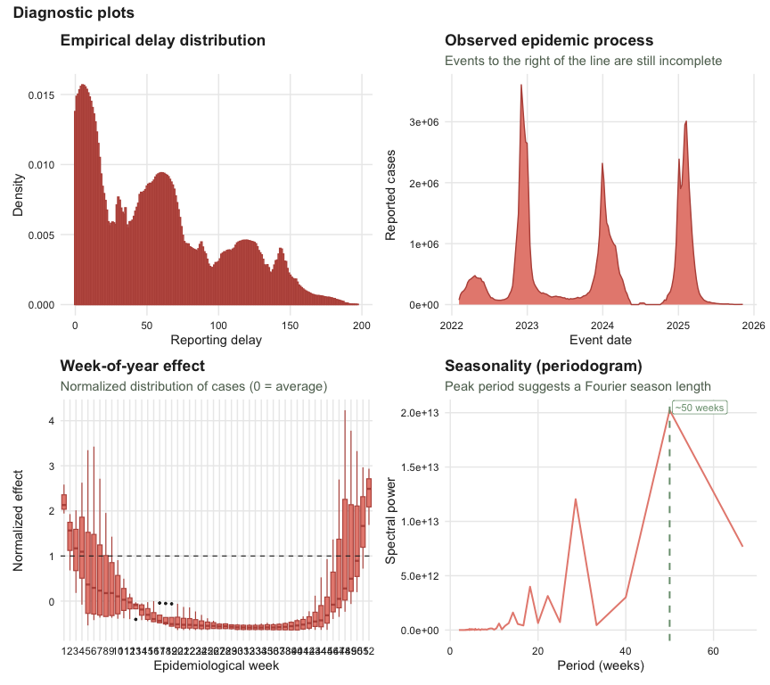

<!-- README.md is generated from README.Rmd. Please edit that file -->

# Tibble now (tbl.now) <a href="https://rodrigozepeda.github.io/tbl.now/"></a>

<!-- badges: start -->

[](https://app.codecov.io/gh/RodrigoZepeda/tbl.now)
[](https://lifecycle.r-lib.org/articles/stages.html#experimental)
[](https://CRAN.R-project.org/package=tbl.now)
[](https://github.com/RodrigoZepeda/tbl.now/actions/workflows/R-CMD-check.yaml)
<!-- badges: end -->

[`tbl.now`](https://rodrigozepeda.github.io/tbl.now/) provides an
extension of the [`tibble()`](https://tibble.tidyverse.org/) for
storing, validating, and manipulating epidemiological nowcasting data.
It standardizes the representation of event dates, report dates, strata,
temporal covariates, and data types (linelist and cumulative), ensuring
that downstream models within the
[`diseasenowcasting`](https://rodrigozepeda.github.io/diseasenowcasting/)
ecosystem can rely on a consistent interface.

## Installation

Install the development version from [GitHub](https://github.com/):

``` r
# install.packages("remotes")
remotes::install_github("RodrigoZepeda/tbl.now")
```

Load the package:

``` r
library(dplyr, quietly = TRUE)
library(lubridate)
library(tbl.now)
library(almanac)    #Suggested for holiday effects
```

## A minimal example

Suppose you have a dataset where n cases reported on report_date belong
to events occurring on event_date:

``` r
df <- tibble(
  event_date  = c(ymd("2023-12-25"), ymd("2023-12-26"),
                  ymd("2023-12-25"), ymd("2023-12-26")),
  report_date = c(ymd("2023-12-26"), ymd("2023-12-26"),
                  ymd("2023-12-27"), ymd("2023-12-27")),
  n = c(10, 2, 5, 11)
)
```

Convert it to a
[tbl_now()](https://rodrigozepeda.github.io/tbl.now/reference/tbl_now.html):

``` r
df_now <- df %>% 
  tbl_now(event_date = event_date, report_date = report_date, case_count = n)
#> ℹ Identified data as <count-incidence> with counts in column "n".

df_now
#> # A tibble:  4 × 6
#> # Data type: "count-incidence"
#> # Frequency: Event: `days` | Report: `days`
#>   event_date   report_date         n .event_num .report_num .delay
#>   <date>       <date>          <dbl>      <dbl>       <dbl>  <dbl>
#>   [event_date] [report_date] [cases]      [...]       [...]  [...]
#> 1 2023-12-25   2023-12-26         10          0           1      1
#> 2 2023-12-26   2023-12-26          2          1           1      0
#> 3 2023-12-25   2023-12-27          5          0           2      2
#> 4 2023-12-26   2023-12-27         11          1           2      1
#> # ────────────────────────────────────────────────────────────────────────────────
#> # Now: 2023-12-27 | Event date: "event_date" | Report date: "report_date"
#> # ────────────────────────────────────────────────────────────────────────────────
```

`tbl_now()` automatically:

- infers that the **data type** is linelist (one row per event)

- determines the **date units** (daily event and report frequencies)

- computes numerical versions of the dates: `.event_num`, `.report_num`,
  and `.delay`

- sets the **now** to the most recent reporting date

Use it like any tibble:

``` r
df_now %>% 
  filter(n > 5)
#> # A tibble:  2 × 6
#> # Data type: "count-incidence"
#> # Frequency: Event: `days` | Report: `days`
#>   event_date   report_date         n .event_num .report_num .delay
#>   <date>       <date>          <dbl>      <dbl>       <dbl>  <dbl>
#>   [event_date] [report_date] [cases]      [...]       [...]  [...]
#> 1 2023-12-25   2023-12-26         10          0           1      1
#> 2 2023-12-26   2023-12-27         11          1           2      1
#> # ────────────────────────────────────────────────────────────────────────────────
#> # Now: 2023-12-27 | Event date: "event_date" | Report date: "report_date"
#> # ────────────────────────────────────────────────────────────────────────────────
```

## Adding strata

If strata was given, the
[tbl_now()](https://rodrigozepeda.github.io/tbl.now/reference/tbl_now.html)
can easily tag the corresponding strata.

``` r
#Add the column using dplyr:
df_now <- df_now %>% 
  mutate(sex = c("M","M","F","M")) 

df_now
#> # A tibble:  4 × 7
#> # Data type: "count-incidence"
#> # Frequency: Event: `days` | Report: `days`
#>   event_date   report_date         n .event_num .report_num .delay sex  
#>   <date>       <date>          <dbl>      <dbl>       <dbl>  <dbl> <chr>
#>   [event_date] [report_date] [cases]      [...]       [...]  [...] [...]
#> 1 2023-12-25   2023-12-26         10          0           1      1 M    
#> 2 2023-12-26   2023-12-26          2          1           1      0 M    
#> 3 2023-12-25   2023-12-27          5          0           2      2 F    
#> 4 2023-12-26   2023-12-27         11          1           2      1 M    
#> # ────────────────────────────────────────────────────────────────────────────────
#> # Now: 2023-12-27 | Event date: "event_date" | Report date: "report_date"
#> # ────────────────────────────────────────────────────────────────────────────────
```

Use the `add_strata` to specify the new column is a stratum:

``` r
df_now %>% 
  add_strata("sex")
#> # A tibble:  4 × 7
#> # Data type: "count-incidence"
#> # Frequency: Event: `days` | Report: `days`
#>   event_date   report_date         n .event_num .report_num .delay sex     
#>   <date>       <date>          <dbl>      <dbl>       <dbl>  <dbl> <chr>   
#>   [event_date] [report_date] [cases]      [...]       [...]  [...] [strata]
#> 1 2023-12-25   2023-12-26         10          0           1      1 M       
#> 2 2023-12-26   2023-12-26          2          1           1      0 M       
#> 3 2023-12-25   2023-12-27          5          0           2      2 F       
#> 4 2023-12-26   2023-12-27         11          1           2      1 M       
#> # ────────────────────────────────────────────────────────────────────────────────
#> # Now: 2023-12-27 | Event date: "event_date" | Report date: "report_date"
#> # Strata: "sex"
#> # ────────────────────────────────────────────────────────────────────────────────
```

The object now records `"sex"` as a stratification variable, preserved
through downstream operations.

## Adding temporal effects

Temporal covariates help nowcasting models incorporate weekly
seasonality, holiday effects, etc. Define the effects:

``` r
t_eff <- temporal_effects(
  day_of_week  = TRUE,
  week_of_year = TRUE, 
  holidays     = cal_us_federal())

t_eff
#> 
#> ── Temporal Effects ────────────────────────────────────────────────────────────
#> The following effects are in place:
#> • "day_of_week"
#> • "week_of_year"
#> • "holidays":
#>   1. New Year's Day, US Martin Luther King Jr. Day, US Presidents' Day, US
#>   Memorial Day, US Juneteenth, US Independence Day, US Labor Day, US Indigenous
#>   Peoples' Day, US Veterans Day, US Thanksgiving, and Christmas
```

Attach them to the dataset:

``` r
df_now <- df_now %>% 
  add_temporal_effects(t_eff)

df_now
#> # A tibble:  4 × 7
#> # Data type: "count-incidence"
#> # Frequency: Event: `days` | Report: `days`
#>   event_date   report_date         n .event_num .report_num .delay sex  
#>   <date>       <date>          <dbl>      <dbl>       <dbl>  <dbl> <chr>
#>   [event_date] [report_date] [cases]      [...]       [...]  [...] [...]
#> 1 2023-12-25   2023-12-26         10          0           1      1 M    
#> 2 2023-12-26   2023-12-26          2          1           1      0 M    
#> 3 2023-12-25   2023-12-27          5          0           2      2 F    
#> 4 2023-12-26   2023-12-27         11          1           2      1 M    
#> # ────────────────────────────────────────────────────────────────────────────────
#> # Now: 2023-12-27 | Event date: "event_date" | Report date: "report_date"
#> # T. effects (lazy): [event_date] day_of_week, week_of_year, holidays
#> # ────────────────────────────────────────────────────────────────────────────────
```

This lazily adds to the table `day_of_week`, `week_of_year`, and
`holiday` related to `event_date`. However it does not compute. Use
`compute_temporal_effects()` to add them as columns:

``` r
df_now %>% 
  compute_temporal_effects()
#> # A tibble:  4 × 10
#> # Data type: "count-incidence"
#> # Frequency: Event: `days` | Report: `days`
#>   event_date   report_date         n .event_num .report_num .delay sex  
#>   <date>       <date>          <dbl>      <dbl>       <dbl>  <dbl> <chr>
#>   [event_date] [report_date] [cases]      [...]       [...]  [...] [...]
#> 1 2023-12-25   2023-12-26         10          0           1      1 M    
#> 2 2023-12-26   2023-12-26          2          1           1      0 M    
#> 3 2023-12-25   2023-12-27          5          0           2      2 F    
#> 4 2023-12-26   2023-12-27         11          1           2      1 M    
#>   .event_day_of_week .event_week_of_year .event_holiday
#>                <int>               <int>          <int>
#>           [t_effect]          [t_effect]     [t_effect]
#> 1                  2                   1              1
#> 2                  3                   1              0
#> 3                  2                   1              1
#> 4                  3                   1              0
#> # ────────────────────────────────────────────────────────────────────────────────
#> # Now: 2023-12-27 | Event date: "event_date" | Report date: "report_date"
#> # T. effects: [event_date] day_of_week, week_of_year, holidays
#> # T. effect cols: ".event_day_of_week", ".event_week_of_year", and
#> # ".event_holiday"
#> # ────────────────────────────────────────────────────────────────────────────────
```

You can also attach effects related to the `report_date`:

``` r
r_eff <- temporal_effects(day_of_week = TRUE)

df_now %>% 
  add_temporal_effects(r_eff, date_type = "report_date")
#> # A tibble:  4 × 7
#> # Data type: "count-incidence"
#> # Frequency: Event: `days` | Report: `days`
#>   event_date   report_date         n .event_num .report_num .delay sex  
#>   <date>       <date>          <dbl>      <dbl>       <dbl>  <dbl> <chr>
#>   [event_date] [report_date] [cases]      [...]       [...]  [...] [...]
#> 1 2023-12-25   2023-12-26         10          0           1      1 M    
#> 2 2023-12-26   2023-12-26          2          1           1      0 M    
#> 3 2023-12-25   2023-12-27          5          0           2      2 F    
#> 4 2023-12-26   2023-12-27         11          1           2      1 M    
#> # ────────────────────────────────────────────────────────────────────────────────
#> # Now: 2023-12-27 | Event date: "event_date" | Report date: "report_date"
#> # T. effects (lazy): [event_date] day_of_week, week_of_year, holidays |
#> # [report_date] day_of_week
#> # ────────────────────────────────────────────────────────────────────────────────
```

## Working with the “now”

You may override the default now to perform historical evaluation:

``` r
df_pruned <- df_now %>%
  filter(report_date <= ymd("2023-12-26")) %>%
  change_now(ymd("2023-12-26"))
```

Retrieve the current active nowcast horizon:

``` r
get_now(df_pruned)
#> [1] "2023-12-26"
```

## Visualizing a `tbl_now`

The
[autoplot()](https://rodrigozepeda.github.io/tbl.now/reference/autoplot.tbl_now.html)
method gives a quick diagnostic overview of a `tbl_now`.

``` r
library(ggplot2)
library(patchwork)
data("flusight")

flusight_now <- tbl_now(flusight,
                        event_date  = target_end_date,
                        report_date = as_of,
                        case_count  = observation,
                        verbose     = FALSE)

autoplot(flusight_now, level = 1)
```



## Learning more

- Introduction vignette:
  <https://rodrigozepeda.github.io/tbl.now/articles/Introduction.html>
- Full walk-through with real CDC Flusight data:
  <https://rodrigozepeda.github.io/tbl.now/articles/Example.html>
- Package reference:
  <https://rodrigozepeda.github.io/tbl.now/reference/>
