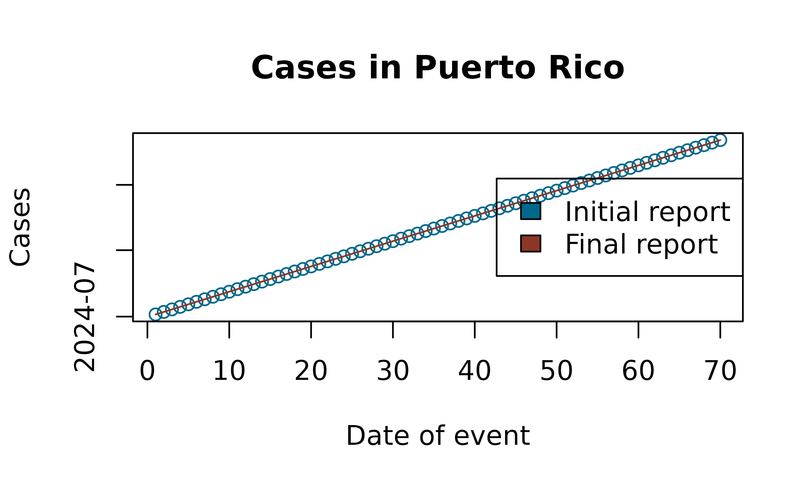

# Example analysis with Flusight

In this vignette we demonstrate how to use the `tbl.now` framework with
real data from the U.S. Centers for Disease Control and Prevention
(CDC). Specifically, we work with the Flusight dataset, which contains
weekly counts of hospital admissions for laboratory-confirmed influenza.

We begin by loading the required packages:

``` r
library(dplyr)
#> 
#> Attaching package: 'dplyr'
#> The following objects are masked from 'package:stats':
#> 
#>     filter, lag
#> The following objects are masked from 'package:base':
#> 
#>     intersect, setdiff, setequal, union
library(lubridate)
#> 
#> Attaching package: 'lubridate'
#> The following objects are masked from 'package:base':
#> 
#>     date, intersect, setdiff, union
library(tbl.now)
```

## Data

The Flusight dataset
([`?flusight`](https://rodrigozepeda.github.io/tbl.now/reference/flusight.md))
includes weekly influenza hospital admission counts. For each
epidemiological week (`target_end_date`), the CDC publishes revised
counts across multiple future weeks (`as_of`). Thus, each event week is
associated with multiple reporting dates reflecting updates or
revisions.

``` r
data(flusight)
```

| as_of      | target_end_date | location_name | observation |
|:-----------|:----------------|:--------------|------------:|
| 2023-09-23 | 2022-02-12      | Alabama       |          10 |
| 2023-09-23 | 2022-02-19      | Alabama       |          22 |
| 2023-09-23 | 2022-02-26      | Alabama       |          13 |
| 2023-09-23 | 2022-03-05      | Alabama       |          31 |
| 2023-09-23 | 2022-03-12      | Alabama       |          36 |
| 2023-09-23 | 2022-03-19      | Alabama       |          27 |
| 2023-09-23 | 2022-03-26      | Alabama       |          27 |
| 2023-09-23 | 2022-04-02      | Alabama       |          32 |
| 2023-09-23 | 2022-04-09      | Alabama       |          28 |
| 2023-09-23 | 2022-04-16      | Alabama       |          19 |

The Flusight dataset

The columns are:

- `target_end_date`: the epidemiological week when cases occurred

- `as_of`: the week in which the CDC updated its estimate for that event
  week

- `location_name`: the state or territory

- `observation`: the reported number of cases for target_end_date as of
  as_of

The key feature of this dataset is that observation is cumulative: the
value for a given `target_end_date` and `as_of` is the latest estimate
of total cases up to that event week, not the incremental update for
that reporting date. The following example illustrates the structure:

``` r
flusight %>% 
  filter(location_name == "Puerto Rico" & target_end_date == ymd("2025/04/12")) 
#> # A tibble: 19 × 4
#>    as_of      target_end_date location_name observation
#>    <date>     <date>          <chr>               <dbl>
#>  1 2025-04-12 2025-04-12      Puerto Rico           231
#>  2 2025-04-19 2025-04-12      Puerto Rico           231
#>  3 2025-04-26 2025-04-12      Puerto Rico           231
#>  4 2025-05-03 2025-04-12      Puerto Rico           261
#>  5 2025-05-10 2025-04-12      Puerto Rico           261
#>  6 2025-05-17 2025-04-12      Puerto Rico           261
#>  7 2025-05-24 2025-04-12      Puerto Rico           261
#>  8 2025-05-31 2025-04-12      Puerto Rico           261
#>  9 2025-06-07 2025-04-12      Puerto Rico           261
#> 10 2025-06-28 2025-04-12      Puerto Rico           273
#> 11 2025-07-05 2025-04-12      Puerto Rico           273
#> 12 2025-07-23 2025-04-12      Puerto Rico           273
#> 13 2025-09-03 2025-04-12      Puerto Rico           273
#> 14 2025-09-03 2025-04-12      Puerto Rico           273
#> 15 2025-09-03 2025-04-12      Puerto Rico           273
#> 16 2025-09-03 2025-04-12      Puerto Rico           273
#> 17 2025-09-24 2025-04-12      Puerto Rico           273
#> 18 2025-09-24 2025-04-12      Puerto Rico           273
#> 19 2025-11-12 2025-04-12      Puerto Rico           274
```

Each unique pair of (`target_end_date`, `as_of`) therefore corresponds
to a cumulative estimate.

## Creating the `tbl_now`

Creating the tbl_now Object

To construct a tbl_now object, we must indicate:

- `event_date`: the date on which cases occurred

- `report_date`: the date on which the estimate was released

- `case_count`: the column containing case counts

- `strata`: grouping variables that define separate strata (e.g.,
  states)

A first attempt produces several warnings:

``` r
df_wrong <- flusight %>% 
  tbl_now(event_date = target_end_date, 
          report_date = as_of, 
          case_count = observation, 
          strata = location_name)
#> Warning: Cannot accurately infer the data-type when rows are repeated across event and
#> report dates
#> Warning: Some observations in the count column "observation"
#> contain missing values.
#> ℹ Identified data as <count-incidence> with counts in column "observation".
#> Warning: *Non-unique*: Data has multiple rows for the same event (target_end_date) and
#> report(as_of) dates. Consider using `to_count()` to aggregate the data
#> or`distinct()` to remove repeated observations.
```

These warnings arise because:

1.  Duplicate rows exist for some event–report combinations.

2.  Missing values appear in the case count column.

3.  The data is incorrectly inferred to represent count-incidence rather
    than count-cumulative, because cumulative-type datasets often
    contain repeated records.

Inspecting a subset confirms duplicated rows:

``` r
flusight[c(422146, 422147, 422148, 422149), ]
#> # A tibble: 4 × 4
#>   as_of      target_end_date location_name observation
#>   <date>     <date>          <chr>               <dbl>
#> 1 2025-09-03 2022-02-05      Alabama                 5
#> 2 2025-09-03 2022-02-05      Alabama                 5
#> 3 2025-09-03 2022-02-05      Alabama                 5
#> 4 2025-09-03 2022-02-05      Alabama                 5
```

Using [\`dplyr’s
distinct()](https://dplyr.tidyverse.org/reference/distinct.html) we
remove the duplicates:

``` r
flusight <- flusight %>% distinct()
```

Next, we remove observations with missing case counts:

``` r
flusight <- flusight %>% filter(!is.na(observation))
```

However, reconstructing the object still yields a misclassified data
type:

``` r
df_still_wrong <- tbl_now(flusight, event_date = "target_end_date", report_date = "as_of", 
        case_count = "observation", strata = c("location_name"))
#> ℹ Identified data as <count-incidence> with counts in column "observation".
```

The function incorrectly infers incidence data (i.e., each row
represents the incremental number reported on that report date). In
contrast, the Flusight dataset contains cumulative values. We therefore
explicitly declare the data type:

``` r
df_flu <- tbl_now(flusight, event_date = "target_end_date", report_date = "as_of", 
        case_count = "observation", strata = c("location_name"), data_type = "count-cumulative")
```

This yields a correctly structured `tbl_now` object:

``` r
df_flu
#> # A tibble:  451,415 × 7
#> # Data type: "count-cumulative"
#> # Frequency: Event: `weeks` | Report: `weeks`
#>    as_of        target_end_date location_name observation .event_num .report_num
#>    <date>       <date>          <chr>               <dbl>      <dbl>       <dbl>
#>    [report_dat… [event_date]    [strata]          [cases]      [...]       [...]
#>  1 2023-09-23   2022-02-12      Alabama                10          1          85
#>  2 2023-09-23   2022-02-12      Alaska                  0          1          85
#>  3 2023-09-23   2022-02-12      Arizona                64          1          85
#>  4 2023-09-23   2022-02-12      Arkansas               29          1          85
#>  5 2023-09-23   2022-02-12      California             36          1          85
#>  6 2023-09-23   2022-02-12      Colorado               29          1          85
#>  7 2023-09-23   2022-02-12      Connecticut             0          1          85
#>  8 2023-09-23   2022-02-12      Delaware                2          1          85
#>  9 2023-09-23   2022-02-12      District of …           0          1          85
#> 10 2023-09-23   2022-02-12      Florida                68          1          85
#> # ────────────────────────────────────────────────────────────────────────────────
#> # Now: 2025-11-12 | Event date: "target_end_date" | Report date: "as_of"
#> # Strata: "location_name"
#> # ────────────────────────────────────────────────────────────────────────────────
#> # ℹ 451,405 more rows
#> # ℹ 1 more variable: .delay <dbl>
```

### Aligining weeks

There is however a last caveat. The `as_of` day of the week is sometimes
registered a Wednesday and sometimes its a Saturday. This results in
some `.delay`s that include decimal components:

``` r
df_flu$.delay %>% unique()
#>   [1]  84.0000000  83.0000000  82.0000000  81.0000000  80.0000000  79.0000000
#>   [7]  78.0000000  77.0000000  76.0000000  75.0000000  74.0000000  73.0000000
#>  [13]  72.0000000  71.0000000  70.0000000  69.0000000  68.0000000  67.0000000
#>  [19]  66.0000000  65.0000000  64.0000000  63.0000000  62.0000000  61.0000000
#>  [25]  60.0000000  59.0000000  58.0000000  57.0000000  56.0000000  55.0000000
#>  [31]  54.0000000  53.0000000  52.0000000  51.0000000  50.0000000  49.0000000
#>  [37]  48.0000000  47.0000000  46.0000000  45.0000000  44.0000000  43.0000000
#>  [43]  42.0000000  41.0000000  40.0000000  39.0000000  38.0000000  37.0000000
#>  [49]  36.0000000  35.0000000  34.0000000  33.0000000  32.0000000  31.0000000
#>  [55]  30.0000000  29.0000000  28.0000000  27.0000000  26.0000000  25.0000000
#>  [61]  24.0000000  23.0000000  22.0000000  21.0000000  20.0000000  19.0000000
#>  [67]  18.0000000  17.0000000  16.0000000  15.0000000  14.0000000  13.0000000
#>  [73]  12.0000000  11.0000000  10.0000000   9.0000000   8.0000000   7.0000000
#>  [79]   6.0000000   5.0000000   4.0000000   3.0000000   2.0000000   1.0000000
#>  [85]   0.0000000  85.0000000  86.0000000  87.0000000  88.0000000  89.0000000
#>  [91]  90.0000000  91.0000000  92.0000000  93.0000000  94.0000000  95.0000000
#>  [97]  96.0000000  97.0000000  98.0000000  99.0000000 100.0000000 101.0000000
#> [103] 102.0000000 103.0000000 104.0000000 105.0000000 106.0000000 107.0000000
#> [109] 108.0000000 109.0000000 110.0000000 111.0000000 112.0000000 113.0000000
#> [115] 114.0000000 115.0000000 145.0000000 144.0000000 143.0000000 142.0000000
#> [121] 141.0000000 140.0000000 139.0000000 138.0000000 137.0000000 136.0000000
#> [127] 135.0000000 134.0000000 133.0000000 132.0000000 131.0000000 130.0000000
#> [133] 129.0000000 128.0000000 127.0000000 126.0000000 125.0000000 124.0000000
#> [139] 123.0000000 122.0000000 121.0000000 120.0000000 119.0000000 118.0000000
#> [145] 117.0000000 116.0000000 147.0000000 146.0000000 149.0000000 148.0000000
#> [151] 150.0000000 151.0000000 153.0000000 152.0000000 155.0000000 154.0000000
#> [157] 156.0000000 157.0000000 158.0000000 159.0000000 160.0000000 161.0000000
#> [163] 162.0000000 163.0000000 164.0000000 165.0000000 166.0000000 167.0000000
#> [169] 168.0000000 169.0000000 170.0000000 171.0000000 172.0000000 173.0000000
#> [175] 174.0000000 177.0000000 176.0000000 175.0000000 178.0000000 180.5714286
#> [181] 179.5714286 178.5714286 177.5714286 176.5714286 175.5714286 174.5714286
#> [187] 173.5714286 172.5714286 171.5714286 170.5714286 169.5714286 168.5714286
#> [193] 167.5714286 166.5714286 165.5714286 164.5714286 163.5714286 162.5714286
#> [199] 161.5714286 160.5714286 159.5714286 158.5714286 157.5714286 156.5714286
#> [205] 155.5714286 154.5714286 153.5714286 152.5714286 151.5714286 150.5714286
#> [211] 149.5714286 148.5714286 147.5714286 146.5714286 145.5714286 144.5714286
#> [217] 143.5714286 142.5714286 141.5714286 140.5714286 139.5714286 138.5714286
#> [223] 137.5714286 136.5714286 135.5714286 134.5714286 133.5714286 132.5714286
#> [229] 131.5714286 130.5714286 129.5714286 128.5714286 127.5714286 126.5714286
#> [235] 125.5714286 124.5714286 123.5714286 122.5714286 121.5714286 120.5714286
#> [241] 119.5714286 118.5714286 117.5714286 116.5714286 115.5714286 114.5714286
#> [247] 113.5714286 112.5714286 111.5714286 110.5714286 109.5714286 108.5714286
#> [253] 107.5714286 106.5714286 105.5714286 104.5714286 103.5714286 102.5714286
#> [259] 101.5714286 100.5714286  99.5714286  98.5714286  97.5714286  96.5714286
#> [265]  95.5714286  94.5714286  93.5714286  92.5714286  91.5714286  90.5714286
#> [271]  89.5714286  88.5714286  87.5714286  86.5714286  85.5714286  84.5714286
#> [277]  83.5714286  82.5714286  81.5714286  80.5714286  79.5714286  78.5714286
#> [283]  77.5714286  76.5714286  75.5714286  74.5714286  73.5714286  72.5714286
#> [289]  71.5714286  70.5714286  69.5714286  68.5714286  67.5714286  66.5714286
#> [295]  65.5714286  64.5714286  63.5714286  62.5714286  61.5714286  60.5714286
#> [301]  59.5714286  58.5714286  57.5714286  56.5714286  55.5714286  54.5714286
#> [307]  53.5714286  52.5714286  51.5714286  50.5714286  49.5714286  48.5714286
#> [313]  47.5714286  46.5714286  45.5714286  44.5714286  43.5714286  42.5714286
#> [319]  41.5714286  40.5714286  39.5714286  38.5714286  37.5714286  36.5714286
#> [325]  35.5714286  34.5714286  33.5714286  32.5714286  31.5714286  30.5714286
#> [331]  29.5714286  28.5714286  27.5714286  26.5714286  25.5714286  24.5714286
#> [337]  23.5714286  22.5714286  21.5714286  20.5714286  19.5714286  18.5714286
#> [343]  17.5714286  16.5714286  15.5714286  14.5714286  13.5714286  12.5714286
#> [349]  11.5714286  10.5714286   9.5714286   8.5714286   7.5714286   6.5714286
#> [355]   5.5714286   4.5714286   3.5714286   2.5714286   1.5714286   0.5714286
#> [361] 186.5714286 185.5714286 184.5714286 183.5714286 182.5714286 181.5714286
#> [367] 189.5714286 188.5714286 187.5714286 196.5714286 195.5714286 194.5714286
#> [373] 193.5714286 192.5714286 191.5714286 190.5714286
```

In order to remove these decimals which don’t work for all nowcasting
models, we can align both report and event dates so that they all happen
on Sundays. This is done with the
[`align_weeks()`](https://rodrigozepeda.github.io/tbl.now/reference/align_weeks.md)
function:

``` r
df_flu <- df_flu %>% 
  align_weeks()
```

And results in integer delays:

``` r
df_flu$.delay %>% unique()
#>   [1]  84  83  82  81  80  79  78  77  76  75  74  73  72  71  70  69  68  67
#>  [19]  66  65  64  63  62  61  60  59  58  57  56  55  54  53  52  51  50  49
#>  [37]  48  47  46  45  44  43  42  41  40  39  38  37  36  35  34  33  32  31
#>  [55]  30  29  28  27  26  25  24  23  22  21  20  19  18  17  16  15  14  13
#>  [73]  12  11  10   9   8   7   6   5   4   3   2   1   0  85  86  87  88  89
#>  [91]  90  91  92  93  94  95  96  97  98  99 100 101 102 103 104 105 106 107
#> [109] 108 109 110 111 112 113 114 115 145 144 143 142 141 140 139 138 137 136
#> [127] 135 134 133 132 131 130 129 128 127 126 125 124 123 122 121 120 119 118
#> [145] 117 116 147 146 149 148 150 151 153 152 155 154 156 157 158 159 160 161
#> [163] 162 163 164 165 166 167 168 169 170 171 172 173 174 177 176 175 178 181
#> [181] 180 179 187 186 185 184 183 182 190 189 188 197 196 195 194 193 192 191
```

## Working with the `tbl_now` Object

`tbl_now` objects are fully compatible with `dplyr` verbs. For example,
we may focus on Puerto Rico and observations after mid–2024:

``` r
df_pr <- df_flu %>% 
  rename(latest_report = as_of) %>% 
  filter(location_name == "Puerto Rico") %>% 
  filter(target_end_date >= ymd("2024/07/01"))

df_pr
#> # A tibble:  1,259 × 7
#> # Data type: "linelist"
#> # Frequency: Event: `weeks` | Report: `weeks`
#>    location_name observation target_end_date latest_report .event_num
#>    <chr>               <dbl> <date>          <date>             <dbl>
#>    [...]               [...] [event_date]    [report_date]      [...]
#>  1 Puerto Rico             6 2024-07-07      2024-11-10           127
#>  2 Puerto Rico             9 2024-07-14      2024-11-10           128
#>  3 Puerto Rico             3 2024-07-21      2024-11-10           129
#>  4 Puerto Rico             6 2024-07-28      2024-11-10           130
#>  5 Puerto Rico             5 2024-08-04      2024-11-10           131
#>  6 Puerto Rico             3 2024-08-11      2024-11-10           132
#>  7 Puerto Rico             3 2024-08-18      2024-11-10           133
#>  8 Puerto Rico             2 2024-08-25      2024-11-10           134
#>  9 Puerto Rico             1 2024-09-01      2024-11-10           135
#> 10 Puerto Rico             0 2024-09-08      2024-11-10           136
#> # ────────────────────────────────────────────────────────────────────────────────
#> # Now: 2025-11-09 | Event date: "target_end_date" | Report date: "latest_report"
#> # ────────────────────────────────────────────────────────────────────────────────
#> # ℹ 1,249 more rows
#> # ℹ 2 more variables: .report_num <dbl>, .delay <dbl>
```

Because we are now working with a single geographic unit, the
`location_name` variable is no longer meaningful as a stratum. We remove
it from the strata definition (without removing the column itself):

``` r
df_pr <- df_pr %>% 
  remove_strata("location_name")

df_pr
#> # A tibble:  1,259 × 7
#> # Data type: "linelist"
#> # Frequency: Event: `weeks` | Report: `weeks`
#>    location_name observation target_end_date latest_report .event_num
#>    <chr>               <dbl> <date>          <date>             <dbl>
#>    [...]               [...] [event_date]    [report_date]      [...]
#>  1 Puerto Rico             6 2024-07-07      2024-11-10           127
#>  2 Puerto Rico             9 2024-07-14      2024-11-10           128
#>  3 Puerto Rico             3 2024-07-21      2024-11-10           129
#>  4 Puerto Rico             6 2024-07-28      2024-11-10           130
#>  5 Puerto Rico             5 2024-08-04      2024-11-10           131
#>  6 Puerto Rico             3 2024-08-11      2024-11-10           132
#>  7 Puerto Rico             3 2024-08-18      2024-11-10           133
#>  8 Puerto Rico             2 2024-08-25      2024-11-10           134
#>  9 Puerto Rico             1 2024-09-01      2024-11-10           135
#> 10 Puerto Rico             0 2024-09-08      2024-11-10           136
#> # ────────────────────────────────────────────────────────────────────────────────
#> # Now: 2025-11-09 | Event date: "target_end_date" | Report date: "latest_report"
#> # ────────────────────────────────────────────────────────────────────────────────
#> # ℹ 1,249 more rows
#> # ℹ 2 more variables: .report_num <dbl>, .delay <dbl>
```

The `now` (the effective horizon for the nowcast) is:

``` r
get_now(df_pr)
#> [1] "2025-11-09"
```

### Changing the “now” for Historical Backtesting

To perform retrospective analyses (backtesting), we can filter the
dataset and explicitly set a historical reporting cutoff:

``` r
df_pr_new_now <- df_pr %>% 
  filter(latest_report < ymd("2023/12/01")) %>% 
  change_now(ymd("2023/12/01"))

df_pr_new_now
#> # A tibble:  0 × 7
#> # Data type: "linelist"
#> # Frequency: Event: `weeks` | Report: `weeks`
#> # ────────────────────────────────────────────────────────────────────────────────
#> # Now: 2025-11-09 | Event date: "target_end_date" | Report date: "latest_report"
#> # ────────────────────────────────────────────────────────────────────────────────
#> # ℹ 7 variables: location_name <chr>, observation <dbl>,
#> #   target_end_date <date>, latest_report <date>, .event_num <dbl>,
#> #   .report_num <dbl>, .delay <dbl>
```

The new now is:

``` r
get_now(df_pr_new_now)
#> [1] "2025-11-09"
```

## Working with Initial and Latest Reports

Two helper functions extract initial and final reported values for each
event date:

- [`get_initial_reported_cases()`](https://rodrigozepeda.github.io/tbl.now/reference/get_latest_first.md):
  the earliest available report for each event

- [`get_latest_reported_cases()`](https://rodrigozepeda.github.io/tbl.now/reference/get_latest_first.md):
  the most recent report relative to now

A simple plot highlights the differences between initial and final
estimates:

``` r
initial_reports <- get_initial_reported_cases(df_pr)
latest_reports  <- get_latest_reported_cases(df_pr)
```

A simple plot highlights the differences between initial and final
estimates:

``` r
plot(initial_reports$target_end_date, initial_reports$observation, 
     type = "p", col = "deepskyblue4",
     xlab = "Date of event", ylab = "Cases",
     main = "Cases in Puerto Rico")
#> Warning: Unknown or uninitialised column: `observation`.

lines(latest_reports$target_end_date, latest_reports$observation,
      col = "tomato4")
#> Warning: Unknown or uninitialised column: `observation`.

legend("right", legend = c("Initial report", "Final report"),
       fill = c("deepskyblue4", "tomato4"))
```


