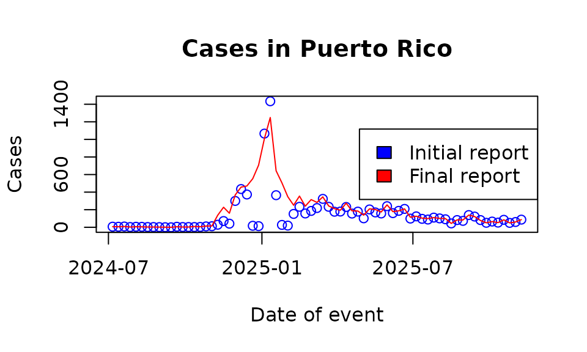

# Example analysis with Flusight

In this article we show how to use the `tbl.now` framework with real
data from the Center for Disease Control (CDC).

We start by loading the required packages:

``` r
library(dplyr)
library(lubridate)
library(tbl.now)
```

## Data

For the example, we will use the Flusight data from the CDC which
contains **weekly** hospital admissions of patients with confirmed
influenza (see
[`?flusight`](https://rodrigozepeda.github.io/tbl.now/reference/flusight.md)).
The data is reported **weekly** starting one week after the
observations.

``` r
data(flusight)
flusight
#> # A tibble: 491,706 × 4
#>    as_of      target_end_date location_name        observation
#>    <date>     <date>          <chr>                      <dbl>
#>  1 2023-09-23 2022-02-12      Alabama                       10
#>  2 2023-09-23 2022-02-12      Alaska                         0
#>  3 2023-09-23 2022-02-12      Arizona                       64
#>  4 2023-09-23 2022-02-12      Arkansas                      29
#>  5 2023-09-23 2022-02-12      California                    36
#>  6 2023-09-23 2022-02-12      Colorado                      29
#>  7 2023-09-23 2022-02-12      Connecticut                    0
#>  8 2023-09-23 2022-02-12      Delaware                       2
#>  9 2023-09-23 2022-02-12      District of Columbia           0
#> 10 2023-09-23 2022-02-12      Florida                       68
#> # ℹ 491,696 more rows
```

The column `target_end_date` corresponds to the **week** of observation
while `as_of` corresponds to the **week** when information was updated.
The same observation week (`target_end_date`) has then multiple report
dates (`as_of`) corresponding to future weeks of update. Data is
available for several states and territories of the United States via
`location_name`.

Finally note that the data is reported as cumulative cases
(`case-cumulative`). That is, the column `observations` contains not the
cases that were updated in date `as_of` but the **overall** number of
cases that were believed to have happend in date `target_end_date` by
date `as_of`. You can see this with an example:

``` r
flusight %>% 
  filter(location_name == "pr" & target_end_date == ymd("2024/04/06")) 
#> # A tibble: 0 × 4
#> # ℹ 4 variables: as_of <date>, target_end_date <date>, location_name <chr>,
#> #   observation <dbl>
```

Where each `as_of` the total number of cases that occurred in
`target_end_date` are reported in `observation`.

## Creating the `tbl_now`

We can try and setup a `tbl_now` by specifying the following:

- `event_date`: When cases happened
- `report_date`: When cases were reported.
- `case_count`: Column containing information about the number of cases
  for that observation.
- `strata`: A vector containing all of the columns considered strata

Creating the `tbl_now` object like this will throw several warnings:

``` r
df_wrong <- flusight %>% 
  tbl_now(event_date = target_end_date, 
          report_date = as_of, 
          case_count = observation, 
          strata = location_name)
#> Warning: Cannot accurately infer the data-type when rows are repeated across event and
#> report dates
#> Warning: Some observations in the count column "observation"
#> contain missing values.
#> ℹ Identified data as <count-incidence> with counts in column "observation".
#> Warning: *Non-unique*: Data has multiple rows for the same event (target_end_date) and
#> report(as_of) dates. Consider using `to_count()` to aggregate the data
#> or`distinct()` to remove repeated observations.
```

The first and last warnings indicate, for example, that some
observations are repeated. You can see that rows `422146`, `422147`,
`422148`, `422149` have exactly the same values:

``` r
flusight[c(422146, 422147, 422148, 422149), ]
#> # A tibble: 4 × 4
#>   as_of      target_end_date location_name observation
#>   <date>     <date>          <chr>               <dbl>
#> 1 2025-09-03 2022-02-05      Alabama                 5
#> 2 2025-09-03 2022-02-05      Alabama                 5
#> 3 2025-09-03 2022-02-05      Alabama                 5
#> 4 2025-09-03 2022-02-05      Alabama                 5
```

Using [\`dplyr’s
distinct()](https://dplyr.tidyverse.org/reference/distinct.html) we can
clean the repeated rows and fix those warnings:

``` r
flusight <- flusight %>% distinct()
```

**Missing** values are warned by the `tbl_now` object to make sure the
user knows of their presence. We can either ignore the warning, remove
or substitute the values. For the purpose of this example, we will
filter them out:

``` r
flusight <- flusight %>% filter(!is.na(observation))
```

Then try again the `tbl_now` (spoiler, we still need to fix one last
thing):

``` r
df_still_wrong <- tbl_now(flusight, event_date = "target_end_date", report_date = "as_of", 
        case_count = "observation", strata = c("location_name"))
#> ℹ Identified data as <count-incidence> with counts in column "observation".
```

The data was incorrectly identified as `count-incidence` which means
that each event-report date combination corresponds to the number of
cases that where observed for the `event_date` and reported **exactly**
at `report_date`. That is, the total number of cases that happened at
`event_date` is given by the **sum** of all of the cases for each
`report_date`.

In our case we have `count-cumulative` data where the `report_date`
reports the latest estimate of the **total** number of cases. This can
be specified with the `data_type` option:

``` r
df_flu <- tbl_now(flusight, event_date = "target_end_date", report_date = "as_of", 
        case_count = "observation", strata = c("location_name"), data_type = "count-cumulative")
```

And this results in the correct `tbl_now` object:

``` r
df_flu
#> # A tibble:  451,415 × 7
#> # Data type: "count-cumulative"
#> # Frequency: Event: `weeks` | Report: `weeks`
#>    as_of        target_end_date location_name observation .event_num .report_num
#>    <date>       <date>          <chr>               <dbl>      <dbl>       <dbl>
#>    [report_dat… [event_date]    [strata]          [cases]      [...]       [...]
#>  1 2023-09-23   2022-02-12      Alabama                10          1          85
#>  2 2023-09-23   2022-02-12      Alaska                  0          1          85
#>  3 2023-09-23   2022-02-12      Arizona                64          1          85
#>  4 2023-09-23   2022-02-12      Arkansas               29          1          85
#>  5 2023-09-23   2022-02-12      California             36          1          85
#>  6 2023-09-23   2022-02-12      Colorado               29          1          85
#>  7 2023-09-23   2022-02-12      Connecticut             0          1          85
#>  8 2023-09-23   2022-02-12      Delaware                2          1          85
#>  9 2023-09-23   2022-02-12      District of …           0          1          85
#> 10 2023-09-23   2022-02-12      Florida                68          1          85
#> # ────────────────────────────────────────────────────────────────────────────────
#> # Now: 2025-11-12 | Event date: "target_end_date" | Report date: "as_of"
#> # Strata: "location_name"
#> # ────────────────────────────────────────────────────────────────────────────────
#> # ℹ 451,405 more rows
#> # ℹ 1 more variable: .delay <dbl>
```

## Using the `tbl_now`

Once created the `tbl_now` you can use the classic `dplyr` verbs to do
operations. For example by renaming columns and filtering out just one
state:

``` r
df_pr <- df_flu %>% 
  rename(latest_report = as_of) %>% 
  filter(location_name == "Puerto Rico") %>% 
  filter(target_end_date >= ymd("2024/07/01"))

df_pr
#> # A tibble:  1,291 × 7
#> # Data type: "count-cumulative"
#> # Frequency: Event: `weeks` | Report: `weeks`
#>    latest_report target_end_date location_name observation .event_num
#>    <date>        <date>          <chr>               <dbl>      <dbl>
#>    [report_date] [event_date]    [strata]          [cases]      [...]
#>  1 2024-11-16    2024-07-06      Puerto Rico             7        126
#>  2 2024-11-16    2024-07-13      Puerto Rico             6        127
#>  3 2024-11-16    2024-07-20      Puerto Rico             9        128
#>  4 2024-11-16    2024-07-27      Puerto Rico             3        129
#>  5 2024-11-16    2024-08-03      Puerto Rico             6        130
#>  6 2024-11-16    2024-08-10      Puerto Rico             5        131
#>  7 2024-11-16    2024-08-17      Puerto Rico             3        132
#>  8 2024-11-16    2024-08-24      Puerto Rico             3        133
#>  9 2024-11-16    2024-08-31      Puerto Rico             2        134
#> 10 2024-11-16    2024-09-07      Puerto Rico             1        135
#> # ────────────────────────────────────────────────────────────────────────────────
#> # Now: 2025-11-12 | Event date: "target_end_date" | Report date: "latest_report"
#> # Strata: "location_name"
#> # ────────────────────────────────────────────────────────────────────────────────
#> # ℹ 1,281 more rows
#> # ℹ 2 more variables: .report_num <dbl>, .delay <dbl>
```

Given that in this dataset we only have `pr` it makes no sense to keep
`location_name` as strata. We can use the `remove_strata` function to
remove it without removing the column (though removing the column would
also work):

``` r
df_pr <- df_pr %>% 
  remove_strata("location_name")
df_pr
#> # A tibble:  1,291 × 7
#> # Data type: "count-cumulative"
#> # Frequency: Event: `weeks` | Report: `weeks`
#>    latest_report target_end_date location_name observation .event_num
#>    <date>        <date>          <chr>               <dbl>      <dbl>
#>    [report_date] [event_date]    [...]             [cases]      [...]
#>  1 2024-11-16    2024-07-06      Puerto Rico             7        126
#>  2 2024-11-16    2024-07-13      Puerto Rico             6        127
#>  3 2024-11-16    2024-07-20      Puerto Rico             9        128
#>  4 2024-11-16    2024-07-27      Puerto Rico             3        129
#>  5 2024-11-16    2024-08-03      Puerto Rico             6        130
#>  6 2024-11-16    2024-08-10      Puerto Rico             5        131
#>  7 2024-11-16    2024-08-17      Puerto Rico             3        132
#>  8 2024-11-16    2024-08-24      Puerto Rico             3        133
#>  9 2024-11-16    2024-08-31      Puerto Rico             2        134
#> 10 2024-11-16    2024-09-07      Puerto Rico             1        135
#> # ────────────────────────────────────────────────────────────────────────────────
#> # Now: 2025-11-12 | Event date: "target_end_date" | Report date: "latest_report"
#> # ────────────────────────────────────────────────────────────────────────────────
#> # ℹ 1,281 more rows
#> # ℹ 2 more variables: .report_num <dbl>, .delay <dbl>
```

The current `now` for the nowcast is:

``` r
get_now(df_pr)
#> [1] "2025-11-12"
```

However, if we were interested, say, in historical nowcasting
(i.e. backtesting) we can filter the dates and update the now:

``` r
df_pr_new_now <- df_pr %>% 
  filter(latest_report < ymd("2023/12/01")) %>% 
  change_now(ymd("2023/12/01"))

df_pr_new_now
#> # A tibble:  0 × 7
#> # Data type: "count-cumulative"
#> # Frequency: Event: `weeks` | Report: `weeks`
#> # ────────────────────────────────────────────────────────────────────────────────
#> # Now: 2025-11-12 | Event date: "target_end_date" | Report date: "latest_report"
#> # ────────────────────────────────────────────────────────────────────────────────
#> # ℹ 7 variables: latest_report <date>, target_end_date <date>,
#> #   location_name <chr>, observation <dbl>, .event_num <dbl>,
#> #   .report_num <dbl>, .delay <dbl>
```

Which yields the new value:

``` r
get_now(df_pr_new_now)
#> [1] "2025-11-12"
```

## Reports

The
[`get_initial_reported_cases()`](https://rodrigozepeda.github.io/tbl.now/reference/get_latest_first.md)
and
[`get_latest_reported_cases()`](https://rodrigozepeda.github.io/tbl.now/reference/get_latest_first.md)
obtain the cases with the earliest report date for each event or witht
he latest report date for the event. This allow to compare the data as
it came initially and the latest report.

``` r
initial_reports <- get_initial_reported_cases(df_pr)
latest_reports  <- get_latest_reported_cases(df_pr)
```

Graphically this is what they look like:

``` r
plot(initial_reports$target_end_date, initial_reports$observation, 
     type = "p", col = "blue", xlab = "Date of event", ylab = "Cases",
     main = "Cases in Puerto Rico")

lines(latest_reports$target_end_date, latest_reports$observation, col = "red")

legend("right", y = "top", legend = c("Initial report","Final report"), 
       fill = c("blue","red"))
```


