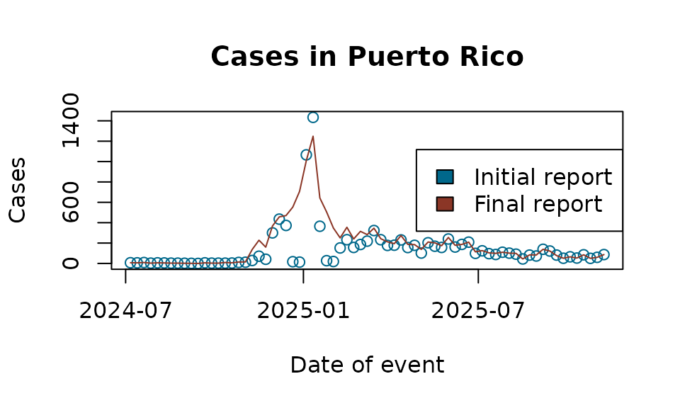

# Example analysis with Flusight

In this vignette we demonstrate how to use the `tbl.now` framework with
real data from the U.S. Centers for Disease Control and Prevention
(CDC). Specifically, we work with the Flusight dataset, which contains
weekly counts of hospital admissions for laboratory-confirmed influenza.

We begin by loading the required packages:

``` r
library(dplyr)
#> 
#> Attaching package: 'dplyr'
#> The following objects are masked from 'package:stats':
#> 
#>     filter, lag
#> The following objects are masked from 'package:base':
#> 
#>     intersect, setdiff, setequal, union
library(lubridate)
#> 
#> Attaching package: 'lubridate'
#> The following objects are masked from 'package:base':
#> 
#>     date, intersect, setdiff, union
library(tbl.now)
```

## Data

The Flusight dataset
([`?flusight`](https://rodrigozepeda.github.io/tbl.now/reference/flusight.md))
includes weekly influenza hospital admission counts. For each
epidemiological week (`target_end_date`), the CDC publishes revised
counts across multiple future weeks (`as_of`). Thus, each event week is
associated with multiple reporting dates reflecting updates or
revisions.

``` r
data(flusight)
```

| as_of      | target_end_date | location_name | observation |
|:-----------|:----------------|:--------------|------------:|
| 2023-09-23 | 2022-02-12      | Alabama       |          10 |
| 2023-09-23 | 2022-02-19      | Alabama       |          22 |
| 2023-09-23 | 2022-02-26      | Alabama       |          13 |
| 2023-09-23 | 2022-03-05      | Alabama       |          31 |
| 2023-09-23 | 2022-03-12      | Alabama       |          36 |
| 2023-09-23 | 2022-03-19      | Alabama       |          27 |
| 2023-09-23 | 2022-03-26      | Alabama       |          27 |
| 2023-09-23 | 2022-04-02      | Alabama       |          32 |
| 2023-09-23 | 2022-04-09      | Alabama       |          28 |
| 2023-09-23 | 2022-04-16      | Alabama       |          19 |

The Flusight dataset

The columns are:

- `target_end_date`: the epidemiological week when cases occurred

- `as_of`: the week in which the CDC updated its estimate for that event
  week

- `location_name`: the state or territory

- `observation`: the reported number of cases for target_end_date as of
  as_of

The key feature of this dataset is that observation is cumulative: the
value for a given `target_end_date` and `as_of` is the latest estimate
of total cases up to that event week, not the incremental update for
that reporting date. The following example illustrates the structure:

``` r
flusight %>% 
  filter(location_name == "Puerto Rico" & target_end_date == ymd("2025/04/12")) 
#> # A tibble: 19 × 4
#>    as_of      target_end_date location_name observation
#>    <date>     <date>          <chr>               <dbl>
#>  1 2025-04-12 2025-04-12      Puerto Rico           231
#>  2 2025-04-19 2025-04-12      Puerto Rico           231
#>  3 2025-04-26 2025-04-12      Puerto Rico           231
#>  4 2025-05-03 2025-04-12      Puerto Rico           261
#>  5 2025-05-10 2025-04-12      Puerto Rico           261
#>  6 2025-05-17 2025-04-12      Puerto Rico           261
#>  7 2025-05-24 2025-04-12      Puerto Rico           261
#>  8 2025-05-31 2025-04-12      Puerto Rico           261
#>  9 2025-06-07 2025-04-12      Puerto Rico           261
#> 10 2025-06-28 2025-04-12      Puerto Rico           273
#> 11 2025-07-05 2025-04-12      Puerto Rico           273
#> 12 2025-07-23 2025-04-12      Puerto Rico           273
#> 13 2025-09-03 2025-04-12      Puerto Rico           273
#> 14 2025-09-03 2025-04-12      Puerto Rico           273
#> 15 2025-09-03 2025-04-12      Puerto Rico           273
#> 16 2025-09-03 2025-04-12      Puerto Rico           273
#> 17 2025-09-24 2025-04-12      Puerto Rico           273
#> 18 2025-09-24 2025-04-12      Puerto Rico           273
#> 19 2025-11-12 2025-04-12      Puerto Rico           274
```

Each unique pair of (`target_end_date`, `as_of`) therefore corresponds
to a cumulative estimate.

## Creating the `tbl_now`

Creating the tbl_now Object

To construct a tbl_now object, we must indicate:

- `event_date`: the date on which cases occurred

- `report_date`: the date on which the estimate was released

- `case_count`: the column containing case counts

- `strata`: grouping variables that define separate strata (e.g.,
  states)

A first attempt produces several warnings:

``` r
df_wrong <- flusight %>% 
  tbl_now(event_date = target_end_date, 
          report_date = as_of, 
          case_count = observation, 
          strata = location_name)
#> Warning: Cannot accurately infer the data-type when rows are repeated across event and
#> report dates
#> Warning: Some observations in the count column "observation"
#> contain missing values.
#> ℹ Identified data as <count-incidence> with counts in column "observation".
#> Warning: *Non-unique*: Data has multiple rows for the same event (target_end_date) and
#> report(as_of) dates. Consider using `to_count()` to aggregate the data
#> or`distinct()` to remove repeated observations.
```

These warnings arise because:

1.  Duplicate rows exist for some event–report combinations.

2.  Missing values appear in the case count column.

3.  The data is incorrectly inferred to represent count-incidence rather
    than count-cumulative, because cumulative-type datasets often
    contain repeated records.

Inspecting a subset confirms duplicated rows:

``` r
flusight[c(422146, 422147, 422148, 422149), ]
#> # A tibble: 4 × 4
#>   as_of      target_end_date location_name observation
#>   <date>     <date>          <chr>               <dbl>
#> 1 2025-09-03 2022-02-05      Alabama                 5
#> 2 2025-09-03 2022-02-05      Alabama                 5
#> 3 2025-09-03 2022-02-05      Alabama                 5
#> 4 2025-09-03 2022-02-05      Alabama                 5
```

Using [\`dplyr’s
distinct()](https://dplyr.tidyverse.org/reference/distinct.html) we
remove the duplicates:

``` r
flusight <- flusight %>% distinct()
```

Next, we remove observations with missing case counts:

``` r
flusight <- flusight %>% filter(!is.na(observation))
```

However, reconstructing the object still yields a misclassified data
type:

``` r
df_still_wrong <- tbl_now(flusight, event_date = "target_end_date", report_date = "as_of", 
        case_count = "observation", strata = c("location_name"))
#> ℹ Identified data as <count-incidence> with counts in column "observation".
```

The function incorrectly infers incidence data (i.e., each row
represents the incremental number reported on that report date). In
contrast, the Flusight dataset contains cumulative values. We therefore
explicitly declare the data type:

``` r
df_flu <- tbl_now(flusight, event_date = "target_end_date", report_date = "as_of", 
        case_count = "observation", strata = c("location_name"), data_type = "count-cumulative")
```

This yields a correctly structured `tbl_now` object:

``` r
df_flu
#> # A tibble:  451,415 × 7
#> # Data type: "count-cumulative"
#> # Frequency: Event: `weeks` | Report: `weeks`
#>    as_of        target_end_date location_name observation .event_num .report_num
#>    <date>       <date>          <chr>               <dbl>      <dbl>       <dbl>
#>    [report_dat… [event_date]    [strata]          [cases]      [...]       [...]
#>  1 2023-09-23   2022-02-12      Alabama                10          1          85
#>  2 2023-09-23   2022-02-12      Alaska                  0          1          85
#>  3 2023-09-23   2022-02-12      Arizona                64          1          85
#>  4 2023-09-23   2022-02-12      Arkansas               29          1          85
#>  5 2023-09-23   2022-02-12      California             36          1          85
#>  6 2023-09-23   2022-02-12      Colorado               29          1          85
#>  7 2023-09-23   2022-02-12      Connecticut             0          1          85
#>  8 2023-09-23   2022-02-12      Delaware                2          1          85
#>  9 2023-09-23   2022-02-12      District of …           0          1          85
#> 10 2023-09-23   2022-02-12      Florida                68          1          85
#> # ────────────────────────────────────────────────────────────────────────────────
#> # Now: 2025-11-12 | Event date: "target_end_date" | Report date: "as_of"
#> # Strata: "location_name"
#> # ────────────────────────────────────────────────────────────────────────────────
#> # ℹ 451,405 more rows
#> # ℹ 1 more variable: .delay <dbl>
```

## Working with the `tbl_now` Object

`tbl_now` objects are fully compatible with `dplyr` verbs. For example,
we may focus on Puerto Rico and observations after mid–2024:

``` r
df_pr <- df_flu %>% 
  rename(latest_report = as_of) %>% 
  filter(location_name == "Puerto Rico") %>% 
  filter(target_end_date >= ymd("2024/07/01"))

df_pr
#> # A tibble:  1,291 × 7
#> # Data type: "count-cumulative"
#> # Frequency: Event: `weeks` | Report: `weeks`
#>    latest_report target_end_date location_name observation .event_num
#>    <date>        <date>          <chr>               <dbl>      <dbl>
#>    [report_date] [event_date]    [strata]          [cases]      [...]
#>  1 2024-11-16    2024-07-06      Puerto Rico             7        126
#>  2 2024-11-16    2024-07-13      Puerto Rico             6        127
#>  3 2024-11-16    2024-07-20      Puerto Rico             9        128
#>  4 2024-11-16    2024-07-27      Puerto Rico             3        129
#>  5 2024-11-16    2024-08-03      Puerto Rico             6        130
#>  6 2024-11-16    2024-08-10      Puerto Rico             5        131
#>  7 2024-11-16    2024-08-17      Puerto Rico             3        132
#>  8 2024-11-16    2024-08-24      Puerto Rico             3        133
#>  9 2024-11-16    2024-08-31      Puerto Rico             2        134
#> 10 2024-11-16    2024-09-07      Puerto Rico             1        135
#> # ────────────────────────────────────────────────────────────────────────────────
#> # Now: 2025-11-12 | Event date: "target_end_date" | Report date: "latest_report"
#> # Strata: "location_name"
#> # ────────────────────────────────────────────────────────────────────────────────
#> # ℹ 1,281 more rows
#> # ℹ 2 more variables: .report_num <dbl>, .delay <dbl>
```

Because we are now working with a single geographic unit, the
`location_name` variable is no longer meaningful as a stratum. We remove
it from the strata definition (without removing the column itself):

``` r
df_pr <- df_pr %>% 
  remove_strata("location_name")

df_pr
#> # A tibble:  1,291 × 7
#> # Data type: "count-cumulative"
#> # Frequency: Event: `weeks` | Report: `weeks`
#>    latest_report target_end_date location_name observation .event_num
#>    <date>        <date>          <chr>               <dbl>      <dbl>
#>    [report_date] [event_date]    [...]             [cases]      [...]
#>  1 2024-11-16    2024-07-06      Puerto Rico             7        126
#>  2 2024-11-16    2024-07-13      Puerto Rico             6        127
#>  3 2024-11-16    2024-07-20      Puerto Rico             9        128
#>  4 2024-11-16    2024-07-27      Puerto Rico             3        129
#>  5 2024-11-16    2024-08-03      Puerto Rico             6        130
#>  6 2024-11-16    2024-08-10      Puerto Rico             5        131
#>  7 2024-11-16    2024-08-17      Puerto Rico             3        132
#>  8 2024-11-16    2024-08-24      Puerto Rico             3        133
#>  9 2024-11-16    2024-08-31      Puerto Rico             2        134
#> 10 2024-11-16    2024-09-07      Puerto Rico             1        135
#> # ────────────────────────────────────────────────────────────────────────────────
#> # Now: 2025-11-12 | Event date: "target_end_date" | Report date: "latest_report"
#> # ────────────────────────────────────────────────────────────────────────────────
#> # ℹ 1,281 more rows
#> # ℹ 2 more variables: .report_num <dbl>, .delay <dbl>
```

The `now` (the effective horizon for the nowcast) is:

``` r
get_now(df_pr)
#> [1] "2025-11-12"
```

### Changing the “now” for Historical Backtesting

To perform retrospective analyses (backtesting), we can filter the
dataset and explicitly set a historical reporting cutoff:

``` r
df_pr_new_now <- df_pr %>% 
  filter(latest_report < ymd("2023/12/01")) %>% 
  change_now(ymd("2023/12/01"))

df_pr_new_now
#> # A tibble:  0 × 7
#> # Data type: "count-cumulative"
#> # Frequency: Event: `weeks` | Report: `weeks`
#> # ────────────────────────────────────────────────────────────────────────────────
#> # Now: 2025-11-12 | Event date: "target_end_date" | Report date: "latest_report"
#> # ────────────────────────────────────────────────────────────────────────────────
#> # ℹ 7 variables: latest_report <date>, target_end_date <date>,
#> #   location_name <chr>, observation <dbl>, .event_num <dbl>,
#> #   .report_num <dbl>, .delay <dbl>
```

The new now is:

``` r
get_now(df_pr_new_now)
#> [1] "2025-11-12"
```

## Working with Initial and Latest Reports

Two helper functions extract initial and final reported values for each
event date:

- [`get_initial_reported_cases()`](https://rodrigozepeda.github.io/tbl.now/reference/get_latest_first.md):
  the earliest available report for each event

- [`get_latest_reported_cases()`](https://rodrigozepeda.github.io/tbl.now/reference/get_latest_first.md):
  the most recent report relative to now

A simple plot highlights the differences between initial and final
estimates:

``` r
initial_reports <- get_initial_reported_cases(df_pr)
latest_reports  <- get_latest_reported_cases(df_pr)
```

A simple plot highlights the differences between initial and final
estimates:

``` r
plot(initial_reports$target_end_date, initial_reports$observation, 
     type = "p", col = "deepskyblue4",
     xlab = "Date of event", ylab = "Cases",
     main = "Cases in Puerto Rico")

lines(latest_reports$target_end_date, latest_reports$observation,
      col = "tomato4")

legend("right", legend = c("Initial report", "Final report"),
       fill = c("deepskyblue4", "tomato4"))
```


