# Diagnosing reporting batches and other reporting-delay artifacts

## Batch reporting

Surveillance data does not always arrive smoothly. Sometimes the
reporting system halts or reduces its output (e.g. a data-system outage,
an overwhelmed jurisdiction) and the backlog is released later all at
once. That release is called a **batch**: a collection of reports from
previous periods that were held and reported all at once during a
different reporting period. Intuivitively one can think of a batch as a
collection of reports that –in an ideal scenario– *should have been
reported* on a previous date but were actually released later.


A batch is easy to confuse with an epidemic **surge**. The important
part is that the batch happens on the **reporting date** axis while a
surge happens on the **event date** axis. A batch just *moves* reports
to a later date not adding new cases while a real epidemic surge *adds*
new cases. The tools here are designed to help you visualize that
difference.

> This article shows each plot **twice**: first on a clean, made-up
> outbreak with one obvious batch (so you learn the signature), then on
> real, COVID-19 data from the CDC (see
> [`covid_us`](https://rodrigozepeda.github.io/tbl.now/reference/covid_us.html)).

## Two datasets to compare

### The made-up outbreak.

This simulation consists of a bell-shaped curve over a hundred days,
each case reported within a few days. For one week near the peak, the
reporting system slows down with **half** of each day’s reports being
held back and released days after. That release is the **batch**.

``` r

set.seed(82495)
#Simulate a curve
onset_days <- as.Date("2024-01-01") + 0:99
bell       <- dnorm(seq(-2.5, 2.5, length.out = 100))
per_day    <- round(400 * bell / max(bell)) + 8         
onset      <- rep(onset_days, per_day)
reported   <- onset + rpois(length(onset), 1.5)         

clean_tn <- tbl_now(tibble(onset = onset, reported = reported),
                    event_date = onset, report_date = reported,
                    data_type = "linelist", verbose = FALSE)

# Simulate a batch
ideal <- simulate_batch(clean_tn,
  closed_dates  = seq(as.Date("2024-02-19"), by = "day", length.out = 7),
  held_fraction = 0.5)
```

We can see the simulated data both from the event-date and the
report-date perspectives:

``` r

plot_epidemic_process(ideal)
plot_reporting_process(ideal)
```

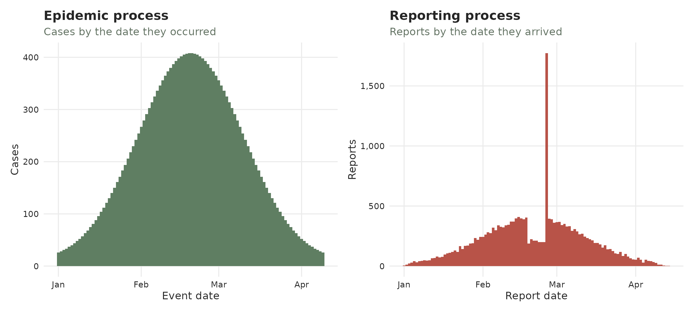

### The real data

`covid_us` comes from the CDC’s individual-level [COVID-19 Case
Surveillance Public Use
Data](https://data.cdc.gov/Case-Surveillance/COVID-19-Case-Surveillance-Public-Use-Data/vbim-akqf/about_data).
These represent cases whose event date (`cdc_case_earliest_dt`) *and*
report date (`cdc_report_dt`) both fall before September 2020. The
picture shows what it would have looked back then.

``` r

data(covid_us)

covid_early <- covid_us %>% 
  filter(cdc_case_earliest_dt < as.Date("2020-09-01") &
           cdc_report_dt < as.Date("2020-09-01"))

tn <- tbl_now(covid_early, event_date = cdc_case_earliest_dt,
              report_date = cdc_report_dt, case_count = n,
              data_type = "count-incidence", verbose = FALSE)
```

Half of all cases were reported within a few days, but the tail is long:
some cases take weeks or months to surface.

``` r

stats::quantile(rep(tn$.delay, tn$n), c(0.5, 0.75, 0.9, 0.99))
#> 50% 75% 90% 99% 
#>   4  13  42  88
```

We can see this dataset again from both the event-date and the
report-date perspectives:

``` r

plot_epidemic_process(tn)
plot_reporting_process(tn)
```

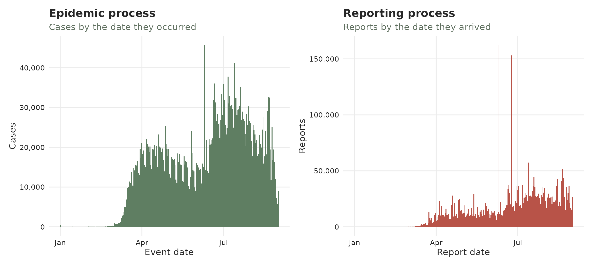

## The reporting process

This plot, which we have previously shown, shows how many reports
arrived by date. Batches or surges might correspond to spikes towering
over their neighbours.

``` r

plot_reporting_process(ideal)
```


Reporting process of the simulated data

On the real data the reporting is spikier; however, a couple of peaks in
June 2020 stick up where smooth epidemic reporting should be. Those are
reporting artefacts either pure backlog releases, or a mix of backlog +
a genuine surge (we’ll come back to this characterization later). The
tallest is a single day of about 160K reports, well above the 20-40K
that arrive on a typical day that summer.

``` r

plot_reporting_process(tn)
```


Reporting process of the COVID-19 data

## The reporting triangle

We provide two different visualizations of the reporting triangle. In
both we plot the three temporal dimensions involved in the process: the
event date, the reporting date and the delay. We cover the plots in
tiles coloured by how many cases were registered then.

### The classical reporting triangle

The classical view is given by
[`plot_reporting_triangle()`](https://rodrigozepeda.github.io/tbl.now/reference/plot_reporting_triangle.md)
where each tile is described by *when it happened* (across) and *how
long they took to be reported* (vertical). The diagonal shows reports
that arrive on the same day.  
An indicator of a batch is **a bright diagonal reaching high up** which
reporesents many delayed cases being all reported on the same day.

``` r

plot_reporting_triangle(ideal)
```


Classical reporting triangle of the simulated data

On COVID-19, the triangle is a broad blue-grey haze (most cases reported
over many months) crossed by two bright diagonals. They correspond to
the same spikes seen for June 2020:

``` r

plot_reporting_triangle(tn)
```


Classical reporting triangle of the COVID-19 data

### The reporting V

[`plot_reporting_v()`](https://rodrigozepeda.github.io/tbl.now/reference/plot_reporting_v.md)
shows *exactly the same data* but rotated 45 degrees so that the report
date is the main vertical axis. Here batches that were diagonals in the
previous interpretation are horizontal slices where the reporting dates
can be seen more easily.

``` r

plot_reporting_v(ideal)
```

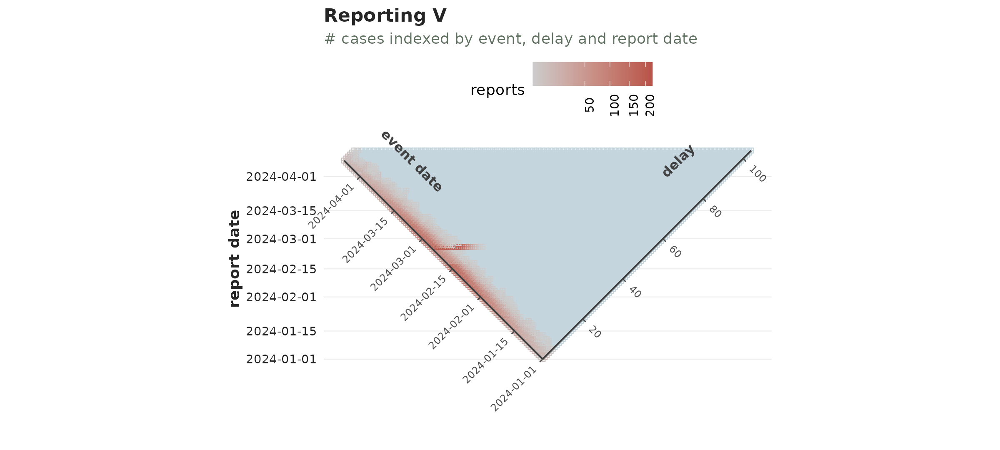

On covid the V opens into a full wedge; the potential batches are the
faint horizontal streaks in June 2020.

``` r

plot_reporting_v(tn)
```

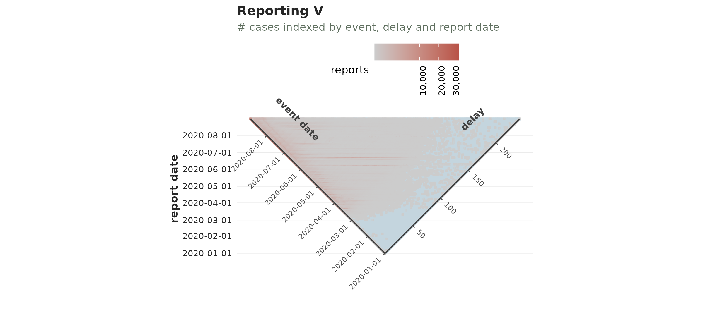

## Scalograms

The scalogram functions are **very experimental**. We have yet to
confirm they work for all batch cases. Feel free to skip to the section
on
[transport](https://rodrigozepeda.github.io/tbl.now/articles/batch-reporting.html#sec-transport)

Scalograms show reductions of cases. For this example, consider the
following simulated reporting process:

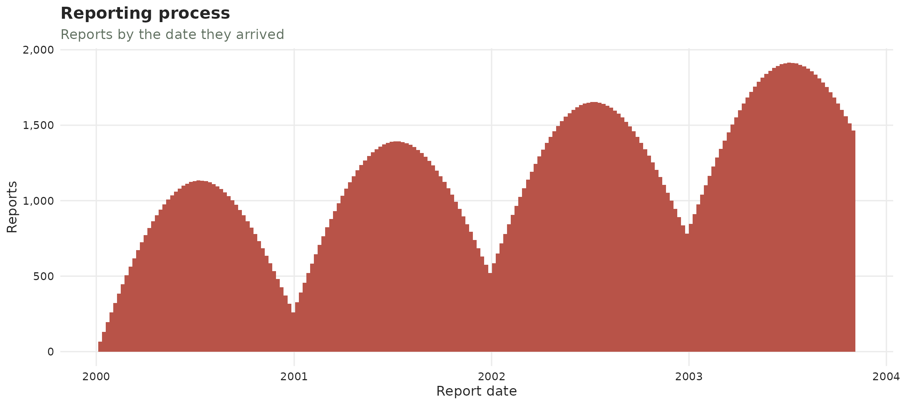

Its scalogram shows the decreases in the reporting cases as vertical
streaks aligned with the minimal date of this decrease:


One can see the same vertical streaks in the previous reporting process
we had been working on corresponding to the dip before the batch:

``` r

plot_scalogram(ideal)
```

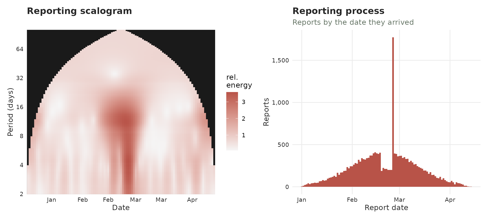

and again the same June dates being the most identified with additional
dates having less of a clear pattern:

``` r

plot_scalogram(tn)
```

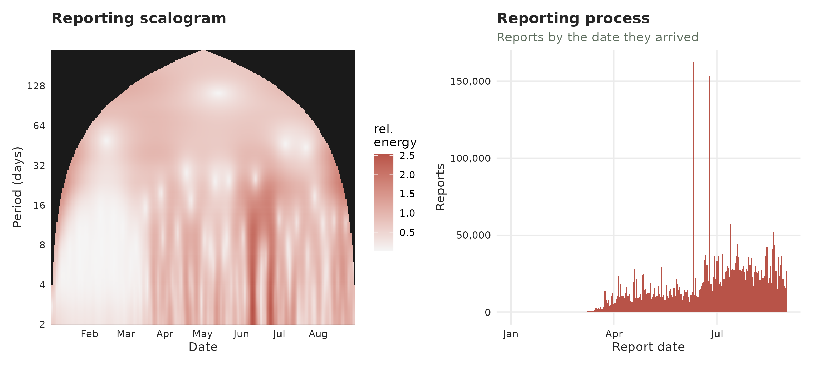

## Transport vs creation

This is the main tool for detecting batches and surges. Before the plot,
we will explain the whole idea. Consider a daily outbreak with reports
incoming each day. Three things can change the number of reports:

- a **hold** – a reporting office falls behind and some days’ reports
  are withheld;
- a **batch** – the day the backlog (hold) is finally released, all at
  once;
- a **surge** – an increase in the epidemic process: more people falling
  ill and being reported.

We simulate one of each in a clean epidemic and colour every day by its
type (grey = ordinary day):


In the previous plot, every bar is one report date. The **batch** towers
where the held reports land together; the **hold** is the small blue dip
just before it; the **surge** is a genuine bump of new cases.

The transport discriminant turns each day into **two numbers**:

- A **creation score** – did this stretch of days genuinely *gain*
  cases? A larger surge implies a larger creation score.
- A **transport score** – were the days just before *missing* reports? A
  backlog release after a hold pushes it up.

We plot every day by those two numbers and observe the directions of the
three disturbances:


Identifying any bar with its dot we can conclude:

- A **batch (backlog release, red)** shoots **up and right** – the days
  before were depleted (high transport) but not as many new cases were
  created (right);
- A **surge (green)** shoots **right** – cases genuinely appeared (high
  creation), with apparent preceding hole;
- A **hold (blue)** drifts **left** – reports have apparently gone
  missing (transport rising) while the window has *lost* cases (creation
  negative).

Ordinary days (grey) sit in the cloud through the middle. That is the
whole idea behind
[`transport_discriminant()`](https://rodrigozepeda.github.io/tbl.now/reference/transport_discriminant.md)
and
[`batch_test()`](https://rodrigozepeda.github.io/tbl.now/reference/batch_test.md):
**a batch is high transport with little creation**.

### The transport discriminant

The previous plot can be done with the
[`plot_transport_discriminant()`](https://rodrigozepeda.github.io/tbl.now/reference/plot_transport_discriminant.md)
function:

``` r

plot_transport_discriminant(ideal)
```

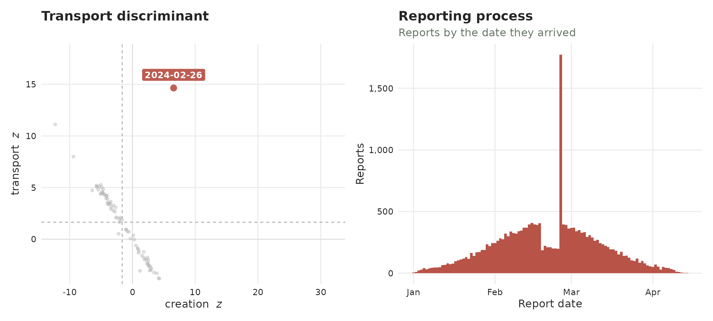

Which also works to identify the COVID-19 cases:

``` r

plot_transport_discriminant(tn, period = 7)
```

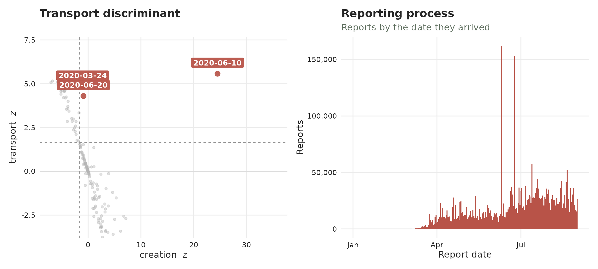

### Recovering the data

The
[`batch_test()`](https://rodrigozepeda.github.io/tbl.now/reference/batch_test.md)
function runs the transport test for the batch signature and returns,
for every report date, the `batch` flag – a Benjamini-Hochberg-corrected
verdict that controls the false-discovery rate across all dates (see
[`?batch_test`](https://rodrigozepeda.github.io/tbl.now/reference/batch_test.md)
for the full column reference). Keeping the `batch` rows gives the
confirmed releases together with their `deficit` (how depleted the days
just before were) and `delta` (how little the window total actually
changed).

``` r

batch_test(ideal) %>%
  filter(batch)
```

    #> # A tibble: 1 × 7
    #>   report_date reported baseline deficit delta p_transport_bh batch
    #>   <date>         <dbl>    <dbl>   <dbl> <dbl>          <dbl> <lgl>
    #> 1 2024-02-26      1773     336.    972.  465.       7.03e-47 TRUE

On covid we pass `period = 7` to divide out the weekly reporting
cadence. The confirmed batches (the Benjamini-Hochberg-corrected `batch`
flag) are the spring/summer-2020 releases – each reported far more than
its neighbours *and* was preceded by a matching deficit. The clearest is
**10 June 2020**, nearly ten times its baseline:

``` r

batch_test(tn, period = 7) %>% 
  filter(batch)
```

    #> # A tibble: 3 × 7
    #>   report_date reported baseline deficit   delta p_transport_bh batch
    #>   <date>         <dbl>    <dbl>   <dbl>   <dbl>          <dbl> <lgl>
    #> 1 2020-06-10    162150   16713.  25372. 120065.     0.00000296 TRUE 
    #> 2 2020-06-20     33784   17009.  21427.  -4652.     0.000102   TRUE 
    #> 3 2020-03-24     13532    4712.  11449.  -2629.     0.0000138  TRUE

The sensitivity of the batch flag can be adapted with `alpha`.

## Delay changes

The reporting delay might change through time. Here we show two
different plots for identifying delay problems.

### Reporting-delay drift

The typical time from case to report, tracked over the outbreak. Shows
the overall trend of the delay. Normally it will be steady; a batch can
be seen as a **sudden bump upward** on the release day.

``` r

plot_delay_drift(ideal)
```


On covid the delays show extreme variability in the beginning and a
trend that decreases the delay in time:

``` r

plot_delay_drift(tn)
```

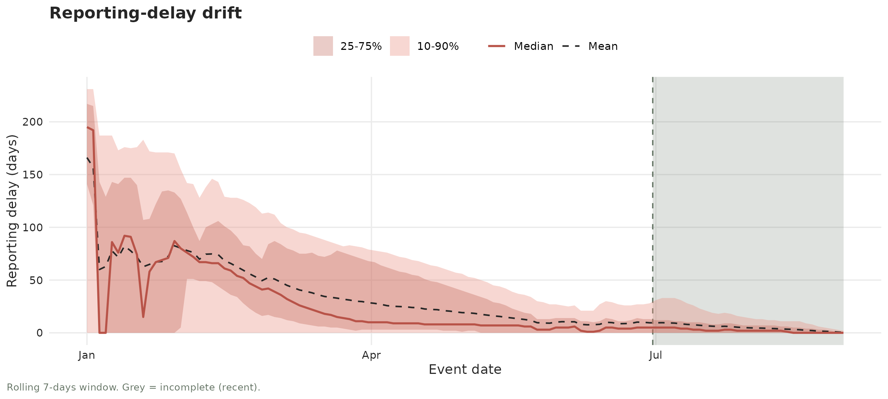

The functions
[`test_delay_drift()`](https://rodrigozepeda.github.io/tbl.now/reference/test_delay_drift.md)
and
[`test_delay_changepoint()`](https://rodrigozepeda.github.io/tbl.now/reference/test_delay_changepoint.md)
test for a gradual or abrupt changes in the delay. We can see, for
example, that it correctly identifies the drift in the COVID-19 dataset
both for the median (trend) and the spread (see the quantiles getting
tighter). On the ideal example this doesn’t happen so it does not detect
a drift:

``` r

test_delay_drift(tn)
#> # A tibble: 2 × 9
#>   strata stat       n    tau sens_slope statistic  p_value method    drift
#>   <chr>  <chr>  <int>  <dbl>      <dbl>     <dbl>    <dbl> <chr>     <lgl>
#> 1 all    median   182 -0.601     -0.286     -3.91 9.17e- 5 hamed-rao TRUE 
#> 2 all    spread   182 -0.871     -0.912     -6.13 8.55e-10 hamed-rao TRUE
test_delay_drift(ideal)
#> # A tibble: 2 × 9
#>   strata stat       n     tau sens_slope statistic p_value method    drift
#>   <chr>  <chr>  <int>   <dbl>      <dbl>     <dbl>   <dbl> <chr>     <lgl>
#> 1 all    median   100  0.0129          0     0.151   0.880 hamed-rao FALSE
#> 2 all    spread   100 -0.0204          0    -0.305   0.760 hamed-rao FALSE
```

The change-point function also detects that by April the COVID-19 delay
distribution has completely changed from before. In the case of the
ideal example the change is not long enough to be detected:

``` r

test_delay_changepoint(tn)
#> # A tibble: 2 × 10
#>   strata stat       n changepoint statistic  p_value before after shift
#>   <chr>  <chr>  <int> <date>          <dbl>    <dbl>  <dbl> <dbl> <dbl>
#> 1 all    median   182 2020-04-06       5881 2.71e-15   40.7  6.35 -34.3
#> 2 all    spread   182 2020-04-01       8076 1.84e-28  127.  44.0  -82.7
#> # ℹ 1 more variable: changepoint_detected <lgl>
test_delay_changepoint(ideal)
#> # A tibble: 2 × 10
#>   strata stat       n changepoint statistic p_value before after  shift
#>   <chr>  <chr>  <int> <date>          <dbl>   <dbl>  <dbl> <dbl>  <dbl>
#> 1 all    median   100 2024-02-17        387   0.822   1.06  1.46  0.399
#> 2 all    spread   100 2024-02-21        335   1       3.44  3.02 -0.421
#> # ℹ 1 more variable: changepoint_detected <lgl>
```

### Delay profiles

Each faint line is one day’s distirbution of reporting delays. Most days
report quickly, so their lines hug the left and concentrate around the
same distribution:

``` r

plot_delay_profiles(ideal)
```


On COVID-19 a whole spray of lines reaches far to the right days that
reported cases months later.

``` r

plot_delay_profiles(tn)
```

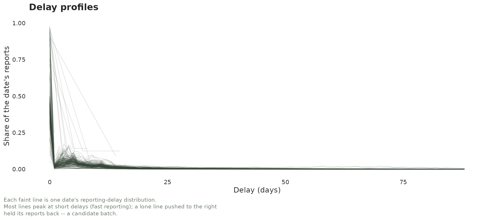

## In summary

Here is the whole toolkit on one page. Every row is a different way of
seeing the same thing – reports that were held back and then released
together.

| Plot | What to look for |
|----|----|
| **Reporting process** | Shows how reports were registered. |
| **Reporting triangle** | Diagonals show cases with the same report date. |
| **The reporting V** | Horizontal slices show cases with the same report date. |
| **Wavelet scalogram** | Bright short-period ridges in the reporting series show *holds* on the reporting. |
| **Transport discriminant** | A red dot up-and-left, in the “potential batch region” might indicate a batch. |
| **[`batch_test()`](https://rodrigozepeda.github.io/tbl.now/reference/batch_test.md)** | Shows the flagged reports in the discriminant as a `data.frame` |
| **Delay profiles** | Show the delay distribution for each event date. |
| **Reporting-delay drift** | Shows how the delay and its variance change through time. |

Another practical notes from other data we have analyzed:

- In general, **surges** (real new cases) seem harder to identify of
  that **batches** (moved reports).
- Batches are very difficult to identify in low-incidence scenarios.  
- Batches very close to the now are difficult to identify without
  additional modeling hypotheses.
