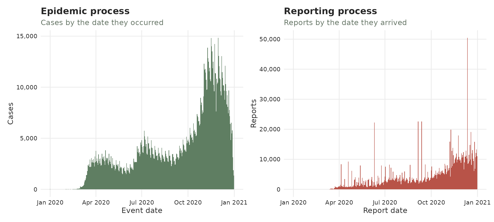
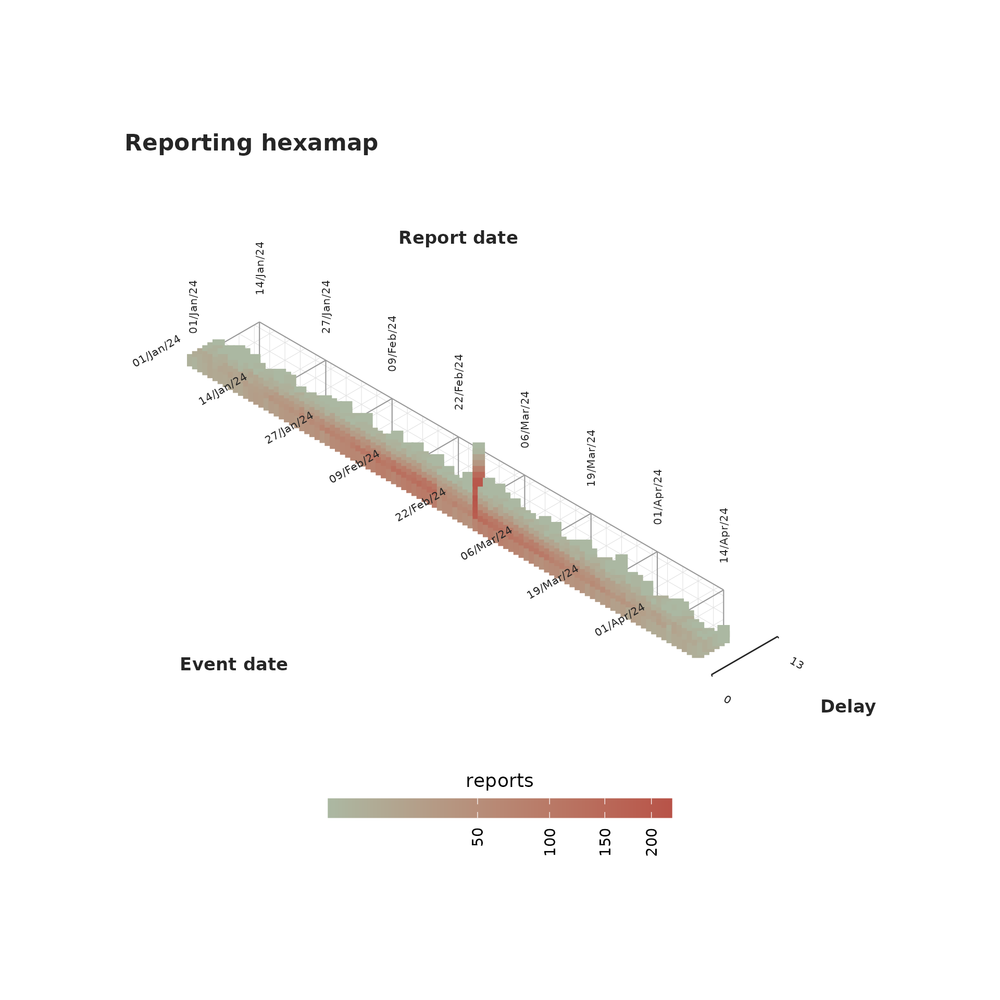
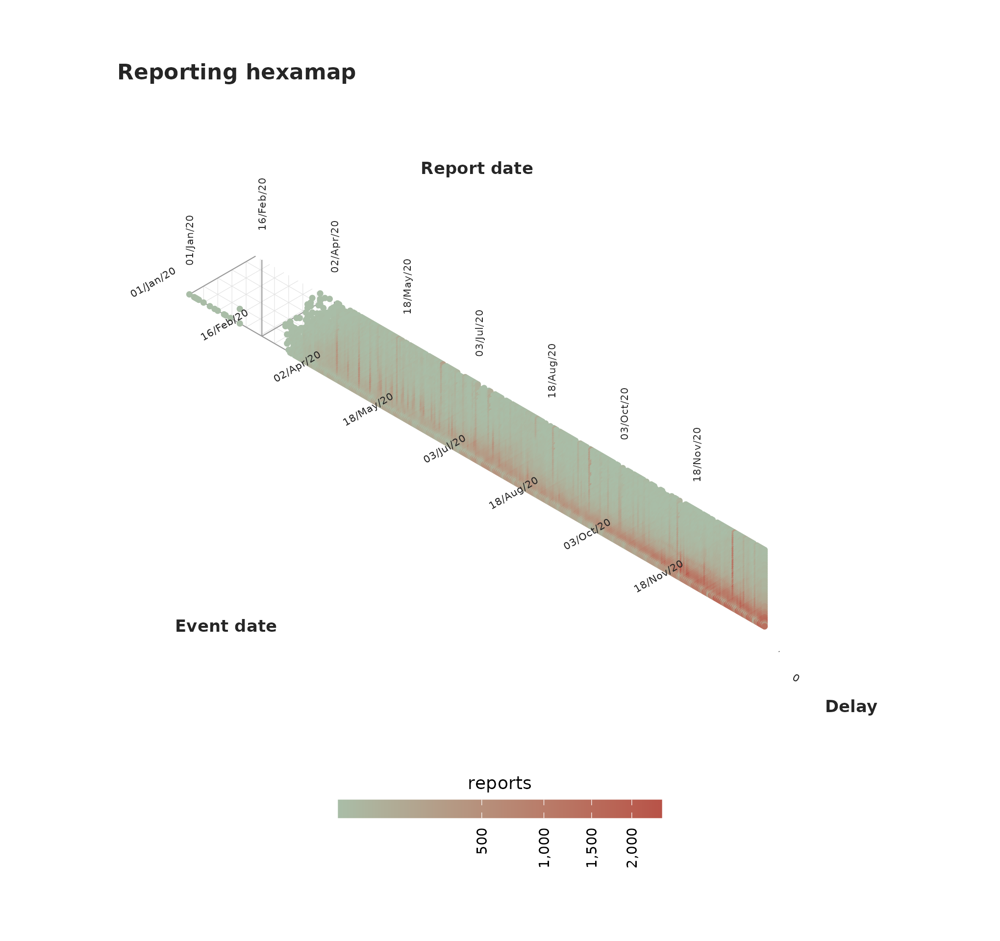

# Identifying reporting batches

``` r

library(dplyr)
library(ggplot2)
library(tidyr)
library(patchwork)
library(tbl.now)
```

## Batch reporting

Surveillance data does not always arrive smoothly. Sometimes the
reporting system halts or reduces its output (e.g. a data-system outage,
an overwhelmed jurisdiction) and the backlog is released later all at
once. That release is called a **batch**: a collection of reports from
previous periods that were held and reported all at once during a
different reporting period. Intuivitively one can think of a batch as a
collection of reports that –in an ideal scenario– *should have been
reported* on a previous date but were actually released later.


A batch is easy to confuse with an epidemic **surge**. The important
part is that the batch happens on the **reporting date** axis while a
surge happens on the **event date** axis. A batch just *moves* reports
to a later date not adding new cases while a real epidemic surge *adds*
new cases. The tools here are designed to help you visualize that
difference.

> This article shows each plot **twice**: first on a clean, made-up
> outbreak with one obvious batch (so you learn the signature), then on
> real, COVID-19 data from the CDC (see
> [`covid_us`](https://rodrigozepeda.github.io/tbl.now/reference/covid_us.html)).

## Two datasets to compare

### The made-up outbreak.

This simulation consists of a bell-shaped curve over a hundred days,
each case reported within a few days. For one week near the peak, the
reporting system slows down with **half** of each day’s reports being
held back and released days after. That release is the **batch**.

``` r

set.seed(82495)
#Simulate a curve
onset_days <- as.Date("2024-01-01") + 0:99
bell       <- dnorm(seq(-2.5, 2.5, length.out = 100))
per_day    <- round(400 * bell / max(bell)) + 8         
onset      <- rep(onset_days, per_day)
reported   <- onset + rpois(length(onset), 1.5)         

clean_tn <- tbl_now(tibble(onset = onset, reported = reported),
                    event_date = onset, report_date = reported,
                    data_type = "linelist", verbose = FALSE)

# Simulate a batch
ideal <- simulate_batch(clean_tn,
  closed_dates  = seq(as.Date("2024-02-19"), by = "day", length.out = 7),
  held_fraction = 0.5)
```

We can see the simulated data both from the event-date and the
report-date perspectives:

``` r

plot_epidemic_process(ideal)
plot_reporting_process(ideal)
```


### The real data

`covid_us` comes from the CDC’s individual-level [COVID-19 Case
Surveillance Public Use
Data](https://data.cdc.gov/Case-Surveillance/COVID-19-Case-Surveillance-Public-Use-Data/vbim-akqf/about_data).
It carries three dates. Here we use the first and the last: symptom
onset (`onset_dt`) as the event, and registration at CDC
(`cdc_report_dt`) as the report. The middle one, `pos_spec_dt`, is the
specimen collection, and it is pooled away along with `current_status`
and `sex` – the batch question is about when reports *arrived*, not
about who they were.

``` r

data(covid_us)

covid_early <- covid_us |>
  summarise(n = sum(n), .by = c(onset_dt, cdc_report_dt))

tn <- tbl_now(covid_early, event_date = onset_dt,
              report_date = cdc_report_dt, case_count = n,
              data_type = "count-incidence", verbose = FALSE)
```

Half of all cases were reported within a few days, but the tail is long:
some cases take weeks or months to surface.

``` r

stats::quantile(rep(tn$.delay, tn$n), c(0.5, 0.75, 0.9, 0.99))
#> 50% 75% 90% 99% 
#>   6  12  30 149
```

We can see this dataset again from both the event-date and the
report-date perspectives:

``` r

plot_epidemic_process(tn)
plot_reporting_process(tn)
```



## The reporting process

This plot, which we have previously shown, shows how many reports
arrived by date. Batches or surges might correspond to spikes towering
over their neighbours.

``` r

plot_reporting_process(ideal)
```


Reporting process of the simulated data

On the real data the reporting is spikier; a handful of peaks stick up
where smooth epidemic reporting should be. Those are reporting artefacts
either pure backlog releases, or a mix of backlog + a genuine surge
(we’ll come back to this characterization later). The tallest is a
single day of about 50K reports on 12 December 2020, sixteen times the
3K that arrive on a typical day; 10 June and 5 September are the other
conspicuous ones.

``` r

plot_reporting_process(tn)
```


Reporting process of the COVID-19 data

## The reporting triangle

We provide two different visualizations of the reporting triangle. In
both we plot the three temporal dimensions involved in the process: the
event date, the reporting date and the delay. We cover the plots in
tiles coloured by how many cases were registered then.

### The classical reporting triangle

The classical view is given by
[`plot_reporting_triangle()`](https://rodrigozepeda.github.io/tbl.now/reference/plot_reporting_triangle.md)
where each tile is described by *when it happened* (across) and *how
long they took to be reported* (vertical). The diagonal shows reports
that arrive on the same day.  
An indicator of a batch is **a bright diagonal reaching high up** which
reporesents many delayed cases being all reported on the same day.

``` r

plot_reporting_triangle(ideal)
```


Classical reporting triangle of the simulated data

On COVID-19, the triangle is a broad blue-grey haze (most cases reported
over many months) crossed by bright diagonals. They correspond to the
same spikes seen in the reporting process:

``` r

plot_reporting_triangle(tn)
```


Classical reporting triangle of the COVID-19 data

### The reporting hexamap

Event date, report date and reporting delay can be seen as an
**age-period-cohort** triple (`report = event + delay`, exactly
`period = cohort + age`), so the reporting triangle can be drawn as a
hexamap in the style of [Jalal and Burke
(2020)](https://doi.org/10.1097/EDE.0000000000001236): each
`(event, delay)` cell is a point on a hexagonal lattice, coloured by its
report count, with event date, report date and delay running along the
three 60-degree axes. Because a batch is a happens in the **report
date**, it shows up as a **vertical stripe**; the fast reporting bulk
sits along the short-delay bottom edge.

``` r

plot_reporting_hexamap(ideal)
```


The marks are sized in millimetres while the lattice is sized in data
units, so no default can suit every combination of cell count and figure
size. `size` is the knob: raise it until the points nearly touch at the
size you are actually drawing, and `shape = 15` swaps the circles for
squares, which tile more closely.

``` r

plot_reporting_hexamap(ideal, size = 3, shape = 15)
```



On covid the vertical stripes are the 2020 backlog releases. The delay
axis is capped with `max_delay` to keep the map to where the reports
are.

``` r

plot_reporting_hexamap(tn, max_delay = 60)
```



## Transport vs creation

This is the main tool for detecting batches and surges. Before the plot,
we will explain the whole idea. Consider a daily outbreak with reports
incoming each day. Three things can change the number of reports:

- a **hold** – a reporting office falls behind and some days’ reports
  are withheld;
- a **batch** – the day the backlog (hold) is finally released, all at
  once;
- a **surge** – an increase in the epidemic process: more people falling
  ill and being reported.

We simulate one of each in a clean epidemic and colour every day by its
type (grey = ordinary day):


In the previous plot, every bar is one report date. The **batch** towers
where the held reports land together; the **hold** is the small blue dip
just before it; the **surge** is a genuine bump of new cases.

The transport discriminant turns each day into **two numbers**:

- A **creation score** – did this stretch of days genuinely *gain*
  cases? A larger surge implies a larger creation score.
- A **transport score** – were the days just before *missing* reports? A
  backlog release after a hold pushes it up.

We plot every day by those two numbers and observe the directions of the
three disturbances:


Identifying any bar with its dot we can conclude:

- A **batch (backlog release, red)** shoots **up and right** – the days
  before were depleted (high transport) but not as many new cases were
  created (right);
- A **surge (green)** shoots **right** – cases genuinely appeared (high
  creation), with apparent preceding hole;
- A **hold (blue)** drifts **left** – reports have apparently gone
  missing (transport rising) while the window has *lost* cases (creation
  negative).

Ordinary days (grey) sit in the cloud through the middle. That is the
whole idea behind
[`transport_discriminant()`](https://rodrigozepeda.github.io/tbl.now/reference/transport_discriminant.md)
and
[`diagnose_batches()`](https://rodrigozepeda.github.io/tbl.now/reference/diagnose_batches.md):
**a batch is high transport with little creation**.

### The transport discriminant

The previous plot can be done with the
[`plot_transport_discriminant()`](https://rodrigozepeda.github.io/tbl.now/reference/plot_transport_discriminant.md)
function:

``` r

plot_transport_discriminant(ideal)
```


Which also works to identify the COVID-19 cases:

``` r

plot_transport_discriminant(tn, period = 7)
```


### Recovering the data

The
[`diagnose_batches()`](https://rodrigozepeda.github.io/tbl.now/reference/diagnose_batches.md)
function runs the transport test for the batch signature and returns,
for every report date, the `batch` flag – a Benjamini-Hochberg-corrected
verdict that controls the false-discovery rate across all dates (see
[`?diagnose_batches`](https://rodrigozepeda.github.io/tbl.now/reference/diagnose_batches.md)
for the full column reference). Keeping the `batch` rows gives the
confirmed releases together with their `deficit` (how depleted the days
just before were) and `delta` (how little the window total actually
changed).

``` r

diagnose_batches(ideal) |>
  filter(batch)
```

    #> # A tibble: 1 × 7
    #>   report_date reported baseline deficit delta p_transport_bh batch
    #>   <date>         <dbl>    <dbl>   <dbl> <dbl>          <dbl> <lgl>
    #> 1 2024-02-26      1773     336.    972.  465.       7.03e-47 TRUE

On covid we pass `period = 7` to divide out the weekly reporting
cadence. Only one date survives the Benjamini-Hochberg-corrected `batch`
flag: **7 November 2020**, which reported about twice its baseline *and*
was preceded by a matching deficit of roughly the same size. That
pairing is the whole test – the taller spikes of 12 December and 10 June
are not flagged, because nothing was withheld beforehand to release,
which makes them surges rather than batches:

``` r

diagnose_batches(tn, period = 7) |>
  filter(batch)
```

    #> # A tibble: 1 × 7
    #>   report_date reported baseline deficit delta p_transport_bh batch
    #>   <date>         <dbl>    <dbl>   <dbl> <dbl>          <dbl> <lgl>
    #> 1 2020-11-07     15882    8174.   8053. -345.        0.00405 TRUE

The sensitivity of the batch flag can be adapted with `alpha`.

If you have any questions or comments regarding the contents of this
article please [open an issue on
Github](https://github.com/RodrigoZepeda/tbl.now/issues/new).

## Learning more

- A **tutorial** on real life surveillance data. Takes you from cleaning
  to diagnosing errors in the data to nowcasting:
  <https://rodrigozepeda.github.io/tbl.now/articles/example.html>
- The **second part of the tutorial** with a revision process: the
  optional third date, where a reported case is later confirmed,
  retracted or left pending:
  <https://rodrigozepeda.github.io/tbl.now/articles/example_revisions.html>
- The **Get started vignette**: the whole workflow, from a raw line list
  to a scored nowcast, in five minutes:
  <https://rodrigozepeda.github.io/tbl.now/articles/tbl.now.html>.
- **More on the `tbl_now` object**: every attribute, the three data
  types, the revision process, temporal effects and the `dplyr` methods:
  <https://rodrigozepeda.github.io/tbl.now/articles/more-on-tbl-now.html>
- More thoughts on **diagnosing your dataset** with `tbl.now`
  <https://rodrigozepeda.github.io/tbl.now/articles/diagnosing-a-tbl-now.html>
- Detecting reporting **batches** with `tbl.now`
  <https://rodrigozepeda.github.io/tbl.now/articles/batches.html>
- How to use different nowcasting engines from `tbl.now`: here you can
  learn **how it connects to the other nowcasting packages**.
  <https://rodrigozepeda.github.io/tbl.now/articles/nowcasting-models.html>
- How to **nowcast with multiple engines, backtest and ensemble**
  nowcasts.
  <https://rodrigozepeda.github.io/tbl.now/articles/ensemble-nowcasting.html>
- Adding your own **custom nowcasting model**
  <https://rodrigozepeda.github.io/tbl.now/articles/custom-nowcast-models.html>
- Package reference:
  <https://rodrigozepeda.github.io/tbl.now/reference/>
