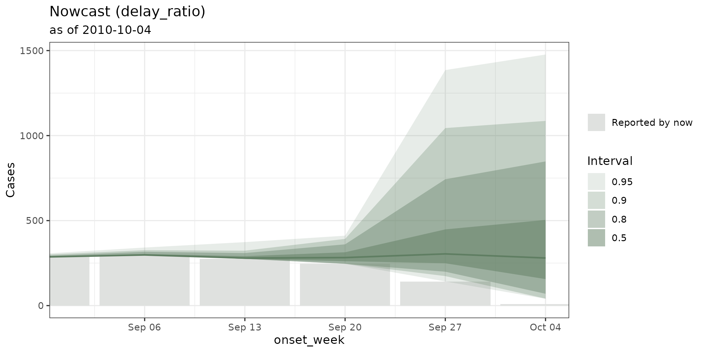

# Adding your own nowcasting model

``` r

library(dplyr)
library(tbl.now)
```

`tbl.now` ships with back-ends for six nowcasting packages. The article
[on ensemble
nowcasting](https://rodrigozepeda.github.io/tbl.now/articles/ensemble-nowcasting.html),
shows how to fit, score and combine them through one call. This article
is about the model not included in the package: **yours**.

## 1. How does it work

The main function for running a nowcast is
`run_nowcast(x, engine("mymodel", ...))` which does exactly three
things:

1.  takes the **engine**: an object of class
    `c("mymodel", "nowcast_engine")` carrying your arguments;
2.  calls **`nowcast_fit(method, x, ...)`** to run the model and return
    whatever it returns. The engine’s arguments are passed in the dots
    (`...`);
3.  utilizes **`nowcast_tidy(method, fit, x, ..., quantile_levels)`** to
    describe that result in the one shape the rest of the package
    understands.

and wraps the answer in a `tbl_nowcast`. In summary:

| you write | it receives | it must return |
|----|----|----|
| `nowcast_fit.mymodel()` | the `tbl_now`, your `...`, `quantile_levels`, `verbose` | anything at all — it is stored verbatim in `nowcast@fit` |
| `nowcast_tidy.mymodel()` | your fit, the `tbl_now`, `quantile_levels` | `list(predictions =, draws =)` |

[`nowcast_tidy()`](https://rodrigozepeda.github.io/tbl.now/reference/nowcast_tidy.md)
returns a list with two slots, and **only one of them may be `NULL`**:

| slot | one row per | columns |
|----|----|----|
| `predictions` | (event date, stratum, quantile level) | `<event_date>`, the strata, `.quantile_level`, `.value` |
| `draws` | (event date, stratum, draw) | `<event_date>`, the strata, `.draw`, `.value` |

Return `draws` when your model has them. `tbl.now` derives the quantiles
and can also use them for the `linear_pool` ensemble. Return
`predictions` when your model produces quantiles directly, which is the
case for the one we are about to write. You may (and preferably should)
return both.

If you are shipping the backend in a package, also write an
`engine_mymodel()` alongside it that names your arguments, the way
[`engine_nobbs()`](https://rodrigozepeda.github.io/tbl.now/reference/nowcast_engines.md)
names `max_D` and `moving_window`:

``` r

engine_mymodel <- function(..., window = 12,
                           min_date = NULL,
                           quantile_levels = nowcast_quantile_levels(),
                           label = NULL) {
  engine("mymodel", window = window, ...,
         min_date = min_date, quantile_levels = quantile_levels, label = label)
}
```

## 2. A worked example: the delay-ratio nowcast

### The model

> The main idea of our model is that we can multiply what has been
> observed until now by a constant factor *for each delay*.

#### Formalization (skip if you want)

Write C(t, d) for the number of cases with event date t that had been
reported within a delay of d periods, and let D be the delay past which
we are willing to call reporting “finished”. Call an event date old
enough that all D periods have elapsed as **mature**. The proportion of
the eventual total visible at each delay is given by the ratio

r_t(d) \\=\\ \frac{C(t, D)}{C(t, d)}

The nowcast for a young event date t, observed so far at delay d(t) =
\mathrm{now} - t, is then its current count scaled by that distribution:

\hat q\_\alpha(t) \\=\\ C\big(t, d(t)\big) \cdot
\mathrm{Quantile}\_\alpha\Big(\big\\\\ r_s(d(t)) : s \text{ mature}
\\\big\\\Big).

The **median** multiplier gives the point estimate. The rest of the
empirical quantiles give the uncertainty.

### The data

For this example we’ll use the `denguedat` dataset. We nowcast as of a
date in the past so that there are later reports to score against.

``` r

data(denguedat)

dengue <- denguedat |>
  filter(onset_week >= as.Date("2008-01-01")) |>
  tbl_now(
    event_date  = onset_week,
    report_date = report_week,
    data_type   = "linelist",
    verbose     = FALSE
  ) 

now <- as.Date("2010-10-04")

snapshot <- dengue |>
  filter(report_week <= now) |>
  change_now(now = now)

get_now(snapshot)
#> [1] "2010-10-04"
```

`backtest_snapshot` is what the model may see; `dengue` still holds the
reports that arrived afterwards, and is the truth we will score against.

### `nowcast_fit.delay_ratio()`

The fitting step estimates the multiplier. Notice how much of it is
spent asking the object about itself rather than doing arithmetic.

``` r

nowcast_fit.delay_ratio <- function(engine, x, ..., max_delay = NULL,
                                    quantile_levels, verbose = TRUE) {
  
  #We verify that x is count-incidence (in case people pass a linelist
  if (get_data_type(x) == "count-cumulative"){
    stop("Invalid data type this model doesn't work with cumulative data")
  } else {
    x <- x |> to_count(to = "count-incidence")
  }

  #It is important to use the getters and don't assume column names
  event_col <- get_event_date(x)
  strata    <- get_strata(x) %||% character(0)
  key       <- c(event_col, strata)

  # How far out we model. Past `max_delay` the model calls reporting finished.
  max_delay  <- if (is.null(max_delay)) max(x$.delay) else max_delay
  delay_grid <- seq(min(x$.delay), max_delay)

  # C(t, d) for every event date and every delay on the grid. This getter does
  # the cumulating, the strata and the three data types for us.
  snapshot_at <- function(d) {
    
    #We check the reported cases by each delay
    snapshot  <- get_nth_reported_cases(x, delay = d)
    
    #We get the case count column
    count_col <- get_case_count(snapshot)

    as_tibble(snapshot) |>
      summarise(.reported = sum(.data[[count_col]]), .by = all_of(key)) |>
      mutate(.delay_grid = d)
  }
  snapshots <- bind_rows(lapply(delay_grid, snapshot_at))

  # Work on the integer grid, not the calendar: `.event_num` and `.report_num`
  # are already in report units, so this is unit-agnostic.
  index     <- distinct(as_tibble(x), across(all_of(event_col)), .event_num)
  now_index <- max(x$.report_num)

  eventual <- snapshots |>
    filter(.delay_grid == max_delay) |>
    select(all_of(key), .eventual = ".reported")

  ratios <- snapshots |>
    filter(.delay_grid < max_delay) |>
    inner_join(eventual, by = key) |>
    inner_join(index, by = event_col) |>
    # Mature dates only: a date still filling in would teach the model that
    # reporting stops early. And a ratio needs a non-zero denominator.
    filter(.event_num + max_delay <= now_index, .reported > 0) |>
    mutate(.ratio = .eventual / .reported) |>
    select(all_of(strata), ".delay_grid", ".ratio")

  if (isTRUE(verbose)) {
    n_delays <- n_distinct(ratios$.delay_grid)
    cli::cli_alert_info(
      "Estimated {nrow(ratios)} multiplier{?s} over {n_delays} delay{?s}."
    )
  }

  list(
    ratios    = ratios,
    max_delay = max_delay,
    index     = index,
    now_index = now_index
  )
}
```

Two things of note:

1.  The returned list is **the fit**. It is kept verbatim in
    `nowcast@fit`, and it carries `index` and `now_index` because the
    tidying step will need them. And `verbose` is used because a
    back-end that talks during
    [`nowcast_backtest()`](https://rodrigozepeda.github.io/tbl.now/reference/nowcast_backtest.md)
    usually floods the console.

### `nowcast_tidy.delay_ratio()`

The tidying step applies the pool. This model produces quantiles
directly, so it fills `predictions` and leaves `draws` as `NULL`.

``` r

nowcast_tidy.delay_ratio <- function(engine, fit, x, ..., quantile_levels) {

  #It is important to use the getters and don't assume column names
  event_col <- get_event_date(x)
  strata    <- get_strata(x) %||% character(0)
  key       <- c(event_col, strata)

  # What each event date has reported as of `now`, and how old it is.
  latest    <- get_latest_reported_cases(x)
  count_col <- get_case_count(latest) %||% "n"

  current <- as_tibble(latest) |>
    summarise(.reported = sum(.data[[count_col]]), .by = all_of(key)) |>
    inner_join(fit$index, by = event_col) |>
    mutate(.delay_grid = pmin(fit$now_index - .event_num, fit$max_delay))

  # The empirical quantiles of the multiplier, per delay (and per stratum).
  # The 0.5 row is the median multiplier: the point estimate.
  multipliers <- fit$ratios |>
    reframe(
      .quantile_level = quantile_levels,
      .multiplier = quantile(.ratio, quantile_levels, names = FALSE),
      .by = all_of(c(strata, ".delay_grid"))
    )

  predictions <- current |>
    cross_join(tibble(.quantile_level = quantile_levels)) |>
    left_join(multipliers, by = c(strata, ".delay_grid", ".quantile_level")) |>
    # No multiplier means nothing left to correct: a mature date, or a delay the
    # history never showed us. Either way the honest factor is 1.
    mutate(
      .multiplier = coalesce(.multiplier, 1),
      .value      = .reported * .multiplier
    ) |>
    select(all_of(key), ".quantile_level", ".value")

  list(predictions = predictions, draws = NULL)
}
```

That is the entire back-end: two functions, no registration, no
`tbl.now` change.

### Running it

``` r

nowcast <- run_nowcast(
  snapshot,
  engine("delay_ratio", max_delay = 8),
  verbose = FALSE
)

nowcast
#> ── A <tbl_nowcast> from method "delay_ratio" ───────────────────────────────────────────────────────────────────────────────────────────────────────────────────
#> • now: "2010-10-04"
#> • event dates: 144
#> • quantile levels: 0.025, 0.05, 0.1, 0.25, 0.5, 0.75, 0.9, 0.95, and 0.975
#> • draws: none (quantiles only)
#> 
#> Nowcast at "2010-10-04" (q50, 2.5-97.5% interval):
#> • 280 [40, 1,476.8]
#> 
#> # A tibble: 6 × 3
#>   onset_week .quantile_level .value
#>   <date>               <dbl>  <dbl>
#> 1 2008-01-07           0.025     22
#> 2 2008-01-07           0.05      22
#> 3 2008-01-07           0.1       22
#> 4 2008-01-07           0.25      22
#> 5 2008-01-07           0.5       22
#> # ℹ 1 more row
#> ℹ 1290 more rows. Use `as_tibble()` for all of them.
```

The fit is kept in `nowcast@fit` if required. We can access the nowcasts
via
[`tidy()`](https://rodrigozepeda.github.io/tbl.now/reference/tidy.nowcast.md):

``` r

tidy(nowcast)
```

    #> # A tibble: 5 × 7
    #>   event_date stratum estimate conf.low conf.high level engine     
    #>   <date>     <chr>      <dbl>    <dbl>     <dbl> <dbl> <chr>      
    #> 1 2010-09-06 all         298       298      342.  0.95 delay_ratio
    #> 2 2010-09-13 all         279.      275      373.  0.95 delay_ratio
    #> 3 2010-09-20 all         282.      246      411.  0.95 delay_ratio
    #> 4 2010-09-27 all         304.      142     1385.  0.95 delay_ratio
    #> 5 2010-10-04 all         280        40     1477.  0.95 delay_ratio

**[`autoplot()`](https://ggplot2.tidyverse.org/reference/autoplot.html)**
is also present:

``` r

library(ggplot2)

autoplot(nowcast, date_lim = c(as.Date("2010/09/01"), as.Date("2010-10-04"))) 
```



**[`nowcast_backtest()`](https://rodrigozepeda.github.io/tbl.now/reference/nowcast_backtest.md)**
refits it at a series of past dates and scores each one:

``` r

backtest <- nowcast_backtest(
  dengue,
  engine("delay_ratio", max_delay = 8),
  now_dates = as.Date(c("2010-07-05", "2010-08-02", "2010-09-06")),
  seed      = 20260827,
  verbose   = FALSE
)

tidy(backtest) 
#> # A tibble: 405 × 13
#>   method      now        event_date stratum observed estimate conf.low conf.high level   wis ae_median coverage_50 coverage_90
#>   <chr>       <date>     <date>     <chr>      <dbl>    <dbl>    <dbl>     <dbl> <dbl> <dbl>     <dbl> <lgl>       <lgl>      
#> 1 delay_ratio 2010-07-05 2008-01-07 all           22       22       22        22  0.95     0         0 TRUE        TRUE       
#> 2 delay_ratio 2010-07-05 2008-01-14 all           19       19       19        19  0.95     0         0 TRUE        TRUE       
#> 3 delay_ratio 2010-07-05 2008-01-21 all            8        8        8         8  0.95     0         0 TRUE        TRUE       
#> 4 delay_ratio 2010-07-05 2008-01-28 all           14       14       14        14  0.95     0         0 TRUE        TRUE       
#> 5 delay_ratio 2010-07-05 2008-02-04 all            5        5        5         5  0.95     0         0 TRUE        TRUE       
#> # ℹ 400 more rows
```

It can also use
[`scoringutils::as_forecast_quantile()`](https://epiforecasts.io/scoringutils/reference/as_forecast_quantile.html)
directly, `score_nowcast` and be used within a
[`nowcast_ensemble()`](https://rodrigozepeda.github.io/tbl.now/reference/nowcast_ensemble.md).
All of the nowcast post-processing functions become available.

## 3. Do’s and don’ts

Your
[`nowcast_fit()`](https://rodrigozepeda.github.io/tbl.now/reference/nowcast_fit.md)
method is handed the whole `tbl_now`. Almost every bug in a back-end
comes from assuming something about it that is not guaranteed.

**Never hard-code a column name.** The event-date column is called
`onset_week` in `denguedat`, `dx_date` in `mpoxdat` and `reference_date`
in an `epinowcast` import. Use the
[getters](https://rodrigozepeda.github.io/tbl.now/reference/nowcast_data_getters.html)
instead:

``` r

get_event_date(x)      # name of the event-date column
get_report_date(x)     # name of the report-date column
get_case_count(x)      # name of the counts column, or NULL for a line list
get_strata(x)          # character vector, or NULL
get_now(x)             # the as-of Date

              ...etcetera...
```

**Three protected numeric columns are always present**, and they are
usually what you actually want to compute on:

| column | meaning |
|----|----|
| `.event_num` | the event date as an integer number of report units from `min(event_date)` |
| `.report_num` | the report date, on the same scale |
| `.delay` | `.report_num - .event_num` — the reporting delay, in report units |

Working in `.event_num` / `.delay` means your model does not care
whether the data is daily, weekly or monthly, and does not have to do
calendar arithmetic.

**Handle the three data types, or refuse one explicitly.** A line list
has no counts column and one row per case; `"count-incidence"` counts
what was *newly* reported in a cell; `"count-cumulative"` counts what
had been reported *so far*. Do not write three branches — call
[`to_count()`](https://rodrigozepeda.github.io/tbl.now/reference/to_count.md)
and be handed the one you want:

``` r

x <- to_count(x, to = "count-incidence")
```

Remember that `cumulative → incidence` de-accumulates, so a downward
revision becomes a **negative** increment. If your model cannot
represent that, say so rather than silently taking a maximum.
([`tbl_now_to_baselinenowcast()`](https://rodrigozepeda.github.io/tbl.now/reference/tbl_now_baselinenowcast.md)
refuses cumulative input for exactly this reason.)

**A zero is not the same as a missing row.** A `tbl_now` only carries
cells that were reported, so an event date with no reports has no rows
at all, and a model that builds its time grid from the rows it was
handed will quietly stop short of `now` — which is precisely where a
nowcast matters.
[`complete_zeroes()`](https://rodrigozepeda.github.io/tbl.now/reference/complete_zeroes.md)
fills the grid out to `now` for count data:

``` r

x <- complete_zeroes(x)
```

For a line list this cannot work — a zero-count row expands to zero rows
— so the grid has to come from somewhere else. The built-in
`"surveillance"` back-end does this by passing an explicit
`control$dRange`.

**`now` is a declaration, not `max(report_date)`.** Use `get_now(x)`. An
object whose reporting has stalled has a `now` later than its last
report, and that gap is real information about the nowcast, not an error
to round away.

### For developing in `tbl.now`:

If your model is a wrapper around another package, [create a
converter](https://rodrigozepeda.github.io/tbl.now/reference/index.html#converters)
that takes a `tbl.now` and returns the object required by the other
package:

``` r

tbl_now_to_baselinenowcast(x) 
tbl_now_to_epinowcast(x)      
tbl_now_to_EpiNow2(x, target = "estimate_infections")
tbl_now_to_epidist(x, format = "interval")        

              ...etcetera...
```

The converter should, when possible, also come back as a `tbl_now` with
the
[`as_tbl_now()`](https://rodrigozepeda.github.io/tbl.now/reference/as_tbl_now.md)
method:

``` r

triangles <- tbl_now_to_baselinenowcast(x, format = "triangle_list")
as_tbl_now(triangles)      # back to a tbl_now, strata recoded
```

### Additional packaging requirements

Everything above worked from the global environment. To put it in a
package:

- **Register both methods.** With roxygen, `@export` on
  `nowcast_fit.mymodel()` and `nowcast_tidy.mymodel()`.
- If developing your own package, **put `tbl.now` in `Imports`** and
  import the generics you extend
  (`@importFrom tbl.now nowcast_fit nowcast_tidy`), along with the
  getters you call.
- If developing for `tbl.now`, **put the modelling package in
  `Suggests`**, and check for it at fit time with
  [`requireNamespace(..., quietly = TRUE)`](https://rdrr.io/r/base/ns-load.html)
- **Give it an `engine_mymodel()`.** `engine("mymodel", ...)` already
  works; a constructor that names your arguments makes them
  discoverable.
- **Test the fit and the tidy separately.** `engine("mymodel")` builds
  the dispatch object, so
  `nowcast_tidy(engine("mymodel"), fit, x, quantile_levels = c(0.1, 0.5, 0.9))`
  can be tested against a stored fit without refitting anything.
- **Test against more than one shape.** A line list and a
  `count-cumulative` object with weekly dates and two strata will find
  the assumptions a daily incidence tibble never does.

A checklist for the method itself:

No hard-coded column names — every one comes from a getter.

All three `data_type`s handled, or one refused with a clear error.

The time grid runs to `get_now(x)`, not to the last observed row.

Strata honoured, or pooled with a warning.

`quantile_levels` respected — or, if the model reports a fixed set, a
warning saying so.

`verbose = FALSE` really is silent.

Everything the tidy step needs is inside the fit object.

## 4. Getting it into `tbl.now` itself

If you think a model belongs in the package, or you have written one and
would like it maintained here:

> **Open an issue at
> [github.com/rodrigozepeda/tbl.now/issues](https://github.com/rodrigozepeda/tbl.now/issues)
> before writing a pull request.**

Please say in the issue:

- which modelling package or model the back-end wraps,
- what extras does it need at install time: a Stan toolchain, JAGS,
  nothing;
- how it handles **strata** — jointly, one fit per stratum, or not at
  all;
- whether it produces **draws** or only quantiles and a single interval;
- a minimal example that fits on one of the packaged datasets
  (`denguedat`, `mpoxdat`, `covid_colombia`, `covid_us`, `flusight`,
  `hai_bucaramanga`).

If you have any questions or comments regarding the contents of this
article please [open an issue on
Github](https://github.com/RodrigoZepeda/tbl.now/issues/new).

### Learning more

- End-to-end tutorial on real life surveillance data. Takes you from
  cleaning to diagnosing errors in the data to nowcasting:
  <https://rodrigozepeda.github.io/tbl.now/articles/example.html>
- The same tutorial with a **revision process** — the optional third
  date, where a reported case is later confirmed, retracted or left
  pending:
  <https://rodrigozepeda.github.io/tbl.now/articles/example_revisions.html>
- Introduction vignette:
  <https://rodrigozepeda.github.io/tbl.now/articles/tbl.now.html> for
  the full anatomy of a `tbl_now`, data types, and temporal effects.
- Tutorial on diagnosing your dataset — what is in it, what is
  structurally wrong with it, and detecting batches and other
  reporting-delay artifacts:
  <https://rodrigozepeda.github.io/tbl.now/articles/diagnosing-a-tbl-now.html>
- Using different nowcasting engines for the same dataset:
  <https://rodrigozepeda.github.io/tbl.now/articles/nowcasting-models.html>
- Ensemble nowcasting across different engines
  <https://rodrigozepeda.github.io/tbl.now/articles/ensemble-nowcasting.html>
- Adding your own nowcasting model
  <https://rodrigozepeda.github.io/tbl.now/articles/custom-nowcast-models.html>
- Package reference:
  <https://rodrigozepeda.github.io/tbl.now/reference/>
