# Diagnosing a tbl_now

``` r

library(dplyr)
library(ggplot2)
library(tidyr)
library(patchwork)
library(tbl.now)
```

Three questions come up with every new surveillance dataset, and they
are different questions that want different tools:

1.  **What is in it?** – how many cases, over what period, arriving how
    late, how sparse, how concentrated in one stratum.
    [`summary()`](https://rdrr.io/r/base/summary.html) answers this.
2.  **What is structurally wrong with it?** – missing dates, impossible
    orderings, repeated rows, units that do not line up, data that stops
    before its own `now`.
    [`diagnose()`](https://rodrigozepeda.github.io/tbl.now/reference/diagnose.md)
    answers this, deterministically and with no model.
3.  **What needs a statistical test?** – has the reporting delay
    drifted, did reports arrive in batches, is a spike real cases or
    released backlog.
    [`diagnose()`](https://rodrigozepeda.github.io/tbl.now/reference/diagnose.md)
    deliberately refuses these and hands you a signpost instead, because
    answering them means choosing a method, a window and a multiplicity
    correction.

This article walks the three in order. The first two return a
**tibble**, not printed text, which is the design decision everything
else follows from: an answer you can
[`filter()`](https://dplyr.tidyverse.org/reference/filter.html),
`join()`, plot or assert on in a test is worth far more than one you can
only read. The third returns test results and figures, because a
hypothesis test has a p-value and an effect size that a findings row has
nowhere to put.

``` r

data(denguedat)

dengue_now <- tbl_now(denguedat,
  event_date  = "onset_week",
  report_date = "report_week",
  strata      = "gender",
  verbose     = FALSE
)
```

## Part 1 — What is in the data: `summary()`

### One table, several blocks

[`summary()`](https://rdrr.io/r/base/summary.html) returns a table, and
prints it one **component** at a time with the columns that component
does not populate dropped — the schema is wide because it has to hold
every block at once, and no single block fills more than a handful of
it:

``` r

summary(dengue_now)
#> ── Summary of a <tbl_now> ──────────────────────────────────────────────────────────────────────────────────────────────────────────────────────────────────────
#> 76 rows in 7 components; strata: "Female" and "Male".
#> 
#> cases
#>   quantity        stratum     n total  mean    sd   min   q25   q50   q75   q90   max prop_zero
#>   <chr>           <chr>   <int> <dbl> <dbl> <dbl> <dbl> <dbl> <dbl> <dbl> <dbl> <dbl>     <dbl>
#> 1 per_event_date  all      1095 52987  48.4  53.3     0    14    30    64   104   358   0.00365
#> 2 per_event_date  Female   1095 26592  24.3  26.7     0     7    15    32    52   189   0.0119 
#> 3 per_event_date  Male     1095 26395  24.1  27.0     0     7    15    31    53   176   0.0119 
#> 4 per_report_date all      1095 52987  48.4  54.3     0    14    29    64   111   420   0.00274
#> 5 per_report_date Female   1095 26592  24.3  27.3     0     7    15    32    57   217   0.0155 
#> 6 per_report_date Male     1095 26395  24.1  27.5     0     7    15    32    54   203   0.0201 
#> 
#> zero_run
#>   quantity    stratum     n total  mean    sd   min   q25   q50   q75   q90   max
#>   <chr>       <chr>   <int> <dbl> <dbl> <dbl> <dbl> <dbl> <dbl> <dbl> <dbl> <dbl>
#> 1 event_date  all         2     4  2    1.41      1     1     1     3     3     3
#> 2 event_date  Female     10    13  1.3  0.675     1     1     1     1     2     3
#> 3 event_date  Male        8    13  1.62 0.916     1     1     1     2     3     3
#> 4 report_date all         3     3  1    0         1     1     1     1     1     1
#> 5 report_date Female     15    17  1.13 0.352     1     1     1     1     2     2
#> 6 report_date Male       19    22  1.16 0.501     1     1     1     1     2     3
#> 
#> autocorrelation
#>   quantity              stratum     n value
#>   <chr>                 <chr>   <int> <dbl>
#> 1 per_event_date lag 1  all      1094 0.958
#> 2 per_event_date lag 1  Female   1094 0.944
#> 3 per_event_date lag 1  Male     1094 0.941
#> 4 per_report_date lag 1 all      1094 0.885
#> 5 per_report_date lag 1 Female   1094 0.867
#> 6 per_report_date lag 1 Male     1094 0.878
#> 
#> composition
#>   quantity            n total  prop
#>   <chr>           <int> <dbl> <dbl>
#> 1 strata = Female  4133 26592 0.502
#> 2 strata = Male    4132 26395 0.498
#> 
#> coverage
#>    quantity    stratum     n total date_min   date_max  
#>    <chr>       <chr>   <int> <dbl> <date>     <date>    
#>  1 total_cases all      8265 52987 NA         NA        
#>  2 event_date  all      1091 52987 1990-01-01 2010-11-29
#>  3 report_date all      1092 52987 1990-01-01 2010-12-20
#>  4 total_cases Female   4133 26592 NA         NA        
#>  5 event_date  Female   1082 26592 1990-01-01 2010-11-29
#>  6 report_date Female   1078 26592 1990-01-01 2010-12-20
#>  7 total_cases Male     4132 26395 NA         NA        
#>  8 event_date  Male     1082 26395 1990-01-01 2010-11-29
#>  9 report_date Male     1073 26395 1990-01-01 2010-12-13
#> 10 now         all        NA    NA 2010-12-20 2010-12-20
#> ℹ 19 more rows.
#> 
#> completeness
#>    quantity   stratum     n total   mean     sd   min   q25    q50    q75   q90   max   prop
#>    <chr>      <chr>   <int> <dbl>  <dbl>  <dbl> <dbl> <dbl>  <dbl>  <dbl> <dbl> <dbl>  <dbl>
#>  1 delay <= 0 all      1090  2099 0.0381 0.0533 0     0     0.0220 0.0594 0.1     0.5 0.0396
#>  2 delay <= 1 all      1090 26595 0.510  0.175  0     0.410 0.510  0.618  0.710   1   0.502 
#>  3 delay <= 2 all      1090 44988 0.844  0.130  0     0.781 0.867  0.930  1       1   0.850 
#>  4 delay <= 3 all      1090 49837 0.931  0.0850 0.104 0.9   0.953  1      1       1   0.941 
#>  5 delay <= 4 all      1090 51451 0.963  0.0597 0.5   0.949 0.984  1      1       1   0.972 
#>  6 delay <= 5 all      1090 52126 0.978  0.0449 0.5   0.972 1      1      1       1   0.984 
#>  7 delay <= 6 all      1090 52505 0.988  0.0330 0.5   0.990 1      1      1       1   0.992 
#>  8 delay <= 7 all      1090 52668 0.992  0.0275 0.5   1     1      1      1       1   0.995 
#>  9 delay <= 0 Female   1081  1039 0.0367 0.0670 0     0     0      0.0556 0.111   1   0.0391
#> 10 delay <= 1 Female   1081 13313 0.509  0.214  0     0.384 0.514  0.635  0.75    1   0.501 
#> ℹ 14 more rows.
#> 
#> delay
#>   quantity        stratum     n total  mean    sd   min   q25   q50   q75   q90   max
#>   <chr>           <chr>   <int> <dbl> <dbl> <dbl> <dbl> <dbl> <dbl> <dbl> <dbl> <dbl>
#> 1 event_to_report all      8265 52987  1.74  1.21     0     1     1     2     3    26
#> 2 event_to_report Female   4133 26592  1.74  1.20     0     1     1     2     3    15
#> 3 event_to_report Male     4132 26395  1.74  1.22     0     1     1     2     3    26
#> 
#> ℹ Use `dplyr::filter()` or `tibble::as_tibble()` for the full schema.
```

Underneath it is an ordinary tibble, so every `dplyr` verb works on it
and
[`tibble::as_tibble()`](https://tibble.tidyverse.org/reference/as_tibble.html)
gives the full schema back. The `component` column says which block a
row belongs to:

``` r

summary(dengue_now) |>
  count(component)
#> # A tibble: 7 × 2
#>   component           n
#>   <chr>           <int>
#> 1 autocorrelation     6
#> 2 cases               6
#> 3 completeness       24
#> 4 composition         2
#> 5 coverage           29
#> 6 delay               3
#> 7 zero_run            6
```

Every row is one quantity, described by up to eighteen columns. Not
every column applies to every row — a delay distribution has a `mean`
but no `prop`, a proportion has a `prop` but no `q90` — so the table is
deliberately sparse:

``` r

summary(dengue_now) |>
  filter(component == "cases") |>
  select(component, quantity, stratum, n, total, mean, sd, min, q50, q90, max, prop_zero)
#> ── Summary of a <tbl_now> ──────────────────────────────────────────────────────────────────────────────────────────────────────────────────────────────────────
#> 6 rows in 1 component; strata: "Female" and "Male".
#> 
#> cases
#>   quantity        stratum     n total  mean    sd   min   q50   q90   max prop_zero
#>   <chr>           <chr>   <int> <dbl> <dbl> <dbl> <dbl> <dbl> <dbl> <dbl>     <dbl>
#> 1 per_event_date  all      1095 52987  48.4  53.3     0    30   104   358   0.00365
#> 2 per_event_date  Female   1095 26592  24.3  26.7     0    15    52   189   0.0119 
#> 3 per_event_date  Male     1095 26395  24.1  27.0     0    15    53   176   0.0119 
#> 4 per_report_date all      1095 52987  48.4  54.3     0    29   111   420   0.00274
#> 5 per_report_date Female   1095 26592  24.3  27.3     0    15    57   217   0.0155 
#> 6 per_report_date Male     1095 26395  24.1  27.5     0    15    54   203   0.0201 
#> 
#> ℹ Use `dplyr::filter()` or `tibble::as_tibble()` for the full schema.
```

`stratum` is always “which subset of the data does this row describe”:
`"all"` for the pooled rows, or a stratum label. The *category* of a
compositional row goes in `quantity` instead, which keeps the two ideas
from colliding:

``` r

summary(dengue_now) |>
  filter(component == "composition") |>
  select(quantity, stratum, n, total, prop)
#> # A tibble: 2 × 5
#>   quantity        stratum     n total  prop
#>   <chr>           <chr>   <int> <dbl> <dbl>
#> 1 strata = Female all      4133 26592 0.502
#> 2 strata = Male   all      4132 26395 0.498
```

### The blocks worth knowing

**`delay`** — the case-weighted reporting delay. Weighted means “equal
to what you would get by expanding the counts to one row per case”, so
it needs no separate explanation:

``` r

delay_summary(dengue_now) |>
  select(quantity, stratum, n, total, mean, sd, q50, q90, max)
#> # A tibble: 3 × 9
#>   quantity        stratum     n total  mean    sd   q50   q90   max
#>   <chr>           <chr>   <int> <dbl> <dbl> <dbl> <dbl> <dbl> <dbl>
#> 1 event_to_report all      8265 52987  1.74  1.21     1     3    26
#> 2 event_to_report Female   4133 26592  1.74  1.20     1     3    15
#> 3 event_to_report Male     4132 26395  1.74  1.22     1     3    26
```

**`completeness`** — the share of each event date’s eventual total that
had arrived by delay `d`. This is usually the most decision-relevant
block in the table, because it says how far back a nowcast has anything
left to estimate:

``` r

reporting_completeness(dengue_now, delays = 0:4) |>
  filter(stratum == "all") |>
  select(quantity, n, mean, q50, prop)
#> # A tibble: 5 × 5
#>   quantity       n   mean    q50   prop
#>   <chr>      <int>  <dbl>  <dbl>  <dbl>
#> 1 delay <= 0  1090 0.0381 0.0220 0.0396
#> 2 delay <= 1  1090 0.510  0.510  0.502 
#> 3 delay <= 2  1090 0.844  0.867  0.850 
#> 4 delay <= 3  1090 0.931  0.953  0.941 
#> 5 delay <= 4  1090 0.963  0.984  0.972
```

Four percent of a week’s cases are in by the end of that week, half by
the end of the next, and 94% by three weeks. Beyond about three weeks
there is very little missing to reconstruct.

**`zero_run`** — how sparse the series is, measured as runs of
consecutive zero dates rather than as a simple proportion. A series that
is 30% zeros scattered at random is a very different modelling problem
from one that is 30% zeros in three long gaps:

``` r

zero_run_summary(dengue_now, axis = "event") |>
  select(quantity, stratum, n, total, mean, q50, max)
#> # A tibble: 3 × 7
#>   quantity   stratum     n total  mean   q50   max
#>   <chr>      <chr>   <int> <dbl> <dbl> <dbl> <dbl>
#> 1 event_date all         2     4  2        1     3
#> 2 event_date Female     10    13  1.3      1     3
#> 3 event_date Male        8    13  1.62     1     3
```

**`coverage`** — the reach of the object, including how stale it is:

``` r

triangle_occupancy(dengue_now) |>
  filter(stratum == "all") |>
  select(quantity, n, value)
#> # A tibble: 6 × 3
#>   quantity                    n  value
#>   <chr>                   <int>  <dbl>
#> 1 max_delay                  NA 26    
#> 2 triangle_cells_observed  5154 NA    
#> 3 triangle_cells_possible 29214 NA    
#> 4 triangle_occupancy         NA  0.176
#> 5 now_gap_event              NA  3    
#> 6 now_gap_report             NA  0
```

### Every block is also a function

[`summary()`](https://rdrr.io/r/base/summary.html) is exactly the
[`bind_rows()`](https://dplyr.tidyverse.org/reference/bind_rows.html) of
its components, and each one is exported, so you can ask a single
question without computing the rest:

``` r

prop_strata(dengue_now) |>
  select(quantity, total, prop)
#> # A tibble: 2 × 3
#>   quantity        total  prop
#>   <chr>           <dbl> <dbl>
#> 1 strata = Female 26592 0.502
#> 2 strata = Male   26395 0.498
```

The full set is
[`cases_per_date()`](https://rodrigozepeda.github.io/tbl.now/reference/nowcast_summary_components.md),
[`delay_summary()`](https://rodrigozepeda.github.io/tbl.now/reference/nowcast_summary_components.md),
[`zero_run_summary()`](https://rodrigozepeda.github.io/tbl.now/reference/nowcast_summary_components.md),
[`prop_censored()`](https://rodrigozepeda.github.io/tbl.now/reference/nowcast_summary_components.md),
[`prop_validation_type()`](https://rodrigozepeda.github.io/tbl.now/reference/nowcast_summary_components.md),
[`prop_strata()`](https://rodrigozepeda.github.io/tbl.now/reference/nowcast_summary_components.md),
[`prop_covariate_levels()`](https://rodrigozepeda.github.io/tbl.now/reference/nowcast_summary_components.md),
[`case_autocorrelation()`](https://rodrigozepeda.github.io/tbl.now/reference/nowcast_summary_components.md),
[`date_ranges()`](https://rodrigozepeda.github.io/tbl.now/reference/nowcast_summary_components.md),
[`triangle_occupancy()`](https://rodrigozepeda.github.io/tbl.now/reference/nowcast_summary_components.md),
[`reporting_completeness()`](https://rodrigozepeda.github.io/tbl.now/reference/nowcast_summary_components.md)
and
[`cumulative_growth()`](https://rodrigozepeda.github.io/tbl.now/reference/nowcast_summary_components.md).

**Quantiles are inverse-ECDF (type 1).** `q50` is the smallest value
whose cumulative weight reaches 0.5 — for an even number of
observations, the upper of the two middle values rather than their
average. This is the same estimator
[`autoplot()`](https://ggplot2.tidyverse.org/reference/autoplot.html)
and
[`plot_delay_drift()`](https://rodrigozepeda.github.io/tbl.now/reference/plot_delay_drift.md)
use, so the table and the figures always agree, and for count data it
always returns a value that was actually observed. A half-case delay is
not.

## Part 2 — What is structurally wrong: `diagnose()`

### Findings, worst first

[`diagnose()`](https://rodrigozepeda.github.io/tbl.now/reference/diagnose.md)
prints as a report: the errors, warnings and notes in full, each with
its hint, and one line each for the checks that passed, that were
deliberately not run, and that could not be assessed.
`print(x, all = TRUE)` spells those out too.

``` r

diagnose(dengue_now)
#> ── Diagnosis of a <tbl_now> ────────────────────────────────────────────────────────────────────────────────────────────────────────────────────────────────────
#> 9 notes, 14 passed, 3 not run, 6 skipped.
#> 
#> Notes (9)
#> ℹ now/now_gap_event [Female]: The last event date is 3 weeks before now ("2010-12-20").
#>   → Everything in that window is still arriving; it is what a nowcast is for, and it is also what makes the last points of any plot look like a decline.
#> ℹ now/now_gap_event [Male]: The last event date is 3 weeks before now ("2010-12-20").
#> ℹ now/now_gap_event: The last event date is 3 weeks before now ("2010-12-20").
#> ℹ now/now_gap_report [Male]: The last report date is 1 week before now ("2010-12-20").
#> ℹ strata/size [Male]: The smallest stratum is "Male" with 26395 cases, 49.8% of the total.
#> ℹ strata/sparsity [Female]: The sparsest stratum is "Female": 1.2% of the event dates on the grid carry no cases at all.
#>   → A stratum that is mostly zeros is the one a per-stratum fit will struggle with; pooling it is often better than fitting it.
#> ℹ truncation/event_date [Female]: 1 event date is younger than the 95th percentile of the delay, so its counts are still filling in; an estimated 5.8% of its eventual total has not arrived.
#>   → This is right-truncation, and it is the reason to nowcast rather than a defect. Cut the series at "2010-11-22" to describe it instead.
#> ℹ truncation/event_date [Male]: 1 event date is younger than the 95th percentile of the delay, so its counts are still filling in; an estimated 5.9% of its eventual total has not arrived.
#> ℹ truncation/event_date: 1 event date is younger than the 95th percentile of the delay, so its counts are still filling in; an estimated 5.9% of its eventual total has not arrived.
#> 
#> Not run (3)
#> → signposts/report: Run: diagnose_drift(x, axis = "report")
#>   → `diagnose()` runs no statistical test: a trend test needs a method, a maturity window and an alpha, and those are the caller's to choose.
#> → signposts/report_batches: Run: diagnose_batches(x, axis = "report")
#>   → `diagnose()` runs no statistical test: batch detection needs a look-back, a null model and a multiplicity correction.
#> → signposts/validation_batches: Run: diagnose_batches(x, axis = "validation")
#> 
#> ✔ 14 passed: declarations/temporal_effects, declarations/undeclared, missing/gender, missing/onset_week, missing/report_week, now/event_date, now/now_gap_report, now/report_date, ordering/event_to_report, units/declared, units/delay, units/event_grid, and units/report_grid
#> ─ 6 skipped: duplicates/key, negatives/count, ordering/event_to_validation, ordering/report_to_validation, signposts/validation, and strata/pending
#> 
#> ℹ 32 findings. Use `dplyr::filter()` or `tibble::as_tibble()` for the table.
```

It is a tibble underneath, in the schema the rest of this section reads:

``` r

diagnose(dengue_now) |>
  count(status)
#> # A tibble: 4 × 2
#>   status      n
#>   <ord>   <int>
#> 1 note        9
#> 2 ok         14
#> 3 not_run     3
#> 4 skipped     6
```

`status` is an **ordered factor** — `error` \> `warning` \> `note` \>
`ok` \> `not_run` \> `skipped` — so the table sorts itself and filtering
to what needs acting on is a comparison rather than a set membership
test:

``` r

diagnose(dengue_now) |>
  filter(status <= "note") |>
  select(check, scope, stratum, status, n_affected, n_total, message)
#> # A tibble: 9 × 7
#>   check      scope          stratum status n_affected n_total message                                                                                           
#>   <chr>      <chr>          <chr>   <ord>       <dbl>   <dbl> <chr>                                                                                             
#> 1 now        now_gap_event  Female  note            3      NA "The last event date is 3 weeks before now (\"2010-12-20\")."                                     
#> 2 now        now_gap_event  Male    note            3      NA "The last event date is 3 weeks before now (\"2010-12-20\")."                                     
#> 3 now        now_gap_event  all     note            3      NA "The last event date is 3 weeks before now (\"2010-12-20\")."                                     
#> 4 now        now_gap_report Male    note            1      NA "The last report date is 1 week before now (\"2010-12-20\")."                                     
#> 5 strata     size           Male    note        26395   52987 "The smallest stratum is \"Male\" with 26395 cases, 49.8% of the total."                          
#> 6 strata     sparsity       Female  note           13    1095 "The sparsest stratum is \"Female\": 1.2% of the event dates on the grid carry no cases at all."  
#> 7 truncation event_date     Female  note            1    1082 "1 event date is younger than the 95th percentile of the delay, so its counts are still filling i…
#> 8 truncation event_date     Male    note            1    1082 "1 event date is younger than the 95th percentile of the delay, so its counts are still filling i…
#> 9 truncation event_date     all     note            1    1091 "1 event date is younger than the 95th percentile of the delay, so its counts are still filling i…
```

Each finding also carries a `hint` saying what to do about it, and a
`rows` list-column of the offending row indices, so you can go straight
to them:

``` r

finding <- diagnose(dengue_now) |> filter(check == "declarations", status <= "note")

finding$hint
#> character(0)
```

### The six statuses, and why `skipped` is not `ok`

The distinction that matters most is between a check that **ran and
found nothing** and one that **could not run**:

``` r

diagnose(dengue_now) |>
  filter(status == "skipped") |>
  select(check, scope, message)
#> # A tibble: 6 × 3
#>   check      scope                message                                                                               
#>   <chr>      <chr>                <chr>                                                                                 
#> 1 duplicates key                  A line list is one row per case, so identical rows are two cases rather than a repeat.
#> 2 negatives  count                A line list has no count column to go negative.                                       
#> 3 ordering   event_to_validation  The object carries no validation process.                                             
#> 4 ordering   report_to_validation The object carries no validation process.                                             
#> 5 signposts  validation           The object carries no validation process.                                             
#> 6 strata     pending              The object carries no validation process.
```

`dengue_now` is a line list with no validation process, so four checks
have nothing to work on. None of them is a pass. Reporting them as `ok`
would be a quiet lie, and this is the single most common way a health
check misleads: silence that reads as approval.

Note the first row in particular.
**[`diagnose()`](https://rodrigozepeda.github.io/tbl.now/reference/diagnose.md)
will not look for duplicate records in a line list**, because a line
list is one row per case — two identical rows are two infections, not a
repeat. Deduplicating a line list needs a key the object does not have
(a record id, say), so that check stays yours.

### Structural, never statistical

[`diagnose()`](https://rodrigozepeda.github.io/tbl.now/reference/diagnose.md)
runs no statistical tests at all. It is fast, and its answer never
depends on a random seed or an optional package. The questions that *do*
need a test come back as `not_run` signposts naming the call that
answers each one:

``` r

diagnose_signposts(dengue_now) |>
  select(scope, status, message)
#> # A tibble: 4 × 3
#>   scope              status  message                                          
#>   <chr>              <ord>   <chr>                                            
#> 1 report             not_run "Run: diagnose_drift(x, axis = \"report\")"      
#> 2 report_batches     not_run "Run: diagnose_batches(x, axis = \"report\")"    
#> 3 validation_batches not_run "Run: diagnose_batches(x, axis = \"validation\")"
#> 4 validation         skipped "The object carries no validation process."
```

Those calls —
[`diagnose_drift()`](https://rodrigozepeda.github.io/tbl.now/reference/diagnose_drift.md),
[`diagnose_changepoint()`](https://rodrigozepeda.github.io/tbl.now/reference/diagnose_changepoint.md),
[`diagnose_batches()`](https://rodrigozepeda.github.io/tbl.now/reference/diagnose_batches.md),
[`diagnose_batch_shape()`](https://rodrigozepeda.github.io/tbl.now/reference/diagnose_batch_shape.md)
— are Part 3 of this article. They return their own shapes rather than
the findings schema, because a hypothesis test has a p-value and an
effect size that a findings row has nowhere to put.

### Cumulative data: the revisions

Cumulative counts get revised downwards, and a downward revision becomes
a **negative increment** the moment the series is de-accumulated.
Anything consuming incidence has to cope with that, so
[`diagnose()`](https://rodrigozepeda.github.io/tbl.now/reference/diagnose.md)
counts them. FluSight is the standard example:

``` r

data(flusight)

flu_now <- flusight |>
  filter(location_name %in% c("Alabama", "Alaska", "Arizona"),
         target_end_date >= as.Date("2023-01-01")) |>
  tbl_now(
    event_date  = target_end_date,
    report_date = as_of,
    case_count  = observation,
    strata      = location_name,
    data_type   = "count-cumulative",
    verbose     = FALSE
  )

diagnose_negatives(flu_now) |>
  select(scope, stratum, status, n_affected, n_total, message)
#> # A tibble: 4 × 6
#>   scope     stratum status n_affected n_total message                                                  
#>   <chr>     <chr>   <ord>       <dbl>   <dbl> <chr>                                                    
#> 1 increment Alabama note           73    5499 73 de-accumulated increments are negative (total -175).  
#> 2 increment Alaska  note           12    5499 12 de-accumulated increments are negative (total -26).   
#> 3 increment Arizona note           71    5499 71 de-accumulated increments are negative (total -7522). 
#> 4 increment all     note          156   16497 156 de-accumulated increments are negative (total -7723).
```

For cumulative data [`summary()`](https://rdrr.io/r/base/summary.html)
also swaps its `delay` block for a `growth` one — the ratio of one
delay’s running total to the previous one’s — because a cumulative total
is not additive across delays and a case-weighted delay distribution
would be meaningless:

``` r

cumulative_growth(flu_now, k = 3) |>
  filter(stratum == "all") |>
  select(quantity, n, total, mean, q50, max)
#> # A tibble: 3 × 6
#>   quantity     n total  mean   q50   max
#>   <chr>    <int> <dbl> <dbl> <dbl> <dbl>
#> 1 delay 1     64  2024 1.08      1  3.44
#> 2 delay 2     75  -103 1.01      1  1.78
#> 3 delay 3     81 -1042 0.993     1  1.72
```

The mean ratio falls below 1 by the third delay, and the totals go
negative: these series shrink on revision more often than they grow.
[`delay_summary()`](https://rodrigozepeda.github.io/tbl.now/reference/nowcast_summary_components.md)
refuses to run on this object at all, and says why.

### The same findings, two presentations

[`validate_tbl_now()`](https://rodrigozepeda.github.io/tbl.now/reference/validate_tbl_now.md)
runs the **same engine** as
[`diagnose()`](https://rodrigozepeda.github.io/tbl.now/reference/diagnose.md).
It does not return the findings; it re-emits the `error` rows as an
abort and the `warning` rows as warnings. That is why a malformed object
complains the moment you build it, and why the two can never drift
apart:

``` r

bad <- denguedat |>
  mutate(report_week = report_week - 400) |>
  tbl_now(event_date = "onset_week", report_date = "report_week", verbose = FALSE)
```

The warning above and the `ordering` row of `diagnose(bad)` are the same
finding, formatted for two different audiences: one for a person who is
about to make a mistake, one for a program that needs to decide what to
do.

`note` rows are deliberately never promoted to warnings.
[`validate_tbl_now()`](https://rodrigozepeda.github.io/tbl.now/reference/validate_tbl_now.md)
runs on every `dplyr` verb, so a new warning there would turn a quiet
construction into a noisy one for data that has always been accepted.

## Part 3 — What needs a statistical test: reporting artefacts

Everything above is structural: it can be decided by looking at the
object, it gives the same answer every time, and it costs nothing. The
`not_run` signposts at the end of Part 2 are where that stops. Whether
the reporting delay has drifted, and whether a spike is released backlog
or genuine new cases, are statements about a **distribution** — and
answering them means picking a method, a window and a multiplicity
correction, which is not a decision a health check should make on your
behalf.

So the rest of this article is the other half of the toolkit: the tests
and the pictures for the questions
[`diagnose()`](https://rodrigozepeda.github.io/tbl.now/reference/diagnose.md)
refuses to answer.

### Batch reporting

Surveillance data does not always arrive smoothly. Sometimes the
reporting system halts or reduces its output (e.g. a data-system outage,
an overwhelmed jurisdiction) and the backlog is released later all at
once. That release is called a **batch**: a collection of reports from
previous periods that were held and reported all at once during a
different reporting period. Intuivitively one can think of a batch as a
collection of reports that –in an ideal scenario– *should have been
reported* on a previous date but were actually released later.

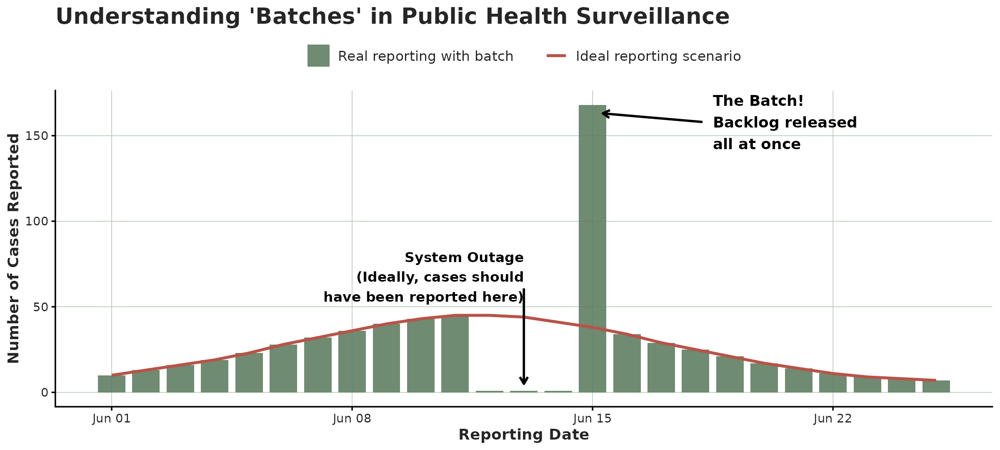

A batch is easy to confuse with an epidemic **surge**. The important
part is that the batch happens on the **reporting date** axis while a
surge happens on the **event date** axis. A batch just *moves* reports
to a later date not adding new cases while a real epidemic surge *adds*
new cases. The tools here are designed to help you visualize that
difference.

> This article shows each plot **twice**: first on a clean, made-up
> outbreak with one obvious batch (so you learn the signature), then on
> real, COVID-19 data from the CDC (see
> [`covid_us`](https://rodrigozepeda.github.io/tbl.now/reference/covid_us.html)).

### Two datasets to compare

#### The made-up outbreak.

This simulation consists of a bell-shaped curve over a hundred days,
each case reported within a few days. For one week near the peak, the
reporting system slows down with **half** of each day’s reports being
held back and released days after. That release is the **batch**.

``` r

set.seed(82495)
#Simulate a curve
onset_days <- as.Date("2024-01-01") + 0:99
bell       <- dnorm(seq(-2.5, 2.5, length.out = 100))
per_day    <- round(400 * bell / max(bell)) + 8         
onset      <- rep(onset_days, per_day)
reported   <- onset + rpois(length(onset), 1.5)         

clean_tn <- tbl_now(tibble(onset = onset, reported = reported),
                    event_date = onset, report_date = reported,
                    data_type = "linelist", verbose = FALSE)

# Simulate a batch
ideal <- simulate_batch(clean_tn,
  closed_dates  = seq(as.Date("2024-02-19"), by = "day", length.out = 7),
  held_fraction = 0.5)
```

We can see the simulated data both from the event-date and the
report-date perspectives:

``` r

plot_epidemic_process(ideal)
plot_reporting_process(ideal)
```


#### The real data

`covid_us` comes from the CDC’s individual-level [COVID-19 Case
Surveillance Public Use
Data](https://data.cdc.gov/Case-Surveillance/COVID-19-Case-Surveillance-Public-Use-Data/vbim-akqf/about_data).
It carries three dates. Here we use the first and the last: symptom
onset (`onset_dt`) as the event, and registration at CDC
(`cdc_report_dt`) as the report. The middle one, `pos_spec_dt`, is the
specimen collection, and it is pooled away along with `current_status`
and `sex` – the batch question is about when reports *arrived*, not
about who they were.

``` r

data(covid_us)

covid_early <- covid_us |>
  summarise(n = sum(n), .by = c(onset_dt, cdc_report_dt))

tn <- tbl_now(covid_early, event_date = onset_dt,
              report_date = cdc_report_dt, case_count = n,
              data_type = "count-incidence", verbose = FALSE)
```

Half of all cases were reported within a few days, but the tail is long:
some cases take weeks or months to surface.

``` r

stats::quantile(rep(tn$.delay, tn$n), c(0.5, 0.75, 0.9, 0.99))
#> 50% 75% 90% 99% 
#>   6  12  30 149
```

We can see this dataset again from both the event-date and the
report-date perspectives:

``` r

plot_epidemic_process(tn)
plot_reporting_process(tn)
```


### The reporting process

This plot, which we have previously shown, shows how many reports
arrived by date. Batches or surges might correspond to spikes towering
over their neighbours.

``` r

plot_reporting_process(ideal)
```


Reporting process of the simulated data

On the real data the reporting is spikier; a handful of peaks stick up
where smooth epidemic reporting should be. Those are reporting artefacts
either pure backlog releases, or a mix of backlog + a genuine surge
(we’ll come back to this characterization later). The tallest is a
single day of about 50K reports on 12 December 2020, sixteen times the
3K that arrive on a typical day; 10 June and 5 September are the other
conspicuous ones.

``` r

plot_reporting_process(tn)
```


Reporting process of the COVID-19 data

### The reporting triangle

We provide two different visualizations of the reporting triangle. In
both we plot the three temporal dimensions involved in the process: the
event date, the reporting date and the delay. We cover the plots in
tiles coloured by how many cases were registered then.

#### The classical reporting triangle

The classical view is given by
[`plot_reporting_triangle()`](https://rodrigozepeda.github.io/tbl.now/reference/plot_reporting_triangle.md)
where each tile is described by *when it happened* (across) and *how
long they took to be reported* (vertical). The diagonal shows reports
that arrive on the same day.  
An indicator of a batch is **a bright diagonal reaching high up** which
reporesents many delayed cases being all reported on the same day.

``` r

plot_reporting_triangle(ideal)
```


Classical reporting triangle of the simulated data

On COVID-19, the triangle is a broad blue-grey haze (most cases reported
over many months) crossed by bright diagonals. They correspond to the
same spikes seen in the reporting process:

``` r

plot_reporting_triangle(tn)
```


Classical reporting triangle of the COVID-19 data

#### The reporting hexamap

Event date, report date and reporting delay can be seen as an
**age-period-cohort** triple (`report = event + delay`, exactly
`period = cohort + age`), so the reporting triangle can be drawn as a
hexamap in the style of [Jalal and Burke
(2020)](https://doi.org/10.1097/EDE.0000000000001236): each
`(event, delay)` cell is a hexagon, coloured by its report count, with
event date, report date and delay running along the three 60-degree
axes. Because a batch is a happens in the **report date**, it shows up
as a **vertical stripe**; the fast reporting bulk sits along the
short-delay bottom edge.

``` r

plot_reporting_hexamap(ideal)
```

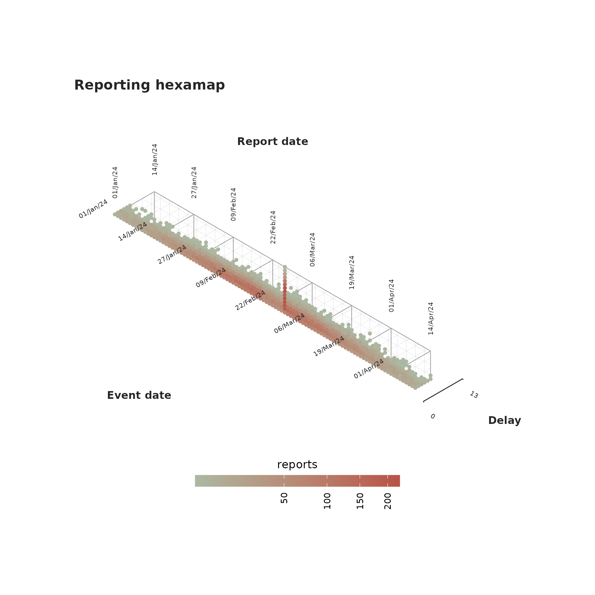

On covid the vertical stripes are the 2020 backlog releases. The delay
axis is capped with `max_delay` to keep the map to where the reports
are.

``` r

plot_reporting_hexamap(tn, max_delay = 60)
```

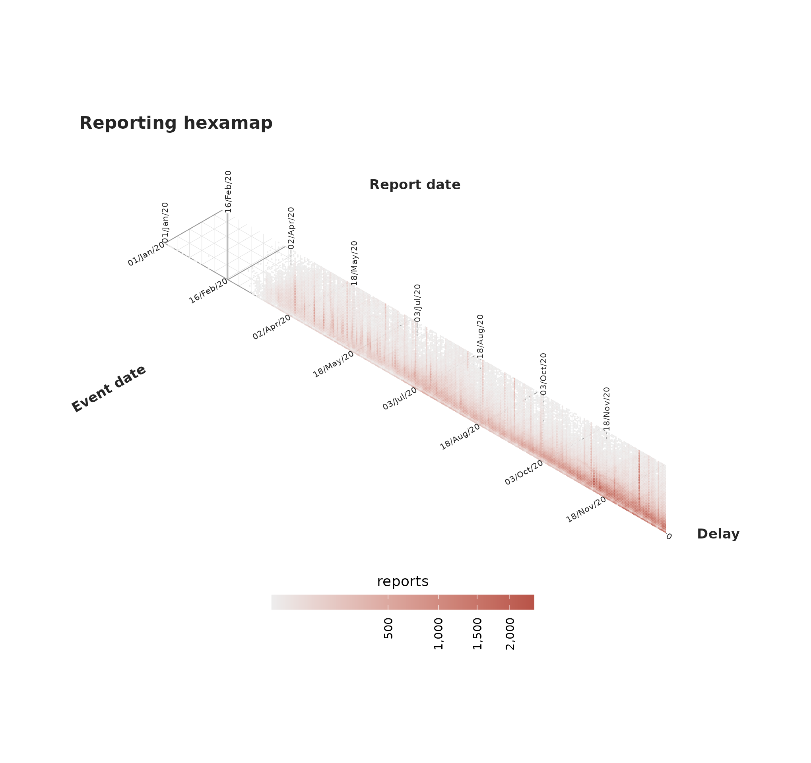

### Scalograms

The scalogram functions are **very experimental**. We have yet to
confirm they work for all batch cases. Feel free to skip to the section
on
[transport](https://rodrigozepeda.github.io/tbl.now/articles/diagnosing-a-tbl-now.html#sec-transport)

Scalograms show reductions of cases. For this example, consider the
following simulated reporting process:

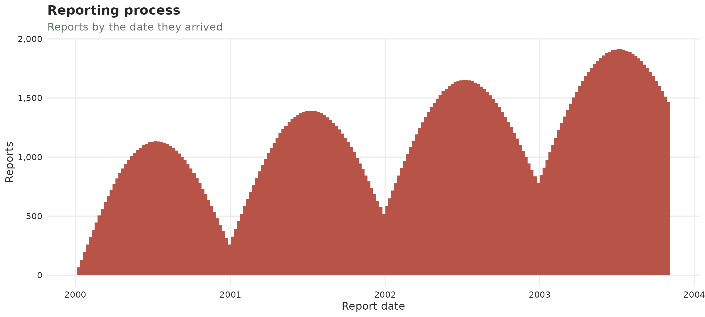

Its scalogram shows the decreases in the reporting cases as vertical
streaks aligned with the minimal date of this decrease:

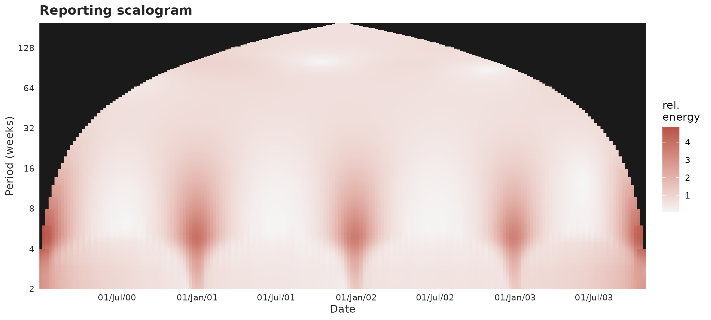

One can see the same vertical streaks in the previous reporting process
we had been working on corresponding to the dip before the batch:

``` r

plot_scalogram(ideal)
```

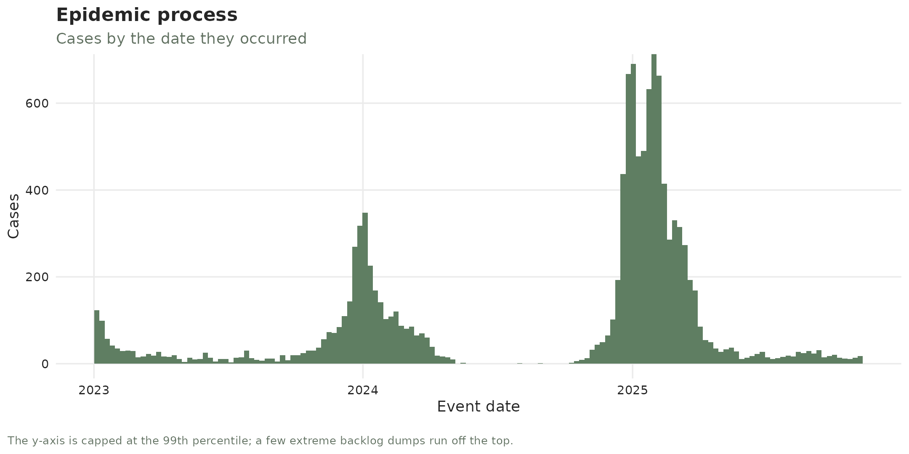

and again the same release dates being the most identified, with
additional dates having less of a clear pattern:

``` r

plot_scalogram(tn)
```

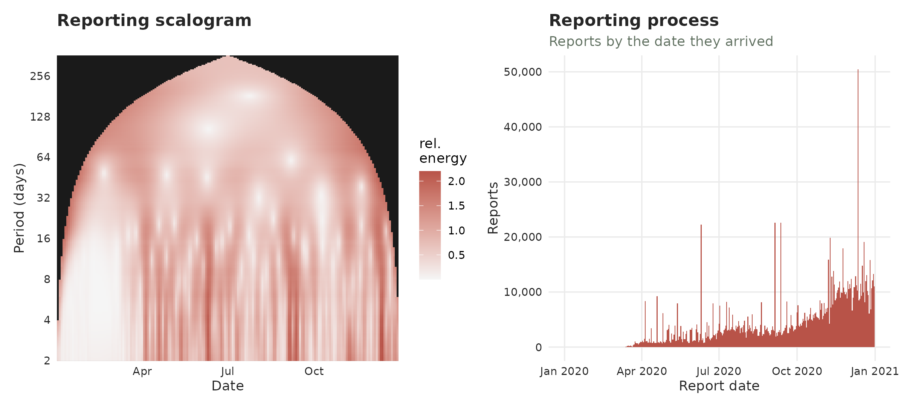

### Transport vs creation

This is the main tool for detecting batches and surges. Before the plot,
we will explain the whole idea. Consider a daily outbreak with reports
incoming each day. Three things can change the number of reports:

- a **hold** – a reporting office falls behind and some days’ reports
  are withheld;
- a **batch** – the day the backlog (hold) is finally released, all at
  once;
- a **surge** – an increase in the epidemic process: more people falling
  ill and being reported.

We simulate one of each in a clean epidemic and colour every day by its
type (grey = ordinary day):

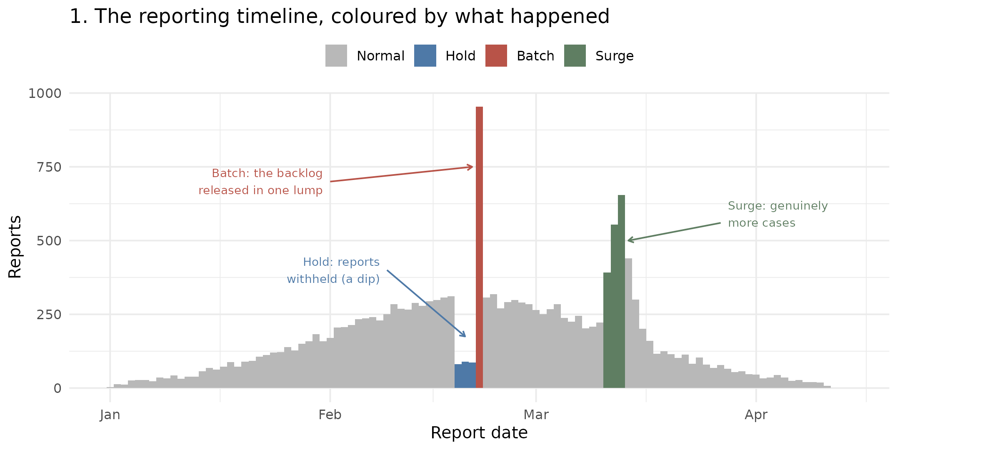

In the previous plot, every bar is one report date. The **batch** towers
where the held reports land together; the **hold** is the small blue dip
just before it; the **surge** is a genuine bump of new cases.

The transport discriminant turns each day into **two numbers**:

- A **creation score** – did this stretch of days genuinely *gain*
  cases? A larger surge implies a larger creation score.
- A **transport score** – were the days just before *missing* reports? A
  backlog release after a hold pushes it up.

We plot every day by those two numbers and observe the directions of the
three disturbances:

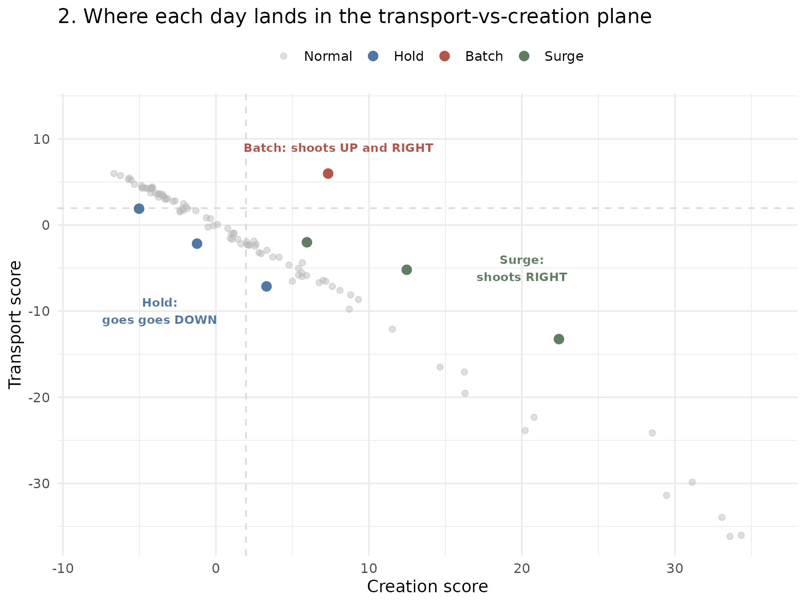

Identifying any bar with its dot we can conclude:

- A **batch (backlog release, red)** shoots **up and right** – the days
  before were depleted (high transport) but not as many new cases were
  created (right);
- A **surge (green)** shoots **right** – cases genuinely appeared (high
  creation), with apparent preceding hole;
- A **hold (blue)** drifts **left** – reports have apparently gone
  missing (transport rising) while the window has *lost* cases (creation
  negative).

Ordinary days (grey) sit in the cloud through the middle. That is the
whole idea behind
[`transport_discriminant()`](https://rodrigozepeda.github.io/tbl.now/reference/transport_discriminant.md)
and
[`diagnose_batches()`](https://rodrigozepeda.github.io/tbl.now/reference/diagnose_batches.md):
**a batch is high transport with little creation**.

#### The transport discriminant

The previous plot can be done with the
[`plot_transport_discriminant()`](https://rodrigozepeda.github.io/tbl.now/reference/plot_transport_discriminant.md)
function:

``` r

plot_transport_discriminant(ideal)
```

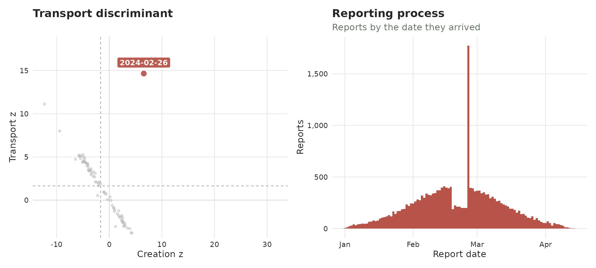

Which also works to identify the COVID-19 cases:

``` r

plot_transport_discriminant(tn, period = 7)
```

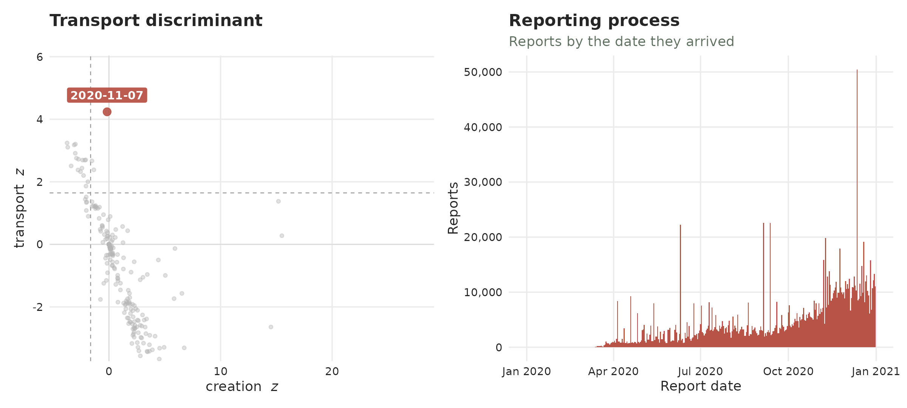

#### Recovering the data

The
[`diagnose_batches()`](https://rodrigozepeda.github.io/tbl.now/reference/diagnose_batches.md)
function runs the transport test for the batch signature and returns,
for every report date, the `batch` flag – a Benjamini-Hochberg-corrected
verdict that controls the false-discovery rate across all dates (see
[`?diagnose_batches`](https://rodrigozepeda.github.io/tbl.now/reference/diagnose_batches.md)
for the full column reference). Keeping the `batch` rows gives the
confirmed releases together with their `deficit` (how depleted the days
just before were) and `delta` (how little the window total actually
changed).

``` r

diagnose_batches(ideal) |>
  filter(batch)
```

    #> # A tibble: 1 × 7
    #>   report_date reported baseline deficit delta p_transport_bh batch
    #>   <date>         <dbl>    <dbl>   <dbl> <dbl>          <dbl> <lgl>
    #> 1 2024-02-26      1773     336.    972.  465.       7.03e-47 TRUE

On covid we pass `period = 7` to divide out the weekly reporting
cadence. Only one date survives the Benjamini-Hochberg-corrected `batch`
flag: **7 November 2020**, which reported about twice its baseline *and*
was preceded by a matching deficit of roughly the same size. That
pairing is the whole test – the taller spikes of 12 December and 10 June
are not flagged, because nothing was withheld beforehand to release,
which makes them surges rather than batches:

``` r

diagnose_batches(tn, period = 7) |>
  filter(batch)
```

    #> # A tibble: 1 × 7
    #>   report_date reported baseline deficit delta p_transport_bh batch
    #>   <date>         <dbl>    <dbl>   <dbl> <dbl>          <dbl> <lgl>
    #> 1 2020-11-07     15882    8174.   8053. -345.        0.00405 TRUE

The sensitivity of the batch flag can be adapted with `alpha`.

### Delay changes

The reporting delay might change through time. Here we show two
different plots for identifying delay problems.

#### Reporting-delay drift

The typical time from case to report, tracked over the outbreak. Shows
the overall trend of the delay. Normally it will be steady; a batch can
be seen as a **sudden bump upward** on the release day.

``` r

plot_delay_drift(ideal)
```

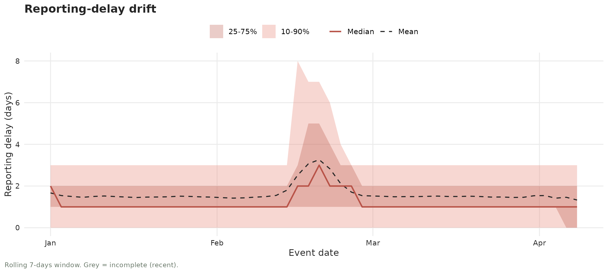

On covid the delays show extreme variability in the beginning and a
trend that decreases the delay in time:

``` r

plot_delay_drift(tn)
```

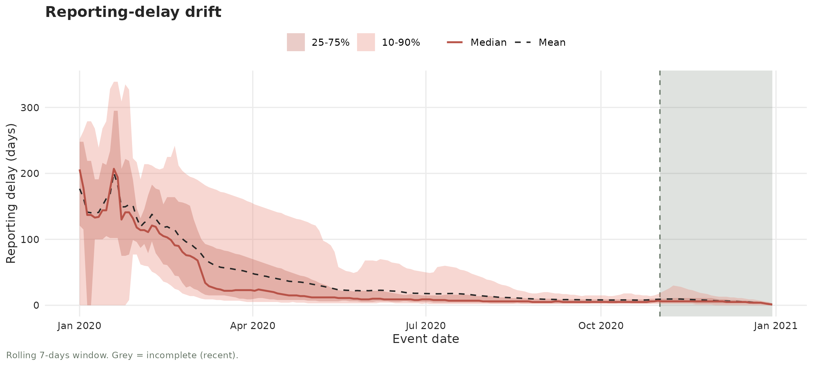

The functions
[`diagnose_drift()`](https://rodrigozepeda.github.io/tbl.now/reference/diagnose_drift.md)
and
[`diagnose_changepoint()`](https://rodrigozepeda.github.io/tbl.now/reference/diagnose_changepoint.md)
test for a gradual or abrupt changes in the delay. We can see, for
example, that it correctly identifies the drift in the COVID-19 dataset
both for the median (trend) and the spread (see the quantiles getting
tighter). On the ideal example this doesn’t happen so it does not detect
a drift:

``` r

diagnose_drift(tn)
#> # A tibble: 2 × 9
#>   strata stat       n    tau sens_slope statistic     p_value method    drift
#>   <chr>  <chr>  <int>  <dbl>      <dbl>     <dbl>       <dbl> <chr>     <lgl>
#> 1 all    median   305 -0.793     -0.108     -3.81 0.000142    hamed-rao TRUE 
#> 2 all    spread   305 -0.730     -0.669     -5.29 0.000000120 hamed-rao TRUE
diagnose_drift(ideal)
#> # A tibble: 2 × 9
#>   strata stat       n     tau sens_slope statistic p_value method    drift
#>   <chr>  <chr>  <int>   <dbl>      <dbl>     <dbl>   <dbl> <chr>     <lgl>
#> 1 all    median   100  0.0129          0     0.151   0.880 hamed-rao FALSE
#> 2 all    spread   100 -0.0204          0    -0.305   0.760 hamed-rao FALSE
```

The change-point function also detects that by early June the COVID-19
delay distribution has completely changed from before. In the case of
the ideal example the change is not long enough to be detected:

``` r

diagnose_changepoint(tn)
#> # A tibble: 2 × 10
#>   strata stat       n changepoint statistic  p_value before after  shift changepoint_detected
#>   <chr>  <chr>  <int> <date>          <dbl>    <dbl>  <dbl> <dbl>  <dbl> <lgl>               
#> 1 all    median   305 2020-06-07      21432 1.79e-42   55.8  6.41  -49.4 TRUE                
#> 2 all    spread   305 2020-06-18      20419 1.36e-38  128.  28.1  -100.  TRUE
diagnose_changepoint(ideal)
#> # A tibble: 2 × 10
#>   strata stat       n changepoint statistic p_value before after  shift changepoint_detected
#>   <chr>  <chr>  <int> <date>          <dbl>   <dbl>  <dbl> <dbl>  <dbl> <lgl>               
#> 1 all    median   100 2024-02-17        387   0.822   1.06  1.46  0.399 FALSE               
#> 2 all    spread   100 2024-02-21        335   1       3.44  3.02 -0.421 FALSE
```

#### Delay profiles

Each faint line is one day’s distirbution of reporting delays. Most days
report quickly, so their lines hug the left and concentrate around the
same distribution:

``` r

plot_delay_profiles(ideal)
```

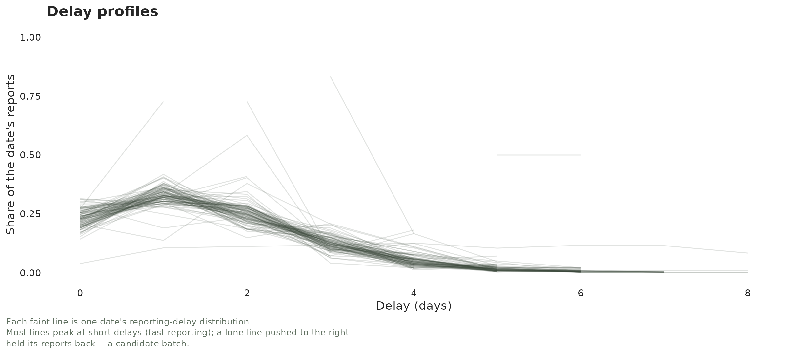

On COVID-19 a whole spray of lines reaches far to the right days that
reported cases months later.

``` r

plot_delay_profiles(tn)
```


## The whole toolkit, on one page

The structural tools come first because they are cheap and never wrong;
the statistical ones come second because they cost a choice.

| Tool | Question it answers |
|----|----|
| **[`summary()`](https://rdrr.io/r/base/summary.html)** | What is in the data: counts, delays, sparsity, composition, reach. |
| **[`diagnose()`](https://rodrigozepeda.github.io/tbl.now/reference/diagnose.md)** | What is structurally wrong: ordering, missingness, duplicates, units, right-truncation. |
| **[`validate_tbl_now()`](https://rodrigozepeda.github.io/tbl.now/reference/validate_tbl_now.md)** | The same findings, raised as errors and warnings instead of returned. |

Everything below needs a statistical choice, and every row is a
different way of seeing the same thing – reports that were held back and
then released together.

| Plot or test | What to look for |
|----|----|
| **Reporting process** | Shows how reports were registered. |
| **Reporting triangle** | Diagonals show cases with the same report date. |
| **The reporting V** | Horizontal slices show cases with the same report date. |
| **Wavelet scalogram** | Bright short-period ridges in the reporting series show *holds* on the reporting. |
| **Transport discriminant** | A red dot up-and-left, in the “potential batch region” might indicate a batch. |
| **[`diagnose_batches()`](https://rodrigozepeda.github.io/tbl.now/reference/diagnose_batches.md)** | Shows the flagged reports in the discriminant as a `data.frame` |
| **Delay profiles** | Show the delay distribution for each event date. |
| **Reporting-delay drift** | Shows how the delay and its variance change through time. |

Another practical notes from other data we have analyzed:

- In general, **surges** (real new cases) seem harder to identify of
  that **batches** (moved reports).
- Batches are very difficult to identify in low-incidence scenarios.  
- Batches very close to the now are difficult to identify without
  additional modeling hypotheses.

## Where to go next

- [`?tbl_now_summary`](https://rodrigozepeda.github.io/tbl.now/reference/tbl_now_summary.md)
  and
  [`?nowcast_summary_components`](https://rodrigozepeda.github.io/tbl.now/reference/nowcast_summary_components.md)
  — every column, every block of Part 1.
- [`?diagnose`](https://rodrigozepeda.github.io/tbl.now/reference/diagnose.md)
  and
  [`?nowcast_diagnose_components`](https://rodrigozepeda.github.io/tbl.now/reference/nowcast_diagnose_components.md)
  — every check, every status of Part 2.
- [`?diagnose_drift`](https://rodrigozepeda.github.io/tbl.now/reference/diagnose_drift.md),
  [`?diagnose_batches`](https://rodrigozepeda.github.io/tbl.now/reference/diagnose_batches.md)
  and
  [`?diagnostic_plot`](https://rodrigozepeda.github.io/tbl.now/reference/diagnostic_plot.md)
  — the tests and figures of Part 3.

### Learning more

- Introduction vignette:
  <https://rodrigozepeda.github.io/tbl.now/articles/tbl.now.html> for
  the full anatomy of a `tbl_now`, data types, and temporal effects.
- End-to-end tutorial on real, messy surveillance data — cleaning,
  diagnostics and nowcasting:
  <https://rodrigozepeda.github.io/tbl.now/articles/example.html>
- Tutorial on diagnosing your dataset — what is in it, what is
  structurally wrong with it, and detecting batches and other
  reporting-delay artifacts:
  <https://rodrigozepeda.github.io/tbl.now/articles/diagnosing-a-tbl-now.html>
- Using different nowcasting engines for the same dataset:
  <https://rodrigozepeda.github.io/tbl.now/articles/nowcasting-models.html>
- Ensemble nowcasting across different engines
  <https://rodrigozepeda.github.io/tbl.now/articles/ensemble-nowcasting.html>
- Adding your own nowcasting model
  <https://rodrigozepeda.github.io/tbl.now/articles/custom-nowcast-models.html>
- Package reference:
  <https://rodrigozepeda.github.io/tbl.now/reference/>
