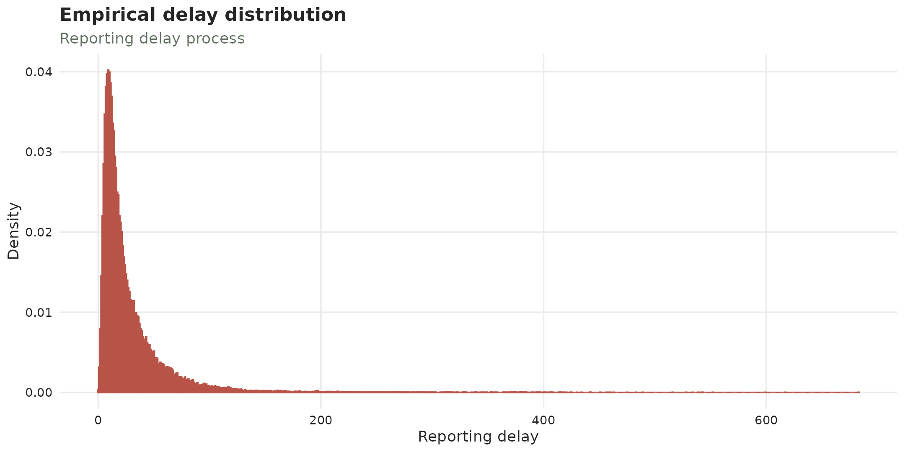
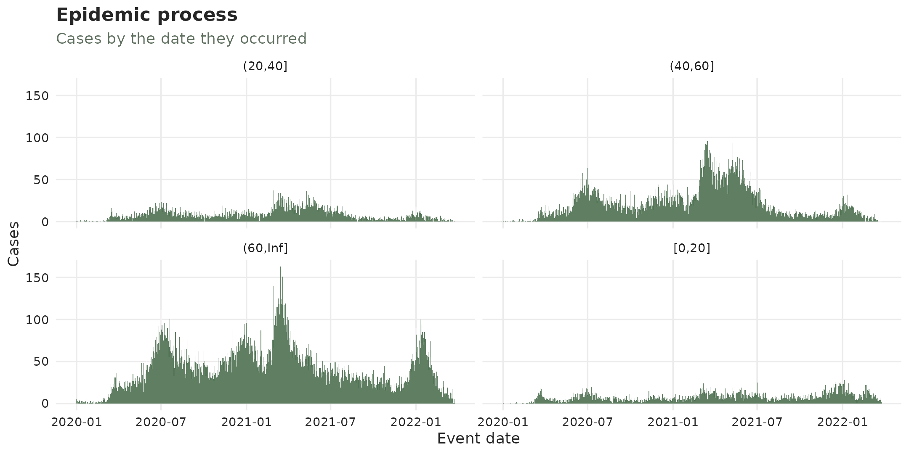
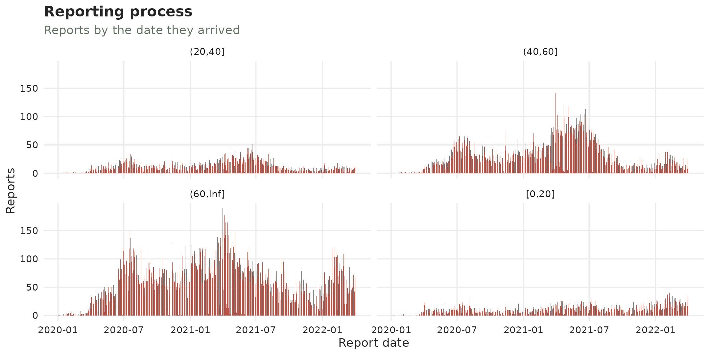
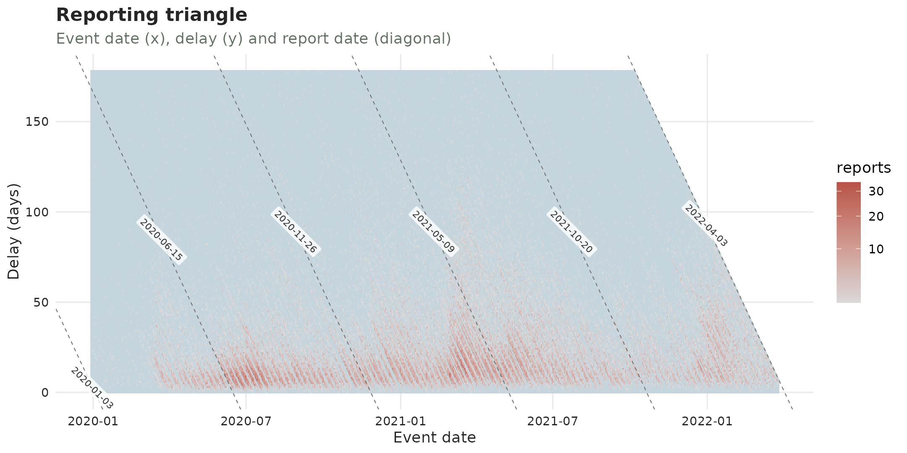

# Diagnosing a tbl_now

``` r

library(dplyr)
library(ggplot2)
library(tidyr)
library(patchwork)
library(tbl.now)
```

Three questions frequently appear with every surveillance dataset:

1.  **What is structurally wrong with it?**: missing and impossible
    dates, data that stops before its own `now`.
    [`diagnose()`](https://rodrigozepeda.github.io/tbl.now/reference/diagnose.md)
    answers this.

2.  **What is in it?**: how many cases, over what period, arriving how
    late, how sparse, how do they vary among strata.
    [`summary()`](https://rdrr.io/r/base/summary.html) answers these.

3.  **Are there any changes in the epidemic or the reporting
    mechanism?** To answer these we look at batches, drifts as well as
    visualizations of the processes.

This article follows the `sari_bh` dataset, a linelist of severe acute
respiratory illness (SARI) cases from Belo Horizonte (Brazil) from 2020
to 2022:

``` r

data(sari_bh)

#Create an age category for strata
sari_bh <- sari_bh |> 
  mutate(age_cat = cut(age_yrs, breaks = c(0, 20, 40, 60, Inf), include.lowest = TRUE))

sari <- tbl_now(sari_bh,
  event_date  = symptom_onset_date,
  report_date = record_date,
  strata      = age_cat
)

sari
#> # A tibble:  65,404 × 9
#> # Data type: "linelist"
#> # Frequency: Event: `days` | Report: `days`
#>   symptom_onset_date record_date   final_classification case_evolution age_yrs age_cat  .event_num .report_num .delay
#>   <date>             <date>        <chr>                <chr>            <dbl> <fct>         <dbl>       <dbl>  <dbl>
#>   [event_date]       [report_date] [...]                [...]            [...] [strata]      [...]       [...]  [...]
#> 1 2020-02-11         2020-03-05    Not specified        Cured               59 (40,60]          44          67     23
#> 2 2020-01-21         2020-02-06    Not specified        Cured               79 (60,Inf]         23          39     16
#> 3 2020-03-30         2020-04-17    Not specified        Cured               72 (60,Inf]         92         110     18
#> 4 2020-03-26         2020-04-02    Not specified        Cured               82 (60,Inf]         88          95      7
#> 5 2020-03-20         2020-04-13    Not specified        Cured               50 (40,60]          82         106     24
#> # ────────────────────────────────────────────────────────────────────────────────────────────────────────────────────────────────────────────────────────────────
#> # Now: 2022-04-03 | Event date: "symptom_onset_date" | Report date: "record_date"
#> # Strata: "age_cat"
#> # ────────────────────────────────────────────────────────────────────────────────────────────────────────────────────────────────────────────────────────────────
#> # ℹ 65,399 more rows
```

## 1. Diagnose what is structurally wrong

### Linelist data

Once the `tbl_now` is specified,
[`diagnose()`](https://rodrigozepeda.github.io/tbl.now/reference/diagnose.md)
can be used to print a report: with errors, warnings and notes:

``` r

diagnose(sari)
#> ── Diagnosis of a <tbl_now> ────────────────────────────────────────────────────────────────────────────────────────────────────────────────────────────────────
#> 2 warnings, 16 notes, 12 passed, 5 skipped.
#> 
#> Warnings (2)
#> ! missing/record_date: 12 rows have NA values in the report_date column "record_date".
#>   → A row with no report date cannot be placed on the reporting triangle.
#> ! ordering/event_to_report: 30 rows have a `report_date` before `event_date`
#>   → A negative reporting delay is not a delay; the two date columns may be swapped, or the rows may be data-entry errors.
#> 
#> Notes (16)
#> ℹ declarations/undeclared: 3 columns "final_classification", "case_evolution", and "age_yrs" are not declared as strata or covariates.
#>   → Declare them with `strata = ` to model them separately, or let `to_count()` pool them away -- which is what the `tbl_now_to_()` converters do.
#> ℹ now/now_gap_event [(20,40]]: The last event date is 9 days before now ("2022-04-03").
#>   → Everything in that window is still arriving; it is what a nowcast is for, and it is also what makes the last points of any plot look like a decline.
#> ℹ now/now_gap_event [(40,60]]: The last event date is 9 days before now ("2022-04-03").
#> ℹ now/now_gap_event [(60,Inf]]: The last event date is 9 days before now ("2022-04-03").
#> ℹ now/now_gap_event [[0,20]]: The last event date is 7 days before now ("2022-04-03").
#> ℹ now/now_gap_event: The last event date is 7 days before now ("2022-04-03").
#> ℹ now/now_gap_report [(20,40]]: The last report date is 2 days before now ("2022-04-03").
#> ℹ now/now_gap_report [(40,60]]: The last report date is 2 days before now ("2022-04-03").
#> ℹ now/now_gap_report [[0,20]]: The last report date is 2 days before now ("2022-04-03").
#> ℹ strata/size [[0,20]]: The smallest stratum is "[0,20]" with 6286 cases, 9.6% of the total.
#> ℹ strata/sparsity [(20,40]]: The sparsest stratum is "(20,40]": 66 of the 827 days between the minimum event (2019-12-29) and the now (2022-04-03) carry no cases at all (8%, against 1.2% pooled over every stratum).
#>   → A stratum that is mostly zeros is the one a per-stratum fit will struggle with; pooling it is often better than fitting it. When every stratum is mostly zeros the grid is finer than the data -- `aggregate_time_units()` coarsens it.
#> ℹ truncation/event_date [(20,40]]: 66 event dates are younger than the 95th percentile of the delay, so their counts are still filling in; an estimated 18.5% of their eventual total has not arrived.
#>   → This is right-truncation, and it is the reason to nowcast rather than a defect. Cut the series at "2022-01-08" to describe it instead.
#> ℹ truncation/event_date [(40,60]]: 70 event dates are younger than the 95th percentile of the delay, so their counts are still filling in; an estimated 15.3% of their eventual total has not arrived.
#> ℹ truncation/event_date [(60,Inf]]: 76 event dates are younger than the 95th percentile of the delay, so their counts are still filling in; an estimated 14.3% of their eventual total has not arrived.
#> ℹ truncation/event_date [[0,20]]: 78 event dates are younger than the 95th percentile of the delay, so their counts are still filling in; an estimated 22% of their eventual total has not arrived.
#> ℹ truncation/event_date: 78 event dates are younger than the 95th percentile of the delay, so their counts are still filling in; an estimated 17% of their eventual total has not arrived.
#> 
#> ✔ 12 passed: declarations/temporal_effects, missing/age_cat, missing/symptom_onset_date, now/event_date, now/now_gap_report, now/report_date, simultaneously missing/event and report dates, units/declared, units/delay, units/event_grid, and units/report_grid
#> ─ 5 skipped: duplicates/key, negatives/count, ordering/event_to_revision, ordering/report_to_revision, and strata/pending
#> 
#> ℹ 35 findings. Use `dplyr::filter()` or `tibble::as_tibble()` for the table.
```

in our case we have rows with missing report dates which we’ll input via
censoring (we’ll utilize the last value observed):

``` r

sari <- sari |> censor_reports(is.na(record_date))
```

while for the 30 rows where the report date was set before the event
we’ll drop them as there is no principled way of handling these cases:

``` r

sari <- sari |> filter(record_date >= symptom_onset_date)
```

The notes can also be reduced.
[`tbl_now()`](https://rodrigozepeda.github.io/tbl.now/reference/tbl_now.md)
aims for the bare minimum for a nowcast hence it complains about the
extra columns that are neither covariates nor strata. We can remove them
to silence the note:

``` r

sari <- sari |> select(-age_yrs, -final_classification, -case_evolution)
```

This now leads to a cleaner diagnose which can be called the same way or
printed as a tibble by assigning it to an object:

``` r

sari_diagnostic <- diagnose(sari) |> filter(status != "ok" & status != "skipped")
```

| stratum | n_affected | n_total | prop | message | rows |
|:---|---:|---:|---:|:---|:---|
| (20,40\] | 9 | NA | NA | The last event date is 9 days before now (“2022-04-03”). |  |
| (40,60\] | 9 | NA | NA | The last event date is 9 days before now (“2022-04-03”). |  |
| (60,Inf\] | 9 | NA | NA | The last event date is 9 days before now (“2022-04-03”). |  |
| \[0,20\] | 7 | NA | NA | The last event date is 7 days before now (“2022-04-03”). |  |
| all | 7 | NA | NA | The last event date is 7 days before now (“2022-04-03”). |  |
| (20,40\] | 2 | NA | NA | The last report date is 2 days before now (“2022-04-03”). |  |
| \[0,20\] | 6284 | 65374 | 0.0961238 | The smallest stratum is “\[0,20\]” with 6284 cases, 9.6% of the total. |  |
| (20,40\] | 66 | 827 | 0.0798065 | The sparsest stratum is “(20,40\]”: 66 of the 827 days between the minimum event (2019-12-29) and the now (2022-04-03) carry no cases at all (8%, against 1.2% pooled over every stratum). |  |
| (20,40\] | 66 | 761 | 0.0867280 | 66 event dates are younger than the 95th percentile of the delay, so their counts are still filling in; an estimated 18.5% of their eventual total has not arrived. |  |
| (40,60\] | 70 | 780 | 0.0897436 | 70 event dates are younger than the 95th percentile of the delay, so their counts are still filling in; an estimated 15.4% of their eventual total has not arrived. |  |
| (60,Inf\] | 76 | 810 | 0.0938272 | 76 event dates are younger than the 95th percentile of the delay, so their counts are still filling in; an estimated 14.3% of their eventual total has not arrived. |  |
| \[0,20\] | 78 | 776 | 0.1005155 | 78 event dates are younger than the 95th percentile of the delay, so their counts are still filling in; an estimated 22.1% of their eventual total has not arrived. |  |
| all | 78 | 817 | 0.0954712 | 78 event dates are younger than the 95th percentile of the delay, so their counts are still filling in; an estimated 17% of their eventual total has not arrived. |  |

### Cumulative data: the revisions

Cumulative counts represent at each entry the best estimate of the
running total of cases by that event-report date. As such, they can get
revised downwards, and a downward revision can become a **negative
‘increment’** the moment the series is de-accumulated. We can see this
example with the `flusight` dataset:

``` r

data(flusight)

flu_now <- flusight |>
  filter(location_name == "Alabama", target_end_date >= as.Date("2023-01-01")) |>
  tbl_now(
    event_date  = target_end_date,
    report_date = as_of,
    case_count  = observation,
    data_type   = "count-cumulative"
  )

diagnose(flu_now)
#> ── Diagnosis of a <tbl_now> ────────────────────────────────────────────────────────────────────────────────────────────────────────────────────────────────────
#> 1 warning, 5 notes, 12 passed, 4 skipped.
#> 
#> Warnings (1)
#> ! units/delay: 563 rows have a fractional `.delay`.
#>   → A fractional delay is what a converter chokes on: the two date columns are on different grids. `align_weeks()` is the fix for weekly data.
#> 
#> Notes (5)
#> ℹ declarations/undeclared: 1 column "location_name" is not declared as strata or covariates.
#>   → Declare it with `strata = ` to model it separately, or let `to_count()` pool it away -- which is what the `tbl_now_to_()` converters do.
#> ℹ negatives/increment: 73 de-accumulated increments are negative (total -175).
#>   → A cumulative total that goes down is a revision. `to_count(x, to = "count-incidence")` shows the increments; the row indices are its rows, not this object's, so none are given.
#> ℹ now/now_gap_event: The last event date is 0.57 weeks before now ("2025-11-12").
#>   → Everything in that window is still arriving; it is what a nowcast is for, and it is also what makes the last points of any plot look like a decline.
#> ℹ truncation/event_date: 24 event dates are younger than the 95th percentile of the delay, so their counts are still filling in; an estimated 7.6% of their eventual total has not arrived.
#>   → This is right-truncation, and it is the reason to nowcast rather than a defect. Cut the series at "2025-05-28" to describe it instead.
#> ℹ units/report_grid: "as_of" is declared "weeks" but 563 of its dates do not sit on the same grid as the earliest event date ("2023-01-07").
#>   → Weekly columns on different weekdays are the usual cause; fix them with `align_weeks()` rather than rounding.
#> 
#> ✔ 12 passed: declarations/temporal_effects, duplicates/key, missing/as_of, missing/observation, missing/target_end_date, now/event_date, now/now_gap_report, now/report_date, ordering/event_to_report, simultaneously missing/event and report dates, units/declared, and units/event_grid
#> ─ 4 skipped: ordering/event_to_revision, ordering/report_to_revision, strata/pending, and strata/size
#> 
#> ℹ 22 findings. Use `dplyr::filter()` or `tibble::as_tibble()` for the table.
```

The first thing to note here is that data is weekly though sometimes
reported on a Saturday and sometimes on a Wednesday. We can use the
[`align_weeks()`](https://rodrigozepeda.github.io/tbl.now/reference/align_weeks.md)
function to set all the days to the same day of the week so that the
delays are integer numbers:

``` r

#Day 4 is a wednesday as per wday()
flu_now <- flu_now |> align_weeks(align_on_day = 4)
```

The remaining notes refer to the distance between today and the now as
well as the fact that this dataset sometimes gets revised in its number
of cases (hence the negative ‘increments’)

## 2. Summarise what is in the data

The [`summary()`](https://rdrr.io/r/base/summary.html) function returns
a table, and prints it one **component** at a time:

``` r

summary(sari)
#> ── Summary of a <tbl_now> ──────────────────────────────────────────────────────────────────────────────────────────────────────────────────────────────────────
#> 91 rows in 5 components; strata: "(20,40]", "(40,60]", "(60,Inf]", and "[0,20]".
#> 
#> cases
#>   n = dates on the grid; total = cases
#>    quantity                stratum      n total     mean      sd   min   q25   q50   q75   q90   max prop_zero
#>    <chr>                   <chr>    <int> <dbl>    <dbl>   <dbl> <dbl> <dbl> <dbl> <dbl> <dbl> <dbl>     <dbl>
#>  1 per_event_date          all        827 65374 79.0     51.4        0    44    72   109   144   307    0.0121
#>  2 censored_per_event_date all        827    12  0.0145   0.120      0     0     0     0     0     1    0.985 
#>  3 per_event_date          (20,40]    827  6846  8.28     6.64       0     3     7    12    17    37    0.0798
#>  4 censored_per_event_date (20,40]    827     0  0        0          0     0     0     0     0     0    1     
#>  5 per_event_date          (40,60]    827 17949 21.7     19.4        0     8    16    31    51    96    0.0568
#>  6 censored_per_event_date (40,60]    827     6  0.00726  0.0849     0     0     0     0     0     1    0.993 
#>  7 per_event_date          (60,Inf]   827 34295 41.5     26.8        0    23    38    56    76   163    0.0206
#>  8 censored_per_event_date (60,Inf]   827     5  0.00605  0.0776     0     0     0     0     0     1    0.994 
#>  9 per_event_date          [0,20]     827  6284  7.60     5.22       0     4     7    10    14    28    0.0617
#> 10 censored_per_event_date [0,20]     827     1  0.00121  0.0348     0     0     0     0     0     1    0.999 
#> ℹ 10 more rows.
#> 
#> zero_run
#>   n = runs of consecutive zero dates; total = zero dates in those runs
#>    quantity    stratum      n total  mean    sd   min   q25   q50   q75   q90   max
#>    <chr>       <chr>    <int> <dbl> <dbl> <dbl> <dbl> <dbl> <dbl> <dbl> <dbl> <dbl>
#>  1 event_date  all          4    10  2.5  3         1     1     1     1     7     7
#>  2 event_date  (20,40]     25    66  2.64 2.31      1     1     2     3     6     9
#>  3 event_date  (40,60]     18    47  2.61 1.94      1     1     2     3     5     9
#>  4 event_date  (60,Inf]     9    17  1.89 2.67      1     1     1     1     9     9
#>  5 event_date  [0,20]      13    51  3.92 3.12      1     2     3     7     9     9
#>  6 report_date all        119   210  1.76 0.945     1     1     2     2     2     9
#>  7 report_date (20,40]    130   278  2.14 1.59      1     2     2     2     3    14
#>  8 report_date (40,60]    128   255  1.99 1.30      1     1     2     2     3    14
#>  9 report_date (60,Inf]   126   237  1.88 1.02      1     1     2     2     2    10
#> 10 report_date [0,20]     127   289  2.28 1.41      1     2     2     2     3    10
#> 
#> composition
#>   n = (event, report) cells in the category; total = cases in the category
#>   quantity          stratum      n total     prop
#>   <chr>             <chr>    <int> <dbl>    <dbl>
#> 1 censored          all         12    12 0.000184
#> 2 censored          (20,40]      0     0 0       
#> 3 censored          (40,60]      6     6 0.000334
#> 4 censored          (60,Inf]     5     5 0.000146
#> 5 censored          [0,20]       1     1 0.000159
#> 6 strata = (20,40]  all       5684  6846 0.105   
#> 7 strata = (40,60]  all      11458 17949 0.275   
#> 8 strata = (60,Inf] all      17880 34295 0.525   
#> 9 strata = [0,20]   all       5072  6284 0.0961  
#> 
#> coverage
#>   n = cells, or distinct dates on a date row; total = cases
#>    quantity    stratum      n total date_min   date_max  
#>    <chr>       <chr>    <int> <dbl> <date>     <date>    
#>  1 total_cases all      40094 65374 NA         NA        
#>  2 event_date  all        817 65374 2019-12-29 2022-03-27
#>  3 report_date all        612 65374 2020-01-03 2022-04-03
#>  4 total_cases (20,40]   5684  6846 NA         NA        
#>  5 event_date  (20,40]    761  6846 2020-01-01 2022-03-25
#>  6 report_date (20,40]    544  6846 2020-01-17 2022-04-01
#>  7 total_cases (40,60]  11458 17949 NA         NA        
#>  8 event_date  (40,60]    780 17949 2019-12-29 2022-03-25
#>  9 report_date (40,60]    567 17949 2020-01-17 2022-04-03
#> 10 total_cases (60,Inf] 17880 34295 NA         NA        
#> ℹ 37 more rows.
#> 
#> delay
#>   n = (event, report) cells; total = cases
#>   quantity        stratum      n total  mean    sd   min   q25   q50   q75   q90   max
#>   <chr>           <chr>    <int> <dbl> <dbl> <dbl> <dbl> <dbl> <dbl> <dbl> <dbl> <dbl>
#> 1 event_to_report all      40094 65374  28.7  35.5     0    10    18    34    61   683
#> 2 event_to_report (20,40]   5684  6846  29.8  35.8     0    11    18    36    64   483
#> 3 event_to_report (40,60]  11458 17949  30.1  35.2     0    11    19    36    64   617
#> 4 event_to_report (60,Inf] 17880 34295  28.3  35.6     0    10    17    33    60   683
#> 5 event_to_report [0,20]    5072  6284  26.3  35.6     0     8    14    32    59   539
#> 
#> ℹ Use `dplyr::filter()` or `tibble::as_tibble()` for the full schema.
```

We’ll discuss each of the blocks individually:

#### Delay block

Summarises the distribution of the reporting delay. Here we can see that
on average it takes 29 days to get reported but some cases took more
than 500 days!

You can also see the reporting delay via its plot:

``` r

plot_delay_distribution(sari)
```



Or get that specific table with:

``` r

delay_summary(sari)
#> ── Summary of a <tbl_now> ──────────────────────────────────────────────────────────────────────────────────────────────────────────────────────────────────────
#> 5 rows in 1 component; strata: "(20,40]", "(40,60]", "(60,Inf]", and "[0,20]".
#> 
#> delay
#>   n = (event, report) cells; total = cases
#>   quantity        stratum      n total  mean    sd   min   q25   q50   q75   q90   max
#>   <chr>           <chr>    <int> <dbl> <dbl> <dbl> <dbl> <dbl> <dbl> <dbl> <dbl> <dbl>
#> 1 event_to_report all      40094 65374  28.7  35.5     0    10    18    34    61   683
#> 2 event_to_report (20,40]   5684  6846  29.8  35.8     0    11    18    36    64   483
#> 3 event_to_report (40,60]  11458 17949  30.1  35.2     0    11    19    36    64   617
#> 4 event_to_report (60,Inf] 17880 34295  28.3  35.6     0    10    17    33    60   683
#> 5 event_to_report [0,20]    5072  6284  26.3  35.6     0     8    14    32    59   539
#> 
#> ℹ Use `dplyr::filter()` or `tibble::as_tibble()` for the full schema.
```

### Composition

The strata composition (i.e. the proportion of cases by strata) can be
accessed with the
[`prop_strata()`](https://rodrigozepeda.github.io/tbl.now/reference/nowcast_summary_components.md)
function:

``` r

prop_strata(sari)
#> ── Summary of a <tbl_now> ──────────────────────────────────────────────────────────────────────────────────────────────────────────────────────────────────────
#> 4 rows in 1 component.
#> 
#> composition
#>   n = (event, report) cells in the category; total = cases in the category
#>   quantity              n total   prop
#>   <chr>             <int> <dbl>  <dbl>
#> 1 strata = (20,40]   5684  6846 0.105 
#> 2 strata = (40,60]  11458 17949 0.275 
#> 3 strata = (60,Inf] 17880 34295 0.525 
#> 4 strata = [0,20]    5072  6284 0.0961
#> 
#> ℹ Use `dplyr::filter()` or `tibble::as_tibble()` for the full schema.
```

Here we see that half of the cases occurred in people 60 years or older.

### Sparcity

The `zero_run_summary` explains how sparse the series is. It measures a
zero-run: a collection of consecutive dates with no cases and quantifies
how those runs behave. Here we can see that there is no sparcity (the
longest zero runs are of 7 days with most of them lasting 1 day or
less). The data is not at all sparse as we can see that if we see a
zero, it is very likely the next day there will be cases (in contrast
with another 0).

``` r

zero_run_summary(sari, axis = "event")
#> ── Summary of a <tbl_now> ──────────────────────────────────────────────────────────────────────────────────────────────────────────────────────────────────────
#> 5 rows in 1 component; strata: "(20,40]", "(40,60]", "(60,Inf]", and "[0,20]".
#> 
#> zero_run
#>   n = runs of consecutive zero dates; total = zero dates in those runs
#>   quantity   stratum      n total  mean    sd   min   q25   q50   q75   q90   max
#>   <chr>      <chr>    <int> <dbl> <dbl> <dbl> <dbl> <dbl> <dbl> <dbl> <dbl> <dbl>
#> 1 event_date all          4    10  2.5   3        1     1     1     1     7     7
#> 2 event_date (20,40]     25    66  2.64  2.31     1     1     2     3     6     9
#> 3 event_date (40,60]     18    47  2.61  1.94     1     1     2     3     5     9
#> 4 event_date (60,Inf]     9    17  1.89  2.67     1     1     1     1     9     9
#> 5 event_date [0,20]      13    51  3.92  3.12     1     2     3     7     9     9
#> 
#> ℹ Use `dplyr::filter()` or `tibble::as_tibble()` for the full schema.
```

### Coverage

The `date_ranges` show the minimum and maximum for each date per strata
to see if there was a lapse in coverage for one:

``` r

date_ranges(sari)
#> ── Summary of a <tbl_now> ──────────────────────────────────────────────────────────────────────────────────────────────────────────────────────────────────────
#> 17 rows in 1 component; strata: "(20,40]", "(40,60]", "(60,Inf]", and "[0,20]".
#> 
#> coverage
#>   n = cells, or distinct dates on a date row; total = cases
#>    quantity    stratum      n total date_min   date_max  
#>    <chr>       <chr>    <int> <dbl> <date>     <date>    
#>  1 total_cases all      40094 65374 NA         NA        
#>  2 event_date  all        817 65374 2019-12-29 2022-03-27
#>  3 report_date all        612 65374 2020-01-03 2022-04-03
#>  4 total_cases (20,40]   5684  6846 NA         NA        
#>  5 event_date  (20,40]    761  6846 2020-01-01 2022-03-25
#>  6 report_date (20,40]    544  6846 2020-01-17 2022-04-01
#>  7 total_cases (40,60]  11458 17949 NA         NA        
#>  8 event_date  (40,60]    780 17949 2019-12-29 2022-03-25
#>  9 report_date (40,60]    567 17949 2020-01-17 2022-04-03
#> 10 total_cases (60,Inf] 17880 34295 NA         NA        
#> ℹ 7 more rows.
#> 
#> ℹ Use `dplyr::filter()` or `tibble::as_tibble()` for the full schema.
```

### The epidemic process

The
[`cases_per_date()`](https://rodrigozepeda.github.io/tbl.now/reference/nowcast_summary_components.md)
function recovers the description of the number of cases with the mean
number of cases reported per day and its distribution

``` r

cases_per_date(sari)
#> ── Summary of a <tbl_now> ──────────────────────────────────────────────────────────────────────────────────────────────────────────────────────────────────────
#> 10 rows in 1 component; strata: "(20,40]", "(40,60]", "(60,Inf]", and "[0,20]".
#> 
#> cases
#>   n = dates on the grid; total = cases
#>    quantity                stratum      n total     mean      sd   min   q25   q50   q75   q90   max prop_zero
#>    <chr>                   <chr>    <int> <dbl>    <dbl>   <dbl> <dbl> <dbl> <dbl> <dbl> <dbl> <dbl>     <dbl>
#>  1 per_event_date          all        827 65374 79.0     51.4        0    44    72   109   144   307    0.0121
#>  2 censored_per_event_date all        827    12  0.0145   0.120      0     0     0     0     0     1    0.985 
#>  3 per_event_date          (20,40]    827  6846  8.28     6.64       0     3     7    12    17    37    0.0798
#>  4 censored_per_event_date (20,40]    827     0  0        0          0     0     0     0     0     0    1     
#>  5 per_event_date          (40,60]    827 17949 21.7     19.4        0     8    16    31    51    96    0.0568
#>  6 censored_per_event_date (40,60]    827     6  0.00726  0.0849     0     0     0     0     0     1    0.993 
#>  7 per_event_date          (60,Inf]   827 34295 41.5     26.8        0    23    38    56    76   163    0.0206
#>  8 censored_per_event_date (60,Inf]   827     5  0.00605  0.0776     0     0     0     0     0     1    0.994 
#>  9 per_event_date          [0,20]     827  6284  7.60     5.22       0     4     7    10    14    28    0.0617
#> 10 censored_per_event_date [0,20]     827     1  0.00121  0.0348     0     0     0     0     0     1    0.999 
#> 
#> ℹ Use `dplyr::filter()` or `tibble::as_tibble()` for the full schema.
```

The epidemic process can be seen with a plot too:S

``` r

plot_epidemic_process(sari)
```



(to plot the unstratified one use `remove_strata` on the `tbl_now`
before `plot_epidemic_process`)

We can see, for example, the flusight dataset too where we can see that
there were no reports for the off-season in 2024.

``` r

plot_epidemic_process(flu_now)
```


We can use the
[`complete_zeroes()`](https://rodrigozepeda.github.io/tbl.now/reference/complete_zeroes.md)
function to substitute those values for zeroes and complete the
observations:

``` r

flu_now <- flu_now |> complete_zeroes(max_delay = 10)
```

## 3. Visualizing a `tbl.now`

One can use
[`autoplot()`](https://ggplot2.tidyverse.org/reference/autoplot.html) to
glance at the main properties of a `tbl.now` where we can see that there
is an effect of the weekend on the reporting:

``` r

autoplot(sari)
```


with less cases getting reported on Saturday/Sunday. Additional plots
help you observe how the reports have changed over time where you can
clearly see the emptyness of the weekends:

``` r

plot_reporting_process(sari)
```



The reporting triangle shows in the same plot the delays, reports and
event dates

``` r

sari |> remove_all_strata() |> plot_reporting_triangle()
```



where we can again see the weekends leaving empty streaks.

## 4. Identifying delay changes

The reporting delay might change through time. Here we show two
different plots for identifying delay problems.

#### Reporting-delay drift

This shows the typical time from event to report as it moved through the
outbreak. It shows the overall trend of the delay and its quantiles.

``` r

plot_delay_drift(sari)
```


Here we can see that the first cases took so long to get reported.
However, we can also see that after the initial chaos int he first
months of 2020 the reporting delay became pretty stable. The functions
[`diagnose_drift()`](https://rodrigozepeda.github.io/tbl.now/reference/diagnose_drift.md)
and
[`diagnose_changepoint()`](https://rodrigozepeda.github.io/tbl.now/reference/diagnose_changepoint.md)
test for a gradual or abrupt changes in the delay.

Here we can see that they identify a slight reduction (the delay reduces
0.0105 days per day) and no changes in the intervals

``` r

diagnose_drift(sari)
#> # A tibble: 2 × 9
#>   strata stat       n    tau sens_slope statistic p_value method    drift
#>   <chr>  <chr>  <int>  <dbl>      <dbl>     <dbl>   <dbl> <chr>     <lgl>
#> 1 all    median   739 0.266     0.0105      2.95  0.00323 hamed-rao TRUE 
#> 2 all    spread   739 0.0245    0.00244     0.289 0.773   hamed-rao FALSE
```

The change-point function on the other hand looks for changes in the
distribution of the delay. The function however has to be used carfully
as the changepoint function will **always** look for a changepoint in
the data. So one has to first see the delay distribution to detect a
possible changepoint before calling the diagnostic. The diagnostic will
always find a changepoint no matter what. So here although it gives a
very small p value we have decided to conclude there is no changepoint
based on the delay plot:

``` r

diagnose_changepoint(sari)
#> # A tibble: 2 × 10
#>   strata stat       n changepoint statistic  p_value before after shift changepoint_detected
#>   <chr>  <chr>  <int> <date>          <dbl>    <dbl>  <dbl> <dbl> <dbl> <lgl>               
#> 1 all    median   739 2020-11-24      78877 1.53e-40   15.7  19.7  3.99 TRUE                
#> 2 all    spread   739 2020-07-30      33299 1.42e- 7   63.0  55.1 -7.89 TRUE
```

## Batches

Reporting batches are an important hurdle in surveillance systems. See
[this vignette on
batches](https://rodrigozepeda.github.io/tbl.now/articles/batches.html)
for how we represent them and how to diagnose them. For the purpose of
this tutorial we present two diagnosing functions. The
[`diagnose_batches()`](https://rodrigozepeda.github.io/tbl.now/reference/diagnose_batches.md)
identifies potential dates that might carry reporting batches:

``` r

sari |> remove_all_strata() |> diagnose_batches()
#> ── Batch screen ────────────────────────────────────────────────────────────────────────────────────────────────────────────────────────────────────────────────
#> 822 (report date, stratum) pairs; look-back 7; null "robust"
#> ✔ No batches flagged at alpha = 0.05 (BH-adjusted).
```

while
[`diagnose_batches2()`](https://rodrigozepeda.github.io/tbl.now/reference/diagnose_batches2.md)
requires you to identify a date to test for batch-reporting:

``` r

sari |> remove_all_strata() |> diagnose_batches2(at = as.Date("2021/11/11"))
#> # A tibble: 1 × 7
#>   stratum  n_at n_reference mean_delay_at mean_delay_reference statistic p_value
#>   <chr>   <int>       <int>         <dbl>                <dbl>     <dbl>   <dbl>
#> 1 all        81         390          36.8                 42.1     -1.06   0.868
```

## Summary

Here we have shown how to diagnose, summarise and visualize a `tbl.now`
to characterize its data.

If you have any questions or comments regarding the contents of this
article please [open an issue on
Github](https://github.com/RodrigoZepeda/tbl.now/issues/new).

### Learning more

- A **tutorial** on real life surveillance data. Takes you from cleaning
  to diagnosing errors in the data to nowcasting:
  <https://rodrigozepeda.github.io/tbl.now/articles/example.html>
- The **second part of the tutorial** with a revision process: the
  optional third date, where a reported case is later confirmed,
  retracted or left pending:
  <https://rodrigozepeda.github.io/tbl.now/articles/example_revisions.html>
- The **Get started vignette**: the whole workflow, from a raw line list
  to a scored nowcast, in five minutes:
  <https://rodrigozepeda.github.io/tbl.now/articles/tbl.now.html>.
- **More on the `tbl_now` object**: every attribute, the three data
  types, the revision process, temporal effects and the `dplyr` methods:
  <https://rodrigozepeda.github.io/tbl.now/articles/more-on-tbl-now.html>
- More thoughts on **diagnosing your dataset** with `tbl.now`
  <https://rodrigozepeda.github.io/tbl.now/articles/diagnosing-a-tbl-now.html>
- Detecting reporting **batches** with `tbl.now`
  <https://rodrigozepeda.github.io/tbl.now/articles/batches.html>
- How to use different nowcasting engines from `tbl.now`: here you can
  learn **how it connects to the other nowcasting packages**.
  <https://rodrigozepeda.github.io/tbl.now/articles/nowcasting-models.html>
- How to **nowcast with multiple engines, backtest and ensemble**
  nowcasts.
  <https://rodrigozepeda.github.io/tbl.now/articles/ensemble-nowcasting.html>
- Adding your own **custom nowcasting model**
  <https://rodrigozepeda.github.io/tbl.now/articles/custom-nowcast-models.html>
- Package reference:
  <https://rodrigozepeda.github.io/tbl.now/reference/>
