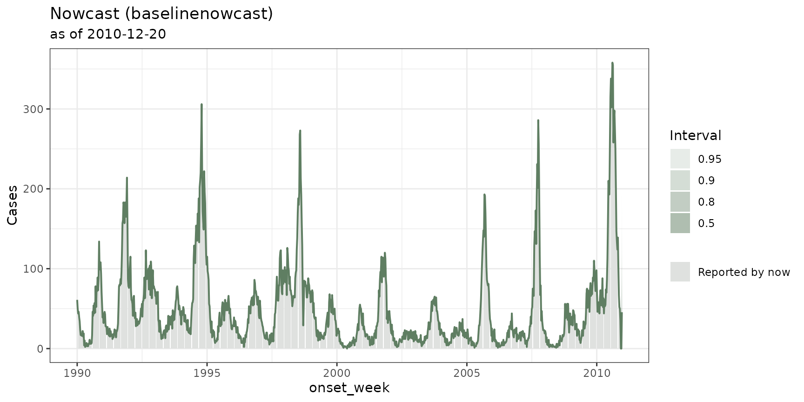
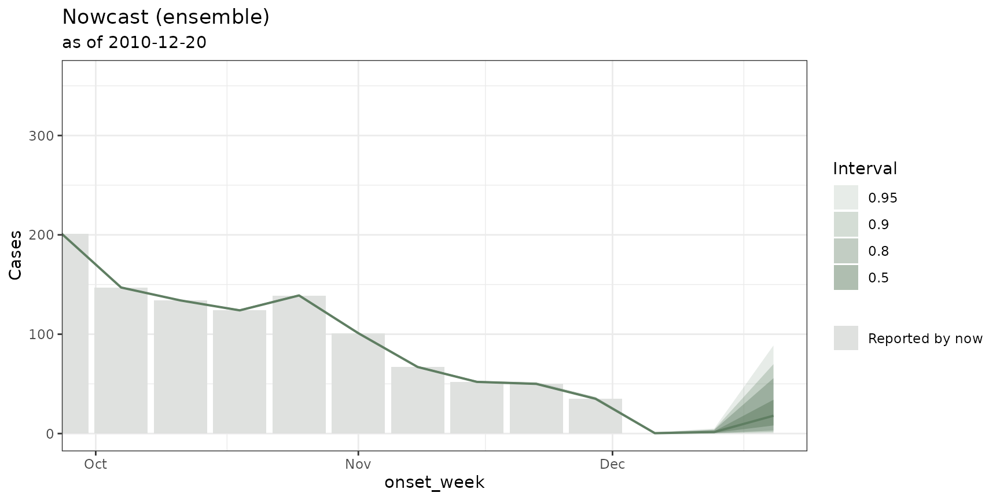

# Fitting models from different nowcasting frameworks, backtesting and building an ensemble

## Why this vignette?

This vignette is about how to run nowcasts from different `R` packages
all within the same `tbl_now` framework as well as on how to backtest
and do ensembles.

Here we describe how to:

- Use **`engine_*()`** to setup the model and its arguments,
- Fit any model with **`run_nowcast(x, engine)`**.
- Build backtest with
  **[`nowcast_backtest()`](https://rodrigozepeda.github.io/tbl.now/reference/nowcast_backtest.md)**
  to evaluate your models.
- Use
  **[`nowcast_ensemble()`](https://rodrigozepeda.github.io/tbl.now/reference/nowcast_ensemble.md)**
  to combines several models into an ensemble model.

**There are two ways to do the same.** You can either use
`run_nowcast(x, engine_epinowcast())` to use the same call for any
nowcast (this is what this vignette explains). Alternatively you can use
the converters to use the original method from the specific package:

``` r

tbl_now_to_epinowcast(x) |> epinowcast::epinowcast() 
```

Ideally you should:

1.  Use the converter (`tbl_now_to_*`) when you want to pass that
    package’s own arguments, inspect what it was handed, or do something
    the `tbl.now` backend does not.

2.  Use
    [`run_nowcast()`](https://rodrigozepeda.github.io/tbl.now/reference/run_nowcast.md)
    when you want several models that can be compared via
    [`nowcast_backtest()`](https://rodrigozepeda.github.io/tbl.now/reference/nowcast_backtest.md)
    and
    [`nowcast_ensemble()`](https://rodrigozepeda.github.io/tbl.now/reference/nowcast_ensemble.md).

``` r

library(dplyr)
library(tbl.now)

data(denguedat)
```

The examples below use `denguedat`: a **weekly line list** of dengue
cases in Puerto Rico:

``` r

dengue <- denguedat |>
  tbl_now(
    event_date  = onset_week,  #symptom onset
    report_date = report_week, #when it was reported
    verbose     = FALSE
  )

dengue
#> # A tibble:  52,987 × 6
#> # Data type: "linelist"
#> # Frequency: Event: `weeks` | Report: `weeks`
#>   onset_week   report_week   gender .event_num .report_num .delay
#>   <date>       <date>        <chr>       <dbl>       <dbl>  <dbl>
#>   [event_date] [report_date] [...]       [...]       [...]  [...]
#> 1 1990-01-01   1990-01-01    Male            0           0      0
#> 2 1990-01-01   1990-01-01    Female          0           0      0
#> 3 1990-01-01   1990-01-01    Female          0           0      0
#> 4 1990-01-01   1990-01-08    Female          0           1      1
#> 5 1990-01-01   1990-01-08    Male            0           1      1
#> # ────────────────────────────────────────────────────────────────────────────────────────────────────────────────────────────────────────────────────────────────
#> # Now: 2010-12-20 | Event date: "onset_week" | Report date: "report_week"
#> # ────────────────────────────────────────────────────────────────────────────────────────────────────────────────────────────────────────────────────────────────
#> # ℹ 52,982 more rows
```

This tutorial requires installation of baselinenowcast, NobBS and
surveillance. You can do it as:

``` r

install.packages(c("baselinenowcast","surveillance","NobBS"))
```

## 1. Fitting a nowcast

The
[`run_nowcast()`](https://rodrigozepeda.github.io/tbl.now/reference/run_nowcast.md)
function takes two arguments: the `tbl_now`, and an
[`engine()`](https://rodrigozepeda.github.io/tbl.now/reference/engine.md):

``` r

#Here we run a baselinenowcast as an example with very few draws
#because its a tutorial
baseline <- dengue |> 
  run_nowcast(engine_baselinenowcast(draws = 100))

baseline
#> ── A <tbl_nowcast> from method "baselinenowcast" ───────────────────────────────────────────────────────────────────────────────────────────────────────────────
#> • now: "2010-12-20"
#> • event dates: 1095
#> • quantile levels: 0.025, 0.05, 0.1, 0.25, 0.5, 0.75, 0.9, 0.95, and 0.975
#> • draws: 100
#> 
#> Nowcast at "2010-12-20" (q50, 2.5-97.5% interval):
#> • 45.5 [5, 202.4]
#> 
#> # A tibble: 6 × 3
#>   onset_week .quantile_level .value
#>   <date>               <dbl>  <dbl>
#> 1 1990-01-01           0.025     61
#> 2 1990-01-01           0.05      61
#> 3 1990-01-01           0.1       61
#> 4 1990-01-01           0.25      61
#> 5 1990-01-01           0.5       61
#> # ℹ 1 more row
#> ℹ 9849 more rows. Use `as_tibble()` for all of them.
```

An engine includes *the model and all of its arguments*. For example,
[`engine_baselinenowcast()`](https://rodrigozepeda.github.io/tbl.now/reference/nowcast_engines.md)
names
[`baselinenowcast::baselinenowcast()`](https://baselinenowcast.epinowcast.org/reference/baselinenowcast.html)’s
own arguments. For example in the previous case we modified the number
of draws which is an argument from
[`baselinenowcast::baselinenowcast()`](https://baselinenowcast.epinowcast.org/reference/baselinenowcast.html):

``` r

engine_baselinenowcast(draws = 1000)
#> ── <nowcast_engine: "baselinenowcast"> ─────────────────────────────────────────────────────────────────────────────────────────────────────────────────────────
#> • quantile levels: 0.025, 0.05, 0.1, 0.25, 0.5, 0.75, 0.9, 0.95, and 0.975
#> • arguments: draws and strata_sharing
```

You can call
[`list_nowcast_methods()`](https://rodrigozepeda.github.io/tbl.now/reference/list_nowcast_methods.md)
to see all the methods available in this package

``` r

list_nowcast_methods()
#> [1] "baselinenowcast"   "diseasenowcasting" "EpiNow2"           "epinowcast"        "example"           "NobBS"             "surveillance"
```

In general each of the methods for the
[`engine()`](https://rodrigozepeda.github.io/tbl.now/reference/engine.md)
requires you to install the corresponding package. You can only use
those you have installed.

### How much history to fit on: `min_date`

In general not all nowcasts can fit all of the same data fast enough to
be useful. As a rule of thumb:

1.  `diseasenowcasting` can take the **whole series** and produce a
    nowcast in less than a minute.
2.  `baselinenowcast` can take all of the event dates however one
    usually has to truncate the number of delays in the delay
    distribution.
3.  `epinowcast`, `EpiNow2`, `surveillance` and `NobBS` all require an
    event-window so that for a long time series not all event dates are
    passed. You can use the `min_date` argument to select the size of
    the window for the engine.

``` r

run_nowcast(dengue, engine_epinowcast(min_date = 20))
```

For backtesting and ensembles it is important to utilize the `min_date`
in the engine so that the backtest knows to truncate the data to the
last `min_date` periods for every single test.

## 2. Cleaning and evaluating the nowcast

Every method called by `run_engine` returns a `tbl_nowcast` which can be
cleaned with `tidy`:

``` r

tidy(baseline)
#> # A tibble: 1,095 × 7
#>   event_date stratum estimate conf.low conf.high level engine         
#>   <date>     <chr>      <dbl>    <dbl>     <dbl> <dbl> <chr>          
#> 1 1990-01-01 all           61       61        61  0.95 baselinenowcast
#> 2 1990-01-08 all           50       50        50  0.95 baselinenowcast
#> 3 1990-01-15 all           44       44        44  0.95 baselinenowcast
#> 4 1990-01-22 all           46       46        46  0.95 baselinenowcast
#> 5 1990-01-29 all           39       39        39  0.95 baselinenowcast
#> # ℹ 1,090 more rows
```

or visualized with
[`autoplot()`](https://ggplot2.tidyverse.org/reference/autoplot.html):

``` r

autoplot(baseline)
```



If enough cases have been observed so that the “truth” is settled, one
can use the
[`score_nowcast()`](https://rodrigozepeda.github.io/tbl.now/reference/score_nowcast.md)
function which compares the predictive quantiles with a resolved truth
table using the weighted interval score (WIS) of Bracher et al.
([2021](#ref-bracher2021)), plus the absolute error of the median and
the 50% and 90% interval coverage:

``` r

score_nowcast(baseline, truth = dengue)
#> # A tibble: 1,095 × 7
#>   .method         onset_week .observed   wis ae_median coverage_50 coverage_90
#>   <chr>           <date>         <dbl> <dbl>     <dbl> <lgl>       <lgl>      
#> 1 baselinenowcast 1990-01-01        61     0         0 TRUE        TRUE       
#> 2 baselinenowcast 1990-01-08        50     0         0 TRUE        TRUE       
#> 3 baselinenowcast 1990-01-15        44     0         0 TRUE        TRUE       
#> 4 baselinenowcast 1990-01-22        46     0         0 TRUE        TRUE       
#> 5 baselinenowcast 1990-01-29        39     0         0 TRUE        TRUE       
#> # ℹ 1,090 more rows
```

or more directly one can use the package:

``` r

baseline |>
  scoringutils::as_forecast_quantile(truth = dengue) |>
  scoringutils::score()
#>       onset_week           model         wis overprediction underprediction dispersion  bias interval_coverage_50 interval_coverage_90 ae_median
#>           <Date>          <char>       <num>          <num>           <num>      <num> <num>               <lgcl>               <lgcl>     <num>
#>    1: 1990-01-01 baselinenowcast  0.00000000        0.00000               0 0.00000000     0                 TRUE                 TRUE       0.0
#>    2: 1990-01-08 baselinenowcast  0.00000000        0.00000               0 0.00000000     0                 TRUE                 TRUE       0.0
#>    3: 1990-01-15 baselinenowcast  0.00000000        0.00000               0 0.00000000     0                 TRUE                 TRUE       0.0
#>    4: 1990-01-22 baselinenowcast  0.00000000        0.00000               0 0.00000000     0                 TRUE                 TRUE       0.0
#>    5: 1990-01-29 baselinenowcast  0.00000000        0.00000               0 0.00000000     0                 TRUE                 TRUE       0.0
#>   ---                                                                                                                                           
#> 1091: 2010-11-22 baselinenowcast  0.05555556        0.00000               0 0.05555556     0                 TRUE                 TRUE       0.0
#> 1092: 2010-11-29 baselinenowcast  0.13625000        0.00000               0 0.13625000     0                 TRUE                 TRUE       0.0
#> 1093: 2010-12-06 baselinenowcast  0.00000000        0.00000               0 0.00000000     0                 TRUE                 TRUE       0.0
#> 1094: 2010-12-13 baselinenowcast  0.11111111        0.00000               0 0.11111111     0                 TRUE                 TRUE       0.0
#> 1095: 2010-12-20 baselinenowcast 24.06319444       15.86667               0 8.19652778     1                FALSE                FALSE      45.5
```

Because the dataset ends at `r`get_now(dengue)\` and we nowcasted for
that date the scores are not very useful here (we don’t know how many
cases *arrived* eventually). A better option is to perform a backtest to
evaluate historical performance as the dataset knows how many cases have
already settled from dates in the past.

## 3. Backtests and ensembles

Models fail in different directions and combining them cancels part of
that. An ensemble combines multiple nowcasting for robustness. To build
an ensemble one has to specify different engines, backtest them and then
build the ensemble.

Here for example we will create an ensemble from `NobBS`, and two
`baselinenowcast` options. It is important to utilize the `label`
argument when using the same engine with different parameters:

``` r

#NobBS
model1 <- engine_nobbs(min_date = 52, max_D = 15, label = "NobBS")

#baselinenowcast
model2 <- engine_baselinenowcast(max_delay = 15, label = "baselinenowcast")

#a baselinenowcast model with a different specification
model3 <- engine_baselinenowcast(max_delay = 10, prop_delay = 0.75, label = "baselinenowcast 2")
```

Once the models are specified we can backtest through several past
dates:

``` r

#We evaluate the performance of our models in 2 past dates
#in real life change n_dates to a bigger number (we use 2 for the tutorial)
models_backtest <- dengue |> 
  nowcast_backtest(model1, model2, model3, n_dates = 2)
#> ℹ Backtesting "NobBS" at 2010-11-15.
#> ℹ Backtesting "baselinenowcast" at 2010-11-15.
#> ℹ Backtesting "baselinenowcast 2" at 2010-11-15.
#> ℹ Backtesting "NobBS" at 2010-11-22.
#> ℹ Backtesting "baselinenowcast" at 2010-11-22.
#> ℹ Backtesting "baselinenowcast 2" at 2010-11-22.
```

The backtest now gives us enough information to evaluate each of the
models:

``` r

models_backtest |> 
  scoringutils::as_forecast_quantile(truth = dengue) |>
  scoringutils::score() |> 
  scoringutils::summarise_scores() 
#>                model        wis overprediction underprediction dispersion         bias interval_coverage_50 interval_coverage_90  ae_median
#>               <char>      <num>          <num>           <num>      <num>        <num>                <num>                <num>      <num>
#> 1:             NobBS 0.66998397    0.501068376      0.03418803 0.13472756  0.033653846            0.9326923            0.9711538 1.08653846
#> 2:   baselinenowcast 0.02820801    0.001528351      0.01426461 0.01241505 -0.006373223            0.9926639            0.9940394 0.04332875
#> 3: baselinenowcast 2 0.18177964    0.001477406      0.16862805 0.01167418 -0.131957818            0.8670335            0.8674920 0.19669876
```

Once the historical evaluation is performed one needs to fit each of the
models individually and then can put them together into a
`nowcast_ensemble` along its backtest. The ensemble will then average
all the models in a way that optimizes the WIS (if `weights = "optim"`
or proportional to the WIS if `weights = "inverse_score"`).

``` r

#We fit each of the individual models
nowcast1 <- dengue |> run_nowcast(model1)
#> NOTE: Stopping adaptation
nowcast2 <- dengue |> run_nowcast(model2)
nowcast3 <- dengue |> run_nowcast(model3)

#And then ensemble to optimize for the best WIS
ensemble_nowcast <-  
  nowcast_ensemble(nowcast1, nowcast2, nowcast3, 
                   weights = "optim", backtest = models_backtest)
```

One can visualize the ensemble with
[`autoplot()`](https://ggplot2.tidyverse.org/reference/autoplot.html) or
get its results with
[`tidy()`](https://rodrigozepeda.github.io/tbl.now/reference/tidy.nowcast.md)
as in the case of a regular nowcast.

``` r

autoplot(ensemble_nowcast, date_lim = c(as.Date("2010/10/01"), as.Date("2010/12/20")))
```



## 4. Adding your own model

You can add any model built by yourself or from any other package to the
fitting so that it has its own engine, its own tidy to clean and can be
used in conjunction with
[`tidy()`](https://rodrigozepeda.github.io/tbl.now/reference/tidy.nowcast.md),
[`autoplot()`](https://ggplot2.tidyverse.org/reference/autoplot.html) as
well as the backtesting and ensemble methods. You can read more about it
in [the corresponding
article](https://rodrigozepeda.github.io/tbl.now/articles/custom-nowcast-models.html).

If you have any questions or comments regarding the contents of this
article please [open an issue on
Github](https://github.com/RodrigoZepeda/tbl.now/issues/new).

## Learning more

- End-to-end tutorial on real life surveillance data. Takes you from
  cleaning to diagnosing errors in the data to nowcasting:
  <https://rodrigozepeda.github.io/tbl.now/articles/example.html>
- The same tutorial with a **revision process** — the optional third
  date, where a reported case is later confirmed, retracted or left
  pending:
  <https://rodrigozepeda.github.io/tbl.now/articles/example_revisions.html>
- Introduction vignette:
  <https://rodrigozepeda.github.io/tbl.now/articles/tbl.now.html> for
  the full anatomy of a `tbl_now`, data types, and temporal effects.
- Tutorial on diagnosing your dataset — what is in it, what is
  structurally wrong with it, and detecting batches and other
  reporting-delay artifacts:
  <https://rodrigozepeda.github.io/tbl.now/articles/diagnosing-a-tbl-now.html>
- Using different nowcasting engines for the same dataset:
  <https://rodrigozepeda.github.io/tbl.now/articles/nowcasting-models.html>
- Ensemble nowcasting across different engines
  <https://rodrigozepeda.github.io/tbl.now/articles/ensemble-nowcasting.html>
- Adding your own nowcasting model
  <https://rodrigozepeda.github.io/tbl.now/articles/custom-nowcast-models.html>
- Package reference:
  <https://rodrigozepeda.github.io/tbl.now/reference/>

## References

Bracher, Johannes, Evan L. Ray, Tilmann Gneiting, and Nicholas G. Reich.
2021. “Evaluating Epidemic Forecasts in an Interval Format.” *PLoS
Computational Biology* 17 (2): e1008618.
<https://doi.org/10.1371/journal.pcbi.1008618>.
