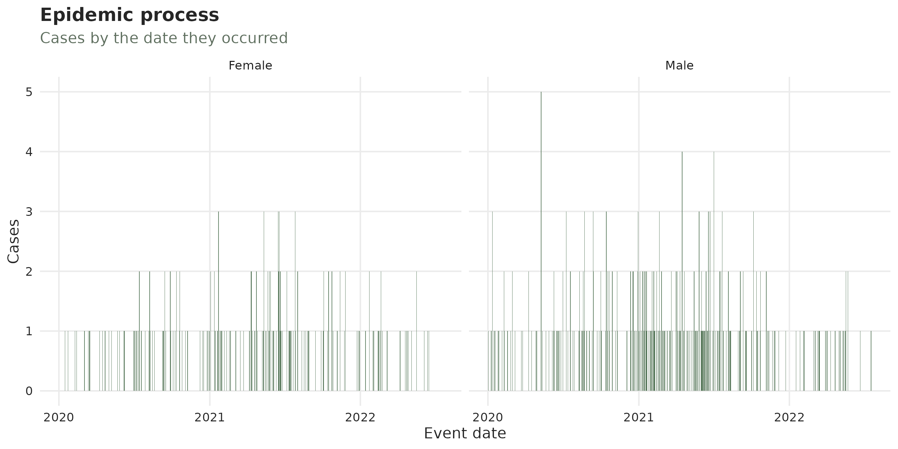
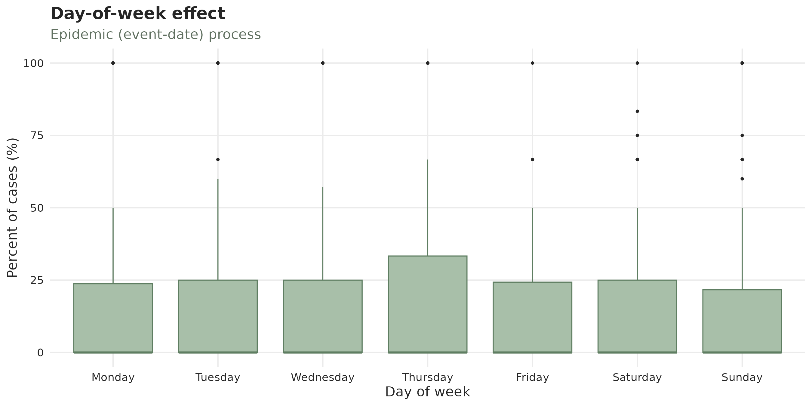
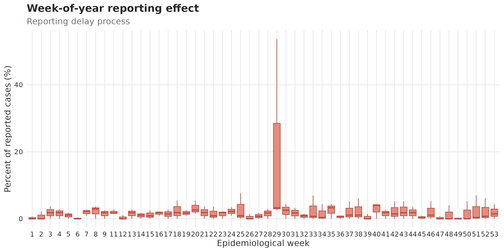
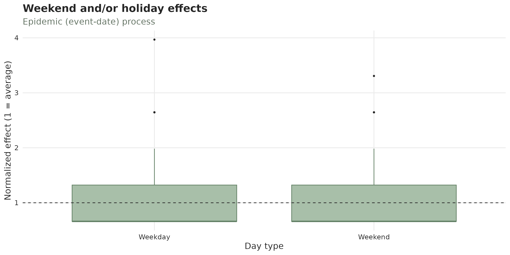
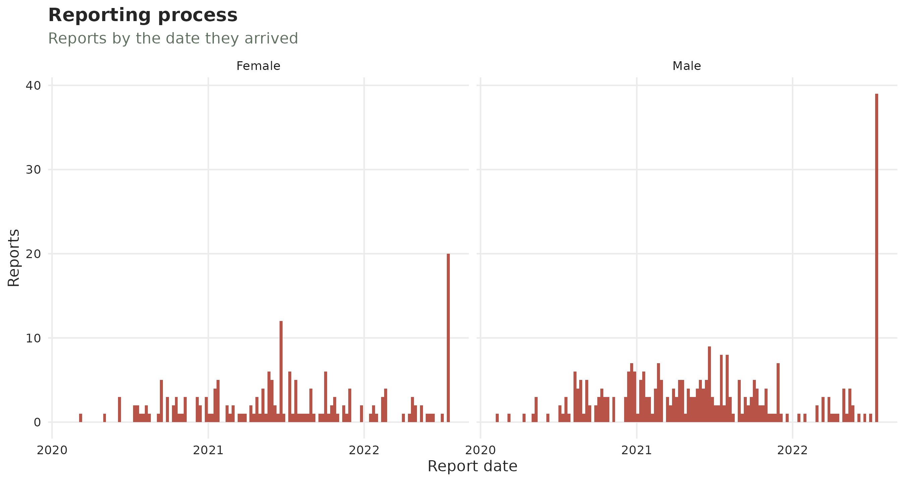

# The nowcasting workflow: hospital-acquired infections in Bucaramanga, Colombia

This article is an end-to-end walk-through of the `tbl.now` workflow on
a real, **deliberately unpolished** dataset. We will:

1.  **Build** a `tbl_now` from a messy surveillance extract and show how
    to
    [`diagnose()`](https://rodrigozepeda.github.io/tbl.now/reference/diagnose.md)
    possible data errors.
2.  **Clean** what it reported: duplicate records, missing dates, etc.
3.  **Look** at the data with
    [`autoplot()`](https://ggplot2.tidyverse.org/reference/autoplot.html),
    and the [`summary()`](https://rdrr.io/r/base/summary.html)
    functions.
4.  **Describe** the behaviour of the reporting delay.
5.  **Attach temporal effects** to a model using the data.
6.  **Nowcast** with two different engines using everything we found.

We’ll start the process by nowcasting with two dates (event and report
dates) and then we’ll focus on nowcasting with three dates (event,
report, and validation dates).

Let’s start by calling the libraries:

``` r

library(dplyr)
library(lubridate)
library(ggplot2)
library(tbl.now)
```

## The data

`hai_bucaramanga` is a raw line list of **healthcare-associated
infections** (IAAS, *Infecciones Asociadas a la Atención en Salud*)
notified in the county of Bucaramanga, Sandander, Colombia, as published
by the county. Each row is one infection: a specimen taken from a
hospitalised patient, the laboratory result, and the microorganism
isolated.

``` r

data(hai_bucaramanga)
```

``` r

hai_bucaramanga
#> # A tibble: 989 × 13
#>       id specimen_date received_date report_date specimen test  microorganism sex    age_group case_type            final_condition icu_type institution
#>    <int> <date>        <date>        <date>      <fct>    <fct> <chr>         <fct>  <ord>     <fct>                <fct>           <fct>          <int>
#>  1    32 NA            NA            NA          NA       NA    NA            Male   <1        Clinically-confirmed Alive           Neonatal           1
#>  2    33 NA            NA            2018-11-04  NA       NA    NA            Female <1        Clinically-confirmed Alive           Neonatal           7
#>  3    37 NA            NA            NA          NA       NA    NA            Male   <1        Clinically-confirmed Alive           Neonatal           1
#>  4    46 NA            NA            NA          NA       NA    NA            Female 30-39     Clinically-confirmed Alive           Adult              5
#>  5    54 NA            NA            NA          NA       NA    NA            Female 20-29     Clinically-confirmed Dead            Adult              5
#>  6    55 NA            NA            NA          NA       NA    NA            Male   70+       Clinically-confirmed Dead            Adult              2
#>  7    66 NA            NA            NA          NA       NA    NA            Female <1        Clinically-confirmed Alive           Neonatal           1
#>  8    76 NA            NA            NA          NA       NA    NA            Male   15-19     Clinically-confirmed Alive           Adult              5
#>  9    77 NA            NA            NA          NA       NA    NA            Female 70+       Clinically-confirmed Alive           Adult              1
#> 10    78 NA            NA            NA          NA       NA    NA            Female 30-39     Clinically-confirmed Alive           Adult              1
#> # ℹ 979 more rows
```

For our example, six columns matter:

- `id` — a unique patient identifier.
- `specimen_date` — the **event date**, when the sample was taken.
- `report_date` — the **report date**, when the laboratory issued the
  result.
- `sex` - the sex of the individual.

For the tutorial, we will do perform a nowcast assuming we are standing
on July 18th 2022. For that purpose we filter our data to what it would
have looked like:

``` r

hai_bucaramanga <- hai_bucaramanga |>
  filter((is.na(specimen_date) | specimen_date <= ymd("2022/07/18")), 
         (is.na(report_date)   | report_date   <= ymd("2022/07/18")))
```

For this tutorial we are keeping those events that have missing dates.
That is what the [`is.na()`](https://rdrr.io/r/base/NA.html) section on
the left side of the filter is doing as we keep either cases by July
18th 2022 or missing.

## 1. Initial data cleaning

In this tutorial we show how to discover several anomalies in the data
as well as several modeling indicators. We suggest, however, that before
transforming the dataset into a `tbl_now` you use traditional data
analysis tools to clean the data first. Here we’ll just select the
columns that matter to us and move onto the `tbl_now` capabilities.
However if you already have a pipeline for cleaning and preparing your
data this is where you would do it as we’ll see the `tbl_now`
diagnostics don’t cover everything.

``` r

#We keep only the columns of interest
hai_bucaramanga <- hai_bucaramanga |> 
  select(id, specimen_date, report_date, sex)
```

## 2. Building the `tbl_now`

We’ll create the
[`tbl_now()`](https://rodrigozepeda.github.io/tbl.now/reference/tbl_now.md)
object. For the beginning of the example, we will declare two dates
(`specimen_date` for the event and `report_date`) for the report. We’ll
further specify that the data is in line-list format (*i.e.* each row is
a case), and stratify by `sex`.

``` r

hai_bucaramanga <- hai_bucaramanga |>
  tbl_now(
    event_date   = specimen_date,
    report_date  = report_date,
    strata       = sex,
    data_type    = "linelist",
    event_units  = "days",
    report_units = "days"
  )
#> Warning: 363 rows have NA values in the report_date column "report_date".
#> ℹ A row with no report date cannot be placed on the reporting triangle.
#> Warning: 314 rows have NA values in the event_date column "specimen_date".
#> ℹ A row with no event date cannot be placed on the reporting triangle.
#> Warning: 48 rows have a `report_date` before `event_date`
#> ℹ A negative reporting delay is not a delay; the two date columns may be swapped, or the rows may be data-entry errors.
#> Warning: 304 rows have NA values in the event and report date columns: "specimen_date" and "report_date".
#> ℹ
```

The
[`tbl.now()`](https://rodrigozepeda.github.io/tbl.now/reference/tbl.now-package.md)
automatically fires several warnings. Let’s take a look!

## 3. What is wrong?

These same warnings can also be accessed with the
[`diagnose()`](https://rodrigozepeda.github.io/tbl.now/reference/diagnose.md)
function which returns the warnings as well as additional notes:

``` r

diagnose(hai_bucaramanga) 
#> ── Diagnosis of a <tbl_now> ────────────────────────────────────────────────────────────────────────────────────────────────────────────────────────────────────
#> 4 warnings, 8 notes, 12 passed, 5 skipped.
#> 
#> Warnings (4)
#> ! missing/report_date: 363 rows have NA values in the report_date column "report_date".
#>   → A row with no report date cannot be placed on the reporting triangle.
#> ! missing/specimen_date: 314 rows have NA values in the event_date column "specimen_date".
#>   → A row with no event date cannot be placed on the reporting triangle.
#> ! ordering/event_to_report: 48 rows have a `report_date` before `event_date`
#>   → A negative reporting delay is not a delay; the two date columns may be swapped, or the rows may be data-entry errors.
#> ! simultaneously missing/event and report dates: 304 rows have NA values in the event and report date columns: "specimen_date" and "report_date".
#>   → 
#> 
#> Notes (8)
#> ℹ declarations/undeclared: 1 column "id" is not declared as strata or covariates.
#>   → Declare it with `strata = ` to model it separately, or let `to_count()` pool it away -- which is what the `tbl_now_to_()` converters do.
#> ℹ now/now_gap_event [Female]: The last event date is 32 days before now ("2022-07-18").
#>   → Everything in that window is still arriving; it is what a nowcast is for, and it is also what makes the last points of any plot look like a decline.
#> ℹ now/now_gap_report [Female]: The last report date is 10 days before now ("2022-07-18").
#> ℹ strata/size [Female]: The smallest stratum is "Female" with 329 cases, 38.6% of the total.
#> ℹ strata/sparsity [Female]: The sparsest stratum is "Female": 768 of the 929 days between the minimum event (NA) and the now (2022-07-18) carry no cases at all (82.7%, against 63% pooled over every stratum).
#>   → A stratum that is mostly zeros is the one a per-stratum fit will struggle with; pooling it is often better than fitting it. When every stratum is mostly zeros the grid is finer than the data -- `aggregate_time_units()` coarsens it.
#> ℹ truncation/event_date [Female]: 10 event dates are younger than the 95th percentile of the delay, so their counts are still filling in; an estimated 10.6% of their eventual total has not arrived.
#>   → This is right-truncation, and it is the reason to nowcast rather than a defect. Cut the series at "2022-03-20" to describe it instead.
#> ℹ truncation/event_date [Male]: 15 event dates are younger than the 95th percentile of the delay, so their counts are still filling in; an estimated 25.5% of their eventual total has not arrived.
#> ℹ truncation/event_date: 24 event dates are younger than the 95th percentile of the delay, so their counts are still filling in; an estimated 20.5% of their eventual total has not arrived.
#> 
#> ✔ 12 passed: declarations/temporal_effects, missing/sex, now/event_date, now/now_gap_event, now/now_gap_report, now/report_date, units/declared, units/delay, units/event_grid, and units/report_grid
#> ─ 5 skipped: duplicates/key, negatives/count, ordering/event_to_validation, ordering/report_to_validation, and strata/pending
#> 
#> ℹ 29 findings. Use `dplyr::filter()` or `tibble::as_tibble()` for the table.
```

Let’s see what they identify.

### The warnings

In general the warnings will look for missing data within the dates and
the strata or for violations of the nowcasting hypotheses (for example
reports that “see the future” and identify an event before it happens!).
In our case, specifically we identify missing dates in both the report
and the event as well as some reports that have incorrect dates.

There is no solution that works in all cases for these problems and
oftentimes the ideal solution is to identify the reason for the
misingness. Here we posit some approaches for the warnings:

1.  **For simultaneosuly missing event and report dates** there is
    nothing one can do. In those cases we don’t know when something
    happened (to add to the epidemic process) or when it was reported
    (to add to the delay process). Hence we remove those rows.

``` r

#Remove those that have both dates missing
hai_bucaramanga <- hai_bucaramanga |> 
  filter(!(is.na(report_date) & is.na(specimen_date)))
```

2.  **For the rows with missing reports, we can censor them above**.
    This will tell the models in
    [diseasenowcasting](https://rodrigozepeda.github.io/diseasenowcasting/)
    that the measurement is not exact; instead, that we know the report
    arrived before a certain date though we don’t know that *exact* date
    in particular. We can do this because if we are seeing the reports
    **today** then we know that at most they took until **today** to
    arrive. This censoring will add a column `.is_censored_report` which
    will indicate that that report is censored.

When calling the function we specify that the ones we are censoring are
the missing values and that the date they should input is “2022/10/18”
which corresponds to the date of the nowcast in this example.

``` r

hai_bucaramanga <- hai_bucaramanga |> 
  censor_reports(is.na(report_date), to_report = as.Date("2022/07/18"))
```

3.  **For the delays before the reports we visualize the data**. Doing a
    quick analysis we see that its a date formatting issue. You can see
    in the first entries that the specimen date is in format
    `year-day-month` (read with
    [`lubridate::ydm()`](https://lubridate.tidyverse.org/reference/ymd.html))
    while the `report_date` and `received_date` is in format
    `year-month-day` (read with
    [`lubridate::ymd()`](https://lubridate.tidyverse.org/reference/ymd.html))
    .

``` r

hai_bucaramanga |> filter(report_date < specimen_date) 
#> # A tibble:  48 × 8
#> # Data type: "linelist"
#> # Frequency: Event: `days` | Report: `days`
#>       id specimen_date report_date   sex      .is_censored_report  .event_num .report_num .delay
#>    <int> <date>        <date>        <fct>    <lgl>                     <dbl>       <dbl>  <dbl>
#>    [...] [event_date]  [report_date] [strata] [is_censored_report]      [...]       [...]  [...]
#>  1   590 2020-11-07    2020-07-21    Female   FALSE                       310         201   -109
#>  2   613 2020-10-08    2020-08-13    Male     FALSE                       280         224    -56
#>  3   622 2020-08-28    2020-01-09    Male     FALSE                       239           7   -232
#>  4   623 2020-08-28    2020-03-09    Female   FALSE                       239          67   -172
#>  5   626 2020-08-30    2020-02-09    Female   FALSE                       241          38   -203
#>  6   627 2020-08-30    2020-02-09    Female   FALSE                       241          38   -203
#>  7   634 2020-09-20    2020-05-09    Male     FALSE                       262         128   -134
#>  8   635 2020-09-20    2020-05-09    Female   FALSE                       262         128   -134
#>  9   656 2020-11-09    2020-09-14    Female   FALSE                       312         256    -56
#> 10   658 2020-10-09    2020-09-14    Female   FALSE                       281         256    -25
#> # ────────────────────────────────────────────────────────────────────────────────────────────────────────────────────────────────────────────────────────────────
#> # Now: 2022-07-18 | Event date: "specimen_date" | Report date: "report_date"
#> # left-censored indicator: ".is_censored_report"
#> # Strata: "sex"
#> # ────────────────────────────────────────────────────────────────────────────────────────────────────────────────────────────────────────────────────────────────
#> # ℹ 38 more rows
```

We can correct the date format to fix this issue:

``` r

hai_bucaramanga <- hai_bucaramanga |> 
  mutate(specimen_date = if_else(specimen_date > report_date, 
                                 ydm(as.character(specimen_date)), 
                                 ymd(as.character(specimen_date))))
```

3.  Currently there is **nothing we can do for the cases were the event
    date is unknown**. Hence we just document them and we’ll remove from
    the dataset given that they represent such a small percent
    (5.6569343%).

``` r

hai_bucaramanga <- hai_bucaramanga |> filter(!is.na(specimen_date))
```

Re-running
[`diagnose()`](https://rodrigozepeda.github.io/tbl.now/reference/diagnose.md)
confirms we solved this issues:

``` r

diagnose(hai_bucaramanga)
#> ── Diagnosis of a <tbl_now> ────────────────────────────────────────────────────────────────────────────────────────────────────────────────────────────────────
#> 7 notes, 20 passed, 5 skipped.
#> 
#> Notes (7)
#> ℹ declarations/undeclared: 1 column "id" is not declared as strata or covariates.
#>   → Declare it with `strata = ` to model it separately, or let `to_count()` pool it away -- which is what the `tbl_now_to_()` converters do.
#> ℹ now/now_gap_event [Female]: The last event date is 32 days before now ("2022-07-18").
#>   → Everything in that window is still arriving; it is what a nowcast is for, and it is also what makes the last points of any plot look like a decline.
#> ℹ strata/size [Female]: The smallest stratum is "Female" with 195 cases, 37.7% of the total.
#> ℹ strata/sparsity [Female]: The sparsest stratum is "Female": 777 of the 929 days between the minimum event (2020-01-02) and the now (2022-07-18) carry no cases at all (83.6%, against 64.5% pooled over every stratum).
#>   → A stratum that is mostly zeros is the one a per-stratum fit will struggle with; pooling it is often better than fitting it. When every stratum is mostly zeros the grid is finer than the data -- `aggregate_time_units()` coarsens it.
#> ℹ truncation/event_date [Female]: 140 event dates are younger than the 95th percentile of the delay, so their counts are still filling in; an estimated 76.8% of their eventual total has not arrived.
#>   → This is right-truncation, and it is the reason to nowcast rather than a defect. Cut the series at "2020-05-01" to describe it instead.
#> ℹ truncation/event_date [Male]: 204 event dates are younger than the 95th percentile of the delay, so their counts are still filling in; an estimated 71.7% of their eventual total has not arrived.
#> ℹ truncation/event_date: 300 event dates are younger than the 95th percentile of the delay, so their counts are still filling in; an estimated 74.7% of their eventual total has not arrived.
#> 
#> ✔ 20 passed: declarations/temporal_effects, missing/.is_censored_report, missing/report_date, missing/sex, missing/specimen_date, now/event_date, now/now_gap_event, now/now_gap_report, now/report_date, ordering/event_to_report, simultaneously missing/event and report dates, units/declared, units/delay, units/event_grid, and units/report_grid
#> ─ 5 skipped: duplicates/key, negatives/count, ordering/event_to_validation, ordering/report_to_validation, and strata/pending
#> 
#> ℹ 32 findings. Use `dplyr::filter()` or `tibble::as_tibble()` for the table.
```

### The notes

The notes convey additinal information that, at a glance, can tell you
whether something needs to be corrected in your data.

It helps you know that you have columns that are not strata or
covariates (in case you forgot to declare them!):

    declarations/undeclared: 3 columns "id", "received_date", and "microorganism" are not declared as strata or covariates.

It quantifies how much time has happened between the last observation
and the now for each strata:

    now/now_gap_event [Female]: The last event date is 32 days before now ("2022-07-18").

It also tells you how what is the smallest stratum (in case you have
strata with so few observations you need to collapse them into another
one):

    strata/size [Female]: The smallest stratum is "Female" with 195 cases, 37.7% of the total.

And how sparse your data is:

    strata/sparsity [Female]: The sparsest stratum is "Female": 777 of the 929 "days" between the minimum event (2020-01-02) and the now (2022-07-18) carry no cases at all (83.6%, against 64.5% pooled over every stratum).

This is particularly useful for triangle-based methods that require to
fill with zeroes the whole reporting triangle.

## 4. More cleaning

Besides the
[`diagnose()`](https://rodrigozepeda.github.io/tbl.now/reference/diagnose.md)
one always has to do some additional cleaning of datasets. One
particular issue is for repeated rows; that is when an individual is
registered twice in the dataset for the same disease at the same exact
times.

Here we can see that the same individuals `id` are sometimes repeated:

``` r

hai_bucaramanga |>
  count(id, report_date, specimen_date) |>
  filter(n > 1) |> 
  as_tibble()
#> Warning: Dropping `tbl_now` attributes and converting to `tibble`
#> Warning: Dropped protected column(?s): ".is_censored_report", ".event_num", ".report_num", and ".delay". Returning a
#> `tibble`
#> # A tibble: 18 × 4
#>       id report_date specimen_date     n
#>    <int> <date>      <date>        <int>
#>  1  1225 2022-05-16  2022-05-13        2
#>  2  1226 2022-05-18  2022-05-18        2
#>  3  1227 2022-05-18  2022-05-17        2
#>  4  1228 2022-05-19  2022-05-17        2
#>  5  1229 2022-05-20  2022-05-17        2
#>  6  1232 2022-05-23  2022-05-23        2
#>  7  1233 2022-05-23  2022-05-23        2
#>  8  1234 2022-05-06  2022-02-06        2
#>  9  1237 2022-06-16  2022-06-16        2
#> 10  1239 2022-07-18  2022-06-13        2
#> 11  1241 2022-06-22  2022-06-22        2
#> 12  1243 2022-05-07  2022-03-07        2
#> 13  1244 2022-04-07  2022-04-07        2
#> 14  1248 2022-07-18  2022-07-18        2
#> 15  1254 2022-07-08  2022-04-08        2
#> 16  1282 2022-05-10  2022-05-10        2
#> 17  1284 2022-04-10  2022-03-10        2
#> 18  1292 2022-06-11  2022-04-11        2
```

We can use
[`dplyr::distinct()`](https://dplyr.tidyverse.org/reference/distinct.html)
to remove them without losing information:

``` r

hai_bucaramanga <- hai_bucaramanga |> distinct()
```

## 5. Temporal effects

Temporal covariates can be added to a `tbl_now` so that we can describe
their effect or use them for nowcasting. They can be specified via the
[`temporal_effects()`](https://rodrigozepeda.github.io/tbl.now/reference/temporal_effects.md)
function. It can add holidays, weekends, day of the week effects and
more. For the purpose of this tutorial we will add the weekends and
check whether there is a weekend effect or not:

``` r

temporal_effects(weekend = TRUE)
#> ── Temporal Effects ────────────────────────────────────────────────────────────────────────────────────────────────────────────────────────────────────────────
#> The following effects are in place:
#> • "weekend"
```

You can add the effects to the
[`tbl_now()`](https://rodrigozepeda.github.io/tbl.now/reference/tbl_now.md)
with the
[`add_temporal_effects()`](https://rodrigozepeda.github.io/tbl.now/reference/add_temporal_effects.md)
function:

``` r

hai_bucaramanga <- hai_bucaramanga |> 
  add_temporal_effects(t_effects = temporal_effects(weekend = TRUE))

hai_bucaramanga
#> # A tibble:  499 × 8
#> # Data type: "linelist"
#> # Frequency: Event: `days` | Report: `days`
#>       id specimen_date report_date   sex      .is_censored_report  .event_num .report_num .delay
#>    <int> <date>        <date>        <fct>    <lgl>                     <dbl>       <dbl>  <dbl>
#>    [...] [event_date]  [report_date] [strata] [is_censored_report]      [...]       [...]  [...]
#>  1   528 2020-10-01    2022-07-18    Male     TRUE                        273         928    655
#>  2   529 2020-10-01    2022-07-18    Male     TRUE                        273         928    655
#>  3   530 2020-01-23    2022-07-18    Female   TRUE                         21         928    907
#>  4   531 2020-07-01    2022-07-18    Male     TRUE                        181         928    747
#>  5   532 2020-07-01    2022-07-18    Male     TRUE                        181         928    747
#>  6   533 2020-05-01    2022-07-18    Female   TRUE                        120         928    808
#>  7   534 2020-01-17    2022-07-18    Male     TRUE                         15         928    913
#>  8   535 2020-01-16    2022-07-18    Male     TRUE                         14         928    914
#>  9   536 2020-01-16    2022-07-18    Female   TRUE                         14         928    914
#> 10   537 2020-01-19    2022-07-18    Male     TRUE                         17         928    911
#> # ────────────────────────────────────────────────────────────────────────────────────────────────────────────────────────────────────────────────────────────────
#> # Now: 2022-07-18 | Event date: "specimen_date" | Report date: "report_date"
#> # left-censored indicator: ".is_censored_report"
#> # Strata: "sex"
#> # T. effects (lazy): [event_date] weekend
#> # ────────────────────────────────────────────────────────────────────────────────────────────────────────────────────────────────────────────────────────────────
#> # ℹ 489 more rows
```

The temporal effect gets added lazily. You can use
[`compute_temporal_effects()`](https://rodrigozepeda.github.io/tbl.now/reference/add_temporal_effects.md)
to show it as a column in case you require it (see them at the end of
the tbl_now).

``` r

hai_bucaramanga |> compute_temporal_effects()
#> # A tibble:  499 × 9
#> # Data type: "linelist"
#> # Frequency: Event: `days` | Report: `days`
#>       id specimen_date report_date   sex      .is_censored_report  .event_num .report_num .delay .event_weekend
#>    <int> <date>        <date>        <fct>    <lgl>                     <dbl>       <dbl>  <dbl>          <int>
#>    [...] [event_date]  [report_date] [strata] [is_censored_report]      [...]       [...]  [...]     [t_effect]
#>  1   528 2020-10-01    2022-07-18    Male     TRUE                        273         928    655              0
#>  2   529 2020-10-01    2022-07-18    Male     TRUE                        273         928    655              0
#>  3   530 2020-01-23    2022-07-18    Female   TRUE                         21         928    907              0
#>  4   531 2020-07-01    2022-07-18    Male     TRUE                        181         928    747              0
#>  5   532 2020-07-01    2022-07-18    Male     TRUE                        181         928    747              0
#>  6   533 2020-05-01    2022-07-18    Female   TRUE                        120         928    808              0
#>  7   534 2020-01-17    2022-07-18    Male     TRUE                         15         928    913              0
#>  8   535 2020-01-16    2022-07-18    Male     TRUE                         14         928    914              0
#>  9   536 2020-01-16    2022-07-18    Female   TRUE                         14         928    914              0
#> 10   537 2020-01-19    2022-07-18    Male     TRUE                         17         928    911              1
#> # ────────────────────────────────────────────────────────────────────────────────────────────────────────────────────────────────────────────────────────────────
#> # Now: 2022-07-18 | Event date: "specimen_date" | Report date: "report_date"
#> # left-censored indicator: ".is_censored_report"
#> # Strata: "sex"
#> # T. effects: [event_date] weekend
#> # T. effect cols: ".event_weekend"
#> # ────────────────────────────────────────────────────────────────────────────────────────────────────────────────────────────────────────────────────────────────
#> # ℹ 489 more rows
```

## 6. Looking at the data

[`autoplot()`](https://ggplot2.tidyverse.org/reference/autoplot.html)
draws a diagnostic grid with the panels in green describing the
**epidemic** process and the red ones, the **reporting** process.

``` r

autoplot(hai_bucaramanga)
```


Four things stand out, and each of them changes a modelling decision
later.

**The epidemic curve is extremely sparse.** There are only a handful of
cases a year with most of the times 0 or 1 cases being reported.

``` r

plot_epidemic_process(hai_bucaramanga)
```



> **Note** This is the same sparcity the `note` in the `diagnostic()`
> function gave us.

**The delay distribution has some extreme delays.** This is the most
consequential feature of the dataset, so it is worth its own plot:

``` r

plot_delay_distribution(hai_bucaramanga)
```


A lot of results are reported way after 500 days!

**There doesn’t seem to be a day-of-the-week effect** In both reports
and events there is no aparent day of the week effect.

``` r

plot_day_of_week_effects(hai_bucaramanga)
```



**One week had a lot of reports** Epiweek 29 is an anomaly in the amount
of reports it seems to have. This would warrant further investigation.

``` r

plot_week_of_year_effects(hai_bucaramanga, type = "report")
```



**There doesn’t seem to be a weekend effect either** In both reports and
events there is no aparent effect of a weekend.

``` r

plot_weekend_effects(hai_bucaramanga)
```



## 7. Summarising the data

The [`summary()`](https://rdrr.io/r/base/summary.html) of a `tbl_now`
quantifies what we see in the plots. You can either call
[`summary()`](https://rdrr.io/r/base/summary.html) all at once:

``` r

summary(hai_bucaramanga) 
```

or as we do here call each of the summaries we are going to discuss (see
[`?nowcast_summary_components`](https://rodrigozepeda.github.io/tbl.now/reference/nowcast_summary_components.md)
for the whole list).

We can start with the delays. Here we can see that up until the 3rd
quartile (`q75`) delays are less than 100 days but then they explode by
the 90th quantile (`q90`):

``` r

delay_summary(hai_bucaramanga)
#> ── Summary of a <tbl_now> ──────────────────────────────────────────────────────────────────────────────────────────────────────────────────────────────────────
#> 3 rows in 1 component; strata: "Female" and "Male".
#> 
#> delay
#>   n = (event, report) cells; total = cases
#>   quantity        stratum     n total  mean    sd   min   q25   q50   q75   q90   max
#>   <chr>           <chr>   <int> <dbl> <dbl> <dbl> <dbl> <dbl> <dbl> <dbl> <dbl> <dbl>
#> 1 event_to_report all       438   499 107.   243.     0     1     3    89   627   928
#> 2 event_to_report Female    170   188  89.3  228.     0     2     3    35   186   914
#> 3 event_to_report Male      268   311 118.   252.     0     0     4    91   634   928
#> 
#> ℹ Use `dplyr::filter()` or `tibble::as_tibble()` for the full schema.
```

The
[`zero_run_summary()`](https://rodrigozepeda.github.io/tbl.now/reference/nowcast_summary_components.md)
quantifies the sparcity by counting how many days with continuous zeroes
happened for either the event or the report dates. That is, it measures
the distribution of days of continuous zeroes. You can see that usually
there are on average 3.06 continuous zeroes before a case. However there
have been runs of 25 continuous days with no cases (continuous zeroes)
until one case:

``` r

zero_run_summary(hai_bucaramanga)
#> ── Summary of a <tbl_now> ──────────────────────────────────────────────────────────────────────────────────────────────────────────────────────────────────────
#> 3 rows in 1 component; strata: "Female" and "Male".
#> 
#> zero_run
#>   n = runs of consecutive zero dates; total = zero dates in those runs
#>   quantity   stratum     n total  mean    sd   min   q25   q50   q75   q90   max
#>   <chr>      <chr>   <int> <dbl> <dbl> <dbl> <dbl> <dbl> <dbl> <dbl> <dbl> <dbl>
#> 1 event_date all       196   599  3.06  3.29     1     1     2     4     6    25
#> 2 event_date Female    123   777  6.32  6.31     1     2     4     8    13    32
#> 3 event_date Male      159   703  4.42  4.87     1     1     3     6     9    29
#> 
#> ℹ Use `dplyr::filter()` or `tibble::as_tibble()` for the full schema.
```

The composition block shows that there are way less females than males.
Which, again was already observed in the notes as the smaller stratum:

``` r

prop_strata(hai_bucaramanga)
#> ── Summary of a <tbl_now> ──────────────────────────────────────────────────────────────────────────────────────────────────────────────────────────────────────
#> 2 rows in 1 component.
#> 
#> composition
#>   n = (event, report) cells in the category; total = cases in the category
#>   quantity            n total  prop
#>   <chr>           <int> <dbl> <dbl>
#> 1 strata = Female   170   188 0.377
#> 2 strata = Male     268   311 0.623
#> 
#> ℹ Use `dplyr::filter()` or `tibble::as_tibble()` for the full schema.
```

Finally the cases per date shows how many cases on average occur per
date-axis. That is on average how many cases there are per event date or
per report date. In this case we can see that at least half of the dates
have zero cases:

``` r

cases_per_date(hai_bucaramanga)
#> ── Summary of a <tbl_now> ──────────────────────────────────────────────────────────────────────────────────────────────────────────────────────────────────────
#> 6 rows in 1 component; strata: "Female" and "Male".
#> 
#> cases
#>   n = dates on the grid; total = cases
#>   quantity                stratum     n total   mean    sd   min   q25   q50   q75   q90   max prop_zero
#>   <chr>                   <chr>   <int> <dbl>  <dbl> <dbl> <dbl> <dbl> <dbl> <dbl> <dbl> <dbl>     <dbl>
#> 1 per_event_date          all       929   499 0.537  0.877     0     0     0     1     2     6     0.645
#> 2 censored_per_event_date all       929    58 0.0624 0.267     0     0     0     0     0     2     0.944
#> 3 per_event_date          Female    929   188 0.202  0.500     0     0     0     0     1     3     0.836
#> 4 censored_per_event_date Female    929    20 0.0215 0.145     0     0     0     0     0     1     0.978
#> 5 per_event_date          Male      929   311 0.335  0.678     0     0     0     0     1     5     0.757
#> 6 censored_per_event_date Male      929    38 0.0409 0.219     0     0     0     0     0     2     0.963
#> 
#> ℹ Use `dplyr::filter()` or `tibble::as_tibble()` for the full schema.
```

## Intermezzo: The first nowcast

Even with all this sparcity here we can nowcast using the
diseasenowcasting package:

``` r

hai_fit <- hai_bucaramanga |> 
  run_nowcast(engine = engine_diseasenowcasting(temporal_effects = "none"))
```

Due to the sparcity, the nowcast predicts almost no cases at any time
with just maybe a second case at the now for males:

``` r

autoplot(hai_fit) 
```

## 8. Changing to weekly data

Though nowcasting is possible with sparse data, oftentimes people prefer
to rescale data to a coarser time frame (and some packages can’t handle
the sparcity either). Here we’ll rescale the dataset to a weekly
reporting time frame with
[`aggregate_time_units()`](https://rodrigozepeda.github.io/tbl.now/reference/aggregate_time_units.md):

``` r

hai_bucaramanga <- hai_bucaramanga |> 
  aggregate_time_units(to = "weeks")
#> ℹ Dropped the temporal effect "weekend" from the specification;
#> a "weeks" grid cannot express it.
#> ℹ Aggregated the "event" and "report" axes to "weeks"
#> (499 rows -> 499).
```

This aggregation of the epidemic process allows the nowcasting models to
infer more from it as you can see a clearer epidemic-process shape:

``` r

autoplot(hai_bucaramanga)
```


One should run again the
[`summary()`](https://rdrr.io/r/base/summary.html) and
[`diagnose()`](https://rodrigozepeda.github.io/tbl.now/reference/diagnose.md)
in the aggregated to draw conclusions from this data. For us, however it
will suffice to see that the sparcity has reduced to usually just 1 week
with zero cases before having cases again:

``` r

zero_run_summary(hai_bucaramanga)
#> ── Summary of a <tbl_now> ──────────────────────────────────────────────────────────────────────────────────────────────────────────────────────────────────────
#> 3 rows in 1 component; strata: "Female" and "Male".
#> 
#> zero_run
#>   n = runs of consecutive zero dates; total = zero dates in those runs
#>   quantity   stratum     n total  mean    sd   min   q25   q50   q75   q90   max
#>   <chr>      <chr>   <int> <dbl> <dbl> <dbl> <dbl> <dbl> <dbl> <dbl> <dbl> <dbl>
#> 1 event_date all         9    12  1.33 0.707     1     1     1     1     3     3
#> 2 event_date Female     28    45  1.61 0.956     1     1     1     2     3     5
#> 3 event_date Male       17    27  1.59 0.795     1     1     1     2     3     3
#> 
#> ℹ Use `dplyr::filter()` or `tibble::as_tibble()` for the full schema.
```

Let’s move on with the tutorial.

## 9. Is the reporting delay stable?

A nowcast might assume that the delay distribution is the same
throughout. Here we check those assumptions:

First, we just look at the delay aggregated through time

``` r

plot_delay_drift(hai_bucaramanga)
```


The median moves from an extremely wide distribution in 2020 to a
shorter delay after 2021. We can confirm that split of two delay
behaviours with the following tests:

### Testing for the delay’s drift

The
[`diagnose_drift()`](https://rodrigozepeda.github.io/tbl.now/reference/diagnose_drift.md)
function runs an autocorrelation-robust Mann-Kendall test for a
*monotonic* trend in the delay:

``` r

diagnose_drift(hai_bucaramanga)
#> # A tibble: 2 × 9
#>   strata stat       n     tau sens_slope statistic p_value method    drift
#>   <chr>  <chr>  <int>   <dbl>      <dbl>     <dbl>   <dbl> <chr>     <lgl>
#> 1 all    median    17 -0.272          -1    -3.05  0.00225 hamed-rao TRUE 
#> 2 all    spread    17 -0.0735          0    -0.503 0.615   hamed-rao FALSE
```

Here the median shows a reduction (`sens_slope` of -1) which is
consistent with the plot. The `-1` can be interpreted as the decrease in
the median per unit of time. In this case, the median delay reduced 1
week per week.

### Is there an abrupt shift?

A trend test cannot see a steep change like a jump. The
[`diagnose_changepoint()`](https://rodrigozepeda.github.io/tbl.now/reference/diagnose_changepoint.md)
function uses Pettitt’s test to look for exactly that.

``` r

diagnose_changepoint(hai_bucaramanga)
#> # A tibble: 2 × 10
#>   strata stat       n changepoint statistic p_value before after shift changepoint_detected
#>   <chr>  <chr>  <int> <date>          <dbl>   <dbl>  <dbl> <dbl> <dbl> <lgl>               
#> 1 all    median    17 2020-02-23         30   0.708   89.6 78.8  -10.8 FALSE               
#> 2 all    spread    17 2020-03-01         14   1       34.4  1.29 -33.1 FALSE
```

Here neither the median nor the spread have a changepoint. The change
was a drift in the trend as we saw in the plot and not an abrupt shift.
You can see the section on [delay
changes](https://rodrigozepeda.github.io/tbl.now/articles/diagnosing-a-tbl-now.html#part-3-what-needs-a-statistical-test-reporting-artefacts)
of the [Diagnosing a
tbl_now](https://rodrigozepeda.github.io/tbl.now/articles/diagnosing-a-tbl-now.html)
article for more information.

## 10. Are there any reporting batches?

A reporting batch consists on several reports that were all held for any
reason by the reporter (e.g. a laboratory) and then reported all
together as a group so that there is a giant signal in the reporting
process. To see them we can start by plotting against the reporting
axis:

``` r

plot_reporting_process(hai_bucaramanga)
```



We can see that there were several reports that dropped near the end of
2022. The reporting hexamap allows us to visualize the date of the
report at the same time as the day of the event and the corresponding
delay

``` r

plot_reporting_hexamap(hai_bucaramanga)
```


The batch at `2022-07-17` was actually introduced by us by censoring all
the cases at that date in section 3.

Here lies a figure with 3 axis. We can see for example our censoring at
`2022-07-17` as the collection of points in the same axis. Values shared
by the same report axis with a high delay might be batches (*i.e.*
several reported at once with some far from the event-date axis). You
can see for example a point with delay around 32 weeks just before a
report date of October 31st that corresponds to an event somewhere
between November 2020 and Match 2021. This has a high delay and several
more points were reported at that report date. We’ll come back to that.

You can also use

``` r

plot_reporting_triangle(hai_bucaramanga)
```

to visualize the batches; however for this specific case they are easier
to visualize in the hexamap.

In this package, the
[`diagnose_batches()`](https://rodrigozepeda.github.io/tbl.now/reference/diagnose_batches.md)
function helps identify potential dates with batches. We recommend using
it with or without the strata depending on whether the context warrants
the possibility that batching could differ by strata (e.g. if strata
correspond to healthcare facilities maybe yes; if they correspond to
gender of the patient maybe no).

Here we run it without the strata which we remove first. We’ll keep only
those observations that have been identified as potential batches:

``` r

hai_bucaramanga |> 
  remove_all_strata() |> 
  diagnose_batches(drop_censored = TRUE) 
#> Warning: ! `diagnose_batches()` is experimental: results are not guaranteed and the interface may change.
#> ℹ Treat a flagged report date as a potential batch, not a confirmed one.
#> This warning is displayed once every 8 hours.
#> ℹ Ignoring 58 rows flagged by .is_censored_report: a censored date is a bound, not an arrival.
#> ── Batch screen ────────────────────────────────────────────────────────────────────────────────────────────────────────────────────────────────────────────────
#> 128 (report date, stratum) pairs; look-back 7; null "poisson"
#> ⚠ 2 batches flagged at alpha = 0.05 (BH-adjusted):
#> • 2021-06-20 [all] -- reported 21, baseline 4.5, deficit -16.5, delta 33
#> • 2021-10-03 [all] -- reported 11, baseline 4, deficit 10.2, delta -3.2
```

This identifies some dates that might be batches due to their high
reported numbers. A second batch method is the
[`diagnose_batches2()`](https://rodrigozepeda.github.io/tbl.now/reference/diagnose_batches2.md)
function. This one takes a specific date and checks whether the reports
that arrived on a date came from systematically older dates. We can
combine the findings from the previous run to test some of them and add
evidence to which are batches:

``` r

hai_bucaramanga |> 
  remove_all_strata() |> 
  diagnose_batches2(at = ymd("2021-11-28"))
#> Warning: ! `diagnose_batches2()` is experimental: results are not guaranteed and the interface may change.
#> ℹ Treat a flagged report date as a potential batch, not a confirmed one.
#> This warning is displayed once every 8 hours.
#> ℹ Ignoring 58 rows flagged by .is_censored_report: a censored date is a bound, not an arrival.
#> # A tibble: 1 × 7
#>   stratum  n_at n_reference mean_delay_at mean_delay_reference statistic p_value
#>   <chr>   <int>       <int>         <dbl>                <dbl>     <dbl>   <dbl>
#> 1 all        11          14          11.4                 2.93      2.68   0.006
```

Where we further identify the date of `2021-11-28` as a potential batch
with its `p_value < 0.003`.

Given that the

## 11. Nowcasting

Everything from sections 1 to 10 was about deciding *what* to fit. Three
of those findings change the call we are about to make:

- The object is **weekly** now (section 8), so `now` is the week of
  2022-07-17 and every delay corresponds to weeks.
- The reporting delay **drifts down** across the series. So we’ll
  utilize the data starting on 2021 where the delay has settled.

``` r

hai_bucaramanga <- hai_bucaramanga |> 
  filter(year(specimen_date) > 2020)
```

The
[`run_nowcast()`](https://rodrigozepeda.github.io/tbl.now/reference/run_nowcast.md)
function takes the `tbl_now` and an **engine**. An engine contains a
modelling package’s nowcasting function plus every argument that it
needs:

``` r

hai_fit_weekly <- hai_bucaramanga |>
  run_nowcast(engine = engine_diseasenowcasting())
```

The
[`autoplot()`](https://ggplot2.tidyverse.org/reference/autoplot.html)
shows the nowcast with gray columns representing what had been reported
by `now`, and the green fan the nowcast’s prediction intervals.

``` r

autoplot(hai_fit_weekly)
```

Calling
[`tidy()`](https://rodrigozepeda.github.io/tbl.now/reference/tidy.nowcast.md)
gives the nowcast as a table:

``` r

tidy(hai_fit_weekly)
```

## 12. Evaluate your nowcast

One way to evaluate the nowcast is to go back in time and see, what
would the nowcast have produced with the information available at a
previous date contrasting it with the information known by now. You can
use
[`nowcast_backtest()`](https://rodrigozepeda.github.io/tbl.now/reference/nowcast_backtest.md)
for that purpose: for every past date it truncates the data to the
reports that were available *then*, refits the nowcast, and scores the
result against what was eventually observed.

To best evaluate the nowcast we need something to compare against. Hence
we will fit a second model: `baselinenowcast`.

One can fit it with the same call just a different engine

``` r

hai_fit_baseline <- hai_bucaramanga |>
  run_nowcast(engine = engine_baselinenowcast())
```

Any backtest uses the **same engines** refitting every engine once per
past date. Here we show the backtest with just 3 past dates. On a real
scenario we recommend using as many as possible to draw any conclusions:

``` r

hai_backtest <- hai_bucaramanga |> 
  nowcast_backtest(
    engine_diseasenowcasting(),
    engine_baselinenowcast(),
    now_dates = c(ymd("2022-04-24"), ymd("2022-05-22"), ymd("2022-06-19")),
    seed      = 20260904
  )
```

Printing the object shows the results from the backtest which includes
the individual results for the weighted interval score (`wis`), the
median absolute error (`ae_median`), and the coverage of the 50 and 90%
intervals (`coverage_*`):

``` r

hai_backtest
```

In this scenario, `diseasenowcasting` scores better on both accuracy
measures and **both** methods cover far more than the nominal 90. We
caution however that we cannot conclude anything from just 3 data points
and in a real scenario one should use more.

Date-level indicators for the `wis`, `ae_median` and coverage can be
obtained with tidy:

``` r

tidy(hai_backtest)
```

``` r

tidy(hai_backtest) |> arrange(event_date) |> tail()
```

## 13. Ensemble nowcast

An ensemble is a weighted average between models. It leverages the fact
that no model is perfect hence combining the predictions of each might
lead to a more robust nowcast. You can think of an ensemble as an
average of the models.

To create an ensemble model one needs to pass the model specifications
(with a name) as well as the backtest:

``` r

hai_ensemble <- nowcast_ensemble(
  hai_fit_weekly,
  hai_fit_baseline,
  weights  = "inverse_score",
  backtest = hai_backtest
)
```

The same
[`tidy()`](https://rodrigozepeda.github.io/tbl.now/reference/tidy.nowcast.md)
and
[`autoplot()`](https://ggplot2.tidyverse.org/reference/autoplot.html)
functions can be used here:

``` r

autoplot(hai_ensemble)
```

One can fit ensembles with more than two models and different model
specifications. Check out the article on [ensemble
nowcasting](https://rodrigozepeda.github.io/tbl.now/articles/ensemble-nowcasting.html)
for more information.

## Summary

In this example we showed: 1. How to create a
[`tbl_now()`](https://rodrigozepeda.github.io/tbl.now/reference/tbl_now.md)
object. 2. How to
[`diagnose()`](https://rodrigozepeda.github.io/tbl.now/reference/diagnose.md)
and summarise with [`summary()`](https://rdrr.io/r/base/summary.html) as
well as visualize with
[`autoplot()`](https://ggplot2.tidyverse.org/reference/autoplot.html) a
[`tbl_now()`](https://rodrigozepeda.github.io/tbl.now/reference/tbl_now.md).
3. How to add
[`temporal_effects()`](https://rodrigozepeda.github.io/tbl.now/reference/temporal_effects.md)
to the object which can be displayed in the plots. 4. How to aggregate
the time units with
[`aggregate_time_units()`](https://rodrigozepeda.github.io/tbl.now/reference/aggregate_time_units.md)
to pass from days to weeks.  
5. How to identify drifts and batches with
[`plot_delay_drift()`](https://rodrigozepeda.github.io/tbl.now/reference/plot_delay_drift.md),
[`diagnose_drift()`](https://rodrigozepeda.github.io/tbl.now/reference/diagnose_drift.md)
and
[`diagnose_changepoint()`](https://rodrigozepeda.github.io/tbl.now/reference/diagnose_changepoint.md).
6. How to identify potential batches with
[`plot_reporting_hexamap()`](https://rodrigozepeda.github.io/tbl.now/reference/plot_reporting_hexamap.md)
in conjunction with
[`diagnose_batches()`](https://rodrigozepeda.github.io/tbl.now/reference/diagnose_batches.md)
(and
[`diagnose_batches2()`](https://rodrigozepeda.github.io/tbl.now/reference/diagnose_batches2.md)).
7. How to perform a nowcast by setting an
[`engine()`](https://rodrigozepeda.github.io/tbl.now/reference/engine.md)
and running with
[`run_nowcast()`](https://rodrigozepeda.github.io/tbl.now/reference/run_nowcast.md).
8. How to clean with
[`tidy()`](https://rodrigozepeda.github.io/tbl.now/reference/tidy.nowcast.md)
and
[`autoplot()`](https://ggplot2.tidyverse.org/reference/autoplot.html) a
nowcast. 9. How to backtest a nowcast with
[`nowcast_backtest()`](https://rodrigozepeda.github.io/tbl.now/reference/nowcast_backtest.md)
and create an ensemble with
[`nowcast_ensemble()`](https://rodrigozepeda.github.io/tbl.now/reference/nowcast_ensemble.md).

If you have any questions regarding this article or comments please
[open an issue](https://github.com/RodrigoZepeda/tbl.now/issues/new)

## Learning more

- Introduction vignette:
  <https://rodrigozepeda.github.io/tbl.now/articles/tbl.now.html> for
  the full anatomy of a `tbl_now`, data types, and temporal effects.
- End-to-end tutorial on real, messy surveillance data — cleaning,
  diagnostics and nowcasting:
  <https://rodrigozepeda.github.io/tbl.now/articles/example.html>
- Tutorial on diagnosing your dataset — what is in it, what is
  structurally wrong with it, and detecting batches and other
  reporting-delay artifacts:
  <https://rodrigozepeda.github.io/tbl.now/articles/diagnosing-a-tbl-now.html>
- Using different nowcasting engines for the same dataset:
  <https://rodrigozepeda.github.io/tbl.now/articles/nowcasting-models.html>
- Ensemble nowcasting across different engines
  <https://rodrigozepeda.github.io/tbl.now/articles/ensemble-nowcasting.html>
- Adding your own nowcasting model
  <https://rodrigozepeda.github.io/tbl.now/articles/custom-nowcast-models.html>
- Package reference:
  <https://rodrigozepeda.github.io/tbl.now/reference/>
