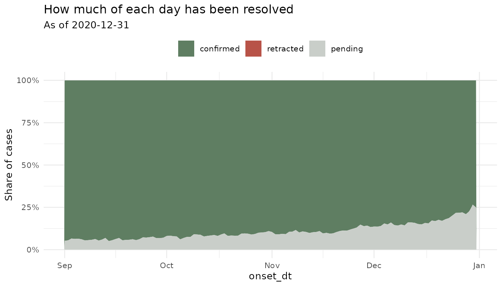
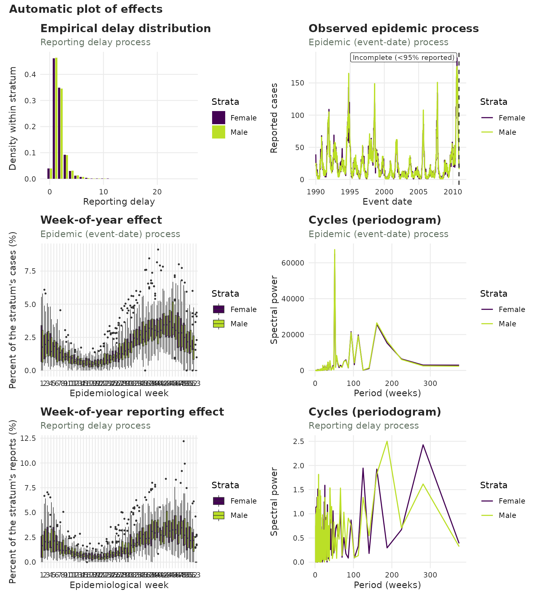
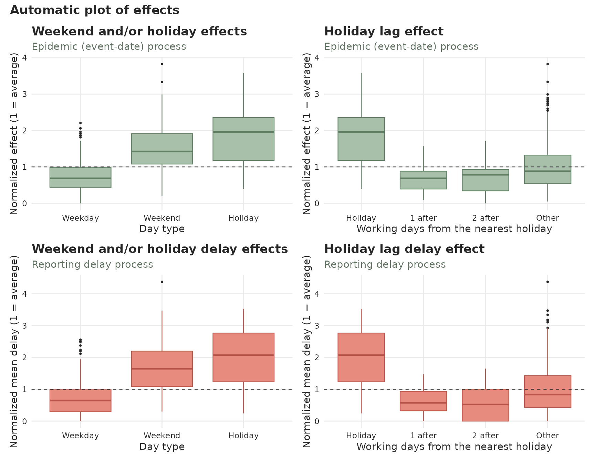

# tbl.now

## Introduction

The [tidyverse](https://tidyverse.org/) ecosystem ([Wickham et al.
2019](#ref-tidyverse)) provides a widely adopted framework for data
analysis. Within this paradigm, data is structured such that rows
represent individual observations and columns represent variables. This
approach is commonly referred to as [tidy
data](https://tidyr.tidyverse.org/articles/tidy-data.html) ([Wickham
2014](#ref-wickham2014tidy)).

Several tidyverse extensions exist for working with time series
including [tsibble](https://tsibble.tidyverts.org/),
[tibbletime](https://business-science.github.io/tibbletime/), and
[timetk](https://business-science.github.io/timetk/) ([Wang et al.
2020](#ref-wang2020new); [Wang 2019](#ref-wang2019tidy); [Dancho and
Vaughan 2023](#ref-timetk)). These packages provide time-aware tibbles
and tools that integrate smoothly with the tidyverse. However,
epidemiological nowcasting requires two time indices simultaneously: an
**event time** and a **reporting time**. Classical time-series
abstractions assume only a single index and therefore do not fully
support this structure.

The `tbl.now` class and package addresses this gap. The `tbl.now`
extends a regular [tibble()](https://tibble.tidyverse.org/) to
explicitly encode epidemiological event and report dates, allowing
consistent data transformation, delay computation, and integration with
the
[diseasenowcasting](https://rodrigozepeda.github.io/diseasenowcasting/)
modeling workflow.

More concretely, `tbl.now` was designed to:

- Standardize the data inputs required by
  [diseasenowcasting](https://rodrigozepeda.github.io/diseasenowcasting/)
  models.

- Preserve [tidyverse](https://tidyverse.org/) compatibility so users
  can continue to apply familiar [dplyr](https://dplyr.tidyverse.org/)
  operations.

- [Diagnose reporting
  artefacts](https://rodrigozepeda.github.io/tbl.now/articles/diagnosing-a-tbl-now.html)
  directly from the data (such as reporting-delay drift and change
  points) as well as batch (backlog) reporting.

- Facilitate integration into iterative modeling workflows with
  [different nowcasting
  packages](https://rodrigozepeda.github.io/tbl.now/articles/nowcasting-models.html)
  ([Gelman et al. 2020](#ref-gelman2020bayesian); [Wickham et al.
  2023](#ref-wickham2023r)):

&nbsp;

    Data Cleaning -> Modeling -> New Data Cleaning -> New Modeling -> ...

We’ll begin by loading the required packages:

``` r

library(dplyr, quietly = TRUE)
library(lubridate)
library(tbl.now)
```

## How `tbl.now` works

In an epidemiological nowcast, we typically observe at least two key
dates[^1]:

- `event_date`: when the underlying event occurred (e.g., symptom onset,
  exposure, sample collection).

- `report_date`: when the event was recorded in the data system (e.g.,
  lab result processed, clinical visit documented).

The nowcasting task is:

> To estimate, for each past `event_date`, how many events (e.g. cases)
> have already occurred but have not yet been reported as of **now**.
> That is, the nowcast will predict how many observations will
> eventually be observed for each (past or present) `event_date`.

Visually:


> In the figure above, the green bars represent the number of cases
> (events) that have been observed until **now**; the pale red segments
> are the reports still in transit. Because completeness decays sharply
> over the most recent event dates, the observed counts bend *downwards*
> near the right edge even though the epidemic is still growing. The
> **nowcast** is the red line: an estimate of the height each bar will
> eventually reach.

A `tbl.now` object is a specialized
[tibble()](https://tibble.tidyverse.org/) that:

- Identifies the `event_date` and `report_date` columns.

- Stores these as
  [`attributes()`](https://rdrr.io/r/base/attributes.html) to enable
  consistent processing.

- Automatically computes auxiliary fields such as delay, numerical
  indices, and frequency units.

- Ensures the dataset is correctly formatted for
  [diseasenowcasting](https://rodrigozepeda.github.io/diseasenowcasting/)
  models.

## Example: A simple `tbl.now`

Consider the following dataset:

| symptom_onset | medical_visit |   n |
|---------------|---------------|----:|
| 2023-12-25    | 2023-12-26    |  10 |
| 2023-12-26    | 2023-12-26    |   2 |
| 2023-12-25    | 2023-12-27    |   5 |
| 2023-12-26    | 2023-12-27    |  11 |

Where:

- `symptom_onset` is the `event_date`.

- `medical_visit` is the `report_date`.

- `n` is the number of reported cases for each event–report combination.

We can convert this into a
[tbl_now()](https://rodrigozepeda.github.io/tbl.now/reference/tbl_now.html)
by first creating a `data.frame` and then using the
[`tbl_now()`](https://rodrigozepeda.github.io/tbl.now/reference/tbl_now.md)
function:

``` r

#Create a data.frame
df <- data.frame(
  symptom_onset = c(ymd("2023/12/25"), ymd("2023/12/26"), 
                    ymd("2023/12/25"), ymd("2023/12/26")),
  medical_visit = c(ymd("2023/12/26"), ymd("2023/12/26"), 
                    ymd("2023/12/27"), ymd("2023/12/27")),
  n = c(10, 2, 5, 11)
)

#Convert to tbl.now
df |>
  tbl_now(event_date = symptom_onset, report_date = medical_visit, case_count = n)
#> ℹ Identified data as <count-incidence> with counts in column "n".
#> # A tibble:  4 × 6
#> # Data type: "count-incidence"
#> # Frequency: Event: `days` | Report: `days`
#>   symptom_onset medical_visit       n .event_num .report_num .delay
#>   <date>        <date>          <dbl>      <dbl>       <dbl>  <dbl>
#>   [event_date]  [report_date] [cases]      [...]       [...]  [...]
#> 1 2023-12-25    2023-12-26         10          0           1      1
#> 2 2023-12-26    2023-12-26          2          1           1      0
#> 3 2023-12-25    2023-12-27          5          0           2      2
#> 4 2023-12-26    2023-12-27         11          1           2      1
#> # ────────────────────────────────────────────────────────────────────────────────
#> # Now: 2023-12-27 | Event date: "symptom_onset" | Report date: "medical_visit"
#> # ────────────────────────────────────────────────────────────────────────────────
```

This performs several operations automatically:

- Detects the **data type** (`count-incidence` in this example). See
  [below](#data-types) for all the data types available.

- Infers the **frequency units** of event and report dates (daily).

- Tags the correct columns as `event_date`, `report_date`, and
  `case_count.`

- Computes `.event_num`, `.report_num`, and `.delay` columns the
  numerical versions (indexed at 0) of event, report and
  `.delay = report_date - event_date` columns.

- Identifies the appropriate **now** date (the most recent report date).

The remaining sections describe these features and the broader `tbl.now`
toolkit.

## Attributes of a [tbl_now()](https://rodrigozepeda.github.io/tbl.now/reference/tbl_now.html)

A
[tbl_now()](https://rodrigozepeda.github.io/tbl.now/reference/tbl_now.html)
stores information about its structure using object attributes, ensuring
consistent behavior across `dplyr` transformations. The primary
attributes are:

- **now**: the “current” reporting date used for nowcasting, typically
  the most recent `report_date`.

- **event_date**: the column name storing event dates.

- **report_date**: the column name storing report dates.

- **event_units**: the temporal units for event dates (e.g., “days”,
  “weeks”, “numeric”).

- **report_units**: the temporal units for report dates.

- **data_type**: one of the following (see [the data types
  section](#data-types)):

  - `"linelist"`: each row is an individual observation
  - `"count-incidence"`: each row contains counts. Those counts
    represent the exact number of events observed for each event-report
    date combination.
  - `"count-cumulative"`: each row contains cumulative counts. Those
    counts represent the cumulative number of events observed by each
    report date for that event. Later report dates accumulate the
    earlier ones into the count.

- **strata** (optional)[^2]: variables for which the nowcast should be
  computed separately (e.g., age group, sex).

- **covariates** (optional): predictor variables that may improve the
  nowcast (e.g., weather covariates).

- **is_censored_report** (optional): identifies cases where the report
  date represents not the exact date it was reported but an upper limit
  to that exact date (i.e. left-censored). As an example, one can
  consider a system error and reports from a lab are not registered
  until a week after.

- **is_censored_validation** (optional): the same flag on the validation
  axis. It marks rows whose *validation* delay – the time from report to
  resolution – is a bound rather than a measurement. See the [validation
  process](#the-validation-process) section.

- **validation_levels** (optional): a named dictionary translating the
  labels in `validation_type` into the four values that column may hold.
  Surveillance data is not always recorded in English, and this is how
  `c(confirmado = "confirmed")` becomes `"confirmed"` once rather than
  in every script that touches the data.

- **case_count** (optional): the column storing case counts when the
  dataset is aggregated.

- **temporal_effects** (optional): a lazy specification for temporal
  effects such as day of the week, holiday, week of the year and other
  temporal effects. See the [temporal effects](#temporal-effects)
  section for more details.

You can access any attribute using the corresponding
[getter](https://rodrigozepeda.github.io/tbl.now/reference/nowcast_data_getters.html),
e.g. [get_event_date()](https://rodrigozepeda.github.io/tbl.now/reference/nowcast_data_getters.html)
or
[get_strata()](https://rodrigozepeda.github.io/tbl.now/reference/nowcast_data_getters.html).

Below we provide more information on some of the attributes.

### Data types

A
[tbl_now()](https://rodrigozepeda.github.io/tbl.now/reference/tbl_now.html)
can represent one of three data structures:

1.  **Linelist**: Each row corresponds to a single reported observation.

| patient | event_date | report_date |
|--------:|:-----------|:------------|
|       1 | 2020-09-12 | 2020-09-12  |
|       2 | 2020-09-12 | 2020-09-12  |
|       3 | 2020-09-12 | 2020-09-13  |
|       4 | 2020-09-13 | 2020-09-13  |
|       5 | 2020-09-13 | 2020-09-13  |
|       6 | 2020-09-13 | 2020-09-13  |

Linelist data {.table}

2.  **Count-incidence**: Each row summarizes how many events with a
    given `event_date` were reported **exactly** on that `report_date.`

|   n | event_date | report_date |
|----:|:-----------|:------------|
|   7 | 2020-09-12 | 2020-09-12  |
|   1 | 2020-09-12 | 2020-09-13  |
|   9 | 2020-09-12 | 2020-09-14  |
|   5 | 2020-09-13 | 2020-09-13  |
|   0 | 2020-09-13 | 2020-09-14  |
|   2 | 2020-09-13 | 2020-09-15  |

Count-incidence data {.table}

3.  **Count-cumulative** Each row summarizes how many events with a
    given `event_date` had been reported up to and including that
    `report_date`. The distinction is crucial for nowcasting models that
    operate either on daily increments or cumulative totals.

|   n | event_date | report_date |
|----:|:-----------|:------------|
|   1 | 2020-09-12 | 2020-09-12  |
|   5 | 2020-09-12 | 2020-09-13  |
|   8 | 2020-09-12 | 2020-09-14  |
|   2 | 2020-09-13 | 2020-09-13  |
|   2 | 2020-09-13 | 2020-09-14  |
|   4 | 2020-09-13 | 2020-09-15  |

Count-cumulative data {.table}

The
[`to_count()`](https://rodrigozepeda.github.io/tbl.now/reference/to_count.md)
function allows you to convert between different data-types as we see
below:

### Converting Between Data Types

The
[to_count()](https://rodrigozepeda.github.io/tbl.now/reference/to_count.html)
function supports structured transformations. Here we start with
linelist data as an example:

``` r

#The original data.frame has one row per patient
df_linelist <- data.frame(
  patient     = 1:6,
  event_date  = c(rep(ymd("2020/09/12"), 3), rep(ymd("2020/09/13"), 3)),
  report_date = c(rep(ymd("2020/09/12"), 2), rep(ymd("2020/09/13"), 4))
)

#We can convert it to a tbl.now
df_linelist <- df_linelist |> 
  tbl_now(event_date = event_date, report_date = report_date, 
          data_type = "linelist")

#This is what it looks like
df_linelist
#> # A tibble:  6 × 6
#> # Data type: "linelist"
#> # Frequency: Event: `days` | Report: `days`
#>   patient event_date   report_date   .event_num .report_num .delay
#>     <int> <date>       <date>             <dbl>       <dbl>  <dbl>
#>     [...] [event_date] [report_date]      [...]       [...]  [...]
#> 1       1 2020-09-12   2020-09-12             0           0      0
#> 2       2 2020-09-12   2020-09-12             0           0      0
#> 3       3 2020-09-12   2020-09-13             0           1      1
#> 4       4 2020-09-13   2020-09-13             1           1      0
#> 5       5 2020-09-13   2020-09-13             1           1      0
#> 6       6 2020-09-13   2020-09-13             1           1      0
#> # ────────────────────────────────────────────────────────────────────────────────
#> # Now: 2020-09-13 | Event date: "event_date" | Report date: "report_date"
#> # ────────────────────────────────────────────────────────────────────────────────
```

- **Linelist → Count-Incidence**: Aggregates by event–report date,
  counting only cases reported on that date.

``` r

df_linelist |>
  to_count(to = "count-incidence")
#> # A tibble:  3 × 6
#> # Data type: "count-incidence"
#> # Frequency: Event: `days` | Report: `days`
#>   event_date   report_date   .event_num .report_num       n .delay
#>   <date>       <date>             <dbl>       <dbl>   <int>  <dbl>
#>   [event_date] [report_date]      [...]       [...] [cases]  [...]
#> 1 2020-09-12   2020-09-12             0           0       2      0
#> 2 2020-09-12   2020-09-13             0           1       1      1
#> 3 2020-09-13   2020-09-13             1           1       3      0
#> # ────────────────────────────────────────────────────────────────────────────────
#> # Now: 2020-09-13 | Event date: "event_date" | Report date: "report_date"
#> # ────────────────────────────────────────────────────────────────────────────────
```

- **Linelist → Count-Cumulative**: Aggregates by event–report date,
  producing cumulative counts up to each report date.

``` r

df_linelist |>
  to_count(to = "count-cumulative")
#> # A tibble:  3 × 6
#> # Data type: "count-cumulative"
#> # Frequency: Event: `days` | Report: `days`
#>   event_date   report_date   .event_num .report_num       n .delay
#>   <date>       <date>             <dbl>       <dbl>   <int>  <dbl>
#>   [event_date] [report_date]      [...]       [...] [cases]  [...]
#> 1 2020-09-12   2020-09-12             0           0       2      0
#> 2 2020-09-12   2020-09-13             0           1       3      1
#> 3 2020-09-13   2020-09-13             1           1       3      0
#> # ────────────────────────────────────────────────────────────────────────────────
#> # Now: 2020-09-13 | Event date: "event_date" | Report date: "report_date"
#> # ────────────────────────────────────────────────────────────────────────────────
```

> **Note** In the previous example the `n` counts `3` as it is
> aggregating the `1` observed at `report_date = 2020-09-13` and the `2`
> observed at `report_date = 2020-09-12`. This is the difference between
> the **count-incidence** that specifies the ones observed **exactly**
> on that date and the **count-cumulative** that specifies the ones
> observed up **until and including** that date.

- **Count-Incidence → Count-Cumulative**: Computes cumulative sums for
  each event date across report dates.

``` r

df_count_inc <- df_linelist |>
  to_count(to = "count-incidence")

#This is count incidence:
df_count_inc
#> # A tibble:  3 × 6
#> # Data type: "count-incidence"
#> # Frequency: Event: `days` | Report: `days`
#>   event_date   report_date   .event_num .report_num       n .delay
#>   <date>       <date>             <dbl>       <dbl>   <int>  <dbl>
#>   [event_date] [report_date]      [...]       [...] [cases]  [...]
#> 1 2020-09-12   2020-09-12             0           0       2      0
#> 2 2020-09-12   2020-09-13             0           1       1      1
#> 3 2020-09-13   2020-09-13             1           1       3      0
#> # ────────────────────────────────────────────────────────────────────────────────
#> # Now: 2020-09-13 | Event date: "event_date" | Report date: "report_date"
#> # ────────────────────────────────────────────────────────────────────────────────

#Turns to count cumulative:
df_count_inc |>
  to_count(to = "count-cumulative")
#> # A tibble:  3 × 6
#> # Data type: "count-cumulative"
#> # Frequency: Event: `days` | Report: `days`
#>   event_date   report_date   .event_num .report_num       n .delay
#>   <date>       <date>             <dbl>       <dbl>   <int>  <dbl>
#>   [event_date] [report_date]      [...]       [...] [cases]  [...]
#> 1 2020-09-12   2020-09-12             0           0       2      0
#> 2 2020-09-12   2020-09-13             0           1       3      1
#> 3 2020-09-13   2020-09-13             1           1       3      0
#> # ────────────────────────────────────────────────────────────────────────────────
#> # Now: 2020-09-13 | Event date: "event_date" | Report date: "report_date"
#> # ────────────────────────────────────────────────────────────────────────────────
```

- **Aggregation within the same type**: The
  [to_count()](https://rodrigozepeda.github.io/tbl.now/reference/to_count.html)
  may also be used to re-aggregate datasets that contain duplicate
  event–report pairs. This is useful when raw surveillance feeds contain
  repeated entries such as in this case:

``` r

tbl_example <- data.frame(
  n = c(8, 11, 0, 1, 1, 5, 2, 4, 1, 10, 9, 11, 3, 1),
  sex = c(rep("M", 3), rep("F", 4), rep("M", 2), rep("F", 5)),
  event_date = c(
    rep(ymd("2020/09/12"), 3),
    rep(ymd("2020/09/12"), 4),
    rep(ymd("2020/09/13"), 2),
    rep(ymd("2020/09/13"), 5)
  ),
  report_date = c(
    ymd("2020/09/12"), ymd("2020/09/13"), ymd("2020/09/14"),
    ymd("2020/09/12"), ymd("2020/09/13"), ymd("2020/09/14"),
    ymd("2020/09/15"), ymd("2020/09/13"), ymd("2020/09/14"),
    ymd("2020/09/13"), ymd("2020/09/14"),
    ymd("2020/09/15"), ymd("2020/09/16"), ymd("2020/09/17")
  )) |>
  tbl_now(
    event_date = event_date, report_date = report_date,
    data_type = "count-incidence", case_count = n, verbose = FALSE,
    warn_non_uniqueness = FALSE
  )

tbl_example
#> # A tibble:  14 × 7
#> # Data type: "count-incidence"
#> # Frequency: Event: `days` | Report: `days`
#>          n sex   event_date   report_date   .event_num .report_num .delay
#>      <dbl> <chr> <date>       <date>             <dbl>       <dbl>  <dbl>
#>    [cases] [...] [event_date] [report_date]      [...]       [...]  [...]
#>  1       8 M     2020-09-12   2020-09-12             0           0      0
#>  2      11 M     2020-09-12   2020-09-13             0           1      1
#>  3       0 M     2020-09-12   2020-09-14             0           2      2
#>  4       1 F     2020-09-12   2020-09-12             0           0      0
#>  5       1 F     2020-09-12   2020-09-13             0           1      1
#>  6       5 F     2020-09-12   2020-09-14             0           2      2
#>  7       2 F     2020-09-12   2020-09-15             0           3      3
#>  8       4 M     2020-09-13   2020-09-13             1           1      0
#>  9       1 M     2020-09-13   2020-09-14             1           2      1
#> 10      10 F     2020-09-13   2020-09-13             1           1      0
#> 11       9 F     2020-09-13   2020-09-14             1           2      1
#> 12      11 F     2020-09-13   2020-09-15             1           3      2
#> 13       3 F     2020-09-13   2020-09-16             1           4      3
#> 14       1 F     2020-09-13   2020-09-17             1           5      4
#> # ────────────────────────────────────────────────────────────────────────────────
#> # Now: 2020-09-17 | Event date: "event_date" | Report date: "report_date"
#> # ────────────────────────────────────────────────────────────────────────────────
```

This dataset intentionally contains repeated event_date–report_date
pairs for each `sex`. You can aggregate redundant rows with the
[to_count()](https://rodrigozepeda.github.io/tbl.now/reference/to_count.html)
function that collapses duplicates by summing the `case_count` column.

``` r

tbl_example |>
  to_count(to = "count-incidence")
#> # A tibble:  9 × 6
#> # Data type: "count-incidence"
#> # Frequency: Event: `days` | Report: `days`
#>   event_date   report_date   .event_num .report_num       n .delay
#>   <date>       <date>             <dbl>       <dbl>   <dbl>  <dbl>
#>   [event_date] [report_date]      [...]       [...] [cases]  [...]
#> 1 2020-09-12   2020-09-12             0           0       9      0
#> 2 2020-09-12   2020-09-13             0           1      12      1
#> 3 2020-09-12   2020-09-14             0           2       5      2
#> 4 2020-09-12   2020-09-15             0           3       2      3
#> 5 2020-09-13   2020-09-13             1           1      14      0
#> 6 2020-09-13   2020-09-14             1           2      10      1
#> 7 2020-09-13   2020-09-15             1           3      11      2
#> 8 2020-09-13   2020-09-16             1           4       3      3
#> 9 2020-09-13   2020-09-17             1           5       1      4
#> # ────────────────────────────────────────────────────────────────────────────────
#> # Now: 2020-09-17 | Event date: "event_date" | Report date: "report_date"
#> # ────────────────────────────────────────────────────────────────────────────────
```

The function ensures that:

- Rows are grouped by `event_date`, `report_date`, and any `strata`, and
  `is_censored_report`.

- The `case_count` column is summed within each group.

- Attributes are preserved so the resulting object remains a valid
  `tbl_now`.

### Temporal effects

Often, temporal covariates improve nowcasting performance by helping to
adjust systematic changes within the calendar cycle (e.g., day-of-week
effects, seasonal effects, or other reporting artefacts). The
[temporal_effects()](https://rodrigozepeda.github.io/tbl.now/reference/temporal_effects.html)
function creates a *specification* (recipe) of the features to compute:

``` r

library(almanac)

t_eff <- temporal_effects(
  day_of_week  = TRUE,
  week_of_year = TRUE,
  holidays     = cal_us_federal()
)
t_eff
#> ── Temporal Effects ────────────────────────────────────────────────────────────
#> The following effects are in place:
#> • "day_of_week"
#> • "week_of_year"
#> • "holidays":
#>     New Year's Day, US Martin Luther King Jr. Day, US Presidents' Day, US Memorial Day, US Juneteenth, US Independence Day, US Labor Day, US Indigenous Peoples' Day, US Veterans Day, US Thanksgiving, and Christmas
```

> Note that the holidays calendar is an
> [rcalendar](https://davisvaughan.github.io/almanac/reference/rcalendar.html)
> object from the
> [almanac](https://davisvaughan.github.io/almanac/articles/almanac.html)
> package.

#### How do thet work?

Temporal effects in `tbl.now` follow a **lazy evaluation** pattern:

1.  **Add** with
    [add_temporal_effects()](https://rodrigozepeda.github.io/tbl.now/reference/add_temporal_effects.html)
    (or via the `t_effects` argument of
    [`tbl_now()`](https://rodrigozepeda.github.io/tbl.now/reference/tbl_now.md)).
    This records *what* should be computed but adds **no columns** yet.

2.  **Materialise the columns** with
    [compute_temporal_effects()](https://rodrigozepeda.github.io/tbl.now/reference/compute_temporal_effects.html)
    when you are ready to use them in a model.

``` r

data("denguedat")

# Step 1 — create the tbl_now and attach the spec (no columns added yet)
df_now <- denguedat |>
  tbl_now(
    event_date = onset_week, report_date = report_week,
    verbose = FALSE, strata = gender
  )

df_now <- df_now |>
  add_temporal_effects(t_eff)

# The footer shows "T. effects (lazy): ..." — spec is recorded but not computed
df_now
#> # A tibble:  52,987 × 6
#> # Data type: "linelist"
#> # Frequency: Event: `weeks` | Report: `weeks`
#>    onset_week   report_week   gender   .event_num .report_num .delay
#>    <date>       <date>        <chr>         <dbl>       <dbl>  <dbl>
#>    [event_date] [report_date] [strata]      [...]       [...]  [...]
#>  1 1990-01-01   1990-01-01    Male              0           0      0
#>  2 1990-01-01   1990-01-01    Female            0           0      0
#>  3 1990-01-01   1990-01-01    Female            0           0      0
#>  4 1990-01-01   1990-01-08    Female            0           1      1
#>  5 1990-01-01   1990-01-08    Male              0           1      1
#>  6 1990-01-01   1990-01-15    Female            0           2      2
#>  7 1990-01-01   1990-01-15    Female            0           2      2
#>  8 1990-01-01   1990-01-15    Female            0           2      2
#>  9 1990-01-01   1990-01-22    Female            0           3      3
#> 10 1990-01-01   1990-01-08    Female            0           1      1
#> # ────────────────────────────────────────────────────────────────────────────────
#> # Now: 2010-12-20 | Event date: "onset_week" | Report date: "report_week"
#> # Strata: "gender"
#> # T. effects (lazy): [event_date] day_of_week, week_of_year, holidays
#> # ────────────────────────────────────────────────────────────────────────────────
#> # ℹ 52,977 more rows
```

The footer now shows the spec with `(lazy)` to signal that the columns
have not been computed yet. No new columns appear in the tibble at this
point. When we compute, they appear (scroll to the right):

``` r

# Step 2 — materialise the columns when needed
df_computed <- compute_temporal_effects(df_now)

# Columns are now present and annotated [t_effect]
df_computed
#> # A tibble:  52,987 × 9
#> # Data type: "linelist"
#> # Frequency: Event: `weeks` | Report: `weeks`
#>    onset_week   report_week   gender   .event_num .report_num .delay
#>    <date>       <date>        <chr>         <dbl>       <dbl>  <dbl>
#>    [event_date] [report_date] [strata]      [...]       [...]  [...]
#>  1 1990-01-01   1990-01-01    Male              0           0      0
#>  2 1990-01-01   1990-01-01    Female            0           0      0
#>  3 1990-01-01   1990-01-01    Female            0           0      0
#>  4 1990-01-01   1990-01-08    Female            0           1      1
#>  5 1990-01-01   1990-01-08    Male              0           1      1
#>  6 1990-01-01   1990-01-15    Female            0           2      2
#>  7 1990-01-01   1990-01-15    Female            0           2      2
#>  8 1990-01-01   1990-01-15    Female            0           2      2
#>  9 1990-01-01   1990-01-22    Female            0           3      3
#> 10 1990-01-01   1990-01-08    Female            0           1      1
#> # ────────────────────────────────────────────────────────────────────────────────
#> # Now: 2010-12-20 | Event date: "onset_week" | Report date: "report_week"
#> # Strata: "gender"
#> # T. effects: [event_date] day_of_week, week_of_year, holidays
#> # T. effect cols: ".event_day_of_week", ".event_week_of_year", and
#> # ".event_holiday"
#> # ────────────────────────────────────────────────────────────────────────────────
#> # ℹ 52,977 more rows
#> # ℹ 3 more variables: .event_day_of_week <fct>, .event_week_of_year <fct>,
#> #   .event_holiday <int>
```

After
[`compute_temporal_effects()`](https://rodrigozepeda.github.io/tbl.now/reference/add_temporal_effects.md):

- The effect columns (`.event_day_of_week`, `.event_week_of_year`,
  `.event_holiday`) are added.
- The function
  [`get_temporal_effect_cols()`](https://rodrigozepeda.github.io/tbl.now/reference/nowcast_data_getters.md)
  lists the column names while
- The original call remains accessible via
  [`get_temporal_effects()`](https://rodrigozepeda.github.io/tbl.now/reference/nowcast_data_getters.md),
  so you always know which effects were requested even after further
  dplyr operations.

``` r

get_temporal_effects(df_computed) # The spec (list of configs)
#> [[1]]
#> [[1]]$t_effects
#> ── Temporal Effects ────────────────────────────────────────────────────────────
#> The following effects are in place:
#> • "day_of_week"
#> • "week_of_year"
#> • "holidays":
#>     New Year's Day, US Martin Luther King Jr. Day, US Presidents' Day, US Memorial Day, US Juneteenth, US Independence Day, US Labor Day, US Indigenous Peoples' Day, US Veterans Day, US Thanksgiving, and Christmas
#> 
#> [[1]]$date_type
#> [1] "event_date"
#> 
#> [[1]]$weekend_days
#> [1] "Sat" "Sun"
get_temporal_effect_cols(df_computed) # The computed column names
#> [1] ".event_day_of_week"  ".event_week_of_year" ".event_holiday"
```

#### Around-holiday and around-weekend effects

Reporting often *rebounds* on the first working day(s) after a holiday
or a weekend. To capture that,
[`temporal_effects()`](https://rodrigozepeda.github.io/tbl.now/reference/temporal_effects.md)
has `holiday_lags` and `weekend_lags`: each takes a depth `N` and
creates indicator columns `..._holiday_lag_1 … ..._holiday_lag_N` (and
`..._weekend_lag_k`) that flag dates falling exactly `k` **working
days** after a holiday / weekend. Working days skip weekends and other
holidays, so the effect lands on the first day back at work.

``` r

# Flag the two working days after a holiday, and the working day after a weekend
after_eff <- temporal_effects(
  holidays     = cal_us_federal(),
  holiday_lags = 2,
  weekend_lags = 1
)
after_eff
#> ── Temporal Effects ────────────────────────────────────────────────────────────
#> The following effects are in place:
#> • "after-holiday" effect: first 2 working days
#> • "after-weekend" effect: first working day
#> • "holidays":
#>     New Year's Day, US Martin Luther King Jr. Day, US Presidents' Day, US Memorial Day, US Juneteenth, US Independence Day, US Labor Day, US Indigenous Peoples' Day, US Veterans Day, US Thanksgiving, and Christmas
```

The mirror image — a slowdown in the days *leading up to* a break — is a
negative depth. `..._holiday_lead_k` / `..._weekend_lead_k` then flag
dates `k` working days **before** a holiday / weekend, counting
backwards from it, so `_lead_1` is the working day closest to the break:

``` r

# Flag Christmas Eve (and the eve of every other holiday), plus the Wednesday,
# Thursday and Friday before each weekend
before_eff <- temporal_effects(
  holidays     = cal_us_federal(),
  holiday_lags = -1,
  weekend_lags = -3
)
before_eff
#> ── Temporal Effects ────────────────────────────────────────────────────────────
#> The following effects are in place:
#> • "before-holiday" effect: last working day
#> • "before-weekend" effect: last 3 working days
#> • "holidays":
#>     New Year's Day, US Martin Luther King Jr. Day, US Presidents' Day, US Memorial Day, US Juneteenth, US Independence Day, US Labor Day, US Indigenous Peoples' Day, US Veterans Day, US Thanksgiving, and Christmas
```

To model both sides of the same break, attach one specification per
direction:

``` r

df_now |>
  add_temporal_effects(temporal_effects(weekend_lags = -1)) |> # the Friday before
  add_temporal_effects(temporal_effects(weekend_lags = 1)) # the Monday after
```

#### Event- vs report-date effects

By default effects are derived from the **event date** and named
`.event_*`. Pass `date_type = "report_date"` to
[`add_temporal_effects()`](https://rodrigozepeda.github.io/tbl.now/reference/add_temporal_effects.md)
to derive them from the **report date** instead (columns named
`.report_*`). Both can coexist on the same `tbl_now`, and every
converter carries both sets of columns.

``` r

df_now |>
  add_temporal_effects(temporal_effects(week_of_year = TRUE), date_type = "event_date") |>
  add_temporal_effects(temporal_effects(day_of_week = TRUE),  date_type = "report_date")
```

### The validation process

Some surveillance systems have a **third** date. A case is not only
reported – it is later *resolved*: a laboratory issues the result that
confirms it, or rules it out. Influenza is the standard picture:
symptoms begin (the event), the patient visits a doctor (the report),
and days later a swab comes back positive (the validation) or negative
(a *retraction* – the case was reported but is not a case after all).

A `tbl_now` can carry this with `validation_date`, an optional
`validation_type`, and its own `validation_units`. The timeline it
assumes is

\text{event date} \le \text{report date} \le \text{validation date} \le
\text{now}

`validation_type` takes the values `"confirmed"`, `"retracted"`,
`"pending"` or `NA`, **and nothing else**. **Pending** is the important
one: it means the case has been reported and is still waiting for a
result, so it has *no* validation date. That is a different thing from a
case whose result you simply never recorded, which is `NA`.

We will use `covid_us`, the CDC’s COVID-19 case surveillance data for
2020, which records all three dates: when symptoms began, when the first
positive specimen was collected, and when the case was registered at CDC
with a status.

``` r

data("covid_us")

head(covid_us, 3)
#>     onset_dt pos_spec_dt cdc_report_dt            current_status    sex n
#> 1 2020-01-01  2020-01-01    2020-01-01             Probable Case Female 1
#> 2 2020-01-01  2020-03-25    2020-09-05 Laboratory-confirmed case Female 1
#> 3 2020-01-01  2020-03-27    2020-05-13 Laboratory-confirmed case Female 1
table(covid_us$current_status)
#> 
#> Laboratory-confirmed case             Probable Case 
#>                    165663                     27290
```

#### `validation_levels`: getting other people’s words into those four

CDC does not say `"confirmed"`; it says `"Laboratory-confirmed case"`.
Recoding that by hand before every call is the kind of step that gets
forgotten in one script out of five, so the object does it once.
`validation_levels` is a **named** vector whose names are the labels in
your data and whose values are the canonical outcomes:

``` r

covid_now <- covid_us |>
  filter(onset_dt >= as.Date("2020-09-01")) |>
  tbl_now(
    event_date        = onset_dt,      # symptoms began
    report_date       = pos_spec_dt,   # the first positive specimen
    validation_date   = cdc_report_dt, # the case was registered at CDC
    validation_type   = current_status,
    validation_levels = c(
      "Laboratory-confirmed case" = "confirmed",
      "Probable Case"             = "pending"
    ),
    case_count = n,
    strata     = sex,
    data_type  = "count-incidence",
    verbose    = FALSE
  )

table(covid_now$current_status)
#> 
#> confirmed   pending 
#>     55354     20269
get_validation_levels(covid_now)
#> Laboratory-confirmed case             Probable Case 
#>               "confirmed"                 "pending"
```

The column now holds the canonical values, and the dictionary is kept on
the object so you can still see what the data said. The same works for
data recorded in another language:
`c(confirmado = "confirmed", retractado = "retracted", pendiente = "pending")`.
Anything the dictionary does not name, and that is not already one of
the four, is an error rather than a silently accepted category.

A note on this particular dataset: CDC never withdraws a case, so
`"retracted"` does not occur in `covid_us`. It is a two-outcome
validation process.

``` r

covid_now
#> # A tibble:  75,623 × 11
#> # Data type: "count-incidence"
#> # Frequency: Event: `days` | Report: `days`
#>    onset_dt     pos_spec_dt  cdc_report_dt current_status sex       n .event_num
#>    <date>       <date>       <date>        <chr>          <chr> <int>      <dbl>
#>    [event_date] [report_dat… [validation_… [validation_t… [str… [cas…      [...]
#>  1 2020-09-01   2020-09-01   2020-09-01    confirmed      Fema…    80          0
#>  2 2020-09-01   2020-09-01   2020-09-01    confirmed      Male     50          0
#>  3 2020-09-01   2020-09-01   2020-09-01    confirmed      Unkn…     5          0
#>  4 2020-09-01   2020-09-01   2020-09-01    pending        Fema…     2          0
#>  5 2020-09-01   2020-09-01   2020-09-01    pending        Male      1          0
#>  6 2020-09-01   2020-09-01   2020-09-02    confirmed      Fema…    58          0
#>  7 2020-09-01   2020-09-01   2020-09-02    confirmed      Male     44          0
#>  8 2020-09-01   2020-09-01   2020-09-02    pending        Fema…     1          0
#>  9 2020-09-01   2020-09-01   2020-09-02    pending        Male      3          0
#> 10 2020-09-01   2020-09-01   2020-09-03    confirmed      Fema…   104          0
#> # ────────────────────────────────────────────────────────────────────────────────
#> # Now: 2020-12-31 | Event date: "onset_dt" | Report date: "pos_spec_dt"
#> # Validation date: "cdc_report_dt" ("days") | resolved: 55354/75623
#> # Strata: "sex"
#> # ────────────────────────────────────────────────────────────────────────────────
#> # ℹ 75,613 more rows
#> # ℹ 4 more variables: .report_num <dbl>, .delay <dbl>, .validation_num <dbl>,
#> #   .validation_delay <dbl>
```

The footer now carries a validation line – the column, its units, and
how many cases have actually been resolved. Two derived columns appear
alongside `.delay`: `.validation_num` (the validation date on the same
numeric grid as the other dates) and `.validation_delay`, the
laboratory’s **turnaround** – the time from report to result, which is a
different quantity from the reporting delay.

``` r

# Reporting delay: onset to positive specimen.
median(covid_now$.delay, na.rm = TRUE)
#> [1] 4

# Turnaround: specimen to registration at CDC.
median(covid_now$.validation_delay, na.rm = TRUE)
#> [1] 6
```

Validation also moves `now`. A result issued on a date means you were,
by definition, still observing the system on that date, so `now` is
never earlier than the last validation – even when reporting stopped
before it.

``` r

get_now(covid_now)
#> [1] "2020-12-31"
get_validation_units(covid_now)
#> [1] "days"
has_validation(covid_now)
#> [1] TRUE
```

It also moves *backwards* correctly.
[`change_now()`](https://rodrigozepeda.github.io/tbl.now/reference/add.md)
is how you ask what the data looked like at an earlier moment – the loop
a backtest walks – and a validation dated after that moment has simply
not happened yet, so it reverts to `"pending"` with its date masked
rather than making the object invalid:

``` r

as_of_october <- change_now(covid_now, as.Date("2020-10-15"), verbose = FALSE)
#> Warning: Attribute 'now' (2020-10-15) seems to be in the past (before maximum
#> report_date (2020-12-31))
#> ℹ Set it with `change_now()`, or let `update_now()` take the maximum.

get_now(as_of_october)
#> [1] "2020-10-15"
sum(as_of_october$n[as_of_october$current_status == "pending"])
#> [1] 775645
```

#### Counting cases when some of them can be undone

Once cases can be retracted, “how many cases were there?” has more than
one answer, and the right one depends on the question:

``` r

head(get_latest_confirmed(covid_now), 3) # cases the laboratory confirmed
#> # A tibble: 3 × 3
#>   onset_dt   sex         n
#>   <date>     <chr>   <dbl>
#> 1 2020-09-01 Female   1753
#> 2 2020-09-01 Male     1507
#> 3 2020-09-01 Missing     1
head(get_net_confirmed(covid_now), 3) # confirmed minus retracted
#> # A tibble: 3 × 3
#>   onset_dt   sex         n
#>   <date>     <chr>   <dbl>
#> 1 2020-09-01 Female   1753
#> 2 2020-09-01 Male     1507
#> 3 2020-09-01 Missing     1
```

`get_nth_confirmed(x, delay)` counts only the cases resolved *within* a
given number of periods – what you would have known that soon after the
report – and
[`get_initial_confirmed()`](https://rodrigozepeda.github.io/tbl.now/reference/validation_counts.md)
is the same-period case. These mirror
[`get_nth_reported_cases()`](https://rodrigozepeda.github.io/tbl.now/reference/get_latest_first.md)
and
[`get_initial_reported_cases()`](https://rodrigozepeda.github.io/tbl.now/reference/get_latest_first.md)
on the report axis.

#### Validation delays you do not believe

If your data records absurdly long validation delays – a result “issued”
two years later is usually a data-entry artefact, not a laboratory –
[`censor_validation_delays_above()`](https://rodrigozepeda.github.io/tbl.now/reference/censor_delays_above.md)
marks them with the **`is_censored_validation`** flag. It is the
validation-axis twin of `is_censored_report`, and it works the same way:
the case and its date are kept, and the *delay* is recorded as a bound
rather than a measurement, for models that can use censored
observations.

``` r

capped <- censor_validation_delays_above(covid_now, max_delay = 60, verbose = FALSE)

get_is_censored_validation(capped)
#> [1] ".is_censored_validation"
sum(capped$n[capped[[get_is_censored_validation(capped)]]])
#> [1] 2286
```

Nothing is deleted and no outcome is rewritten, so
[`get_latest_confirmed()`](https://rodrigozepeda.github.io/tbl.now/reference/validation_counts.md)
still counts those cases. Set the flag by hand with
[`add_is_censored_validation()`](https://rodrigozepeda.github.io/tbl.now/reference/add.md)
when your data already carries one.

#### How much of the epidemic has been resolved?

[`plot_validation_status()`](https://rodrigozepeda.github.io/tbl.now/reference/plot_validation_status.md)
shows the share of cases confirmed, retracted and pending over time. A
pending share that grows towards the right-hand edge is normal – recent
cases have not had time to come back from the laboratory – but a pending
share that grows in the *middle* of the series is a laboratory falling
behind.

``` r

plot_validation_status(covid_now)
```



#### The validation axis

Every reporting diagnostic in the package asks one question: did an
unusual number of records arrive on this date, and with what delay? That
question is just as meaningful for results arriving from a laboratory,
so the diagnostics take an `axis` argument instead of being duplicated:

``` r

# The same picture, drawn for the laboratory instead of the surveillance desk.
plot_reporting_triangle(covid_now, axis = "validation")
plot_delay_profiles(covid_now, axis = "validation")
plot_delay_drift(covid_now, axis = "validation")
diagnostic_plot(covid_now, axis = "validation")

# A laboratory clearing a backlog is a batch, exactly as a surveillance system
# clearing its inbox is.
diagnose_batches(covid_now, axis = "validation")
```

Two notes on what `axis = "validation"` means. Delays are still measured
**from the event**, so the report and validation axes are directly
comparable and the gap between them is the time the laboratory adds. And
cases that are still `"pending"` are excluded: they have no validation
date, so counting them would invent an arrival on a date they do not
have.

Finally, when a system produces both validations and retractions you can
ask whether they take equally long – a laboratory that rules cases out
faster than it confirms them will bias any nowcast that treats the two
alike.
[`diagnose_validation_delay()`](https://rodrigozepeda.github.io/tbl.now/reference/validation_delay.md)
tests exactly that (a Wilcoxon rank-sum test on the two delay
distributions) and
[`plot_validation_delay()`](https://rodrigozepeda.github.io/tbl.now/reference/validation_delay.md)
draws it. `covid_us` records no retractions, so there is nothing to
compare here.

### Getting, removing and changing attributes

A
[tbl_now()](https://rodrigozepeda.github.io/tbl.now/reference/tbl_now.html)’s
attributes can be modified using the functions in
[add\_\*](https://rodrigozepeda.github.io/tbl.now/reference/add.html),
[change\_\*](https://rodrigozepeda.github.io/tbl.now/reference/change.html),
or
[remove\_\*](https://rodrigozepeda.github.io/tbl.now/reference/remove.html).
These functions share a consistent interface that allows users to
incrementally manipulate strata, covariates, and temporal effects.

The example below demonstrates how to create a
[tbl_now()](https://rodrigozepeda.github.io/tbl.now/reference/tbl_now.html),
add strata and temporal effects, later modify the strata, and finally
remove the temporal effects.

``` r

data("mpoxdat")

df_now <- mpoxdat |>
  tbl_now(
    event_date = dx_date, report_date = dx_report_date,
    case_count = n, verbose = FALSE, strata = race
  )

df_now
#> # A tibble:  1,417 × 7
#> # Data type: "count-incidence"
#> # Frequency: Event: `days` | Report: `days`
#>    dx_date      dx_report_date race              n .event_num .report_num .delay
#>    <date>       <date>         <chr>         <int>      <dbl>       <dbl>  <dbl>
#>    [event_date] [report_date]  [strata]      [cas…      [...]       [...]  [...]
#>  1 2022-07-08   2022-07-12     Asian             4          0           4      4
#>  2 2022-07-08   2022-07-12     Black             6          0           4      4
#>  3 2022-07-08   2022-07-12     Hispanic          6          0           4      4
#>  4 2022-07-08   2022-07-12     Non-Hispanic…     6          0           4      4
#>  5 2022-07-08   2022-07-13     Asian             2          0           5      5
#>  6 2022-07-08   2022-07-13     Black             3          0           5      5
#>  7 2022-07-08   2022-07-13     Hispanic          8          0           5      5
#>  8 2022-07-08   2022-07-13     Non-Hispanic…     5          0           5      5
#>  9 2022-07-08   2022-07-14     Black             1          0           6      6
#> 10 2022-07-08   2022-07-14     Hispanic          3          0           6      6
#> # ────────────────────────────────────────────────────────────────────────────────
#> # Now: 2023-05-19 | Event date: "dx_date" | Report date: "dx_report_date"
#> # Strata: "race"
#> # ────────────────────────────────────────────────────────────────────────────────
#> # ℹ 1,407 more rows
```

You can see that the strata is `race` with the corresponding
[get\_\*](https://rodrigozepeda.github.io/tbl.now/reference/nowcast_data_getters.html):

``` r

get_strata(df_now)
#> [1] "race"
```

Strata can be modified with the
[change\_\*](https://rodrigozepeda.github.io/tbl.now/reference/change.html)
family of functions. The following example adds a new column containing
an uppercase version of the existing race variable and sets it as the
new strata:

``` r

df_now <- df_now |>
  mutate(RACE_UPPER = toupper(race)) |>
  change_strata(RACE_UPPER)

get_strata(df_now)
#> [1] "RACE_UPPER"
```

To attach a lazy temporal-effects spec, use
[add_temporal_effects()](https://rodrigozepeda.github.io/tbl.now/reference/add_temporal_effects.html),
then materialise with
[compute_temporal_effects()](https://rodrigozepeda.github.io/tbl.now/reference/compute_temporal_effects.html):

``` r

df_now <- df_now |>
  add_temporal_effects(temporal_effects(week_of_year = TRUE))

# Spec is stored (lazy):
get_temporal_effects(df_now)
#> [[1]]
#> [[1]]$t_effects
#> ── Temporal Effects ────────────────────────────────────────────────────────────
#> The following effects are in place:
#> • "week_of_year"
#> 
#> [[1]]$date_type
#> [1] "event_date"
#> 
#> [[1]]$weekend_days
#> [1] "Sat" "Sun"

# Compute to add columns:
df_now <- compute_temporal_effects(df_now)
get_temporal_effect_cols(df_now)
#> [1] ".event_week_of_year"
```

Attributes can be removed using the corresponding
[remove\_\*](https://rodrigozepeda.github.io/tbl.now/reference/remove.html)
functions.
[`remove_temporal_effects()`](https://rodrigozepeda.github.io/tbl.now/reference/add.md)
drops both the spec and any computed columns:

``` r

df_now <- df_now |>
  remove_temporal_effects() |>
  remove_all_strata()
#> Warning: *Non-unique*: 832 rows share an (dx_date, dx_report_date) combination.
#> ℹ 2 columns "race" and "RACE_UPPER" are not declared, so they split each cell
#>   into several rows. Declare them with `strata = ` to model them separately, or
#>   `to_count()` to pool them away. The `tbl_now_to_()` converters pool
#>   undeclared columns for you, so this is a warning rather than an error.

df_now
#> # A tibble:  1,417 × 8
#> # Data type: "count-incidence"
#> # Frequency: Event: `days` | Report: `days`
#>    dx_date      dx_report_date race              n .event_num .report_num .delay
#>    <date>       <date>         <chr>         <int>      <dbl>       <dbl>  <dbl>
#>    [event_date] [report_date]  [...]         [cas…      [...]       [...]  [...]
#>  1 2022-07-08   2022-07-12     Asian             4          0           4      4
#>  2 2022-07-08   2022-07-12     Black             6          0           4      4
#>  3 2022-07-08   2022-07-12     Hispanic          6          0           4      4
#>  4 2022-07-08   2022-07-12     Non-Hispanic…     6          0           4      4
#>  5 2022-07-08   2022-07-13     Asian             2          0           5      5
#>  6 2022-07-08   2022-07-13     Black             3          0           5      5
#>  7 2022-07-08   2022-07-13     Hispanic          8          0           5      5
#>  8 2022-07-08   2022-07-13     Non-Hispanic…     5          0           5      5
#>  9 2022-07-08   2022-07-14     Black             1          0           6      6
#> 10 2022-07-08   2022-07-14     Hispanic          3          0           6      6
#> # ────────────────────────────────────────────────────────────────────────────────
#> # Now: 2023-05-19 | Event date: "dx_date" | Report date: "dx_report_date"
#> # ────────────────────────────────────────────────────────────────────────────────
#> # ℹ 1,407 more rows
#> # ℹ 1 more variable: RACE_UPPER <chr>
```

``` r

get_temporal_effects(df_now) # Empty list — no spec
#> list()
get_temporal_effect_cols(df_now) # character(0) — no computed cols
#> character(0)
get_strata(df_now)
#> NULL
```

## Modifying a tbl_now() with dplyr

[tbl_now()](https://rodrigozepeda.github.io/tbl.now/reference/tbl_now.html)
objects extend [tibble()](https://tibble.tidyverse.org/), and therefore
support standard [dplyr](https://dplyr.tidyverse.org/) verbs. The class
attempts to preserve and adapt its internal attributes when operations
are performed. For example, renaming a strata column will automatically
update the stored strata attribute.

``` r

library(dplyr, quietly = TRUE)
data(denguedat)

df_now <- tbl_now(denguedat,
  event_date = onset_week,
  report_date = report_week, strata = gender,
  verbose = FALSE
)

# Current strata
get_strata(df_now)
#> [1] "gender"
```

After renaming the column, the strata attribute updates accordingly:

``` r

df_now <- df_now |>
  rename(male_or_female = gender)

get_strata(df_now)
#> [1] "male_or_female"
```

Certain operations may cause a
[tbl_now()](https://rodrigozepeda.github.io/tbl.now/reference/tbl_now.html)
object to drop back to a standard tibble. This occurs when the operation
removes necessary structure—for example, collapsing all data into a
single row with
[summarise()](https://dplyr.tidyverse.org/reference/summarise.html):

``` r

df_now |>
  summarise(number_males = sum(male_or_female == "Male"))
#> Warning: Dropping `tbl_now` attributes and converting to `tibble`
#> # A tibble: 1 × 1
#>   number_males
#>          <int>
#> 1        26395
```

Other operations like mutate and select work as long as the original
columns and the required for the attributes are kept:

``` r

df_now <- df_now |>
  mutate(GENDER = toupper(male_or_female)) |> 
  select(GENDER, everything())

df_now
#> # A tibble:  52,987 × 7
#> # Data type: "linelist"
#> # Frequency: Event: `weeks` | Report: `weeks`
#>    GENDER onset_week   report_week  male_or_female .event_num .report_num .delay
#>    <chr>  <date>       <date>       <chr>               <dbl>       <dbl>  <dbl>
#>    [...]  [event_date] [report_dat… [strata]            [...]       [...]  [...]
#>  1 MALE   1990-01-01   1990-01-01   Male                    0           0      0
#>  2 FEMALE 1990-01-01   1990-01-01   Female                  0           0      0
#>  3 FEMALE 1990-01-01   1990-01-01   Female                  0           0      0
#>  4 FEMALE 1990-01-01   1990-01-08   Female                  0           1      1
#>  5 MALE   1990-01-01   1990-01-08   Male                    0           1      1
#>  6 FEMALE 1990-01-01   1990-01-15   Female                  0           2      2
#>  7 FEMALE 1990-01-01   1990-01-15   Female                  0           2      2
#>  8 FEMALE 1990-01-01   1990-01-15   Female                  0           2      2
#>  9 FEMALE 1990-01-01   1990-01-22   Female                  0           3      3
#> 10 FEMALE 1990-01-01   1990-01-08   Female                  0           1      1
#> # ────────────────────────────────────────────────────────────────────────────────
#> # Now: 2010-12-20 | Event date: "onset_week" | Report date: "report_week"
#> # Strata: "male_or_female"
#> # ────────────────────────────────────────────────────────────────────────────────
#> # ℹ 52,977 more rows
```

### Updating a tbl_now()

A
[tbl_now()](https://rodrigozepeda.github.io/tbl.now/reference/tbl_now.html)
object can be updated using the
[update()](https://rodrigozepeda.github.io/tbl.now/reference/update.tbl_now.html)
method with another data.frame, tibble, or
[tbl_now()](https://rodrigozepeda.github.io/tbl.now/reference/tbl_now.html)
as input. When the column structure is compatible, the update process
retains the strata, covariate, and temporal-effect attributes from the
original object, and recalculates “now” estimates using the combined
data.

Below is an example using an initial dataset:

``` r

df <- data.frame(
  patient = 1:6,
  event_date = c(rep(ymd("2020/09/12"), 3), rep(ymd("2020/09/13"), 3)),
  report_date = c(
    ymd("2020/09/12"), ymd("2020/09/13"), ymd("2020/09/14"),
    ymd("2020/09/13"), ymd("2020/09/14"), ymd("2020/09/15")
  )
)

df_now <- tbl_now(df,
  event_date = event_date,
  report_date = report_date, verbose = FALSE
)
```

And a follow-up dataset containing newly reported cases:

``` r

df_new <- data.frame(
  patient = 7:13,
  event_date = c(
    ymd("2020/09/13"),
    rep(ymd("2020/09/14"), 3),
    rep(ymd("2020/09/15"), 3)
  ),
  report_date = c(
    ymd("2020/09/14"), ymd("2020/09/14"), ymd("2020/09/15"),
    ymd("2020/09/16"), ymd("2020/09/15"), ymd("2020/09/16"),
    ymd("2020/09/17")
  )
)
```

We can update the original object by incorporating the new data:

``` r

df_updated <- update(df_now, new_data = df_new)

df_updated
#> # A tibble:  13 × 6
#> # Data type: "linelist"
#> # Frequency: Event: `days` | Report: `days`
#>    patient event_date   report_date   .event_num .report_num .delay
#>      <int> <date>       <date>             <dbl>       <dbl>  <dbl>
#>      [...] [event_date] [report_date]      [...]       [...]  [...]
#>  1       1 2020-09-12   2020-09-12             0           0      0
#>  2       2 2020-09-12   2020-09-13             0           1      1
#>  3       3 2020-09-12   2020-09-14             0           2      2
#>  4       4 2020-09-13   2020-09-13             1           1      0
#>  5       5 2020-09-13   2020-09-14             1           2      1
#>  6       6 2020-09-13   2020-09-15             1           3      2
#>  7       7 2020-09-13   2020-09-14             1           2      1
#>  8       8 2020-09-14   2020-09-14             2           2      0
#>  9       9 2020-09-14   2020-09-15             2           3      1
#> 10      10 2020-09-14   2020-09-16             2           4      2
#> 11      11 2020-09-15   2020-09-15             3           3      0
#> 12      12 2020-09-15   2020-09-16             3           4      1
#> 13      13 2020-09-15   2020-09-17             3           5      2
#> # ────────────────────────────────────────────────────────────────────────────────
#> # Now: 2020-09-17 | Event date: "event_date" | Report date: "report_date"
#> # ────────────────────────────────────────────────────────────────────────────────
```

## Visualizing a `tbl_now`

The
[autoplot()](https://rodrigozepeda.github.io/tbl.now/reference/autoplot.tbl_now.html)
method gives a quick diagnostic overview of a `tbl_now`:

``` r

library(ggplot2)
library(patchwork)

dengue_now <- tbl_now(denguedat,
  event_date  = "onset_week",
  report_date = "report_week",
  verbose     = FALSE
)

autoplot(dengue_now)
```


We explore each of the panels below

### The delay distribution


Empirical delay distribution

The **empirical delay distribution** represents a case-count weighted
histogram of the reporting delay.

### The observed epidemic process


Observed epidemic process

The **observed epidemic process** represents the latest reported counts
per `event_date`.

### The calendar effects


Day of the week and week of the year effects

These are boxplots of the *percent* effect by day of week / week of year
/ month. The plots shown are determined automatically by the units of
the event and report dates.

### The holiday effects

If holidays are included in the
[`tbl_now()`](https://rodrigozepeda.github.io/tbl.now/reference/tbl_now.md)
they show the percent effects by *day type* (holiday or not) and by
*position relative to the nearest holiday*. See [Holiday
effects](#holiday-effects)

### The cycles


Periodogram showing the Fourier season’s dominant peak

The periodogram shows the dominant peak. This suggests a Fourier season
length to pass to
[temporal_effects()](https://rodrigozepeda.github.io/tbl.now/reference/temporal_effects.html).
For the weekly dengue data for example, the periodogram peaks near 52
weeks, suggesting an annual cycle. We could capture this with a Fourier
term of `temporal_effects(seasons = 52)`.

> The reporting delay panels reveal the same effects for the
> `report_delay`.

### Additional arguments for `autoplot()`

Set `by_strata = TRUE` to split every panel by stratum: the boxplots
become dodged boxes (one per stratum, side by side), the epidemic
process and periodograms become one coloured line per stratum, and the
delay distribution becomes dodged bars. The boxplots are then normalized
*per stratum* (1 = that stratum’s own average) so the calendar pattern
is comparable across strata. By default the object’s `strata` are used;
pass `strata = "gender"` to group on a subset.

``` r

autoplot(dengue_now, strata = "gender", by_strata = TRUE)
```



#### One panel at a time: the `plot_*()` functions

[`autoplot()`](https://ggplot2.tidyverse.org/reference/autoplot.html)
draws the whole grid in one call. When you want a single effect on its
own — in its own figure, at its own size — every panel also has a
standalone `plot_*()` twin. They take the same object and return the
identical plot, so `autoplot(x, panels = "calendar_weekday")` and
`plot_day_of_week_effects(x)` are the same figure. Use
[`autoplot()`](https://ggplot2.tidyverse.org/reference/autoplot.html)
for the overview; reach for a `plot_*()` when you want to place one
effect in a report.

Each calendar/holiday twin takes a `type` argument choosing the process:
`type = "epidemic"` (the default, green — how the *cases* vary) or
`type = "report"` (red — how the *reporting* does).

| Function | [`autoplot()`](https://ggplot2.tidyverse.org/reference/autoplot.html) panel |
|----|----|
| `plot_day_of_week_effects(x, type = )` | `calendar_weekday` / `delay_weekday` |
| `plot_week_of_year_effects(x, type = )` | `calendar_week` / `delay_week` |
| `plot_month_of_year_effects(x, type = )` | `calendar_month` / `delay_month` |
| `plot_holiday_effects(x, type = )` | `calendar_holiday` / `delay_holiday` |
| `plot_holiday_lag_effects(x, type = )` | `calendar_holiday_lag` / `delay_holiday_lag` |
| `plot_cycles(x, type = )` | `seasonality` / `delay_seasonality` |
| `plot_delay_distribution(x)` | `delay_distribution` |
| `plot_observed_cases(x)` | `epidemic` |

``` r

# The same figure, two ways:
autoplot(dengue_now, panels = "calendar_week")

# The event effects:
plot_week_of_year_effects(dengue_now)

# The reporting twin (delay):
plot_week_of_year_effects(dengue_now, type = "report")
```

### Holiday effects

The holiday panels describe the
[temporal_effects()](https://rodrigozepeda.github.io/tbl.now/reference/temporal_effects.html)
attached. For them to appear you need to describe a `holidays` calendar
and/or `holiday_lags`. The temporal effect is read directly, so there is
no need to call
[`compute_temporal_effects()`](https://rodrigozepeda.github.io/tbl.now/reference/add_temporal_effects.md)
first.

Holidays are a daily phenomenon, so for this example we switch to daily
data:

``` r

holiday_now <- tbl_now(reports,
    event_date = onset, report_date = reported, case_count = n,
    data_type = "count-incidence", verbose = FALSE
  ) |>
  add_temporal_effects(
    temporal_effects(weekend = TRUE, holidays = cal_us_federal(), holiday_lags = 2)
  )
```

``` r

autoplot(holiday_now, panels = c("calendar_holiday", "calendar_holiday_lag",
                                 "delay_holiday", "delay_holiday_lag"))
```



The **holiday effect** panel splits the days by *type*. The categories
you get follow the
[`temporal_effects()`](https://rodrigozepeda.github.io/tbl.now/reference/temporal_effects.md):
a calendar plus `weekend = TRUE` gives `Weekday` / `Weekend` /
`Holiday`; a calendar alone gives `Non-holiday` / `Holiday`; a weekend
effect alone gives `Weekday` / `Weekend`. A holiday that falls on a
weekend counts as a **holiday**.

The **holiday lag effect** panel splits them by *position relative to
the nearest holiday*, showing exactly the days that `holiday_lags` flags
— `"1 after"`, `"2 after"`, and so on, with `"Other"` (every other day)
as the reference to read them against. Negative depths add `"1 before"`,
`"2 before"`, … to the left of the holiday, so the axis reads
left-to-right as time does. Counting is in **working days**, so weekends
and other holidays are skipped exactly as they are for the
`..._holiday_lag_k` columns.

## Describing and diagnosing a `tbl_now`

Two questions come up with every new object: **what is in it**, and
**what is wrong with it**.
[summary()](https://rodrigozepeda.github.io/tbl.now/reference/tbl_now_summary.html)
and
[diagnose()](https://rodrigozepeda.github.io/tbl.now/reference/diagnose.html)
answer them. Both return a **tibble** rather than printed text, so their
answers can be filtered, joined, plotted, or asserted on in a test.

### What is in the data?

[`summary()`](https://rdrr.io/r/base/summary.html) stacks several blocks
into one table. `component` says which block a row belongs to:

``` r

summary(dengue_now) |>
  count(component)
#> # A tibble: 6 × 2
#>   component           n
#>   <chr>           <int>
#> 1 autocorrelation     2
#> 2 cases               2
#> 3 completeness        8
#> 4 coverage           11
#> 5 delay               1
#> 6 zero_run            2
```

The `completeness` block is often the most useful of them: it says how
much of each event date’s eventual total had arrived by delay `d`, which
is what decides how far back a nowcast is even meaningful.

``` r

summary(dengue_now) |>
  filter(component == "completeness") |>
  select(quantity, n, mean, q50, prop) |>
  head(4)
#> # A tibble: 4 × 5
#>   quantity       n   mean    q50   prop
#>   <chr>      <int>  <dbl>  <dbl>  <dbl>
#> 1 delay <= 0  1090 0.0381 0.0220 0.0396
#> 2 delay <= 1  1090 0.510  0.510  0.502 
#> 3 delay <= 2  1090 0.844  0.867  0.850 
#> 4 delay <= 3  1090 0.931  0.953  0.941
```

Half of a week’s cases are in by the end of the following week, and 94%
by three weeks — so a nowcast reaching further back than about three
weeks has very little left to estimate.

Every block is also a function of its own, returning the same schema, so
[`summary()`](https://rdrr.io/r/base/summary.html) is exactly the
[`bind_rows()`](https://dplyr.tidyverse.org/reference/bind_rows.html) of
them:

``` r

delay_summary(dengue_now) |>
  select(quantity, n, total, mean, sd, q50, q90, max)
#> # A tibble: 1 × 8
#>   quantity            n total  mean    sd   q50   q90   max
#>   <chr>           <int> <dbl> <dbl> <dbl> <dbl> <dbl> <dbl>
#> 1 event_to_report  5154 52987  1.74  1.21     1     3    26
```

The others are
[`cases_per_date()`](https://rodrigozepeda.github.io/tbl.now/reference/nowcast_summary_components.md),
[`zero_run_summary()`](https://rodrigozepeda.github.io/tbl.now/reference/nowcast_summary_components.md),
[`prop_censored()`](https://rodrigozepeda.github.io/tbl.now/reference/nowcast_summary_components.md),
[`prop_validation_type()`](https://rodrigozepeda.github.io/tbl.now/reference/nowcast_summary_components.md),
[`prop_strata()`](https://rodrigozepeda.github.io/tbl.now/reference/nowcast_summary_components.md),
[`prop_covariate_levels()`](https://rodrigozepeda.github.io/tbl.now/reference/nowcast_summary_components.md),
[`case_autocorrelation()`](https://rodrigozepeda.github.io/tbl.now/reference/nowcast_summary_components.md),
[`date_ranges()`](https://rodrigozepeda.github.io/tbl.now/reference/nowcast_summary_components.md),
[`triangle_occupancy()`](https://rodrigozepeda.github.io/tbl.now/reference/nowcast_summary_components.md),
[`reporting_completeness()`](https://rodrigozepeda.github.io/tbl.now/reference/nowcast_summary_components.md)
and
[`cumulative_growth()`](https://rodrigozepeda.github.io/tbl.now/reference/nowcast_summary_components.md).
See
[`?nowcast_summary_components`](https://rodrigozepeda.github.io/tbl.now/reference/nowcast_summary_components.md).

Quantiles in [`summary()`](https://rdrr.io/r/base/summary.html) are
**inverse-ECDF** (type 1): `q50` is the smallest value whose cumulative
weight reaches 0.5, which for an even number of observations is the
upper of the two middle values rather than their average. This is the
same estimator
[`autoplot()`](https://ggplot2.tidyverse.org/reference/autoplot.html)
and
[`plot_delay_drift()`](https://rodrigozepeda.github.io/tbl.now/reference/plot_delay_drift.md)
use, so the table and the figures always agree.

### What is wrong with it?

[`diagnose()`](https://rodrigozepeda.github.io/tbl.now/reference/diagnose.md)
returns findings **sorted worst first**. `status` is an ordered factor —
`error` \> `warning` \> `note` \> `ok` \> `not_run` \> `skipped` — so
filtering to what needs acting on is a comparison:

``` r

diagnose(dengue_now) |>
  filter(status <= "note") |>
  select(check, scope, status, n_affected, message)
#> # A tibble: 3 × 5
#>   check        scope         status n_affected message                          
#>   <chr>        <chr>         <ord>       <dbl> <chr>                            
#> 1 declarations undeclared    note            1 "1 column \"gender\" is not decl…
#> 2 now          now_gap_event note            3 "The last event date is 3 weeks …
#> 3 truncation   event_date    note            1 "1 event date is younger than th…
```

Three findings on a dataset that looks clean: an undeclared `gender`
column (which silently splits every reporting-triangle cell), an object
whose last event date is three weeks behind its `now`, and one event
date still too young to be trusted.

[`diagnose()`](https://rodrigozepeda.github.io/tbl.now/reference/diagnose.md)
is deliberately **structural**. It never runs a statistical test, so it
is fast and its answer never depends on a random seed. The questions
that *do* need a test come back as `not_run` signposts naming the call
that answers each one — the two sections that follow:

``` r

diagnose_signposts(dengue_now) |>
  select(scope, status, message)
#> # A tibble: 4 × 3
#>   scope              status  message                                          
#>   <chr>              <ord>   <chr>                                            
#> 1 report             not_run "Run: diagnose_drift(x, axis = \"report\")"      
#> 2 report_batches     not_run "Run: diagnose_batches(x, axis = \"report\")"    
#> 3 validation_batches not_run "Run: diagnose_batches(x, axis = \"validation\")"
#> 4 validation         skipped "The object carries no validation process."
```

`skipped` is a distinct status from `ok`, and the difference matters:
`ok` means the check ran and found nothing, whereas `skipped` means it
could not run at all — here because `dengue_now` carries no validation
process. A check that cannot be performed is never silently reported as
a pass.

Like [`summary()`](https://rdrr.io/r/base/summary.html), every block is
callable on its own —
[`diagnose_declarations()`](https://rodrigozepeda.github.io/tbl.now/reference/nowcast_diagnose_components.md),
[`diagnose_ordering()`](https://rodrigozepeda.github.io/tbl.now/reference/nowcast_diagnose_components.md),
[`diagnose_missing()`](https://rodrigozepeda.github.io/tbl.now/reference/nowcast_diagnose_components.md),
[`diagnose_duplicates()`](https://rodrigozepeda.github.io/tbl.now/reference/nowcast_diagnose_components.md),
[`diagnose_units()`](https://rodrigozepeda.github.io/tbl.now/reference/nowcast_diagnose_components.md),
[`diagnose_negatives()`](https://rodrigozepeda.github.io/tbl.now/reference/nowcast_diagnose_components.md),
[`diagnose_now()`](https://rodrigozepeda.github.io/tbl.now/reference/nowcast_diagnose_components.md),
[`diagnose_truncation()`](https://rodrigozepeda.github.io/tbl.now/reference/nowcast_diagnose_components.md),
[`diagnose_strata()`](https://rodrigozepeda.github.io/tbl.now/reference/nowcast_diagnose_components.md)
and
[`diagnose_signposts()`](https://rodrigozepeda.github.io/tbl.now/reference/nowcast_diagnose_components.md).
See
[`?nowcast_diagnose_components`](https://rodrigozepeda.github.io/tbl.now/reference/nowcast_diagnose_components.md).

The same findings reach you a second way:
[validate_tbl_now()](https://rodrigozepeda.github.io/tbl.now/reference/validate_tbl_now.html)
runs the same engine but *re-emits* the `error` and `warning` rows as
conditions rather than returning them, which is why a malformed object
complains as soon as you build it.

### Do delay distributions drift over time?

Reporting delays are not always stable: a surveillance system may speed
up or slow down over a season or across years.
[plot_delay_drift()](https://rodrigozepeda.github.io/tbl.now/reference/plot_delay_drift.html)
draws a rolling *fan chart* of the delay distribution indexed by event
date — a solid rolling median, a dashed rolling mean, and 25–75% /
10–90% quantile bands. A rising or falling centre line signals
*location* drift; widening or narrowing bands signal *spread* drift.

``` r

plot_delay_drift(dengue_now)
```


Because the most recent event dates have not had time to be fully
reported, their delays look artificially short; that immature region
(after the completeness cutoff) is **shaded grey** and should not be
read as drift.

For a formal answer,
[diagnose_drift()](https://rodrigozepeda.github.io/tbl.now/reference/diagnose_drift.html)
tests both a location statistic (the median) and a dispersion statistic
(the 10–90 spread), on mature data only for any drift:

``` r

diagnose_drift(dengue_now, stat = c("median", "spread"))
#> Warning: ! `diagnose_drift()` is experimental: results are not guaranteed and the
#>   interface may change.
#> ℹ Interpret a significant result as a potential trend change, not a confirmed
#>   one.
#> This warning is displayed once every 8 hours.
#> # A tibble: 2 × 9
#>   strata stat       n      tau sens_slope statistic p_value method    drift
#>   <chr>  <chr>  <int>    <dbl>      <dbl>     <dbl>   <dbl> <chr>     <lgl>
#> 1 all    median  1090 -0.00918          0    -0.243  0.808  hamed-rao FALSE
#> 2 all    spread  1090 -0.178            0    -2.32   0.0203 hamed-rao TRUE
```

A significant `drift` for `spread` with a non-significant one for
`median`, say, would mean the *typical* delay held steady while its
*variability* changed.

The trend test looks for *gradual* change. If instead you suspect an
**abrupt** shift — a reporting-system change on some date — use
[diagnose_changepoint()](https://rodrigozepeda.github.io/tbl.now/reference/diagnose_changepoint.html),
which applies Pettitt’s nonparametric change-point test and returns the
estimated change date together with the before/after delay level:

``` r

diagnose_changepoint(dengue_now, stat = c("median", "spread"))
#> Warning: ! `diagnose_changepoint()` is experimental: results are not guaranteed and the
#>   interface may change.
#> ℹ Treat a detected change as a potential change point, not a confirmed one.
#> This warning is displayed once every 8 hours.
#> # A tibble: 2 × 10
#>   strata stat       n changepoint statistic  p_value before after  shift
#>   <chr>  <chr>  <int> <date>          <dbl>    <dbl>  <dbl> <dbl>  <dbl>
#> 1 all    median  1090 1998-01-19      38402 2.17e- 3   1.53  1.39 -0.136
#> 2 all    spread  1090 1997-09-01      93409 5.77e-18   2.55  1.91 -0.639
#> # ℹ 1 more variable: changepoint_detected <lgl>
```

You can get more information in the [corresponding
article](https://rodrigozepeda.github.io/tbl.now/articles/diagnosing-a-tbl-now.html).

### Detecting batch reporting

Reporting systems sometimes withhold results and then release a whole
backlog at once — a **batch**. The key idea is that a batch *moves*
reports along the report axis without *creating* them, so a window of
report dates spanning both the lull and the spike has an unchanged total
— whereas a genuine epidemic surge adds cases and inflates it.
[diagnose_batches()](https://rodrigozepeda.github.io/tbl.now/reference/diagnose_batches.html)
turns this into a per-report-date diagnostic that separates the two:

``` r

batches <- diagnose_batches(dengue_now, lookback = 2)

batches |>
  filter(batch) |>
  select(report_date, reported, baseline, everything())
#> # A tibble: 4 × 9
#>   report_date reported baseline stratum deficit  delta p_transport
#>   <date>         <dbl>    <dbl> <chr>     <dbl>  <dbl>       <dbl>
#> 1 1991-08-12        61     50.2 all        37.3 -26.6    0.00200  
#> 2 2007-11-26       152     86.5 all        68.0  -2.50   0.000526 
#> 3 2009-11-16       127     83.5 all        60.5 -17      0.000347 
#> 4 2010-09-13       383    272.  all       132.  -21.0    0.0000639
#> # ℹ 2 more variables: p_transport_bh <dbl>, batch <lgl>
```

Additional information on dealing with batches and other reporting delay
artifacts can be found in the corresponding
[article](https://rodrigozepeda.github.io/tbl.now/articles/diagnosing-a-tbl-now.html).

## Other functions (utilities)

### Convert epidemiological weeks to dates

The function
[week_2_date()](https://rodrigozepeda.github.io/tbl.now/reference/week_2_date.html)
converts epidemiological week/year combinations into a calendar date
aligned on the first day of the week (Sunday).

``` r

df <- data.frame(
  epidemiological_week = 1:5,
  epidemiological_year = rep(2024, 5)
)

df |>
  week_2_date(
    week_col = epidemiological_week,
    year_col = epidemiological_year
  )
#>   epidemiological_week epidemiological_year       date
#> 1                    1                 2024 2023-12-31
#> 2                    2                 2024 2024-01-07
#> 3                    3                 2024 2024-01-14
#> 4                    4                 2024 2024-01-21
#> 5                    5                 2024 2024-01-28
```

### Reports

The functions [get_initial_reported_cases() and
get_latest_reported_cases()](https://rodrigozepeda.github.io/tbl.now/reference/get_latest_first.html)
extract the number of cases first reported for each event date and the
most recently reported totals, respectively. These utilities allow users
to quantify revisions between initial and final reports.

``` r

df_reports <- data.frame(
  n = c(10, 1, 1, 0, 0, 3),
  event_date = rep(ymd("2020/09/12"), 6),
  report_date = c(
    ymd("2020/09/12"), ymd("2020/09/13"), ymd("2020/09/14"),
    ymd("2020/09/15"), ymd("2020/09/16"), ymd("2020/09/17")
  )
)

tbl_reports <- df_reports |>
  tbl_now(
    event_date = event_date, report_date = report_date,
    verbose = FALSE, case_count = n, report_units = "days",
    event_units = "days"
  )

tbl_reports
#> # A tibble:  6 × 6
#> # Data type: "count-incidence"
#> # Frequency: Event: `days` | Report: `days`
#>         n event_date   report_date   .event_num .report_num .delay
#>     <dbl> <date>       <date>             <dbl>       <dbl>  <dbl>
#>   [cases] [event_date] [report_date]      [...]       [...]  [...]
#> 1      10 2020-09-12   2020-09-12             0           0      0
#> 2       1 2020-09-12   2020-09-13             0           1      1
#> 3       1 2020-09-12   2020-09-14             0           2      2
#> 4       0 2020-09-12   2020-09-15             0           3      3
#> 5       0 2020-09-12   2020-09-16             0           4      4
#> 6       3 2020-09-12   2020-09-17             0           5      5
#> # ────────────────────────────────────────────────────────────────────────────────
#> # Now: 2020-09-17 | Event date: "event_date" | Report date: "report_date"
#> # ────────────────────────────────────────────────────────────────────────────────
```

The initial reported cases:

``` r

get_initial_reported_cases(tbl_reports)
#> # A tibble:  1 × 6
#> # Data type: "count-cumulative"
#> # Frequency: Event: `days` | Report: `days`
#>   event_date   report_date   .event_num .report_num       n .delay
#>   <date>       <date>             <dbl>       <dbl>   <dbl>  <dbl>
#>   [event_date] [report_date]      [...]       [...] [cases]  [...]
#> 1 2020-09-12   2020-09-12             0           0      10      0
#> # ────────────────────────────────────────────────────────────────────────────────
#> # Now: 2020-09-17 | Event date: "event_date" | Report date: "report_date"
#> # ────────────────────────────────────────────────────────────────────────────────
```

and the latest totals:

``` r

get_latest_reported_cases(tbl_reports)
#> # A tibble:  1 × 6
#> # Data type: "count-cumulative"
#> # Frequency: Event: `days` | Report: `days`
#>   event_date   report_date   .event_num .report_num       n .delay
#>   <date>       <date>             <dbl>       <dbl>   <dbl>  <dbl>
#>   [event_date] [report_date]      [...]       [...] [cases]  [...]
#> 1 2020-09-12   2020-09-17             0           5      15      5
#> # ────────────────────────────────────────────────────────────────────────────────
#> # Now: 2020-09-17 | Event date: "event_date" | Report date: "report_date"
#> # ────────────────────────────────────────────────────────────────────────────────
```

### Week alignment

The
[align_weeks()](https://rodrigozepeda.github.io/tbl.now/reference/align_weeks.html)
function standardizes dates within the same epidemiological week to a
single reference day (for example, the start of the week). This is
helpful when computing differences across weekly reporting periods,
avoiding fractional time intervals.

``` r

df <- data.frame(
  date = c(ymd("2022-10-31"), ymd("2022-11-07"), ymd("2022-11-13")),
  epiweek = c(44, 45, 46)
)

# Align to Sundays
df_aligned <- align_weeks(df, date_col = date)
df_aligned
#>         date epiweek date_aligned
#> 1 2022-10-31      44   2022-10-30
#> 2 2022-11-07      45   2022-11-06
#> 3 2022-11-13      46   2022-11-13
```

You can verify the resulting weekday using the [wday() function from the
lubridate package](https://lubridate.tidyverse.org/reference/day.html):

``` r

df_aligned |>
  mutate(day_label = wday(date_aligned, label = TRUE, abbr = FALSE))
#>         date epiweek date_aligned day_label
#> 1 2022-10-31      44   2022-10-30    Sunday
#> 2 2022-11-07      45   2022-11-06    Sunday
#> 3 2022-11-13      46   2022-11-13    Sunday
```

### Complete zeroes

The
[complete_zeroes()](https://rodrigozepeda.github.io/tbl.now/reference/complete_zeroes.html)
function fills with zeroes those cases where the `event` or `report`
weeks have not been observed.

Consider for example the following data with just two observations per
date:

``` r

ndata <- tibble(
  event_date = c(as.Date("2021/01/12"), as.Date("2021/01/14"), as.Date("2021/01/14")),
  report_date = c(as.Date("2021/01/13"), as.Date("2021/01/15"), as.Date("2021/01/18")),
  case_count = c(10, 5, 1)
)

ndata <- tbl_now(ndata, event_date, report_date,
  verbose = FALSE, case_count = case_count, data_type = "count-incidence"
)

ndata
#> # A tibble:  3 × 6
#> # Data type: "count-incidence"
#> # Frequency: Event: `days` | Report: `days`
#>   event_date   report_date   case_count .event_num .report_num .delay
#>   <date>       <date>             <dbl>      <dbl>       <dbl>  <dbl>
#>   [event_date] [report_date]    [cases]      [...]       [...]  [...]
#> 1 2021-01-12   2021-01-13            10          0           1      1
#> 2 2021-01-14   2021-01-15             5          2           3      1
#> 3 2021-01-14   2021-01-18             1          2           6      4
#> # ────────────────────────────────────────────────────────────────────────────────
#> # Now: 2021-01-18 | Event date: "event_date" | Report date: "report_date"
#> # ────────────────────────────────────────────────────────────────────────────────
```

Notice that there are no observations for `2021/01/13`. Furthermore, if
we assume that the maximum possible observed delay is of `4`, we can
fill the unobserved cases with:

``` r

complete_zeroes(ndata, max_delay = 4)
#> # A tibble:  25 × 6
#> # Data type: "count-incidence"
#> # Frequency: Event: `days` | Report: `days`
#>    event_date   report_date   case_count .event_num .report_num .delay
#>    <date>       <date>             <dbl>      <int>       <dbl>  <dbl>
#>    [event_date] [report_date]    [cases]      [...]       [...]  [...]
#>  1 2021-01-12   2021-01-13            10          0           1      1
#>  2 2021-01-14   2021-01-15             5          2           3      1
#>  3 2021-01-14   2021-01-18             1          2           6      4
#>  4 2021-01-12   2021-01-12             0          0           0      0
#>  5 2021-01-12   2021-01-14             0          0           2      2
#>  6 2021-01-12   2021-01-15             0          0           3      3
#>  7 2021-01-12   2021-01-16             0          0           4      4
#>  8 2021-01-13   2021-01-13             0          1           1      0
#>  9 2021-01-13   2021-01-14             0          1           2      1
#> 10 2021-01-13   2021-01-15             0          1           3      2
#> # ────────────────────────────────────────────────────────────────────────────────
#> # Now: 2021-01-18 | Event date: "event_date" | Report date: "report_date"
#> # ────────────────────────────────────────────────────────────────────────────────
#> # ℹ 15 more rows
```

Which looks at all the possible report dates and event dates and sets
the counts to zero if they have not been observed.

### Censoring extreme delays

The function
[`censor_delays_above()`](https://rodrigozepeda.github.io/tbl.now/reference/censor_delays_above.md)
marks all delays above a threshold value (`max_delay`) as censored. This
is useful to indicate extreme delays in some nowcast models:

``` r

df <- data.frame(
  onset = as.Date("2020-01-01") + c(0, 0, 1, 2),
  reported = as.Date("2020-01-01") + c(1, 5, 2, 300)
)
tn <- tbl_now(df,
  event_date = onset, report_date = reported,
  data_type = "linelist", verbose = FALSE
)

# the 300-day report becomes censored (an upper bound on its delay)
censor_delays_above(tn, max_delay = 60)
#> ℹ Marked 1 report with delay > 60 days as censored.
#> • This delay is now an upper bound (is_censored_report).
#> # A tibble:  4 × 6
#> # Data type: "linelist"
#> # Frequency: Event: `days` | Report: `days`
#>   onset        reported      .event_num .report_num .delay .is_censored_report 
#>   <date>       <date>             <dbl>       <dbl>  <dbl> <lgl>               
#>   [event_date] [report_date]      [...]       [...]  [...] [is_censored_report]
#> 1 2020-01-01   2020-01-02             0           1      1 FALSE               
#> 2 2020-01-01   2020-01-06             0           5      5 FALSE               
#> 3 2020-01-02   2020-01-03             1           2      1 FALSE               
#> 4 2020-01-03   2020-10-27             2         300    298 TRUE                
#> # ────────────────────────────────────────────────────────────────────────────────
#> # Now: 2020-10-27 | Event date: "onset" | Report date: "reported"
#> # left-censored indicator: ".is_censored_report"
#> # ────────────────────────────────────────────────────────────────────────────────
```

### Converting to data formats from other packages

`tbl.now` ships converters that move data between a `tbl_now` and the
data structures used by other nowcasting and delay-estimation packages.
They all follow the same naming convention:

- `tbl_now_from_*()` builds a `tbl_now` (it wraps
  [as_tbl_now()](https://rodrigozepeda.github.io/tbl.now/reference/as_tbl_now.html),
  so `...` is forwarded to
  [tbl_now()](https://rodrigozepeda.github.io/tbl.now/reference/tbl_now.html)).

- `tbl_now_to_*()` converts a `tbl_now` into that package’s native
  object.

Each function accepts a `verbose` argument that reports the choices it
made (the inferred `now`, the data type, For example here we can convert
to `tsibble`:

``` r

dengue_now <- tbl_now(denguedat,
  event_date = "onset_week",
  report_date = "report_week", strata = "gender",
  verbose = FALSE
)

# tbl_now -> tsibble -> tbl_now
dengue_ts <- tbl_now_to_tsibble(dengue_now, verbose = FALSE)
#> Warning: tsibble requires unique index/key rows; aggregating linelist to
#> "count-incidence" with `to_count()`.

#This returns a tsibble
dengue_ts
#> # A tsibble: 8,265 x 4 [7D]
#> # Key:       report_week, gender [2,151]
#>    onset_week report_week gender     n
#>    <date>     <date>      <chr>  <int>
#>  1 1990-01-01 1990-01-01  Female     2
#>  2 1990-01-01 1990-01-01  Male       1
#>  3 1990-01-01 1990-01-08  Female    13
#>  4 1990-01-08 1990-01-08  Female     1
#>  5 1990-01-01 1990-01-08  Male      11
#>  6 1990-01-08 1990-01-08  Male       1
#>  7 1990-01-01 1990-01-15  Female    16
#>  8 1990-01-08 1990-01-15  Female    17
#>  9 1990-01-15 1990-01-15  Female     2
#> 10 1990-01-01 1990-01-15  Male       7
#> # ℹ 8,255 more rows

#Which can be converted back to tbl.now
as_tbl_now(dengue_ts, report_date = "report_week", verbose = FALSE)
#> # A tibble:  8,265 × 7
#> # Data type: "linelist"
#> # Frequency: Event: `weeks` | Report: `weeks`
#>    onset_week   report_week   gender       n .event_num .report_num .delay
#>    <date>       <date>        <chr>    <int>      <dbl>       <dbl>  <dbl>
#>    [event_date] [report_date] [strata] [...]      [...]       [...]  [...]
#>  1 1990-01-01   1990-01-01    Female       2          0           0      0
#>  2 1990-01-01   1990-01-01    Male         1          0           0      0
#>  3 1990-01-01   1990-01-08    Female      13          0           1      1
#>  4 1990-01-08   1990-01-08    Female       1          1           1      0
#>  5 1990-01-01   1990-01-08    Male        11          0           1      1
#>  6 1990-01-08   1990-01-08    Male         1          1           1      0
#>  7 1990-01-01   1990-01-15    Female      16          0           2      2
#>  8 1990-01-08   1990-01-15    Female      17          1           2      1
#>  9 1990-01-15   1990-01-15    Female       2          2           2      0
#> 10 1990-01-01   1990-01-15    Male         7          0           2      2
#> # ────────────────────────────────────────────────────────────────────────────────
#> # Now: 2010-12-20 | Event date: "onset_week" | Report date: "report_week"
#> # Strata: "gender"
#> # ────────────────────────────────────────────────────────────────────────────────
#> # ℹ 8,255 more rows
```

See the [vignette on using different
models](https://rodrigozepeda.github.io/tbl.now/articles/nowcasting-models.html)
to see all conversion formats.

## References

Dancho, Matt, and Davis Vaughan. 2023. *Timetk: A Tool Kit for Working
with Time Series*. <https://doi.org/10.32614/CRAN.package.timetk>.

Gelman, Andrew, Aki Vehtari, Daniel Simpson, et al. 2020. “Bayesian
Workflow.” *arXiv Preprint arXiv:2011.01808*.

Wang, Earo, Dianne Cook, and Rob J Hyndman. 2020. “A New Tidy Data
Structure to Support Exploration and Modeling of Temporal Data.”
*Journal of Computational and Graphical Statistics* 29 (3): 466–78.

Wang, Yiru. 2019. “Tidy Tools for Supporting Fluent Workflow in Temporal
Data Analysis.” PhD thesis, Monash University.

Wickham, Hadley. 2014. “Tidy Data.” *Journal of Statistical Software*
59: 1–23.

Wickham, Hadley, Mara Averick, Jennifer Bryan, et al. 2019. “Welcome to
the tidyverse.” *Journal of Open Source Software* 4 (43): 1686.
<https://doi.org/10.21105/joss.01686>.

Wickham, Hadley, Mine Çetinkaya-Rundel, and Garrett Grolemund. 2023. *R
for Data Science: Import, Tidy, Transform, Visualize, and Model Data*.
O’Reilly Media, Inc.

[^1]: More key dates are possible such as a `validation_date`. For
    example in the case of influenza one might consider the `event_date`
    = symptom onset, the `report_date` = when the patient was first
    diagnosed by a medical professional, and `validation_date` = when
    the positive test’s results for influenza were recorded. We will
    come back to these multiple dates later.

[^2]: Optional attributes are set to `NULL` by default.
