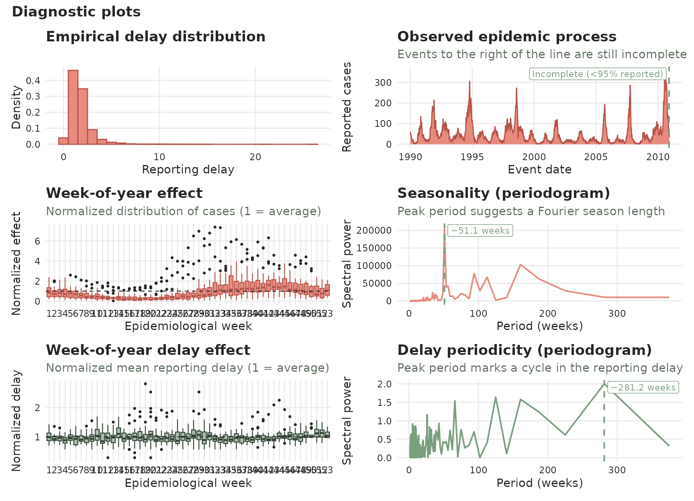
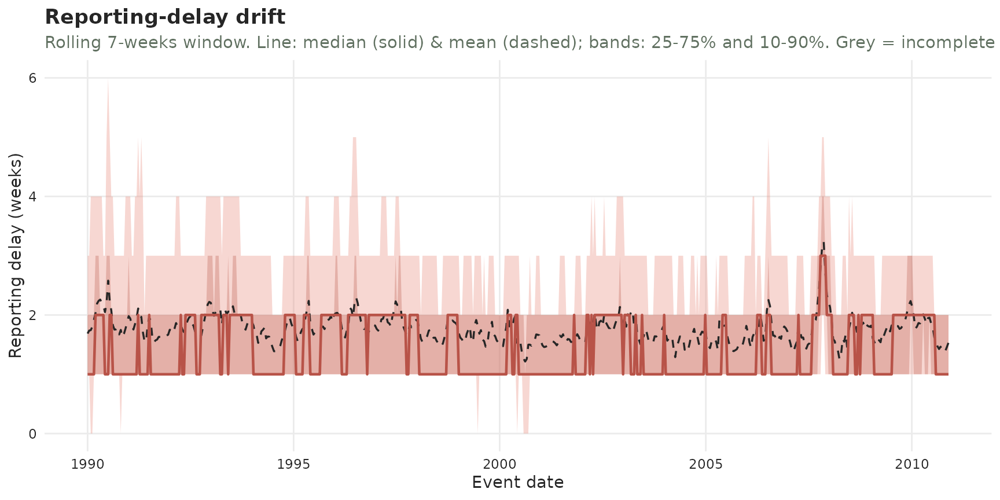

# tbl.now

Within `R`, the [tidyverse](https://tidyverse.org/) ecosystem ([Wickham
et al. 2019](#ref-tidyverse)) provides a widely adopted framework for
data analysis. In this paradigm, data is structured such that rows
represent individual observations and columns represent variables. This
approach is commonly referred to as tidy data ([Wickham
2014](#ref-wickham2014tidy)).

Several tidyverse extensions exist for working with time series data,
including [tsibble](https://tsibble.tidyverts.org/),
[tibbletime](https://business-science.github.io/tibbletime/), and
[timetk](https://business-science.github.io/timetk/) ([Wang et al.
2020](#ref-wang2020new); [Wang 2019](#ref-wang2019tidy); [Dancho and
Vaughan 2023](#ref-timetk)). These packages provide time-aware tibbles
and tools that integrate smoothly with the tidyverse. However,
epidemiological nowcasting requires two time indices simultaneously: an
**event time** and a **reporting time**. Classical time-series
abstractions assume only a single index and therefore do not fully
support this structure.

The `tbl.now` class and package addresses this gap. The `tbl.now`
extends a regular [tibble()](https://tibble.tidyverse.org/) to
explicitly encode epidemiological event and report dates, allowing
consistent data transformation, delay computation, and integration with
the
[diseasenowcasting](https://rodrigozepeda.github.io/diseasenowcasting/)
modeling workflow.

More concretely, tbl.now was designed to:

- Standardize the data inputs required by
  [diseasenowcasting](https://rodrigozepeda.github.io/diseasenowcasting/)
  models.

- Preserve [tidyverse](https://tidyverse.org/) compatibility so users
  can continue to apply familiar [dplyr](https://dplyr.tidyverse.org/)
  operations.

- Diagnose reporting artefacts directly from the data — reporting-delay
  drift and change points
  ([test_delay_drift()](https://rodrigozepeda.github.io/tbl.now/reference/test_delay_drift.html),
  [test_delay_changepoint()](https://rodrigozepeda.github.io/tbl.now/reference/test_delay_changepoint.html))
  and batch (backlog) reporting
  ([detect_report_batches()](https://rodrigozepeda.github.io/tbl.now/reference/detect_report_batches.html)).

- Facilitate seamless integration into iterative modeling workflows
  ([Gelman et al. 2020](#ref-gelman2020bayesian); [Wickham et al.
  2023](#ref-wickham2023r)):

&nbsp;

    Data Cleaning -> Modeling -> New Data Cleaning -> New Modeling -> ...

We’ll begin by loading the required packages:

``` r

library(dplyr, quietly = TRUE)
library(lubridate)
library(tbl.now)
```

## The `tbl.now` Framework

In an epidemiological nowcast, we typically observe two key dates:

- `event_date`: when the underlying event occurred (e.g., symptom onset,
  exposure, sample collection).

- `report_date`: when the event was recorded in the data system (e.g.,
  lab result processed, clinical visit documented).

The nowcasting task is:

> To estimate, for each past `event_date`, how many events have already
> occurred but have not yet been reported as of **now**. That is, the
> nowcast will predict how many observations will eventually be observed
> for the `event_date`s.

A `tbl.now` object is therefore a specialized
[tibble()](https://tibble.tidyverse.org/) that:

- Identifies the `event_date` and `report_date` columns.

- Stores these as attributes to enable consistent processing.

- Automatically computes auxiliary fields such as delay, numerical
  indices, and frequency units.

- Ensures the dataset is well-formed for downstream
  [diseasenowcasting](https://rodrigozepeda.github.io/diseasenowcasting/)
  models.

### Example

Consider the following dataset:

``` r

df <- data.frame(
  symptom_onset = c(ymd("2023/12/25"), ymd("2023/12/26"), ymd("2023/12/25"), ymd("2023/12/26")),
  medical_visit = c(ymd("2023/12/26"), ymd("2023/12/26"), ymd("2023/12/27"), ymd("2023/12/27")),
  n = c(10, 2, 5, 11)
)

knitr::kable(df, caption = "Example dataset")
```

| symptom_onset | medical_visit |   n |
|:--------------|:--------------|----:|
| 2023-12-25    | 2023-12-26    |  10 |
| 2023-12-26    | 2023-12-26    |   2 |
| 2023-12-25    | 2023-12-27    |   5 |
| 2023-12-26    | 2023-12-27    |  11 |

Example dataset {.table}

Here:

- `symptom_onset` is the event date.

- `medical_visit` is the report date.

- `n` is the number of reported cases for each event–report combination.

We can convert this into a
[tbl_now()](https://rodrigozepeda.github.io/tbl.now/reference/tbl_now.html):

``` r

df |>
  tbl_now(event_date = symptom_onset, report_date = medical_visit, case_count = n)
#> ℹ Identified data as <count-incidence> with counts in column "n".
#> # A tibble:  4 × 6
#> # Data type: "count-incidence"
#> # Frequency: Event: `days` | Report: `days`
#>   symptom_onset medical_visit       n .event_num .report_num .delay
#>   <date>        <date>          <dbl>      <dbl>       <dbl>  <dbl>
#>   [event_date]  [report_date] [cases]      [...]       [...]  [...]
#> 1 2023-12-25    2023-12-26         10          0           1      1
#> 2 2023-12-26    2023-12-26          2          1           1      0
#> 3 2023-12-25    2023-12-27          5          0           2      2
#> 4 2023-12-26    2023-12-27         11          1           2      1
#> # ────────────────────────────────────────────────────────────────────────────────
#> # Now: 2023-12-27 | Event date: "symptom_onset" | Report date: "medical_visit"
#> # ────────────────────────────────────────────────────────────────────────────────
```

This performs several operations automatically:

- Detects the **data type** (`count-incidence` in this example).

- Infers the **frequency units** of event and report dates (daily).

- Tags the correct columns as `event_date`, `report_date`, and
  `case_count.`

- Computes `.event_num`, `.report_num`, and `.delay` columns.

- Identifies the appropriate **now** date (the most recent report date).

The remaining sections describe these features and the broader `tbl.now`
toolkit.

## Attributes of a [tbl_now()](https://rodrigozepeda.github.io/tbl.now/reference/tbl_now.html)

A
[tbl_now()](https://rodrigozepeda.github.io/tbl.now/reference/tbl_now.html)
stores information about its structure using object attributes, ensuring
consistent behavior across transformations and modeling steps. The
primary attributes are:

- **now**: the “current” reporting date used for nowcasting, typically
  the most recent `report_date`.

- **event_date**: the column name storing event dates.

- **report_date**: the column name storing report dates.

- **event_units**: the temporal units for event dates (e.g., “days”,
  “weeks”, “numeric”).

- **report_units**: the temporal units for report dates.

- **data_type**: one of the following (see [the data types
  section](#data-types)):

  - linelist
  - count-incidence
  - count-cumulative.

- **strata** (optional)[^1]: variables for which the nowcast should be
  computed separately (e.g., age group, sex).

- **covariates** (optional): predictor variables that may improve the
  nowcast (e.g., weather covariates).

- **is_censored** (optional): identifies cases where some reports arrive
  in artificial “batches” representing right-censoring rather than true
  reporting dynamics (e.g. when there is a system error and reports from
  a lab are not registered until a week after)

- **case_count** (optional): the column storing case counts when the
  dataset is aggregated.

- **temporal_effects** (optional): a lazy specification (list of
  [temporal_effects()](https://rodrigozepeda.github.io/tbl.now/reference/temporal_effects.html)
  configs) stored via
  [add_temporal_effects()](https://rodrigozepeda.github.io/tbl.now/reference/add_temporal_effects.html).
  Columns are only materialised when
  [compute_temporal_effects()](https://rodrigozepeda.github.io/tbl.now/reference/compute_temporal_effects.html)
  is called. See the [temporal effects](#temporal-effects) section for
  more details.

You can access any attribute using the corresponding
[getter](https://rodrigozepeda.github.io/tbl.now/reference/nowcast_data_getters.html),
e.g. [get_event_date()](https://rodrigozepeda.github.io/tbl.now/reference/nowcast_data_getters.html)
or
[get_strata()](https://rodrigozepeda.github.io/tbl.now/reference/nowcast_data_getters.html).

### Data types

A
[tbl_now()](https://rodrigozepeda.github.io/tbl.now/reference/tbl_now.html)
can represent one of three data structures:

1.  **Linelist**: Each row corresponds to a single reported observation.

| patient | event_date | report_date | .event_num | .report_num | .delay |
|--------:|:-----------|:------------|-----------:|------------:|-------:|
|       1 | 2020-09-12 | 2020-09-12  |          0 |           0 |      0 |
|       2 | 2020-09-12 | 2020-09-12  |          0 |           0 |      0 |
|       3 | 2020-09-12 | 2020-09-13  |          0 |           1 |      1 |
|       4 | 2020-09-13 | 2020-09-13  |          1 |           1 |      0 |
|       5 | 2020-09-13 | 2020-09-13  |          1 |           1 |      0 |
|       6 | 2020-09-13 | 2020-09-13  |          1 |           1 |      0 |

Linelist data {.table}

2.  **Count-incidence**: Each row summarizes how many events with a
    given `event_date` were reported exactly on that `report_date.`

|   n | event_date | report_date | .event_num | .report_num | .delay |
|----:|:-----------|:------------|-----------:|------------:|-------:|
|   7 | 2020-09-12 | 2020-09-12  |          0 |           0 |      0 |
|   1 | 2020-09-12 | 2020-09-13  |          0 |           1 |      1 |
|   9 | 2020-09-12 | 2020-09-14  |          0 |           2 |      2 |
|   5 | 2020-09-13 | 2020-09-13  |          1 |           1 |      0 |
|   0 | 2020-09-13 | 2020-09-14  |          1 |           2 |      1 |
|   2 | 2020-09-13 | 2020-09-15  |          1 |           3 |      2 |

Count-incidence data {.table}

3.  **Count-cumulative** Each row summarizes how many events with a
    given `event_date` had been reported up to and including that
    `report_date`. The distinction is crucial for nowcasting models that
    operate either on daily increments or cumulative totals.

|   n | event_date | report_date | .event_num | .report_num | .delay |
|----:|:-----------|:------------|-----------:|------------:|-------:|
|   1 | 2020-09-12 | 2020-09-12  |          0 |           0 |      0 |
|   5 | 2020-09-12 | 2020-09-13  |          0 |           1 |      1 |
|   8 | 2020-09-12 | 2020-09-14  |          0 |           2 |      2 |
|   2 | 2020-09-13 | 2020-09-13  |          1 |           1 |      0 |
|   2 | 2020-09-13 | 2020-09-14  |          1 |           2 |      1 |
|   4 | 2020-09-13 | 2020-09-15  |          1 |           3 |      2 |

Count-cumulative data {.table}

The
[`to_count()`](https://rodrigozepeda.github.io/tbl.now/reference/to_count.md)
function allows you to easily convert between different data-types.

### Converting Between Data Types

The
[to_count()](https://rodrigozepeda.github.io/tbl.now/reference/to_count.html)
function supports structured transformations:

- **Linelist → Count-Incidence**: Aggregates by event–report date,
  counting only cases reported on that date.

``` r

df_linelist |>
  to_count(to = "count-incidence")
#> # A tibble:  3 × 6
#> # Data type: "count-incidence"
#> # Frequency: Event: `days` | Report: `days`
#>   event_date   report_date   .event_num .report_num       n .delay
#>   <date>       <date>             <dbl>       <dbl>   <int>  <dbl>
#>   [event_date] [report_date]      [...]       [...] [cases]  [...]
#> 1 2020-09-12   2020-09-12             0           0       2      0
#> 2 2020-09-12   2020-09-13             0           1       1      1
#> 3 2020-09-13   2020-09-13             1           1       3      0
#> # ────────────────────────────────────────────────────────────────────────────────
#> # Now: 2020-09-13 | Event date: "event_date" | Report date: "report_date"
#> # ────────────────────────────────────────────────────────────────────────────────
```

- **Linelist → Count-Cumulative**: Aggregates by event–report date,
  producing cumulative counts up to each report date.

``` r

df_linelist |>
  to_count(to = "count-cumulative")
#> # A tibble:  3 × 6
#> # Data type: "count-cumulative"
#> # Frequency: Event: `days` | Report: `days`
#>   event_date   report_date   .event_num .report_num       n .delay
#>   <date>       <date>             <dbl>       <dbl>   <int>  <dbl>
#>   [event_date] [report_date]      [...]       [...] [cases]  [...]
#> 1 2020-09-12   2020-09-12             0           0       2      0
#> 2 2020-09-12   2020-09-13             0           1       3      1
#> 3 2020-09-13   2020-09-13             1           1       3      0
#> # ────────────────────────────────────────────────────────────────────────────────
#> # Now: 2020-09-13 | Event date: "event_date" | Report date: "report_date"
#> # ────────────────────────────────────────────────────────────────────────────────
```

> **Note** In the previous example the `n` counts `3` as it is
> aggregating the `1` observed at `report_date = 2020-09-13` and the `2`
> observed at `report_date = 2020-09-12`. This is the difference between
> the **count-incidence** that specifies the ones observed **exactly**
> on that date and the **count-cumulative** that specifies the ones
> observed up **until and including** that date.

- **Count-Incidence → Count-Cumulative**: Computes cumulative sums for
  each event date across report dates.

``` r

df_count_inc |>
  to_count(to = "count-cumulative")
#> # A tibble:  6 × 6
#> # Data type: "count-cumulative"
#> # Frequency: Event: `days` | Report: `days`
#>   event_date   report_date   .event_num .report_num       n .delay
#>   <date>       <date>             <dbl>       <dbl>   <dbl>  <dbl>
#>   [event_date] [report_date]      [...]       [...] [cases]  [...]
#> 1 2020-09-12   2020-09-12             0           0       7      0
#> 2 2020-09-12   2020-09-13             0           1       8      1
#> 3 2020-09-12   2020-09-14             0           2      17      2
#> 4 2020-09-13   2020-09-13             1           1       5      0
#> 5 2020-09-13   2020-09-14             1           2       5      1
#> 6 2020-09-13   2020-09-15             1           3       7      2
#> # ────────────────────────────────────────────────────────────────────────────────
#> # Now: 2020-09-15 | Event date: "event_date" | Report date: "report_date"
#> # ────────────────────────────────────────────────────────────────────────────────
```

- **Aggregation within the same type**: The
  [to_count()](https://rodrigozepeda.github.io/tbl.now/reference/to_count.html)
  may also be used to re-aggregate datasets that contain duplicate
  event–report pairs. This is useful when raw surveillance feeds contain
  repeated entries such as in this case:

``` r

df_example <- data.frame(
  n = c(8, 11, 0, 1, 1, 5, 2, 4, 1, 10, 9, 11, 3, 1),
  sex = c(rep("M", 3), rep("F", 4), rep("M", 2), rep("F", 5)),
  event_date = c(
    rep(ymd("2020/09/12"), 3),
    rep(ymd("2020/09/12"), 4),
    rep(ymd("2020/09/13"), 2),
    rep(ymd("2020/09/13"), 5)
  ),
  report_date = c(
    ymd("2020/09/12"), ymd("2020/09/13"), ymd("2020/09/14"),
    ymd("2020/09/12"), ymd("2020/09/13"), ymd("2020/09/14"),
    ymd("2020/09/15"), ymd("2020/09/13"), ymd("2020/09/14"),
    ymd("2020/09/13"), ymd("2020/09/14"),
    ymd("2020/09/15"), ymd("2020/09/16"), ymd("2020/09/17")
  )
)

tbl_example <- df_example |>
  tbl_now(
    event_date = event_date, report_date = report_date,
    data_type = "count-incidence", case_count = n, verbose = FALSE,
    warn_non_uniqueness = FALSE
  )

tbl_example
#> # A tibble:  14 × 7
#> # Data type: "count-incidence"
#> # Frequency: Event: `days` | Report: `days`
#>          n sex   event_date   report_date   .event_num .report_num .delay
#>      <dbl> <chr> <date>       <date>             <dbl>       <dbl>  <dbl>
#>    [cases] [...] [event_date] [report_date]      [...]       [...]  [...]
#>  1       8 M     2020-09-12   2020-09-12             0           0      0
#>  2      11 M     2020-09-12   2020-09-13             0           1      1
#>  3       0 M     2020-09-12   2020-09-14             0           2      2
#>  4       1 F     2020-09-12   2020-09-12             0           0      0
#>  5       1 F     2020-09-12   2020-09-13             0           1      1
#>  6       5 F     2020-09-12   2020-09-14             0           2      2
#>  7       2 F     2020-09-12   2020-09-15             0           3      3
#>  8       4 M     2020-09-13   2020-09-13             1           1      0
#>  9       1 M     2020-09-13   2020-09-14             1           2      1
#> 10      10 F     2020-09-13   2020-09-13             1           1      0
#> 11       9 F     2020-09-13   2020-09-14             1           2      1
#> 12      11 F     2020-09-13   2020-09-15             1           3      2
#> 13       3 F     2020-09-13   2020-09-16             1           4      3
#> 14       1 F     2020-09-13   2020-09-17             1           5      4
#> # ────────────────────────────────────────────────────────────────────────────────
#> # Now: 2020-09-17 | Event date: "event_date" | Report date: "report_date"
#> # ────────────────────────────────────────────────────────────────────────────────
```

This dataset intentionally contains repeated event_date–report_date
pairs within each stratum. If the user wants to aggregate redundant
rows, the
[to_count()](https://rodrigozepeda.github.io/tbl.now/reference/to_count.html)
function can be used to collapse duplicates by summing the `case_count`
column.

``` r

tbl_example |>
  to_count(to = "count-incidence")
#> # A tibble:  9 × 6
#> # Data type: "count-incidence"
#> # Frequency: Event: `days` | Report: `days`
#>   event_date   report_date   .event_num .report_num       n .delay
#>   <date>       <date>             <dbl>       <dbl>   <dbl>  <dbl>
#>   [event_date] [report_date]      [...]       [...] [cases]  [...]
#> 1 2020-09-12   2020-09-12             0           0       9      0
#> 2 2020-09-12   2020-09-13             0           1      12      1
#> 3 2020-09-12   2020-09-14             0           2       5      2
#> 4 2020-09-12   2020-09-15             0           3       2      3
#> 5 2020-09-13   2020-09-13             1           1      14      0
#> 6 2020-09-13   2020-09-14             1           2      10      1
#> 7 2020-09-13   2020-09-15             1           3      11      2
#> 8 2020-09-13   2020-09-16             1           4       3      3
#> 9 2020-09-13   2020-09-17             1           5       1      4
#> # ────────────────────────────────────────────────────────────────────────────────
#> # Now: 2020-09-17 | Event date: "event_date" | Report date: "report_date"
#> # ────────────────────────────────────────────────────────────────────────────────
```

The function ensures that:

- Rows are grouped by `event_date`, `report_date`, and any `strata`, and
  `is_censored`.

- The `case_count` column is summed within each group.

- Attributes are preserved so the resulting object remains a valid
  `tbl_now`.

### Temporal effects

Often, temporal covariates improve nowcasting performance by helping
adjust for systematic changes occurring within the calendar cycle (e.g.,
day-of-week effects, seasonal effects, or reporting artefacts). The
[temporal_effects()](https://rodrigozepeda.github.io/tbl.now/reference/temporal_effects.html)
function creates a *specification* (recipe) of the features to compute:

``` r

library(almanac)

t_eff <- temporal_effects(
  day_of_week  = TRUE,
  week_of_year = TRUE,
  holidays     = cal_us_federal()
)
t_eff
#> 
#> ── Temporal Effects ────────────────────────────────────────────────────────────
#> The following effects are in place:
#> • "day_of_week"
#> • "week_of_year"
#> • "holidays":
#>   1. New Year's Day, US Martin Luther King Jr. Day, US Presidents' Day, US
#>   Memorial Day, US Juneteenth, US Independence Day, US Labor Day, US Indigenous
#>   Peoples' Day, US Veterans Day, US Thanksgiving, and Christmas
```

> Note that the holidays calendar is an
> [rcalendar](https://davisvaughan.github.io/almanac/reference/rcalendar.html)
> object from the
> [almanac](https://davisvaughan.github.io/almanac/articles/almanac.html)
> package.

#### Lazy evaluation: attach first, compute later

Temporal effects in `tbl.now` follow a **lazy evaluation** pattern:

1.  **Attach the spec** with
    [add_temporal_effects()](https://rodrigozepeda.github.io/tbl.now/reference/add_temporal_effects.html)
    (or via the `t_effects` argument of
    [`tbl_now()`](https://rodrigozepeda.github.io/tbl.now/reference/tbl_now.md)).
    This records *what* should be computed but adds **no columns** yet.

2.  **Materialise the columns** with
    [compute_temporal_effects()](https://rodrigozepeda.github.io/tbl.now/reference/compute_temporal_effects.html)
    when you are ready to use them in a model.

``` r

data("denguedat")

# Step 1 — create the tbl_now and attach the spec (no columns added yet)
df_now <- denguedat |>
  tbl_now(
    event_date = onset_week, report_date = report_week,
    verbose = FALSE, strata = gender
  )

df_now <- df_now |>
  add_temporal_effects(t_eff)

# The footer shows "T. effects (lazy): ..." — spec is recorded but not computed
df_now
#> # A tibble:  52,987 × 6
#> # Data type: "linelist"
#> # Frequency: Event: `weeks` | Report: `weeks`
#>    onset_week   report_week   gender   .event_num .report_num .delay
#>    <date>       <date>        <chr>         <dbl>       <dbl>  <dbl>
#>    [event_date] [report_date] [strata]      [...]       [...]  [...]
#>  1 1990-01-01   1990-01-01    Male              0           0      0
#>  2 1990-01-01   1990-01-01    Female            0           0      0
#>  3 1990-01-01   1990-01-01    Female            0           0      0
#>  4 1990-01-01   1990-01-08    Female            0           1      1
#>  5 1990-01-01   1990-01-08    Male              0           1      1
#>  6 1990-01-01   1990-01-15    Female            0           2      2
#>  7 1990-01-01   1990-01-15    Female            0           2      2
#>  8 1990-01-01   1990-01-15    Female            0           2      2
#>  9 1990-01-01   1990-01-22    Female            0           3      3
#> 10 1990-01-01   1990-01-08    Female            0           1      1
#> # ────────────────────────────────────────────────────────────────────────────────
#> # Now: 2010-12-20 | Event date: "onset_week" | Report date: "report_week"
#> # Strata: "gender"
#> # T. effects (lazy): [event_date] day_of_week, week_of_year, holidays
#> # ────────────────────────────────────────────────────────────────────────────────
#> # ℹ 52,977 more rows
```

The footer now shows the spec with `(lazy)` to signal that the columns
have not been computed yet. No new columns appear in the tibble at this
point.

``` r

# Step 2 — materialise the columns when needed
df_computed <- compute_temporal_effects(df_now)

# Columns are now present and annotated [t_effect]
df_computed
#> # A tibble:  52,987 × 9
#> # Data type: "linelist"
#> # Frequency: Event: `weeks` | Report: `weeks`
#>    onset_week   report_week   gender   .event_num .report_num .delay
#>    <date>       <date>        <chr>         <dbl>       <dbl>  <dbl>
#>    [event_date] [report_date] [strata]      [...]       [...]  [...]
#>  1 1990-01-01   1990-01-01    Male              0           0      0
#>  2 1990-01-01   1990-01-01    Female            0           0      0
#>  3 1990-01-01   1990-01-01    Female            0           0      0
#>  4 1990-01-01   1990-01-08    Female            0           1      1
#>  5 1990-01-01   1990-01-08    Male              0           1      1
#>  6 1990-01-01   1990-01-15    Female            0           2      2
#>  7 1990-01-01   1990-01-15    Female            0           2      2
#>  8 1990-01-01   1990-01-15    Female            0           2      2
#>  9 1990-01-01   1990-01-22    Female            0           3      3
#> 10 1990-01-01   1990-01-08    Female            0           1      1
#>    .event_day_of_week .event_week_of_year .event_holiday
#>                 <int>               <int>          <int>
#>            [t_effect]          [t_effect]     [t_effect]
#>  1                  2                   1              1
#>  2                  2                   1              1
#>  3                  2                   1              1
#>  4                  2                   1              1
#>  5                  2                   1              1
#>  6                  2                   1              1
#>  7                  2                   1              1
#>  8                  2                   1              1
#>  9                  2                   1              1
#> 10                  2                   1              1
#> # ────────────────────────────────────────────────────────────────────────────────
#> # Now: 2010-12-20 | Event date: "onset_week" | Report date: "report_week"
#> # Strata: "gender"
#> # T. effects: [event_date] day_of_week, week_of_year, holidays
#> # T. effect cols: ".event_day_of_week", ".event_week_of_year", and
#> # ".event_holiday"
#> # ────────────────────────────────────────────────────────────────────────────────
#> # ℹ 52,977 more rows
```

After
[`compute_temporal_effects()`](https://rodrigozepeda.github.io/tbl.now/reference/compute_temporal_effects.md):

- The effect columns (`.event_day_of_week`, `.event_week_of_year`,
  `.event_holiday`) are added.
- [`get_temporal_effect_cols()`](https://rodrigozepeda.github.io/tbl.now/reference/nowcast_data_getters.md)
  lists them.
- The original spec remains accessible via
  [`get_temporal_effects()`](https://rodrigozepeda.github.io/tbl.now/reference/nowcast_data_getters.md),
  so you always know which effects were requested even after further
  dplyr operations.

``` r

get_temporal_effects(df_computed) # The spec (list of configs)
#> [[1]]
#> [[1]]$t_effects
#> 
#> ── Temporal Effects ────────────────────────────────────────────────────────────
#> The following effects are in place:
#> • "day_of_week"
#> • "week_of_year"
#> • "holidays":
#>   1. New Year's Day, US Martin Luther King Jr. Day, US Presidents' Day, US
#>   Memorial Day, US Juneteenth, US Independence Day, US Labor Day, US Indigenous
#>   Peoples' Day, US Veterans Day, US Thanksgiving, and Christmas
#> 
#> [[1]]$date_type
#> [1] "event_date"
#> 
#> [[1]]$weekend_days
#> [1] "Sat" "Sun"
get_temporal_effect_cols(df_computed) # The computed column names
#> [1] ".event_day_of_week"  ".event_week_of_year" ".event_holiday"
```

#### After-holiday and after-weekend effects

Reporting often *rebounds* on the first working day(s) after a holiday
or a weekend. To capture that,
[`temporal_effects()`](https://rodrigozepeda.github.io/tbl.now/reference/temporal_effects.md)
has `holiday_lags` and `weekend_lags`: each takes a depth `N` and
creates indicator columns `..._holiday_lag_1 … ..._holiday_lag_N` (and
`..._weekend_lag_k`) that flag dates falling exactly `k` **working
days** after a holiday / weekend. Working days skip weekends and other
holidays, so the effect lands on the first day back at work.

``` r

# Flag the two working days after a holiday, and the working day after a weekend
after_eff <- temporal_effects(
  holidays     = cal_us_federal(),
  holiday_lags = 2,
  weekend_lags = 1
)
after_eff
#> 
#> ── Temporal Effects ────────────────────────────────────────────────────────────
#> The following effects are in place:
#> • "after-holiday" effect: first 2 working days
#> • "after-weekend" effect: first working day
#> • "holidays":
#>   1. New Year's Day, US Martin Luther King Jr. Day, US Presidents' Day, US
#>   Memorial Day, US Juneteenth, US Independence Day, US Labor Day, US Indigenous
#>   Peoples' Day, US Veterans Day, US Thanksgiving, and Christmas
```

#### Event- vs report-date effects

By default effects are derived from the **event date** and named
`.event_*`. Pass `date_type = "report_date"` to
[`add_temporal_effects()`](https://rodrigozepeda.github.io/tbl.now/reference/add_temporal_effects.md)
to derive them from the **report date** instead (columns named
`.report_*`). Both can coexist on the same `tbl_now`, and every
converter carries both sets of columns.

``` r

df_now |>
  add_temporal_effects(temporal_effects(week_of_year = TRUE), date_type = "event_date") |>
  add_temporal_effects(temporal_effects(day_of_week = TRUE),  date_type = "report_date")
```

### Modifying a [tbl_now()](https://rodrigozepeda.github.io/tbl.now/reference/tbl_now.html) with `dplyr`

A
[tbl_now()](https://rodrigozepeda.github.io/tbl.now/reference/tbl_now.html)’s
attributes can be modified using the functions in
[add\_\*](https://rodrigozepeda.github.io/tbl.now/reference/add.html),
[change\_\*](https://rodrigozepeda.github.io/tbl.now/reference/change.html),
or
[remove\_\*](https://rodrigozepeda.github.io/tbl.now/reference/remove.html).
These functions share a consistent interface that allows users to
incrementally manipulate strata, covariates, and temporal effects.

The example below demonstrates how to create a
[tbl_now()](https://rodrigozepeda.github.io/tbl.now/reference/tbl_now.html),
add strata and temporal effects, later modify the strata, and finally
remove the temporal effects.

``` r

data("mpoxdat")

df_now <- mpoxdat |>
  tbl_now(
    event_date = dx_date, report_date = dx_report_date,
    case_count = n, verbose = FALSE, strata = race
  )

df_now
#> # A tibble:  1,417 × 7
#> # Data type: "count-incidence"
#> # Frequency: Event: `days` | Report: `days`
#>    dx_date      dx_report_date race              n .event_num .report_num .delay
#>    <date>       <date>         <chr>         <int>      <dbl>       <dbl>  <dbl>
#>    [event_date] [report_date]  [strata]      [cas…      [...]       [...]  [...]
#>  1 2022-07-08   2022-07-12     Asian             4          0           4      4
#>  2 2022-07-08   2022-07-12     Black             6          0           4      4
#>  3 2022-07-08   2022-07-12     Hispanic          6          0           4      4
#>  4 2022-07-08   2022-07-12     Non-Hispanic…     6          0           4      4
#>  5 2022-07-08   2022-07-13     Asian             2          0           5      5
#>  6 2022-07-08   2022-07-13     Black             3          0           5      5
#>  7 2022-07-08   2022-07-13     Hispanic          8          0           5      5
#>  8 2022-07-08   2022-07-13     Non-Hispanic…     5          0           5      5
#>  9 2022-07-08   2022-07-14     Black             1          0           6      6
#> 10 2022-07-08   2022-07-14     Hispanic          3          0           6      6
#> # ────────────────────────────────────────────────────────────────────────────────
#> # Now: 2023-05-19 | Event date: "dx_date" | Report date: "dx_report_date"
#> # Strata: "race"
#> # ────────────────────────────────────────────────────────────────────────────────
#> # ℹ 1,407 more rows
```

You can see that the strata is `race` with the corresponding
[get\_\*](https://rodrigozepeda.github.io/tbl.now/reference/nowcast_data_getters.html):

``` r

get_strata(df_now)
#> [1] "race"
```

Strata can be modified with the
[change\_\*](https://rodrigozepeda.github.io/tbl.now/reference/change.html)
family of functions. The following example adds a new column containing
an uppercase version of the existing race variable and sets it as the
new strata:

``` r

df_now <- df_now |>
  mutate(RACE_UPPER = toupper(race)) |>
  change_strata(RACE_UPPER)

get_strata(df_now)
#> [1] "RACE_UPPER"
```

To attach a lazy temporal-effects spec, use
[add_temporal_effects()](https://rodrigozepeda.github.io/tbl.now/reference/add_temporal_effects.html),
then materialise with
[compute_temporal_effects()](https://rodrigozepeda.github.io/tbl.now/reference/compute_temporal_effects.html):

``` r

df_now <- df_now |>
  add_temporal_effects(temporal_effects(week_of_year = TRUE))

# Spec is stored (lazy):
get_temporal_effects(df_now)
#> [[1]]
#> [[1]]$t_effects
#> 
#> ── Temporal Effects ────────────────────────────────────────────────────────────
#> The following effects are in place:
#> • "week_of_year"
#> 
#> [[1]]$date_type
#> [1] "event_date"
#> 
#> [[1]]$weekend_days
#> [1] "Sat" "Sun"

# Compute to add columns:
df_now <- compute_temporal_effects(df_now)
get_temporal_effect_cols(df_now)
#> [1] ".event_week_of_year"
```

Attributes can be removed using the corresponding
[remove\_\*](https://rodrigozepeda.github.io/tbl.now/reference/remove.html)
functions.
[`remove_temporal_effects()`](https://rodrigozepeda.github.io/tbl.now/reference/remove.md)
drops both the spec and any computed columns:

``` r

df_now <- df_now |>
  remove_temporal_effects() |>
  remove_all_strata()
#> Warning: *Non-unique*: Data has multiple rows for the same event (dx_date) and
#> report(dx_report_date) dates. Consider using `to_count()` to aggregate the data
#> or`distinct()` to remove repeated observations.

df_now
#> # A tibble:  1,417 × 8
#> # Data type: "count-incidence"
#> # Frequency: Event: `days` | Report: `days`
#>    dx_date      dx_report_date race                     n .event_num .report_num
#>    <date>       <date>         <chr>                <int>      <dbl>       <dbl>
#>    [event_date] [report_date]  [...]              [cases]      [...]       [...]
#>  1 2022-07-08   2022-07-12     Asian                    4          0           4
#>  2 2022-07-08   2022-07-12     Black                    6          0           4
#>  3 2022-07-08   2022-07-12     Hispanic                 6          0           4
#>  4 2022-07-08   2022-07-12     Non-Hispanic White       6          0           4
#>  5 2022-07-08   2022-07-13     Asian                    2          0           5
#>  6 2022-07-08   2022-07-13     Black                    3          0           5
#>  7 2022-07-08   2022-07-13     Hispanic                 8          0           5
#>  8 2022-07-08   2022-07-13     Non-Hispanic White       5          0           5
#>  9 2022-07-08   2022-07-14     Black                    1          0           6
#> 10 2022-07-08   2022-07-14     Hispanic                 3          0           6
#>    .delay RACE_UPPER        
#>     <dbl> <chr>             
#>     [...] [...]             
#>  1      4 ASIAN             
#>  2      4 BLACK             
#>  3      4 HISPANIC          
#>  4      4 NON-HISPANIC WHITE
#>  5      5 ASIAN             
#>  6      5 BLACK             
#>  7      5 HISPANIC          
#>  8      5 NON-HISPANIC WHITE
#>  9      6 BLACK             
#> 10      6 HISPANIC          
#> # ────────────────────────────────────────────────────────────────────────────────
#> # Now: 2023-05-19 | Event date: "dx_date" | Report date: "dx_report_date"
#> # ────────────────────────────────────────────────────────────────────────────────
#> # ℹ 1,407 more rows
```

``` r

get_temporal_effects(df_now) # Empty list — no spec
#> list()
get_temporal_effect_cols(df_now) # character(0) — no computed cols
#> character(0)
get_strata(df_now)
#> NULL
```

## Modifying a tbl_now() with dplyr

[tbl_now()](https://rodrigozepeda.github.io/tbl.now/reference/tbl_now.html)
objects extend [tibble()](https://tibble.tidyverse.org/), and therefore
support standard [dplyr](https://dplyr.tidyverse.org/) verbs. The class
attempts to preserve and adapt its internal attributes when operations
are performed. For example, renaming a strata column will automatically
update the stored strata attribute.

``` r

library(dplyr, quietly = TRUE)
data(denguedat)

df_now <- tbl_now(denguedat,
  event_date = onset_week,
  report_date = report_week, strata = gender,
  verbose = FALSE
)

# Current strata
get_strata(df_now)
#> [1] "gender"
```

After renaming the column, the strata attribute updates accordingly:

``` r

df_now <- df_now |>
  rename(male_or_female = gender)

get_strata(df_now)
#> [1] "male_or_female"
```

Certain operations may cause a
[tbl_now()](https://rodrigozepeda.github.io/tbl.now/reference/tbl_now.html)
object to drop back to a standard tibble. This occurs when the operation
removes necessary structure—for example, collapsing all data into a
single row with
[summarise()](https://dplyr.tidyverse.org/reference/summarise.html):

``` r

df_now |>
  summarise(number_males = sum(male_or_female == "Male"))
#> Warning: Dropping `tbl_now` attributes and converting to `tibble`
#> # A tibble: 1 × 1
#>   number_males
#>          <int>
#> 1        26395
```

### Updating a tbl_now()

A
[tbl_now()](https://rodrigozepeda.github.io/tbl.now/reference/tbl_now.html)
object can be updated using the
[update()](https://rodrigozepeda.github.io/tbl.now/reference/update.tbl_now.html)
method with another data.frame, tibble, or
[tbl_now()](https://rodrigozepeda.github.io/tbl.now/reference/tbl_now.html)
as input. When the column structure is compatible, the update process
retains the strata, covariate, and temporal-effect attributes from the
original object, and recalculates “now” estimates using the combined
data.

Below is an example using an initial dataset:

``` r

df <- data.frame(
  patient = 1:6,
  event_date = c(rep(ymd("2020/09/12"), 3), rep(ymd("2020/09/13"), 3)),
  report_date = c(
    ymd("2020/09/12"), ymd("2020/09/13"), ymd("2020/09/14"),
    ymd("2020/09/13"), ymd("2020/09/14"), ymd("2020/09/15")
  )
)

df_now <- tbl_now(df,
  event_date = event_date,
  report_date = report_date, verbose = FALSE
)
```

And a follow-up dataset containing newly reported cases:

``` r

df_new <- data.frame(
  patient = 7:13,
  event_date = c(
    ymd("2020/09/13"),
    rep(ymd("2020/09/14"), 3),
    rep(ymd("2020/09/15"), 3)
  ),
  report_date = c(
    ymd("2020/09/14"), ymd("2020/09/14"), ymd("2020/09/15"),
    ymd("2020/09/16"), ymd("2020/09/15"), ymd("2020/09/16"),
    ymd("2020/09/17")
  )
)
```

We can update the original object by incorporating the new data:

``` r

df_updated <- update(df_now, new_data = df_new)

df_updated
#> # A tibble:  13 × 6
#> # Data type: "linelist"
#> # Frequency: Event: `days` | Report: `days`
#>    patient event_date   report_date   .event_num .report_num .delay
#>      <int> <date>       <date>             <dbl>       <dbl>  <dbl>
#>      [...] [event_date] [report_date]      [...]       [...]  [...]
#>  1       1 2020-09-12   2020-09-12             0           0      0
#>  2       2 2020-09-12   2020-09-13             0           1      1
#>  3       3 2020-09-12   2020-09-14             0           2      2
#>  4       4 2020-09-13   2020-09-13             1           1      0
#>  5       5 2020-09-13   2020-09-14             1           2      1
#>  6       6 2020-09-13   2020-09-15             1           3      2
#>  7       7 2020-09-13   2020-09-14             1           2      1
#>  8       8 2020-09-14   2020-09-14             2           2      0
#>  9       9 2020-09-14   2020-09-15             2           3      1
#> 10      10 2020-09-14   2020-09-16             2           4      2
#> 11      11 2020-09-15   2020-09-15             3           3      0
#> 12      12 2020-09-15   2020-09-16             3           4      1
#> 13      13 2020-09-15   2020-09-17             3           5      2
#> # ────────────────────────────────────────────────────────────────────────────────
#> # Now: 2020-09-17 | Event date: "event_date" | Report date: "report_date"
#> # ────────────────────────────────────────────────────────────────────────────────
```

## Visualizing a `tbl_now`

The
[autoplot()](https://rodrigozepeda.github.io/tbl.now/reference/autoplot.tbl_now.html)
method gives a quick diagnostic overview of a `tbl_now`. Using
[ggplot2](https://ggplot2.tidyverse.org/) and
[patchwork](https://patchwork.data-imaginist.com/), it draws two
families of panels. The **case-count** panels:

1.  **Empirical delay distribution**: a case-count weighted histogram of
    the reporting delay.
2.  **Observed epidemic process**: the latest reported counts per
    `event_date`.
3.  **Calendar effect**: boxplots of the *normalized* effect (each event
    date’s cases divided by the overall mean, so 1 is average) by day of
    week / week of year / month.
4.  **Seasonality** — a periodogram of the incidence series whose
    dominant peak suggests a Fourier season length to pass to
    [temporal_effects()](https://rodrigozepeda.github.io/tbl.now/reference/temporal_effects.html).

…and the **reporting-delay** panels, which reveal *delay effects*
(whether the delay itself has a calendar or periodic pattern):

5.  **Delay calendar effect**: boxplots of the mean reporting delay by
    day of week / week of year / month.
6.  **Delay periodicity**: a periodogram of the mean-delay series
    (e.g. a weekly reporting rhythm).

Which calendar/delay panels appear depends on the event unit (daily data
gets day-of-week *and* week-of-year; weekly data week-of-year; monthly
data month-of-year). Use the `panels` argument to pick a subset — for
example `panels = "delay_calendar"` for just the delay boxplots, or a
single key like `panels = "delay_week"` (a single panel is returned as a
plain `ggplot`). The aliases are `"all"` (default), `"calendar"` and
`"delay_calendar"`.

Set `by_strata = TRUE` to split every panel by stratum: the boxplots
become dodged boxes (one per stratum, side by side), the epidemic
process and periodograms become one coloured line per stratum, and the
delay distribution becomes dodged bars. The boxplots are then normalized
*per stratum* (1 = that stratum’s own average) so the calendar pattern
is comparable across strata. By default the object’s `strata` are used;
pass `strata = "gender"` to group on a subset of the strata columns.

``` r

library(ggplot2)
library(patchwork)

dengue_now <- tbl_now(denguedat,
  event_date  = "onset_week",
  report_date = "report_week",
  verbose     = FALSE
)

autoplot(dengue_now)
```



For the weekly dengue data the periodogram peaks near 52 weeks,
suggesting an annual cycle. We could capture this with a Fourier term of
`temporal_effects(seasons = 52)`.

### Do delay distributions drift over time?

Reporting delays are not always stable: a surveillance system may speed
up or slow down over a season or across years.
[plot_delay_drift()](https://rodrigozepeda.github.io/tbl.now/reference/plot_delay_drift.html)
draws a rolling *fan chart* of the delay distribution indexed by event
date — a solid rolling median, a dashed rolling mean, and 25–75% /
10–90% quantile bands. A rising or falling centre line signals
*location* drift; widening or narrowing bands signal *spread* drift.

``` r

plot_delay_drift(dengue_now)
```



Because the most recent event dates have not had time to be fully
reported, their delays look artificially short; that immature region
(after the completeness cutoff) is **shaded grey** and should not be
read as drift.

For a formal answer,
[test_delay_drift()](https://rodrigozepeda.github.io/tbl.now/reference/test_delay_drift.html)
runs an autocorrelation-robust monotonic-trend test (a modified
Mann–Kendall test, via the `modifiedmk` package) on the per-period delay
summaries — a delay series is correlated with itself, so an ordinary
trend test would over-state significance. It tests both a location
statistic (the median) and a dispersion statistic (the 10–90 spread), on
mature data only:

``` r

test_delay_drift(dengue_now, stat = c("median", "spread"))
#> Warning: ! `test_delay_drift()` is experimental: results are not guaranteed and the
#>   interface may change.
#> ℹ Interpret a significant result as a potential trend change, not a confirmed
#>   one.
#> This warning is displayed once every 8 hours.
#> # A tibble: 2 × 9
#>   strata stat       n      tau sens_slope statistic p_value method    drift
#>   <chr>  <chr>  <int>    <dbl>      <dbl>     <dbl>   <dbl> <chr>     <lgl>
#> 1 all    median  1090 -0.00918          0    -0.243  0.808  hamed-rao FALSE
#> 2 all    spread  1090 -0.178            0    -2.32   0.0203 hamed-rao TRUE
```

A significant `drift` for `spread` with a non-significant one for
`median`, say, would mean the *typical* delay held steady while its
*variability* changed.

The trend test looks for *gradual* change. If instead you suspect an
**abrupt** shift — a reporting-system change on some date — use
[test_delay_changepoint()](https://rodrigozepeda.github.io/tbl.now/reference/test_delay_changepoint.html),
which applies Pettitt’s nonparametric change-point test and returns the
estimated change date together with the before/after delay level:

``` r

test_delay_changepoint(dengue_now, stat = c("median", "spread"))
#> Warning: ! `test_delay_changepoint()` is experimental: results are not guaranteed and
#>   the interface may change.
#> ℹ Treat a detected change as a potential change point, not a confirmed one.
#> This warning is displayed once every 8 hours.
#> # A tibble: 2 × 10
#>   strata stat       n changepoint statistic  p_value before after  shift
#>   <chr>  <chr>  <int> <date>          <dbl>    <dbl>  <dbl> <dbl>  <dbl>
#> 1 all    median  1090 1998-01-19      38402 2.17e- 3   1.53  1.39 -0.136
#> 2 all    spread  1090 1997-09-01      93409 5.77e-18   2.55  1.91 -0.639
#> # ℹ 1 more variable: changepoint_detected <lgl>
```

You can mark the detected change point on the fan chart with
`plot_delay_drift(dengue_now, changepoint = TRUE)`.

### Detecting batch reporting

Laboratories sometimes withhold results and then release a whole backlog
at once — a **batch**. The key idea is that a batch *moves* reports
along the report axis without *creating* them, so a window of report
dates spanning both the lull and the spike has an unchanged total —
whereas a genuine epidemic surge adds cases and inflates it.
[batch_screen()](https://rodrigozepeda.github.io/tbl.now/reference/batch_screen.html)
turns this into a per-report-date diagnostic that separates the two:

``` r

batches <- batch_screen(dengue_now, lookback = 2)

batches |>
  filter(batch) |>
  select(report_date, reported, baseline, deficit, delta, classification)
#> # A tibble: 69 × 6
#>    report_date reported baseline deficit    delta classification 
#>    <date>         <dbl>    <dbl>   <dbl>    <dbl> <chr>          
#>  1 1990-12-03       124     67    -44    101      batch_and_surge
#>  2 1991-02-04        53     38.4   14.5    0.0625 batch          
#>  3 1991-08-12        61     50.2   37.3  -26.6    batch          
#>  4 1991-12-02       241    154     12     75      batch_and_surge
#>  5 1992-01-20       126     99.2   50.0  -23.2    batch          
#>  6 1992-06-22        54     41.1   18.8   -5.83   batch          
#>  7 1993-01-18       150     62.2   -2.80  90.6    batch_and_surge
#>  8 1993-03-22        46     31.4   20.4   -5.73   batch          
#>  9 1993-09-27        65     40.7   21.5    2.85   batch          
#> 10 1993-10-25        83     53.4   24.7    4.88   batch          
#> # ℹ 59 more rows
```

The `deficit` (reports missing beforehand) is what flags a **batch**;
`delta` (the window total minus its expected value) is what would flag a
genuine **surge**. A volume spike alone is ambiguous — but a spike paid
for by a preceding deficit, with `delta` near zero, is a batch.
[batch_shape_test()](https://rodrigozepeda.github.io/tbl.now/reference/batch_shape_test.html)
complements it by testing whether a flagged date drew on unusually *old*
event dates. These functions are experimental; they are covered in
depth, with the mathematics, in the [Batch
detection](https://rodrigozepeda.github.io/tbl.now/articles/Batch_detection.md)
article.

## Other functions (utilities)

### Convert epidemiological weeks to dates

The function
[week_2_date()](https://rodrigozepeda.github.io/tbl.now/reference/week_2_date.html)
converts epidemiological week/year combinations into an aligned calendar
date.

``` r

df <- data.frame(
  epidemiological_week = 1:5,
  epidemiological_year = rep(2024, 5)
)

df |>
  week_2_date(
    week_col = epidemiological_week,
    year_col = epidemiological_year
  )
#>   epidemiological_week epidemiological_year       date
#> 1                    1                 2024 2023-12-31
#> 2                    2                 2024 2024-01-07
#> 3                    3                 2024 2024-01-14
#> 4                    4                 2024 2024-01-21
#> 5                    5                 2024 2024-01-28
```

### Reports

The functions [get_initial_reported_cases() and
get_latest_reported_cases()](https://rodrigozepeda.github.io/tbl.now/reference/get_latest_first.html)
extract the number of cases first reported for each event date and the
most recently reported totals, respectively. These utilities allow users
to quantify revisions between initial and final reports.

``` r

df_reports <- data.frame(
  n = c(10, 1, 1, 0, 0, 3),
  event_date = rep(ymd("2020/09/12"), 6),
  report_date = c(
    ymd("2020/09/12"), ymd("2020/09/13"), ymd("2020/09/14"),
    ymd("2020/09/15"), ymd("2020/09/16"), ymd("2020/09/17")
  )
)

tbl_reports <- df_reports |>
  tbl_now(
    event_date = event_date, report_date = report_date,
    verbose = FALSE, case_count = n, report_units = "days",
    event_units = "days"
  )

tbl_reports
#> # A tibble:  6 × 6
#> # Data type: "count-incidence"
#> # Frequency: Event: `days` | Report: `days`
#>         n event_date   report_date   .event_num .report_num .delay
#>     <dbl> <date>       <date>             <dbl>       <dbl>  <dbl>
#>   [cases] [event_date] [report_date]      [...]       [...]  [...]
#> 1      10 2020-09-12   2020-09-12             0           0      0
#> 2       1 2020-09-12   2020-09-13             0           1      1
#> 3       1 2020-09-12   2020-09-14             0           2      2
#> 4       0 2020-09-12   2020-09-15             0           3      3
#> 5       0 2020-09-12   2020-09-16             0           4      4
#> 6       3 2020-09-12   2020-09-17             0           5      5
#> # ────────────────────────────────────────────────────────────────────────────────
#> # Now: 2020-09-17 | Event date: "event_date" | Report date: "report_date"
#> # ────────────────────────────────────────────────────────────────────────────────
```

The initial reported cases:

``` r

get_initial_reported_cases(tbl_reports)
#> # A tibble:  1 × 6
#> # Data type: "count-cumulative"
#> # Frequency: Event: `days` | Report: `days`
#>   event_date   report_date   .event_num .report_num       n .delay
#>   <date>       <date>             <dbl>       <dbl>   <dbl>  <dbl>
#>   [event_date] [report_date]      [...]       [...] [cases]  [...]
#> 1 2020-09-12   2020-09-12             0           0      10      0
#> # ────────────────────────────────────────────────────────────────────────────────
#> # Now: 2020-09-17 | Event date: "event_date" | Report date: "report_date"
#> # ────────────────────────────────────────────────────────────────────────────────
```

and the latest totals:

``` r

get_latest_reported_cases(tbl_reports)
#> # A tibble:  1 × 6
#> # Data type: "count-cumulative"
#> # Frequency: Event: `days` | Report: `days`
#>   event_date   report_date   .event_num .report_num       n .delay
#>   <date>       <date>             <dbl>       <dbl>   <dbl>  <dbl>
#>   [event_date] [report_date]      [...]       [...] [cases]  [...]
#> 1 2020-09-12   2020-09-17             0           5      15      5
#> # ────────────────────────────────────────────────────────────────────────────────
#> # Now: 2020-09-17 | Event date: "event_date" | Report date: "report_date"
#> # ────────────────────────────────────────────────────────────────────────────────
```

### Week alignment

The
[align_weeks()](https://rodrigozepeda.github.io/tbl.now/reference/align_weeks.html)
function standardizes dates within the same epidemiological week to a
single reference day (for example, the start of the week). This is
helpful when computing differences across weekly reporting periods,
avoiding fractional time intervals.

``` r

df <- data.frame(
  date = c(ymd("2022-10-31"), ymd("2022-11-07"), ymd("2022-11-13")),
  epiweek = c(44, 45, 46)
)

# Align to Sundays
df_aligned <- align_weeks(df, date_col = date)
df_aligned
#>         date epiweek date_aligned
#> 1 2022-10-31      44   2022-10-30
#> 2 2022-11-07      45   2022-11-06
#> 3 2022-11-13      46   2022-11-13
```

You can verify the resulting weekday using the [wday() function from the
lubridate package](https://lubridate.tidyverse.org/reference/day.html):

``` r

df_aligned |>
  mutate(day_label = wday(date_aligned, label = TRUE, abbr = FALSE))
#>         date epiweek date_aligned day_label
#> 1 2022-10-31      44   2022-10-30    Sunday
#> 2 2022-11-07      45   2022-11-06    Sunday
#> 3 2022-11-13      46   2022-11-13    Sunday
```

### Complete zeroes

The
[complete_zeroes()](https://rodrigozepeda.github.io/tbl.now/reference/complete_zeroes.html)
function fills with zeroes those cases where the `event` or `report`
weeks have not been observed.

Consider for example the following data with just two observations per
date:

``` r

ndata <- tibble(
  event_date = c(as.Date("2021/01/12"), as.Date("2021/01/14"), as.Date("2021/01/14")),
  report_date = c(as.Date("2021/01/13"), as.Date("2021/01/15"), as.Date("2021/01/18")),
  case_count = c(10, 5, 1)
)

ndata <- tbl_now(ndata, event_date, report_date,
  verbose = FALSE, case_count = case_count, data_type = "count-incidence"
)

ndata
#> # A tibble:  3 × 6
#> # Data type: "count-incidence"
#> # Frequency: Event: `days` | Report: `days`
#>   event_date   report_date   case_count .event_num .report_num .delay
#>   <date>       <date>             <dbl>      <dbl>       <dbl>  <dbl>
#>   [event_date] [report_date]    [cases]      [...]       [...]  [...]
#> 1 2021-01-12   2021-01-13            10          0           1      1
#> 2 2021-01-14   2021-01-15             5          2           3      1
#> 3 2021-01-14   2021-01-18             1          2           6      4
#> # ────────────────────────────────────────────────────────────────────────────────
#> # Now: 2021-01-18 | Event date: "event_date" | Report date: "report_date"
#> # ────────────────────────────────────────────────────────────────────────────────
```

Notice that there are no observations for `2021/01/13`. Furthermore, if
we assume that the maximum possible observed delay is of `4`, we can
fill the unobserved cases with:

``` r

complete_zeroes(ndata, max_delay = 4)
#> # A tibble:  14 × 6
#> # Data type: "count-incidence"
#> # Frequency: Event: `days` | Report: `days`
#>    event_date   report_date   case_count .event_num .report_num .delay
#>    <date>       <date>             <dbl>      <int>       <dbl>  <dbl>
#>    [event_date] [report_date]    [cases]      [...]       [...]  [...]
#>  1 2021-01-12   2021-01-13            10          0           1      1
#>  2 2021-01-14   2021-01-15             5          2           3      1
#>  3 2021-01-12   2021-01-12             0          0           0      0
#>  4 2021-01-12   2021-01-14             0          0           2      2
#>  5 2021-01-12   2021-01-15             0          0           3      3
#>  6 2021-01-12   2021-01-16             0          0           4      4
#>  7 2021-01-13   2021-01-13             0          1           1      0
#>  8 2021-01-13   2021-01-14             0          1           2      1
#>  9 2021-01-13   2021-01-15             0          1           3      2
#> 10 2021-01-13   2021-01-16             0          1           4      3
#> 11 2021-01-13   2021-01-17             0          1           5      4
#> 12 2021-01-14   2021-01-14             0          2           2      0
#> 13 2021-01-14   2021-01-16             0          2           4      2
#> 14 2021-01-14   2021-01-17             0          2           5      3
#> # ────────────────────────────────────────────────────────────────────────────────
#> # Now: 2021-01-18 | Event date: "event_date" | Report date: "report_date"
#> # ────────────────────────────────────────────────────────────────────────────────
```

Which looks at all the possible report dates and event dates and sets
the counts to zero if they have not been observed.

### Censoring extreme delays

The function
[`censor_delays_above()`](https://rodrigozepeda.github.io/tbl.now/reference/censor_delays_above.md)
marks all delays above a threshold value (`max_delay`) as censored. This
is useful to indicate extreme delays in some nowcast models:

``` r

df <- data.frame(
  onset = as.Date("2020-01-01") + c(0, 0, 1, 2),
  reported = as.Date("2020-01-01") + c(1, 5, 2, 300)
)
tn <- tbl_now(df,
  event_date = onset, report_date = reported,
  data_type = "linelist", verbose = FALSE
)

# the 300-day report becomes censored (an upper bound on its delay)
censor_delays_above(tn, max_delay = 60)
#> ℹ Marked 1 report with delay > 60 days as censored.
#> • This delay is now an upper bound (is_censored).
#> # A tibble:  4 × 6
#> # Data type: "linelist"
#> # Frequency: Event: `days` | Report: `days`
#>   onset        reported      .event_num .report_num .delay .is_censored 
#>   <date>       <date>             <dbl>       <dbl>  <dbl> <lgl>        
#>   [event_date] [report_date]      [...]       [...]  [...] [is_censored]
#> 1 2020-01-01   2020-01-02             0           1      1 FALSE        
#> 2 2020-01-01   2020-01-06             0           5      5 FALSE        
#> 3 2020-01-02   2020-01-03             1           2      1 FALSE        
#> 4 2020-01-03   2020-10-27             2         300    298 TRUE         
#> # ────────────────────────────────────────────────────────────────────────────────
#> # Now: 2020-10-27 | Event date: "onset" | Report date: "reported"
#> # Right-censored indicator: ".is_censored"
#> # ────────────────────────────────────────────────────────────────────────────────
```

### Converting to data formats from other packages

> **NOTE** This is still work in progress

`tbl.now` ships converters that move data between a `tbl_now` and the
data structures used by other nowcasting and delay-estimation packages.
They all follow the same naming convention:

- `tbl_now_from_*()` builds a `tbl_now` (it wraps
  [as_tbl_now()](https://rodrigozepeda.github.io/tbl.now/reference/as_tbl_now.html),
  so `...` is forwarded to
  [tbl_now()](https://rodrigozepeda.github.io/tbl.now/reference/tbl_now.html)).

- `tbl_now_to_*()` converts a `tbl_now` into that package’s native
  object.

Each function accepts a `verbose` argument that reports the choices it
made (the inferred `now`, the data type, the units, the column mapping,
and so on). The supported packages —
[epinowcast](https://package.epinowcast.org/),
[baselinenowcast](https://baselinenowcast.epinowcast.org/),
[EpiNow2](https://epiforecasts.io/EpiNow2/),
[epidist](https://epidist.epinowcast.org/),
[data.table](https://rdatatable.gitlab.io/data.table/) and
[tsibble](https://tsibble.tidyverts.org/) — are all optional
(`Suggests`).

| Package | `from` | `to` | Maps to |
|----|----|----|----|
| `epinowcast` | yes | yes | `count-cumulative` (`reference_date`, `report_date`, `confirm`); `from` also accepts a preprocessed `enw_preprocess_data` or fitted object |
| `baselinenowcast` | yes | yes | `count-incidence` (long data frame or reporting-triangle matrix) |
| `EpiNow2` | — | yes | a single `date`/`confirm` series for `estimate_infections()`, or (with `model = "estimate_truncation"`) a list of report-date snapshots for `estimate_truncation()` |
| `data.table` | yes | yes | any data type |
| `epidist` | yes | yes | `linelist` (primary/secondary event dates) |
| `tsibble` | yes | yes | a `tbl_ts` (one date as index, the other date + strata as key) |

The object produced by any `tbl_now_to_*()` can be converted straight
back with
[as_tbl_now()](https://rodrigozepeda.github.io/tbl.now/reference/as_tbl_now.html),
which has methods for each of these classes:

``` r

dengue_now <- tbl_now(denguedat,
  event_date = "onset_week",
  report_date = "report_week", strata = "gender",
  verbose = FALSE
)

# tbl_now -> tsibble -> tbl_now
dengue_ts <- tbl_now_to_tsibble(dengue_now, verbose = FALSE)
#> Warning: tsibble requires unique index/key rows; aggregating linelist to
#> "count-incidence" with `to_count()`.
as_tbl_now(dengue_ts, report_date = "report_week", verbose = FALSE)
#> # A tibble:  8,265 × 7
#> # Data type: "linelist"
#> # Frequency: Event: `weeks` | Report: `weeks`
#>    onset_week   report_week   gender       n .event_num .report_num .delay
#>    <date>       <date>        <chr>    <int>      <dbl>       <dbl>  <dbl>
#>    [event_date] [report_date] [strata] [...]      [...]       [...]  [...]
#>  1 1990-01-01   1990-01-01    Female       2          0           0      0
#>  2 1990-01-01   1990-01-01    Male         1          0           0      0
#>  3 1990-01-01   1990-01-08    Female      13          0           1      1
#>  4 1990-01-08   1990-01-08    Female       1          1           1      0
#>  5 1990-01-01   1990-01-08    Male        11          0           1      1
#>  6 1990-01-08   1990-01-08    Male         1          1           1      0
#>  7 1990-01-01   1990-01-15    Female      16          0           2      2
#>  8 1990-01-08   1990-01-15    Female      17          1           2      1
#>  9 1990-01-15   1990-01-15    Female       2          2           2      0
#> 10 1990-01-01   1990-01-15    Male         7          0           2      2
#> # ────────────────────────────────────────────────────────────────────────────────
#> # Now: 2010-12-20 | Event date: "onset_week" | Report date: "report_week"
#> # Strata: "gender"
#> # ────────────────────────────────────────────────────────────────────────────────
#> # ℹ 8,255 more rows
```

For example, the [epinowcast](https://package.epinowcast.org/)
hospitalization data ships in long cumulative format and converts
straight into a `count-cumulative` `tbl_now`:

``` r

library(epinowcast)
data(germany_covid19_hosp)


#Read data from epinowcast
obs  <- germany_covid19_hosp[location == "DE"]

#Remove unused column
obs  <- obs[, location := NULL]

#Pre-process data
pobs <- epinowcast::enw_preprocess_data(obs, max_delay = 40, by = "age_group")

hospitalizations_now <- tbl_now_from_epinowcast(pobs)
  
hospitalizations_now
#> # A tibble:  48,279 × 7
#> # Data type: "count-cumulative"
#> # Frequency: Event: `days` | Report: `days`
#>    reference_date report_date   confirm age_group .event_num .report_num .delay
#>    <date>         <date>          <int> <fct>          <dbl>       <dbl>  <dbl>
#>    [event_date]   [report_date] [cases] [strata]       [...]       [...]  [...]
#>  1 2021-04-06     2021-04-06        149 00+                0           0      0
#>  2 2021-04-06     2021-04-07        289 00+                0           1      1
#>  3 2021-04-06     2021-04-08        350 00+                0           2      2
#>  4 2021-04-06     2021-04-09        402 00+                0           3      3
#>  5 2021-04-06     2021-04-10        438 00+                0           4      4
#>  6 2021-04-06     2021-04-11        446 00+                0           5      5
#>  7 2021-04-06     2021-04-12        456 00+                0           6      6
#>  8 2021-04-06     2021-04-13        468 00+                0           7      7
#>  9 2021-04-06     2021-04-14        493 00+                0           8      8
#> 10 2021-04-06     2021-04-15        508 00+                0           9      9
#> # ────────────────────────────────────────────────────────────────────────────────
#> # Now: 2021-10-20 | Event date: "reference_date" | Report date: "report_date"
#> # Strata: "age_group"
#> # ────────────────────────────────────────────────────────────────────────────────
#> # ℹ 48,269 more rows
```

Going the other way,
[`tbl_now_to_epinowcast()`](https://rodrigozepeda.github.io/tbl.now/reference/tbl_now_epinowcast.md)
returns an `enw_preprocess_data` object ready for
[epinowcast::epinowcast()](https://package.epinowcast.org/reference/epinowcast.html):

``` r

epinowcast_object <- tbl_now_to_epinowcast(hospitalizations_now, verbose = FALSE)
#> Warning: ! Converting a <tbl_now> to epinowcast is lossy: the result is not guaranteed
#>   to be identical to a native epinowcast object.
#> ℹ Some information might be dropped (e.g. covariate columns, maximum delays,
#>   grouping indices and padding rows).
#> ℹ If you have the original data as a `tibble`, `data.frame` or `data.table`,
#>   prefer using that directly over converting from another format.
#> ℹ Silence this warning with `quiet = TRUE`.
epinowcast_object
#> ── Preprocessed nowcast data ─────────────────────────────────────────────────── 
#> Groups: 7 (age_group) | Timestep: day | Max delay: 40 
#> Observations: 198 timepoints x 1386 snapshots 
#> Max date: 2021-10-20 
#> 
#> Datasets (access with `enw_get_data(x, "<name>")`): 
#>   obs                :  49,980 x 8 
#>   new_confirm        :  49,980 x 10 
#>   latest             :   1,386 x 9 
#>   missing_reference  :       0 x 5 
#>   reporting_triangle :   1,386 x 42 
#>   metareference      :   1,386 x 8 
#>   metareport         :   1,659 x 11 
#>   metadelay          :      40 x 5
```

The same pattern works for the other packages.

## References

Dancho, Matt, and Davis Vaughan. 2023. *Timetk: A Tool Kit for Working
with Time Series*. <https://doi.org/10.32614/CRAN.package.timetk>.

Gelman, Andrew, Aki Vehtari, Daniel Simpson, et al. 2020. “Bayesian
Workflow.” *arXiv Preprint arXiv:2011.01808*.

Wang, Earo, Dianne Cook, and Rob J Hyndman. 2020. “A New Tidy Data
Structure to Support Exploration and Modeling of Temporal Data.”
*Journal of Computational and Graphical Statistics* 29 (3): 466–78.

Wang, Yiru. 2019. “Tidy Tools for Supporting Fluent Workflow in Temporal
Data Analysis.” PhD thesis, Monash University.

Wickham, Hadley. 2014. “Tidy Data.” *Journal of Statistical Software*
59: 1–23.

Wickham, Hadley, Mara Averick, Jennifer Bryan, et al. 2019. “Welcome to
the tidyverse.” *Journal of Open Source Software* 4 (43): 1686.
<https://doi.org/10.21105/joss.01686>.

Wickham, Hadley, Mine Çetinkaya-Rundel, and Garrett Grolemund. 2023. *R
for Data Science: Import, Tidy, Transform, Visualize, and Model Data*.
O’Reilly Media, Inc.

[^1]: Optional attributes are set to `NULL` by default.
