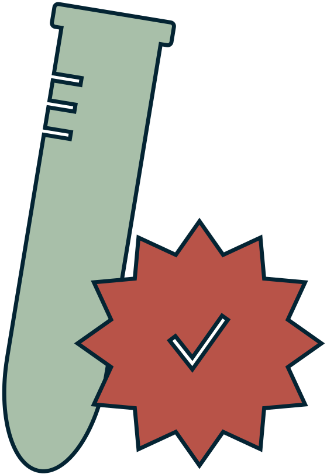
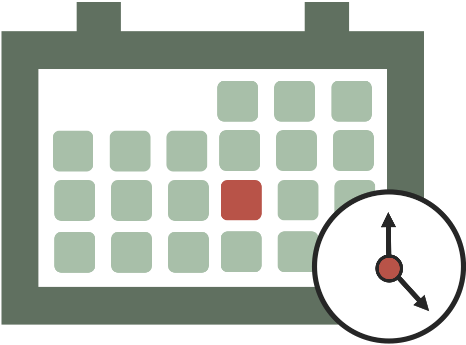
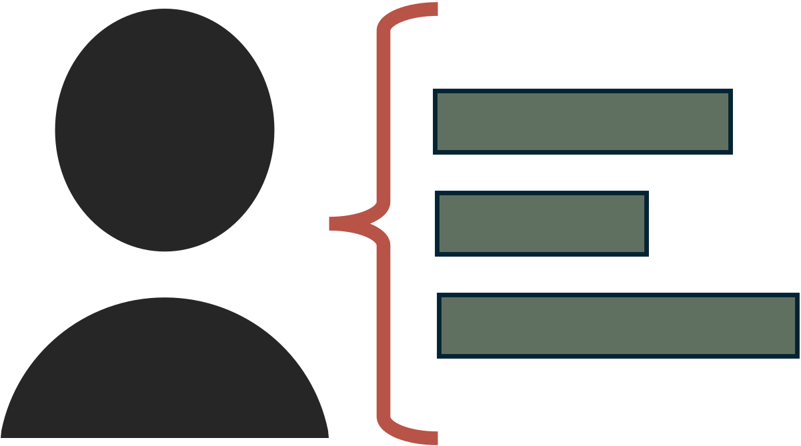
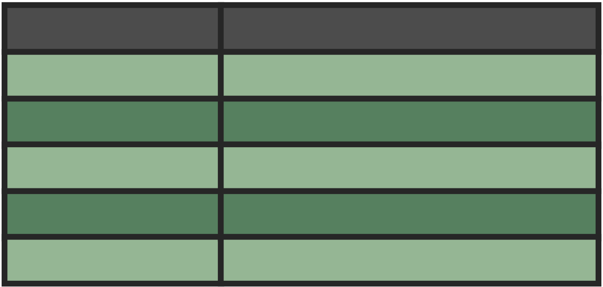
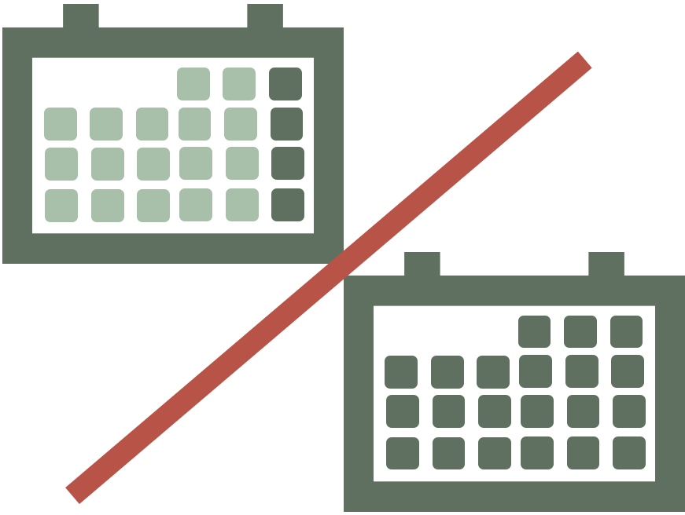

# Tibble now (tbl.now)

[`tbl.now`](https://rodrigozepeda.github.io/tbl.now/) extends
[`tibble()`](https://tibble.tidyverse.org/) for storing, validating, and
manipulating epidemiological nowcasting data. It standardizes event
dates, report dates, strata, temporal covariates, and related metadata
in a shape compatible with many frameworks, including
[diseasenowcasting](https://rodrigozepeda.github.io/diseasenowcasting/),
[epinowcast](https://package.epinowcast.org/),
[NobBS](https://CRAN.R-project.org/package=NobBS),
[surveillance](https://CRAN.R-project.org/package=surveillance),
[EpiNow2](https://epiforecasts.io/EpiNow2/), and more. Finally, it also
standardizes the prediction engines and their results for plotting,
scoring, comparing, and ensembling models.

A `tbl_now` keeps track of the attributes needed for a nowcasting
exercise, so `dplyr` transformations preserve the relevant nowcasting
variables:

|   | Argument | What it records |
|:--:|:---|:---|
|  | `event_date` | The column storing **event dates**; i.e. when the epidemiological phenomenon of interest happened (symptom onset, hospitalisation, death, …). **Required.** |
|  | `report_date` | The column storing **report dates**; i.e. when that event became known to the surveillance system. **Required**, unless it is reconstructed from `delay`. |
|  | `revision_date` | An optional third date indicating when the report was resolved (see `revision_type`). *Optional*. |
|  | `revision_type`, `revision_levels` | What the revision date resolved to. Only `confirmed`, `retracted`, `pending` or `NA` are ever stored; set `revision_levels` as a named dictionary mapping the data’s labels into those four ( e.g. `c(positive = “confirmed”)`). *Optional*. |
|  | `now` | The date the nowcast is anchored to — “today” from the model’s point of view. *Optional*; defaults to the latest date. |
|  | `strata` | Columns you want a separate nowcast for (e.g. gender, region). *Optional*. |
|  | `covariates` | Columns that inform the nowcast but that you do *not* want it broken down by (e.g. temperature or precipitation). *Optional*. |
|  | `case_count` | The column holding the counts when the data is given as aggregated (rather than line-list). *Optional*. |
|  | `data_type` | Whether the data represents a `linelist` (each row is a case), `count-incidence`(each row is a collection of cases per event-report date) or `count-cumulative`(each row is the cummulative number cases for that event accumulating in the report axis). *Optional*; inferred by default. |
|  | `event_units`, `report_units`, `revision_units` | The time grid each date lives on: `days`, `weeks`, `months`, `years` or `numeric`. *Optional*; inferred (`“auto”`) by default. |
|  | `is_censored_report`,`is_censored_revision` | Flags dates from either the report or the revision axis that are only an upper bound, i.e. the true report happened *before* the date given in the database. *Optional*. |
|  | `t_effects` | Columns holding temporal effects (day of week, holidays, …) that some models can use. *Optional*. |

You can specify an object as a `tbl.now` with the `tbl_now` command:

``` r

library(dplyr)
library(tbl.now)
data(denguedat)

#Here we use just a few dates for the example
denguedat <- denguedat |> 
  filter(onset_week >= as.Date("2005/01/01"),
         report_week <= as.Date("2005/10/01")) 

#And we specify as a tbl_now:
denguedat <- denguedat |> 
  tbl_now(
    report_date = report_week,
    event_date = onset_week,
    strata = gender
  ) 

#Which is just a tibble with extra attributes
denguedat
#> # A tibble:  1,652 × 6
#> # Data type: "linelist"
#> # Frequency: Event: `weeks` | Report: `weeks`
#>   onset_week   report_week   gender   .event_num .report_num .delay
#>   <date>       <date>        <chr>         <dbl>       <dbl>  <dbl>
#>   [event_date] [report_date] [strata]      [...]       [...]  [...]
#> 1 2005-01-03   2005-01-17    Male              0           2      2
#> 2 2005-01-03   2005-01-10    Female            0           1      1
#> 3 2005-01-03   2005-01-10    Female            0           1      1
#> 4 2005-01-03   2005-01-10    Male              0           1      1
#> 5 2005-01-03   2005-01-10    Male              0           1      1
#> # ────────────────────────────────────────────────────────────────────────────────────────────────────────────────────────────────────────────────────────────────
#> # Now: 2005-09-26 | Event date: "onset_week" | Report date: "report_week"
#> # Strata: "gender"
#> # ────────────────────────────────────────────────────────────────────────────────────────────────────────────────────────────────────────────────────────────────
#> # ℹ 1,647 more rows
```

Once transformed, it can help you diagnose data problems (see [this
article](https://rodrigozepeda.github.io/tbl.now/articles/diagnosing-a-tbl-now.html))
or modeling requirements with your database:

``` r

autoplot(denguedat)
```


And it can be used to run any of multiple nowcast libraries through the
[`engine()`](https://rodrigozepeda.github.io/tbl.now/reference/engine.md)
and `run_nowcast` specifications (see [this
article](https://rodrigozepeda.github.io/tbl.now/articles/nowcasting-models.html)).
For example, [baselinenowcast](https://baselinenowcast.epinowcast.org/):

``` r

dengue_nowcast_1 <- denguedat |> 
  run_nowcast(engine = engine_baselinenowcast())
```

``` r

autoplot(dengue_nowcast_1)
```


or
[diseasenowcasting](https://rodrigozepeda.github.io/diseasenowcasting/):

``` r

dengue_nowcast_2 <- denguedat |> 
  run_nowcast(engine = engine_diseasenowcasting())
```

``` r

autoplot(dengue_nowcast_2)
```


It can also generate ensemble nowcasts combining multiple engines or
multiple realizations from the same engine as you can see [in this
article](https://rodrigozepeda.github.io/tbl.now/articles/ensemble-nowcasting.html):

``` r

dengue_ensemble <- nowcast_ensemble(
  baselinenowcast   = dengue_nowcast_1,
  diseasenowcasting = dengue_nowcast_2
)
```

``` r

autoplot(dengue_ensemble)
```


If this seems as exciting to you as it is to us, install the development
version from [R universe](https://rodrigozepeda.r-universe.dev/tbl.now):

``` r

install.packages("tbl.now", repos = c("https://rodrigozepeda.r-universe.dev", getOption("repos")))
```

and checkout our articles starting with the [Get started
guide](https://rodrigozepeda.github.io/tbl.now/articles/tbl.now.html):

If you have any questions or comments regarding the contents of this
article please [open an issue on
Github](https://github.com/RodrigoZepeda/tbl.now/issues/new).

## Learning more

- A **tutorial** on real life surveillance data. Takes you from cleaning
  to diagnosing errors in the data to nowcasting:
  <https://rodrigozepeda.github.io/tbl.now/articles/example.html>
- The **second part of the tutorial** with a revision process: the
  optional third date, where a reported case is later confirmed,
  retracted or left pending:
  <https://rodrigozepeda.github.io/tbl.now/articles/example_revisions.html>
- The **Get started vignette**: the whole workflow, from a raw line list
  to a scored nowcast, in five minutes:
  <https://rodrigozepeda.github.io/tbl.now/articles/tbl.now.html>.
- **More on the `tbl_now` object**: every attribute, the three data
  types, the revision process, temporal effects and the `dplyr` methods:
  <https://rodrigozepeda.github.io/tbl.now/articles/more-on-tbl-now.html>
- More thoughts on **diagnosing your dataset** with `tbl.now`
  <https://rodrigozepeda.github.io/tbl.now/articles/diagnosing-a-tbl-now.html>
- Detecting reporting **batches** with `tbl.now`
  <https://rodrigozepeda.github.io/tbl.now/articles/batches.html>
- How to use different nowcasting engines from `tbl.now`: here you can
  learn **how it connects to the other nowcasting packages**.
  <https://rodrigozepeda.github.io/tbl.now/articles/nowcasting-models.html>
- How to **nowcast with multiple engines, backtest and ensemble**
  nowcasts.
  <https://rodrigozepeda.github.io/tbl.now/articles/ensemble-nowcasting.html>
- Adding your own **custom nowcasting model**
  <https://rodrigozepeda.github.io/tbl.now/articles/custom-nowcast-models.html>
- Package reference:
  <https://rodrigozepeda.github.io/tbl.now/reference/>
