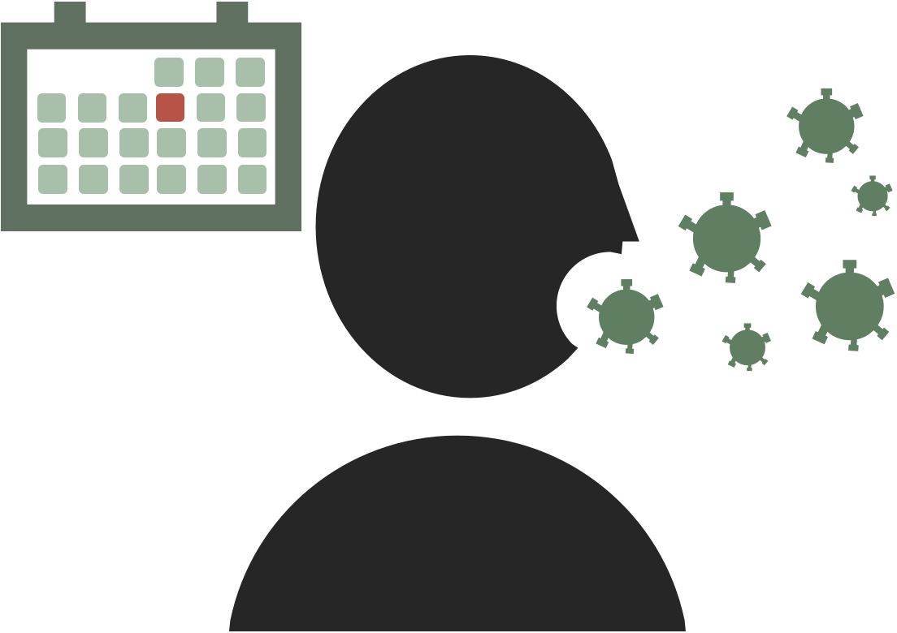
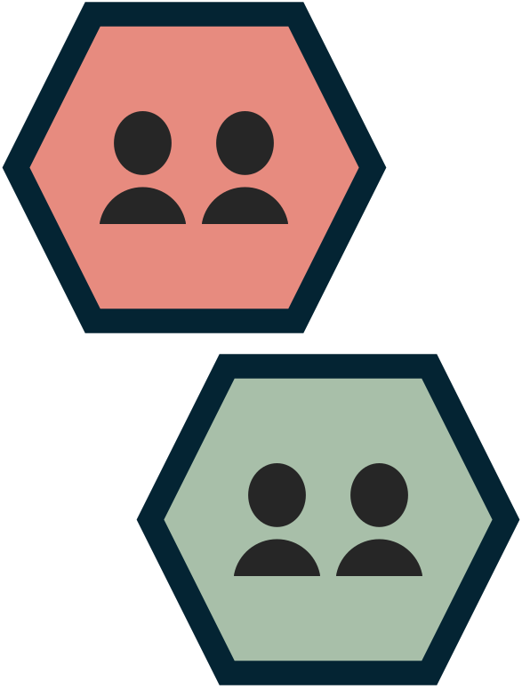
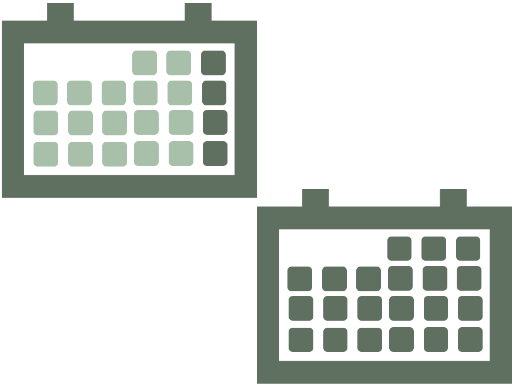
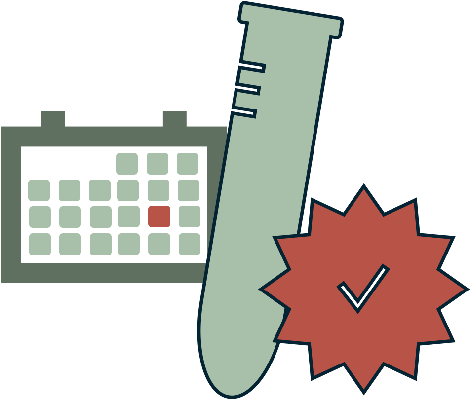
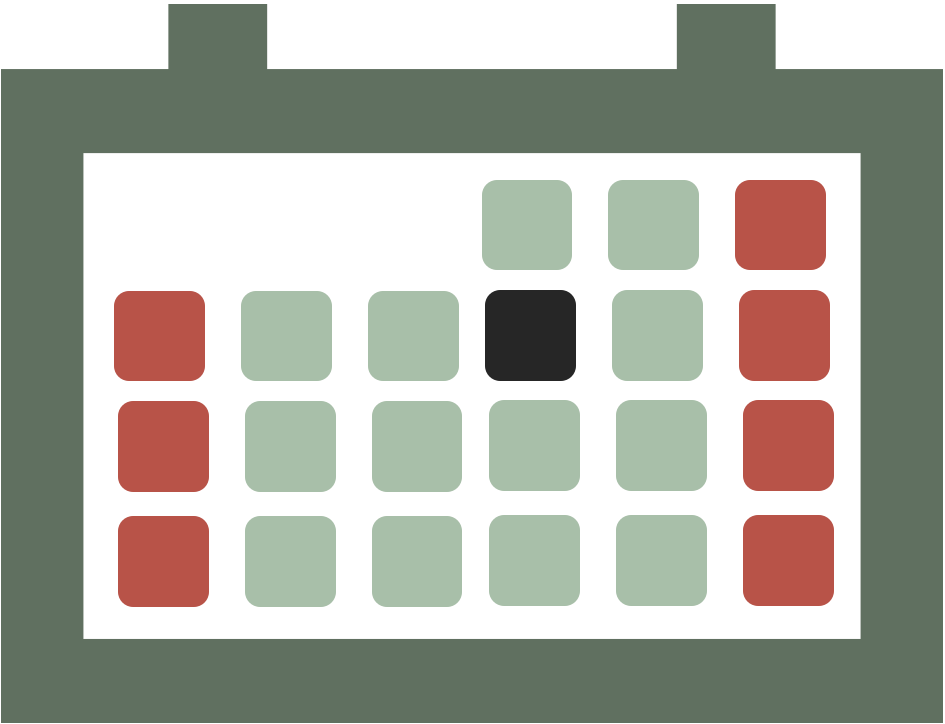
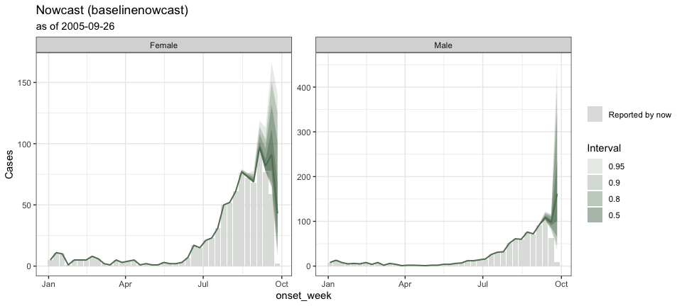
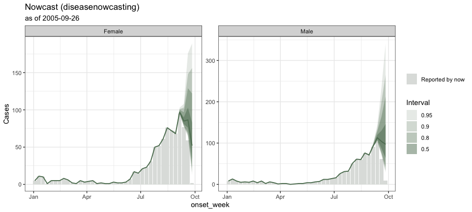

# Tibble now (tbl.now)

[`tbl.now`](https://rodrigozepeda.github.io/tbl.now/) provides an
extension of the [`tibble()`](https://tibble.tidyverse.org/) for
storing, validating, and manipulating epidemiological nowcasting data.
It standardizes the representation of event dates, report dates, strata,
temporal covariates, and data types (linelist and cumulative), ensuring
that downstream models within the
[`diseasenowcasting`](https://rodrigozepeda.github.io/diseasenowcasting/)
ecosystem can rely on a consistent interface.

[`tbl.now`](https://rodrigozepeda.github.io/tbl.now/) rovides an
extension of the [`tibble()`](https://tibble.tidyverse.org/) for
storing, validating, and manipulating epidemiological nowcasting data.
It standardizes the representation of event dates, report dates, strata,
temporal covariates, etc and in a way that is compatible with many
frameworks including diseasenowcasting, epinowcast, NobBS, surveillance,
EpiNow2, and more.

Specifically a `tbl_now` is a data structure that keeps track of the
following attributes relevant for a nowcasting excercise so that all
`dplyr` transformations (i.e. the ones from tidyverse) keep track of the
relevant nowcasting variables:

|   | Argument | What it records |
|:--:|:---|:---|
|  | `event_date` | The column storing **event dates**; i.e. when the epidemiological phenomenon of interest happened (symptom onset, hospitalisation, death, …). **Required.** |
|  | `report_date` | The column storing **report dates**; i.e. when that event became known to the surveillance system. **Required**, unless it is reconstructed from `delay`. |
|  | `now` | The date the nowcast is anchored to — “today” from the model’s point of view. *Optional*; defaults to the latest date. |
|  | `strata` | Columns you want a separate nowcast for (e.g. gender, region). *Optional*. |
|  | `covariates` | Columns that inform the nowcast but that you do *not* want it broken down by (e.g. temperature or precipitation). *Optional*. |
|  | `case_count` | The column holding the counts when the data is given as aggregated (rather than line-list). *Optional*. |
|  | `data_type` | Whether the data represents a `linelist` (each row is a case), `count-incidence`(each row is a collection of cases per event-report date) or `count-cumulative`(each row is the cummulative number cases for that event accumulating in the report axis). *Optional*; inferred by default. |
|  | `event_units`, `report_units`, `confirmation_units` | The time grid each date lives on: `days`, `weeks`, `months`, `years` or `numeric`. *Optional*; inferred (`“auto”`) by default. |
|  | `is_censored` | Flags report dates that are only an upper bound, e.g. a batch or back-fill dump. *Optional*. |
|  | `confirmation_date`, `confirmation_type` | An optional third date — when the report was resolved — and what it resolved to (`confirmed`, `retracted`, `pending`). *Optional*. |
|  | `t_effects` | Columns holding temporal effects (day of week, holidays, …) that some models can use. *Optional*. |

You can specify an object as a `tbl.now` with the `tbl_now` command:

``` r

library(dplyr)
library(tbl.now)
data(denguedat)

#Here we use just a few dates for the example
denguedat <- denguedat |> 
  filter(onset_week >= as.Date("2005/01/01")) |> 
  filter(onset_week <= as.Date("2005/10/01")  & report_week <= as.Date("2005/10/01")) |> 
  tbl_now(
    report_date = report_week,
    event_date = onset_week,
    strata = gender
  ) 
```

Once transformed, it can help you diagnose data problems or modeling
requirements with your database:

``` r

autoplot(denguedat)
```


And it can be used to run any of multiple nowcast libraries through the
[`engine()`](https://rodrigozepeda.github.io/tbl.now/reference/engine.md)
and `run_nowcast` specifications. For example, baselinenowcast:

``` r

dengue_nowcast_1 <- denguedat |> 
  run_nowcast(engine = engine_baselinenowcast())
```

``` r

autoplot(dengue_nowcast_1)
```



or diseasenowcasting:

``` r

dengue_nowcast_2 <- denguedat |> 
  run_nowcast(engine = engine_diseasenowcasting())
```

``` r

autoplot(dengue_nowcast_2)
```



It can also generate ensemble nowcasts combining multiple engines or
multiple realizations from the same engine:

``` r

dengue_ensemble <- nowcast_ensemble(
  baselinenowcast  = dengue_nowcast_1,
  diseasenowcasting = dengue_nowcast_2
)
```

``` r

autoplot(dengue_ensemble)
```


If this seems exciting to you, install the development version from
[GitHub](https://github.com/):

``` r

# install.packages("pak") # <- uncomment if you do not have `pak`
pak::pkg_install("RodrigoZepeda/tbl.now")
```

and checkout our articles starting with the
[Introduction](https://rodrigozepeda.github.io/tbl.now/articles/tbl.now.html):

## Learning more

- Introduction vignette:
  <https://rodrigozepeda.github.io/tbl.now/articles/tbl.now.html> for
  the full anatomy of a `tbl_now`, data types, and temporal effects.
- End-to-end tutorial on real, messy surveillance data — cleaning,
  diagnostics and nowcasting:
  <https://rodrigozepeda.github.io/tbl.now/articles/Example.html>
- Tutorial on detecting batches and other reporting-delay artifacts:
  <https://rodrigozepeda.github.io/tbl.now/articles/batch-reporting.html>
- Comparing nowcasting engines on one dataset:
  <https://rodrigozepeda.github.io/tbl.now/articles/nowcasting-models.html>
- Package reference:
  <https://rodrigozepeda.github.io/tbl.now/reference/>
